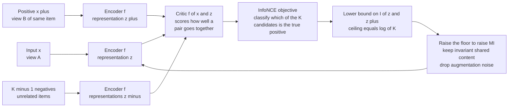

# 🧬 Mutual Information and Representation Learning

> [!abstract] TL;DR
> Modern self-supervised learning learns representations by **maximizing mutual information** — either between an input and its encoding (the InfoMax principle of Linsker and Deep InfoMax) or between two views of the same datum (CPC, SimCLR, CLIP). Because mutual information is intractable to compute from high-dimensional samples, these methods optimize **variational lower bounds** instead: MINE uses the Donsker–Varadhan formula, and the workhorse **InfoNCE** turns MI estimation into a "spot the true positive among K candidates" classification, bounding MI by `log K`. The catch: MI maximization *alone* does not guarantee useful representations — it is invariant to any invertible transform, so the estimator and the inductive biases are doing much of the real work.

---

## Intuition

**Analogy:** You can recognize a close friend from the front, in profile, in dim light, in a grainy old photo, or by their laugh from another room. Your brain has learned a representation that keeps the invariant *"them-ness"* shared across all those views and throws away the noise — the exact lighting, angle, and background that change from glimpse to glimpse. Representation learning does the same trick mechanically: it looks at two different "views" of the same thing (a cropped-and-recolored image and another crop of it, an image and its caption, a slice of audio and the slice that follows) and learns an encoding that preserves what those views **share** while discarding what they don't.

"What two views share" has a precise information-theoretic name: **mutual information**. If Z is the representation of view A and Z⁺ is the representation of view B, then training to maximize I(Z; Z⁺) forces the encoder to capture exactly the stable, semantic content common to both — because only that content is predictable from one view given the other. The augmentation-specific noise carries no mutual information across views, so a good encoder has every incentive to drop it. Recognizing your friend from any angle *is* mutual-information maximization performed by biology.

---

## How It Works

### Core Mechanics

The chain from "learn a good representation" to a trainable loss has four links.

1. **The objective: InfoMax.** Linsker's 1988 InfoMax principle says a good encoder Z = f(X) should maximize I(X; Z) — the representation should retain as much information about the input as possible. Deep InfoMax (Hjelm et al., 2019) refines this: maximize MI between the representation and *local patches* of the input, not the whole raw pixel vector, which better captures semantic structure. A closely related and now-dominant variant is **multi-view InfoMax**: maximize I(Z; Z⁺) between representations of two augmented views, so the encoder keeps only what is invariant to the augmentation.

2. **The obstacle: MI is not computable.** By definition I(X; Z) = D_KL( p(x,z) ‖ p(x)p(z) ), and its differential form (see [[Joint_Conditional_Entropy_and_Mutual_Information]]) needs the joint density of two high-dimensional variables. From a finite sample of images or embeddings, you cannot estimate that density — plug-in and histogram estimators die from the curse of dimensionality. So you **cannot maximize MI directly**; you maximize a tractable **lower bound** and rely on "raising the floor raises the ceiling."

3. **The bounds.** Two variational lower bounds dominate practice:
   - **MINE** (Belghazi et al., 2018) uses the **Donsker–Varadhan** representation of KL divergence. For any function T learned by a neural network,
     $$I(X;Z) \ge \mathbb{E}_{p(x,z)}[T(x,z)] - \log \mathbb{E}_{p(x)p(z)}\!\big[e^{T(x,z)}\big].$$
     The first expectation uses **joint** samples (real pairs); the second uses **product-of-marginals** samples (mismatched pairs, obtained by shuffling). Maximizing over T tightens the bound. MINE gives a nearly unbiased estimate but has high variance and a biased gradient.
   - **InfoNCE** (Oord et al., 2018), the *Noise-Contrastive Estimation* bound, is lower-variance and is the one that actually powers modern systems. Given one positive pair and K−1 negatives, define a critic f(x, z) (an exponentiated similarity). The bound is
     $$I(X;Z) \ge \log K - \mathcal{L}_{\text{NCE}}, \qquad \mathcal{L}_{\text{NCE}} = -\,\mathbb{E}\!\left[\log \frac{f(x, z^+)}{\sum_{j=1}^{K} f(x, z_j)}\right].$$
     Minimizing the NCE loss = maximizing the MI bound. The critical consequence: **this bound can never exceed `log K`**. With few negatives you are estimating MI through a low ceiling; you need `K > e^{I}` negatives before the bound can even reach the true value. That single fact explains SimCLR's giant batches and MoCo's 65k-entry queue.

4. **The interpretation: compression.** The **information bottleneck** view reframes what a *good* representation is: an encoding T of input X that **maximizes I(T; Y)** (keep task-relevant information) while **minimizing I(T; X)** (compress away everything else). Self-supervised MI-maximization is the label-free cousin — it maximizes information shared across views (a proxy for "task-relevant, semantic" content) while augmentations force the discarding of nuisance factors. Good representations sit at the sweet spot: maximally predictive, minimally bloated.

### The InfoMax / Contrastive Estimation Loop



---

## Key Concepts

### Secondary (intuitive)
- A **representation** is a compressed description of data. A *good* one keeps what matters and drops what doesn't — like remembering a friend's face, not the lighting in every photo.
- **Mutual information** measures how much two things share. Learning to maximize it between two views of the same item forces the model to capture their common, meaningful content.
- You can't measure this sharing exactly for images, so you play a game instead: "given this view, pick its true partner out of a lineup of impostors." Winning that game means the two partners share a lot of information.

### Undergraduate (formal)
- **InfoMax principle:** train Z = f(X) to maximize I(X; Z) (Linsker); Deep InfoMax maximizes MI with local input patches; multi-view InfoMax maximizes I(Z; Z⁺) across augmentations.
- **Why a lower bound:** I(X;Z) = D_KL(p(x,z) ‖ p(x)p(z)) is uncomputable in high dimensions from samples, so we optimize variational bounds and use monotonicity ("raise the floor").
- **InfoNCE bound:** the NT-Xent / CPC loss satisfies I ≥ log K − L_NCE, hence is capped at log K; more negatives raise the ceiling. This is why contrastive methods need large batches or memory queues (see [[Contrastive_Learning]]).
- **MINE bound:** uses the Donsker–Varadhan formula with joint samples versus shuffled (product-of-marginals) samples; unbiased value estimate but noisier gradients than InfoNCE.
- **Bottleneck framing:** a good representation maximizes I(T; Y) while minimizing I(T; X) — predictive yet compressed.

### Graduate (advanced)
- **Bound taxonomy (Poole et al., 2019):** InfoNCE, MINE (DV), NWJ/MINE-f (f-divergence), and the "leave-one-out" bounds form a spectrum trading bias against variance. InfoNCE is low-variance but *bounded by log K*; NWJ is unbiased but high-variance. The bias–variance frontier means no single estimator dominates.
- **The log K ceiling in practice:** to estimate MI of B nats you need Ω(e^B) negatives — provably. For representations with large MI, contrastive estimates are severe *underestimates*; the loss can keep improving representations even after the MI *estimate* has saturated, which is one reason "contrastive learning works better than its MI bound suggests."
- **"MI is not enough" (Tschannen et al., 2020):** MI is **invariant under any invertible reparametrization** of Z, so two encoders with identical I(X; Z) can have wildly different downstream utility — a bijective scramble preserves MI while destroying linear separability. Reported gains correlate more with the **critic architecture, augmentation choice, and encoder inductive bias** than with the MI value itself. MI maximization is necessary framing, not sufficient explanation.
- **Disentanglement and total correlation:** factorizing a representation means driving its **total correlation** TC(Z) = D_KL(q(z) ‖ ∏ᵢ q(zᵢ)) — the multivariate generalization of MI — toward zero. β-VAE and β-TCVAE add a penalty that (in TCVAE) isolates and up-weights exactly the total-correlation term to encourage statistically independent latent factors (see [[Variational_Autoencoders]]).
- **Sufficiency and invariance (multi-view theory):** under a multi-view assumption, the optimal representation is a **minimal sufficient statistic** of one view for the other — it keeps all label-relevant shared information and nothing else. This connects self-supervised MI-maximization to classical sufficient-statistic theory and to the [[Rate_Distortion_Theory_and_Lossy_Compression|rate–distortion]] trade-off.
- **Estimator caveats:** InfoNCE gradients are biased; the "critic" (bilinear vs. separable vs. concatenated MLP) changes both the achievable bound and the representation; and evaluating representations by their *estimated* MI is circular — downstream linear-probe accuracy remains the honest metric.

---

## Python Demo

```python
# InfoNCE as a lower bound on mutual information.
#
# Setup: a synthetic bivariate Gaussian pair (X, Y) with correlation rho.
#   - Its TRUE mutual information is known in closed form: I = -0.5 * ln(1 - rho^2).
#   - We form "positive" pairs (x_i, y_i) that are genuinely coupled, and treat the
#     OTHER samples in the batch as "negatives" (mismatched y's).
#   - Using the optimal critic f*(x, y) = log p(y | x) - log p(y), we compute the
#     InfoNCE objective and show it is a LOWER BOUND on the true MI whose ceiling is
#     log(K), tightening toward the truth as the number of negatives K grows.
import numpy as np
import matplotlib.pyplot as plt

rng = np.random.default_rng(0)

def true_mi_gaussian(rho):
    """Exact mutual information (in nats) of a standard bivariate Gaussian."""
    return -0.5 * np.log(1.0 - rho**2)

def sample_pairs(n, rho):
    """Draw n coupled pairs: x ~ N(0,1),  y | x ~ N(rho*x, 1 - rho^2)."""
    x = rng.standard_normal(n)
    y = rho * x + np.sqrt(1.0 - rho**2) * rng.standard_normal(n)
    return x, y

def optimal_critic(x, y, rho):
    """f*(x, y) = log p(y | x) - log p(y), the pointwise log density ratio.
    p(y|x) = N(rho*x, 1 - rho^2),  p(y) = N(0, 1). Its joint expectation IS the MI."""
    var = 1.0 - rho**2
    log_p_y_given_x = -0.5 * np.log(2 * np.pi * var) - (y - rho * x)**2 / (2 * var)
    log_p_y         = -0.5 * np.log(2 * np.pi)       -  y**2 / 2.0
    return log_p_y_given_x - log_p_y

def logsumexp_rows(S):
    """Numerically stable log-sum-exp along each row of matrix S."""
    m = S.max(axis=1, keepdims=True)
    return m[:, 0] + np.log(np.exp(S - m).sum(axis=1))

def infonce_lower_bound(rho, K, n_batches=1500):
    """Monte-Carlo estimate of the InfoNCE lower bound using K samples per batch
    (1 positive + (K-1) in-batch negatives per anchor)."""
    total = 0.0
    for _ in range(n_batches):
        x, y = sample_pairs(K, rho)
        # Score matrix S[i, j] = f*(x_i, y_j); the diagonal holds the true positives.
        S = optimal_critic(x[:, None], y[None, :], rho)          # shape (K, K)
        per_anchor = np.diagonal(S) - logsumexp_rows(S) + np.log(K)
        total += per_anchor.mean()
    return total / n_batches

# ---- Choose rho so the true MI is high enough to reveal the log(K) ceiling ----
rho = 0.99
I_true = true_mi_gaussian(rho)                                   # ~1.96 nats
print(f"correlation rho = {rho}")
print(f"TRUE mutual information I(X;Y) = {I_true:.4f} nats  (need K > e^I = {np.exp(I_true):.1f})\n")

Ks = np.array([1, 2, 4, 8, 16, 32, 64, 128, 256])
estimates = np.array([infonce_lower_bound(rho, int(K)) for K in Ks])
ceilings  = np.log(Ks)                                           # the log(K) ceiling

print(f"{'K':>5} {'log(K)':>9} {'InfoNCE bound':>15} {'true MI':>9}")
for K, ceil, est in zip(Ks, ceilings, estimates):
    print(f"{K:>5} {ceil:>9.3f} {est:>15.3f} {I_true:>9.3f}")

# ---- Plot: the estimate hugs min(log K, true MI) and tightens as K grows ----
plt.figure(figsize=(7.5, 4.8))
plt.plot(Ks, estimates, "o-", lw=2, label="InfoNCE lower bound (estimated)")
plt.plot(Ks, ceilings, "s--", color="gray", label="log(K) ceiling")
plt.axhline(I_true, color="red", ls=":", lw=2, label="true MI = -0.5 ln(1 - rho^2)")
plt.xscale("log", base=2)
plt.xlabel("number of samples per batch  K   (1 positive + K-1 negatives)")
plt.ylabel("mutual information  (nats)")
plt.title("InfoNCE lower-bounds MI, capped at log(K), tightening with more negatives")
plt.legend()
plt.tight_layout()
plt.show()

# What you see:
#   K = 1   -> bound = 0        (no negatives: the game is trivial, zero information)
#   small K -> bound ~ log(K)   (ceiling-limited: cannot report more MI than log K)
#   large K -> bound -> I_true  (once log(K) clears the true MI, the bound tightens)
```

Running this prints a table where the estimate tracks `log(K)` while `log(K) < I_true` and then plateaus near the true 1.96 nats once K is large enough — a direct, from-scratch demonstration that InfoNCE is a *lower* bound whose tightness is gated by the negative count. This is exactly why real contrastive systems fight so hard for more negatives.

---

## Real-World Applications

- **Self-supervised visual pretraining (SimCLR, MoCo, CPC):** maximize I(view A ; view B) of an image via InfoNCE, then fine-tune the encoder on downstream tasks with few labels. The learned features often match or beat supervised ImageNet features (see [[Contrastive_Learning]] and [[Self_Supervised_Learning]]).
- **Multimodal alignment (CLIP):** the InfoNCE loss between image embeddings and text embeddings maximizes cross-modal mutual information over 400M pairs, producing a shared space that enables zero-shot classification by comparing an image to the text of candidate labels.
- **Contrastive Predictive Coding for sequences:** in audio and language, maximize MI between a context summary and *future* latent slices, learning representations that predict what comes next — the origin of the InfoNCE bound itself.
- **Disentangled generative models (β-VAE, β-TCVAE):** penalizing the **total correlation** of the latent code pushes latent dimensions toward statistical independence, so single factors (pose, lighting, identity) map to single axes (see [[Variational_Autoencoders]]).
- **Efficient coding in neuroscience:** Barlow's efficient-coding and Linsker's InfoMax hypotheses model sensory neurons as maximizing information transmitted about the stimulus subject to metabolic and noise constraints — the biological ancestor of machine InfoMax (see [[Neural_Coding_and_Spike_Trains]] and [[Population_Coding_and_Decoding]]).

---

## Common Pitfalls

- **Trusting the MI number over the representation** — MI is invariant to any invertible transform of Z, so a huge estimated I(X; Z) can coexist with useless features. Evaluate representations by a downstream linear probe, not by their MI estimate. ("MI is not enough.")
- **Too few negatives** — InfoNCE cannot report more than `log K` nats. With small batches you are estimating MI through a low ceiling and the bound is loose; scale K with batch size, a memory queue (MoCo), or the log-K correction in mind.
- **Reading InfoNCE as a tight MI estimate** — it is a *lower bound*, often a severe underestimate for high-MI pairs. A saturated bound does not mean the representation stopped improving; the two decouple.
- **High-variance MINE gradients** — the Donsker–Varadhan bound has a biased, high-variance gradient from the log-of-expectation term. Use moving-average bias correction or prefer InfoNCE/NWJ when stability matters.
- **Blaming the objective for the augmentation** — in multi-view InfoMax the augmentation defines what information is treated as "nuisance." Weak augmentations leave a trivial shared signal (the network exploits low-level statistics); overly aggressive ones destroy the semantic content you wanted to keep.
- **Ignoring total correlation for disentanglement** — plain β-VAE trades off reconstruction against the full KL term, which also over-penalizes useful information. Isolate the total-correlation term (β-TCVAE) if factorization, not just compression, is the goal.

---

## Related Concepts

- [[Joint_Conditional_Entropy_and_Mutual_Information]] — defines I(X;Y) as the KL divergence between the joint and the product of marginals; this note builds the entire learning objective on that quantity.
- [[Contrastive_Learning]] — SimCLR/MoCo and the NT-Xent (InfoNCE) loss are the concrete instantiation of the MI-maximization principle developed here.
- [[Self_Supervised_Learning]] — MI maximization is the theoretical backbone of the contrastive family of label-free pretraining methods.
- [[Variational_Autoencoders]] — the ELBO's rate term controls I(X; latent), and total-correlation penalties (β-TCVAE) target disentanglement through a multivariate MI.
- [[Relative_Entropy_and_Cross_Entropy]] — MI is a KL divergence, and MINE's Donsker–Varadhan bound is a variational representation of that same divergence.
- [[Rate_Distortion_Theory_and_Lossy_Compression]] — the information-bottleneck view of "compress the input, keep task-relevant bits" is a rate–distortion trade-off in disguise.
- [[Neural_Coding_and_Spike_Trains]] — biological efficient coding maximizes information a neuron transmits about a stimulus, the neuroscience root of InfoMax.
- [[Population_Coding_and_Decoding]] — mutual information quantifies how much a neural population's joint activity reveals about the encoded variable.

---

## Review Questions

1. **Conceptual:** Explain why representation-learning methods optimize a *lower bound* on mutual information rather than mutual information itself. Starting from I(X;Z) = D_KL(p(x,z) ‖ p(x)p(z)), identify precisely what goes wrong when you try to estimate this from a finite sample of high-dimensional embeddings.
2. **Scenario:** You are pretraining an image encoder with InfoNCE and the estimated mutual information plateaus at about 6.9 nats no matter how long you train, even though you believe the true MI between views is much higher. Given `log(1000) ≈ 6.9`, diagnose what is happening and propose two concrete changes to raise the achievable estimate.
3. **Trade-off / critique:** The "MI is not enough" results show two encoders with identical I(X; Z) can have very different downstream accuracy because MI is invariant under invertible transforms. If mutual information does not by itself determine representation quality, what *does*? Argue for the roles of the critic architecture, the choice of augmentations/views, and the encoder's inductive bias, and explain how you would empirically attribute a gain to each.

---

## Sources

- [Linsker, R. — *Self-Organization in a Perceptual Network* (1988), IEEE Computer 21(3) — the InfoMax principle](https://ieeexplore.ieee.org/document/36)
- [Belghazi et al. — *MINE: Mutual Information Neural Estimation* (2018)](https://arxiv.org/abs/1801.04062)
- [van den Oord, Li & Vinyals — *Representation Learning with Contrastive Predictive Coding (InfoNCE)* (2018)](https://arxiv.org/abs/1807.03748)
- [Hjelm et al. — *Learning Deep Representations by Mutual Information Estimation and Maximization (Deep InfoMax)* (2019)](https://arxiv.org/abs/1808.06670)
- [Poole et al. — *On Variational Bounds of Mutual Information* (2019)](https://arxiv.org/abs/1905.06922)
- [Tschannen et al. — *On Mutual Information Maximization for Representation Learning* (2020)](https://arxiv.org/abs/1907.13625)

---

#information-theory #mutual-information #representation-learning #contrastive-learning #infonce
