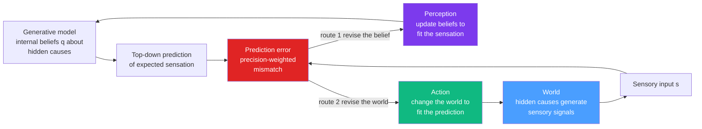

# 🧠 The Free Energy Principle and Active Inference

> [!abstract] TL;DR
> The **Free Energy Principle (FEP)**, due to Karl Friston, claims that any system that persists — a cell, a body, a brain — must act as if it minimizes **variational free energy**, a computable *upper bound on "surprise"* (the negative log-evidence of its sensory inputs). This is the **same** variational free energy that appears in [[Variational_Autoencoders|variational inference]] and in [[Entropy_and_Second_Law|statistical physics]] — here applied to living things. Minimizing it does two jobs at once: it makes the brain a **Bayesian prediction machine** that infers the hidden causes of its senses (perception), and it drives the organism to **act on the world** so that its sensations match its predictions (active inference). Perception and action become one objective — resist disorder by keeping your sensory states within the narrow band you expect to occupy.

---

## Intuition

**Analogy — the brain as a bettor who can rig the game.** Imagine a gambler who must, every second, place a bet on what he is about to see, hear, and feel. He is scored not on being "right" but on how *surprised* he is: the less probable the outcome he actually experiences, the bigger the fine he pays. He has exactly two ways to keep his fines small. **First**, he can get better at *predicting* — study the patterns, update his model, so his bets track reality (this is **perception**). **Second**, and this is the twist, he is allowed to *reach onto the table and rearrange the cards* — to change the world so that the outcome he already bet on actually happens (this is **action**). A living thing does both, ceaselessly, and the single quantity it is always trying to shrink is its long-run surprise.

Your brain never touches the world directly. Sealed inside the skull, it receives only the *effects* — patterns of light, pressure, and chemistry — and must guess the hidden *causes*. So it runs an internal **generative model** that constantly predicts its own incoming sensations, and it pays attention only to the **prediction error**, the surprising residual. You do not perceive the world and then react; you *predict* the world, and perception is just the brain correcting its best guess while action is the brain making its guess come true. "Surprise" cannot be computed directly (it needs an intractable sum over all possible causes), so the brain minimizes a friendly stand-in that it *can* compute — **variational free energy** — which sits just above surprise and squeezes it down for free.

---

## How It Works

### Core mechanics

Let $s$ be sensory data and $x$ the hidden causes in the world. The quantity a self-preserving system "should" minimize is **surprise**, the negative log model-evidence $-\ln p(s)$. Rare, dangerous, out-of-bounds sensory states (a fish out of water, a body at 45 °C) have high surprise; the states an organism expects to occupy have low surprise. But $p(s) = \int p(s,x)\,dx$ requires marginalizing over every possible cause — intractable for any real brain.

Friston's move borrows the **variational trick** used everywhere in machine learning (see [[Variational_Autoencoders]] and [[Maximum_Likelihood_and_Information]]). Introduce an internal *recognition density* $q(x)$ — the brain's current beliefs about the causes — and define **variational free energy**:

$$
F = \underbrace{\mathbb{E}_{q}\!\left[\ln q(x) - \ln p(s,x)\right]}_{\text{computable from beliefs and senses}} \;=\; \underbrace{D_{\mathrm{KL}}\!\big(q(x)\,\|\,p(x\mid s)\big)}_{\ge 0,\ \text{inference gap}} \;+\; \underbrace{\big(-\ln p(s)\big)}_{\text{surprise}}.
$$

Because the [[Relative_Entropy_and_Cross_Entropy|KL divergence]] is non-negative, $F$ is an **upper bound on surprise**. So minimizing $F$ (a) drives $q(x)$ toward the true posterior $p(x\mid s)$ — that is **Bayesian perception** — and (b) drops the surprise bound itself. This is *exactly* the **Evidence Lower Bound (ELBO)** with a sign flip: $F = -\text{ELBO}$. The brain, a VAE, and a Boltzmann machine are all minimizing the same object.

A second, equivalent decomposition makes the trade-off concrete:

$$
F = \underbrace{-\,\mathbb{E}_{q}\!\left[\ln p(s\mid x)\right]}_{\text{accuracy: fit the data}} \;+\; \underbrace{D_{\mathrm{KL}}\!\big(q(x)\,\|\,p(x)\big)}_{\text{complexity: stay near priors}}.
$$

Good perception is accurate but *cheap* — it explains the senses without straying far from prior expectations. Overfitting the senses (chasing noise) costs complexity; ignoring them costs accuracy.

**Predictive coding** is the neurally plausible algorithm that descends this $F$. Under a Gaussian (Laplace) approximation, $F$ reduces to a sum of **precision-weighted squared prediction errors**. The cortex is hypothesized to implement it as hierarchical message passing: top-down connections carry **predictions**, bottom-up connections carry **prediction errors**, and each error is scaled by its **precision** (inverse variance) — which is the theory's account of **attention**. Neurons literally perform gradient descent on $F$ with respect to their beliefs.

**Active inference** is the decisive extension. There are two ways to shrink a prediction error: change the belief to fit the world (perception, updating $q$), or **change the world to fit the belief** (action, changing $s$). Motor commands are treated as *predictions about proprioception* that reflex arcs fulfil. Which actions? An agent selects **policies** (action sequences) that minimize **expected free energy** $G$, which splits cleanly into two drives:

$$
G \;\approx\; \underbrace{-\,\text{(epistemic value)}}_{\text{information gain / explore}} \;+\; \underbrace{-\,\text{(pragmatic value)}}_{\text{preferred outcomes / exploit}}.
$$

The epistemic term rewards actions that resolve uncertainty (curiosity); the pragmatic term rewards actions that reach *preferred* sensory states (goals encoded as priors). This is a first-principles resolution of the **explore–exploit** dilemma and the tightest formal bridge from the FEP to [[Reinforcement_Learning|reinforcement learning]] and world-model agents.

### The perception–action loop



---

## Key Concepts

### Secondary (intuition-level)

- **The brain guesses, then checks.** It predicts what it is about to sense and only reacts to the mistakes — the surprising bits.
- **Surprise is the enemy.** Staying alive means keeping your sensations inside the narrow range you expect (a fish expects water, a body expects ~37 °C). Big surprises mean something is wrong.
- **Two ways to be less surprised.** Update your mind to match the world (perception), or change the world to match your mind (action). Reaching for a cup is you making your prediction "hand on cup" come true.
- **Attention is turning up the volume** on the signals the brain trusts and turning down the noisy ones.

### Undergraduate (probability + a little neuroscience)

- **Free energy bounds surprise.** $F = D_{\mathrm{KL}}(q\,\|\,p(x\mid s)) - \ln p(s) \ge -\ln p(s)$. Minimizing $F$ over $q$ both improves the belief and tightens the bound on surprise.
- **Accuracy vs complexity.** $F = \text{(prediction error)} + \text{(divergence from priors)}$; perception fits the data while staying near prior expectations.
- **Predictive coding.** Under Gaussians, $F$ becomes precision-weighted squared error; top-down predictions and bottom-up errors implement gradient descent on $F$ (Rao & Ballard; Bogacz tutorial).
- **Precision = attention.** Errors are weighted by inverse variance; where the brain expects reliable evidence, those errors dominate the update.
- **Active inference.** Action minimizes the same $F$ by changing sensory input rather than beliefs; motor control is prediction fulfilment.
- **Bayesian brain.** Perception is posterior inference; predictive coding is a message-passing approximation to Bayes' rule (see [[Bayesian_Models_of_Cognition]]).

### Graduate (systems / formal view)

- **Variational free energy = negative ELBO.** Identical object to variational inference; the Laplace approximation yields the predictive-coding update rules as generalized gradient descent on precision-weighted error.
- **Markov blanket & self-organization.** The strong FEP: any system that maintains a statistical boundary (internal, external, and blanket states of sensory + active nodes) and persists in a nonequilibrium steady state must, on average, minimize the free energy of its sensory states — a variational reading of homeostasis and [[Autopoiesis_and_Living_Systems|autopoiesis]].
- **Expected free energy and policy selection.** Policies minimize $G = \text{risk} + \text{ambiguity}$, equivalently $-(\text{epistemic value} + \text{pragmatic value})$; goals are encoded as priors over preferred observations, unifying planning, exploration, and control.
- **Relation to thermodynamic free energy.** Variational free energy is a mathematical analogue of Helmholtz free energy $F = U - TS$ (energy minus entropy); the connection to the [[Entropy_and_Second_Law|second law]] is via nonequilibrium steady states and [[Dissipative_Structures_and_Nonequilibrium|dissipative structures]] that export entropy to persist.
- **Epistemic value is mutual information.** The information-gain term is the expected reduction in uncertainty about hidden states — a [[Joint_Conditional_Entropy_and_Mutual_Information|mutual information]] between states and observations under a policy; representation-learning objectives (InfoMax, empowerment) are close cousins.
- **RL correspondence.** With preferences as log-priors over outcomes, expected-free-energy minimization recovers reward maximization *plus* an intrinsic information-seeking bonus, connecting to KL-control, maximum-entropy RL, and model-based [[Reinforcement_Learning|RL]].

---

## Python Demo

A minimal **predictive-coding / active-inference agent** using only `numpy` and `matplotlib`. The agent has a Gaussian generative model of a noisy observation, $y = x + \text{noise}$, with a prior belief and a sensory precision. Variational free energy under the Laplace approximation is a sum of precision-weighted squared prediction errors:

$$F(\mu) = \tfrac{1}{2}\,\Pi_{s}\,(y-\mu)^2 + \tfrac{1}{2}\,\Pi_{p}\,(\mu-\mu_{\text{prior}})^2.$$

**Panel 1 (perception):** hold the world fixed and descend $F$ in the belief $\mu$ — the belief converges to the precision-weighted posterior (Bayesian perceptual inference). **Panel 2 (active inference):** hold a *preferred* state fixed and let the agent act on the world so incoming observations match the prediction — it makes its expectation come true. **Panel 3:** free energy falls in both cases.

```python
# Free Energy Principle & Active Inference — a minimal predictive-coding agent.
# numpy + matplotlib only.
#
# An agent minimizes variational free energy F in the TWO canonical ways:
#   (1) PERCEPTION  -> hold the world fixed, update the belief mu about a hidden
#       state by gradient descent on F. Belief converges to the precision-weighted
#       posterior: the agent infers the true state from noisy evidence.
#   (2) ACTION      -> hold the belief/goal fixed, act on the world so the incoming
#       observation matches the agent's PREFERRED state (active inference):
#       the agent makes its own prediction come true.
# In both cases F (precision-weighted prediction error) decreases over time.

import numpy as np
import matplotlib.pyplot as plt

rng = np.random.default_rng(1)

# --- Shared generative model:  y = x + sensory noise ------------------------
#   prior belief : N(mu_prior, 1/Pi_prior)    what the agent expects a priori
#   likelihood   : N(x,        1/Pi_sensory)  how reliable the senses are
#   F(mu) = 0.5*Pi_sensory*(y-mu)^2 + 0.5*Pi_prior*(mu-mu_prior)^2
Pi_sensory = 4.0    # high sensory precision -> trust the evidence
Pi_prior   = 1.0    # weaker prior

def free_energy(mu, y, mu_prior):
    return 0.5 * Pi_sensory * (y - mu) ** 2 + 0.5 * Pi_prior * (mu - mu_prior) ** 2

lr, T = 0.05, 200

# --- (1) PERCEPTUAL INFERENCE: fixed noisy observation, descend F in mu -----
x_true   = 3.0                            # hidden state of the world
y_obs    = x_true + rng.normal(0, 0.5)    # one noisy observation
mu_prior = 0.0                            # agent starts out expecting 0
mu       = mu_prior
mu_hist, F_perc = [], []
for t in range(T):
    dF_dmu = -Pi_sensory * (y_obs - mu) + Pi_prior * (mu - mu_prior)  # gradient of F
    mu    -= lr * dF_dmu                                              # gradient descent
    mu_hist.append(mu)
    F_perc.append(free_energy(mu, y_obs, mu_prior))
# analytic optimum = precision-weighted posterior mean
mu_post = (Pi_sensory * y_obs + Pi_prior * mu_prior) / (Pi_sensory + Pi_prior)

# --- (2) ACTIVE INFERENCE: fixed PREFERRED state, act to change observation -
#   The agent "prefers" to observe mu_goal and cannot revise this prior; instead
#   it emits action a proportional to the prediction error, moving the world
#   until sensations match the preference (a reflex arc / active inference).
mu_goal = 3.0                             # preferred / expected observation
x_world = 0.0                             # true world state (starts far away)
gain    = 0.06                            # action gain (reflex strength)
x_hist, a_hist, F_act = [], [], []
for t in range(T):
    y   = x_world + rng.normal(0, 0.1)    # noisy proprioceptive observation
    err = mu_goal - y                     # prediction error vs preferred state
    a   = gain * Pi_sensory * err         # action cancels precision-weighted error
    x_world += a                          # action changes the world -> new sensation
    x_hist.append(x_world)
    a_hist.append(a)
    F_act.append(free_energy(x_world, mu_goal, mu_goal))  # error vs preference

# --- Plot -------------------------------------------------------------------
fig, ax = plt.subplots(1, 3, figsize=(13.5, 4.2))

ax[0].axhline(x_true,  color="gray",    ls="--", lw=1.5, label="true hidden state")
ax[0].axhline(y_obs,   color="#4a9eff", ls=":",  lw=1.2, label="noisy observation")
ax[0].axhline(mu_post, color="#e02424", ls="-",  lw=1.0, label="posterior mean")
ax[0].plot(mu_hist,    color="#7c3aed", lw=2,           label="belief mu (perception)")
ax[0].set_title("Perception: update belief to explain the world")
ax[0].set_xlabel("inference step"); ax[0].set_ylabel("state estimate")
ax[0].legend(fontsize=8); ax[0].grid(alpha=0.3)

ax[1].axhline(mu_goal, color="gray",    ls="--", lw=1.5, label="preferred state (goal)")
ax[1].plot(x_hist,     color="#10b981", lw=2,           label="observation y (via action)")
ax[1].plot(a_hist,     color="#f59e0b", lw=1.2,         label="action a")
ax[1].set_title("Action: change the world to match the prediction")
ax[1].set_xlabel("time step"); ax[1].set_ylabel("value")
ax[1].legend(fontsize=8); ax[1].grid(alpha=0.3)

ax[2].plot(F_perc, color="#7c3aed", lw=2, label="F (perception)")
ax[2].plot(F_act,  color="#10b981", lw=2, label="F (active inference)")
ax[2].set_yscale("log")
ax[2].set_title("Variational free energy falls either way")
ax[2].set_xlabel("step"); ax[2].set_ylabel("free energy (log scale)")
ax[2].legend(fontsize=8); ax[2].grid(alpha=0.3)

plt.tight_layout()
plt.savefig("free_energy_active_inference.png", dpi=120)
plt.show()

print(f"[Perception] true={x_true:.3f}  obs={y_obs:.3f}  "
      f"final belief={mu_hist[-1]:.3f}  posterior={mu_post:.3f}")
print(f"[Action]     goal={mu_goal:.3f}  final observation={x_hist[-1]:.3f}")
print(f"[Free energy] perception {F_perc[0]:.2f} -> {F_perc[-1]:.3f} | "
      f"action {F_act[0]:.2f} -> {F_act[-1]:.4f}")
```

**What to notice.** In Panel 1 the belief $\mu$ (purple) climbs from the prior at 0 and settles at the **posterior mean** — not on the noisy observation and not on the prior, but at their *precision-weighted average* (here nearer the sensory evidence because $\Pi_s > \Pi_p$). That is Bayesian perception emerging purely from descending $F$. In Panel 2 the agent never revises its goal; instead its **action** (orange) drives the world state until the observation (green) reaches the preferred value — active inference literally makes the prediction come true. Panel 3 shows the punchline: free energy falls in both regimes, but perception plateaus at a positive floor (prior and evidence genuinely disagree, so some surprise is irreducible) while action can push $F$ almost to zero (the agent removed the mismatch by changing the world). Same objective, two routes.

---

## Real-World Applications

- **Machine learning / generative models.** The FEP's objective *is* the variational free energy behind [[Variational_Autoencoders|VAEs]] and modern latent-variable models; self-supervised "predict the next token / masked patch" objectives are minimize-surprise in disguise. Predictive-coding networks are studied as a biologically plausible alternative to backpropagation.
- **Active-inference agents & robotics.** Active inference is deployed as a *single* perception–action controller for adaptive robots and control problems, replacing separate state-estimation and control loops with one free-energy-minimizing objective; its expected-free-energy planner supplies principled exploration, linking to [[Reinforcement_Learning|RL]] and world-model agents.
- **Computational psychiatry.** Aberrant-precision models give mechanistic accounts of hallucinations and delusions (over-strong priors), autism (attenuated priors / over-precise sensory evidence), and dopaminergic symptoms (dopamine as a precision signal), connecting to [[Decision_Making_and_Reward_Circuits]].
- **Interoception, homeostasis, and emotion.** Interoceptive-inference accounts recast emotion and bodily regulation as the brain predicting its internal state; **allostasis** is prediction-driven physiological control — a bridge to [[Homeostasis_and_Human_Physiology]].
- **Sensorimotor control.** Motor commands as proprioceptive predictions cancelled by movement is the active-inference reading of the reflex arc and cerebellar control (see [[Sensorimotor_Integration_and_Feedback]]).

---

## Common Pitfalls

- **Confusing "prediction error" with a conscious mistake.** It is a low-level, largely unconscious mismatch between expected and received neural activity, not an error of judgment you can introspect.
- **The dark-room objection.** If minimizing surprise were everything, an organism should seek a silent, dark, stimulus-free room and stay there forever. The reply: creatures carry strong *prior expectations to explore, eat, and seek novelty*, and expected free energy contains an epistemic (information-gain) term — so a dark room is itself wildly surprising relative to what a living thing expects.
- **Treating the strong FEP as a falsifiable empirical claim.** Critics argue the grand FEP is a near-tautological *normative/mathematical framework* that can retro-fit almost any behavior. Keep the falsifiable **process theory** (predictive coding as a specific neural implementation) distinct from the unfalsifiable **normative principle** (free-energy minimization for all persisting systems).
- **Equating variational free energy with thermodynamic free energy.** They share a form ($U - TS$-like structure) and a deep analogy via nonequilibrium steady states, but the variational quantity is an *information-theoretic* bound on surprise, not literal Joules. Treat the [[Entropy_and_Second_Law|thermodynamic]] link as analogy-plus-formal-correspondence, not identity.
- **Reading precision as a free parameter.** Precision-weighting has real content — it explains attention *and* pathology (over-precise priors → hallucination). Tuning it to fit any datum without independent constraint is how the framework earns its "unfalsifiable" reputation.
- **Assuming predictions are high-level "beliefs."** Most predictions are implicit statistical regularities at every level of the hierarchy — edge orientations, timing, social context — not sentences you could state.

---

## Related Concepts

*Section siblings and Information-Theory foundations:*
- [[Maximum_Likelihood_and_Information]] — surprise is negative log-evidence; the same NLL / cross-entropy / KL machinery that MLE minimizes is what free energy bounds.
- [[Relative_Entropy_and_Cross_Entropy]] — the KL divergence that makes $F$ an *upper bound* on surprise and forms the complexity term.
- [[Joint_Conditional_Entropy_and_Mutual_Information]] — the epistemic (information-gain) term of expected free energy is a mutual information between hidden states and observations.
- [[Entropy_and_Information_Content]] — "surprise" $= -\log p(s)$ is exactly Shannon information content, the unit free energy minimizes.

*Cross-vault connections (verified):*
- [[Variational_Autoencoders]] — variational free energy = negative ELBO; the brain and a VAE minimize the identical object (perception as amortized inference).
- [[Predictive_Processing_and_Free_Energy]] — the Cognitive Science companion: predictive coding, precision-as-attention, controlled hallucination, and the FEP as a theory of mind.
- [[Bayesian_Models_of_Cognition]] — the Bayesian-brain hypothesis that predictive coding approximates with neural message passing.
- [[Theories_of_Perception]] — Helmholtz's "unconscious inference," the ancestor of perception-as-prediction.
- [[Reinforcement_Learning]] — expected-free-energy minimization recovers reward-seeking plus an intrinsic exploration bonus; the FEP's link to RL and world models.
- [[Sensorimotor_Integration_and_Feedback]] — active inference in the motor system: commands as proprioceptive predictions fulfilled by movement.
- [[Decision_Making_and_Reward_Circuits]] — policy selection, dopamine-as-precision, and the neural basis of pragmatic (goal) value.
- [[Homeostasis_and_Human_Physiology]] — homeostasis and allostasis as free-energy minimization over interoceptive states.
- [[Autopoiesis_and_Living_Systems]] — the Markov-blanket / self-maintenance reading of what it means to persist.
- [[Dissipative_Structures_and_Nonequilibrium]] — how organisms resist the second law by exporting entropy, the physics behind the FEP's self-organization claim.
- [[Entropy_and_Second_Law]] — the thermodynamic entropy the organism must locally resist while globally obeying.

> Note: dedicated sibling notes on **variational inference / the ELBO and VAEs**, **entropy in thermodynamics and statistical mechanics**, and **mutual information and representation learning** belong in this section (`05_Information_Theory_in_ML_and_Physics`) and should be linked here once created; the verified links above stand in for them for now.

---

## Review Questions

1. **(Secondary)** Using the "gambler who can rig the game" picture, explain the two different ways an organism can reduce its surprise, and give an everyday example of each. Why can't a living thing just seek out a stimulus-free dark room to minimize surprise?
2. **(Undergraduate)** Show that variational free energy $F$ is an upper bound on surprise $-\ln p(s)$, starting from $F = \mathbb{E}_q[\ln q(x) - \ln p(s,x)]$. Then explain, using the accuracy-plus-complexity decomposition, why minimizing $F$ yields Bayesian perception rather than merely memorizing the sensory input.
3. **(Graduate)** Expected free energy decomposes into an epistemic (information-gain) term and a pragmatic (preference) term. Derive intuitively how this resolves the explore–exploit trade-off, state precisely how it maps onto reward maximization in reinforcement learning, and identify one respect in which the strong Free Energy Principle is criticized as unfalsifiable versus the falsifiable predictive-coding *process theory*.

---

## Sources

- Friston, K. (2010). "The free-energy principle: a unified brain theory?" *Nature Reviews Neuroscience*, 11(2), 127–138.
- Friston, K., FitzGerald, T., Rigoli, F., Schwartenbeck, P., & Pezzulo, G. (2017). "Active inference: a process theory." *Neural Computation*, 29(1), 1–49.
- Bogacz, R. (2017). "A tutorial on the free-energy framework for modelling perception and learning." *Journal of Mathematical Psychology*, 76, 198–211. (Basis for the predictive-coding gradient-descent demo.)
- Buckley, C. L., Kim, C. S., McGregor, S., & Seth, A. K. (2017). "The free energy principle for action and perception: A mathematical review." *Journal of Mathematical Psychology*, 81, 55–79.
- Parr, T., Pezzulo, G., & Friston, K. J. (2022). *Active Inference: The Free Energy Principle in Mind, Brain, and Behavior*. MIT Press.
- Colombo, M., & Wright, C. (2021). "First principles in the life sciences: the free-energy principle, organicism, and mechanism." *Synthese*, 198, 3463–3488. (Critique of the FEP's scope and falsifiability.)

---

#information-theory #free-energy-principle #active-inference #predictive-coding #neuroscience
