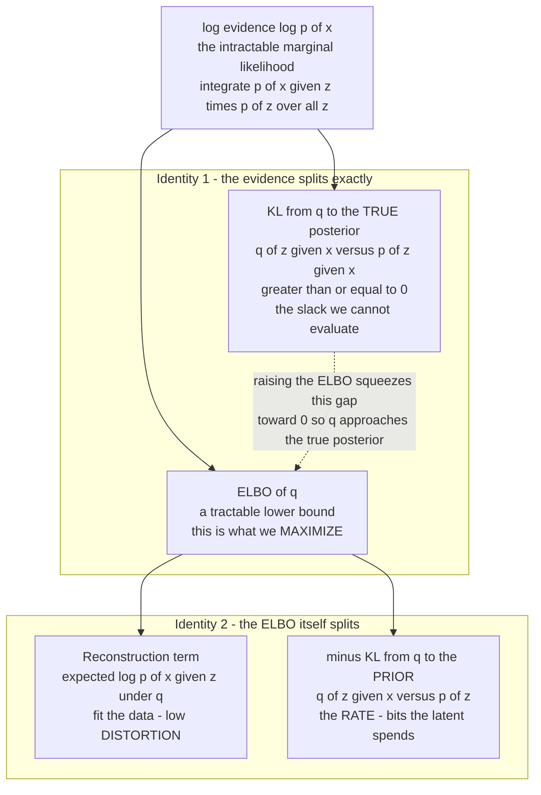

# ⚖️ Variational Inference, the ELBO, and VAEs

> [!abstract] TL;DR
> Exact Bayesian inference asks for the **posterior** $p(z \mid x)$, which needs the **evidence** $p(x) = \int p(x \mid z)\,p(z)\,dz$ — an integral that is intractable for almost any interesting model. **Variational inference (VI)** dodges the integral by turning inference into *optimization*: pick a tractable family $q(z)$ and make it as close as possible to the true posterior by minimizing $\mathrm{KL}\!\left(q \,\|\, p(z\mid x)\right)$. That KL still hides the intractable $p(x)$, so we instead **maximize the Evidence Lower BOund (ELBO)**, which satisfies the exact identity $\log p(x) = \mathrm{ELBO}(q) + \mathrm{KL}\!\left(q \,\|\, p(z\mid x)\right)$. Because $\log p(x)$ is fixed, *raising the ELBO simultaneously fits the data and shrinks the KL to the true posterior.* The ELBO splits into **reconstruction minus rate**: $\mathrm{ELBO} = \mathbb{E}_q[\log p(x\mid z)] - \mathrm{KL}\!\left(q(z\mid x)\,\|\,p(z)\right)$ — the second term is literally the *bits the latent code spends*. A **variational autoencoder** is amortized VI with neural nets and the reparameterization trick; **$\beta$-VAE** dials the rate term to trace a rate-distortion curve. And the **negative ELBO is the variational free energy** — the *same* $F = E - TS$ of statistical physics and of the free-energy principle for brains.

---

## Intuition

**Analogy — measuring a lake you are not allowed to drain.** You want to know the exact shape of the bottom of a lake (the true posterior $p(z\mid x)$), but the only honest way to get it is to drain the entire lake and survey every point — an impossibly expensive operation (the intractable integral for the evidence $p(x)$). So you cheat productively: you take a *simple, adjustable object you fully understand* — say an inflatable dome (a Gaussian $q(z)$) — and you slide and stretch it until it hugs the water's surface as tightly as you can manage. You never drained the lake; you replaced an impossible **measurement** with a tractable **fitting** problem.

That is the whole move of variational inference: **replace an integration you cannot do with an optimization you can.** You give up exactness (your dome is not the true bottom) in exchange for a bound you can actually compute and improve. The genius is that the *quality of the fit* — how badly your dome misses the true surface — is exactly the gap between a number you can compute (the ELBO) and a number you want but cannot (the log-evidence). Push the computable number up, and the gap you cannot see is forced down. You optimize the shadow and the real thing follows.

---

## How It Works

### 1. The problem: the posterior needs an intractable integral

Bayes' rule for a latent-variable model with latent $z$ and observation $x$ is

$$p(z \mid x) \;=\; \frac{p(x \mid z)\,p(z)}{p(x)}, \qquad p(x) \;=\; \int p(x \mid z)\,p(z)\,dz .$$

The numerator (likelihood times prior) is easy — it is how you *defined* the model. The denominator $p(x)$, the **evidence** or **marginal likelihood**, is a sum/integral over *all* configurations of $z$. For a discrete $z$ with $2^{50}$ states, or a continuous $z$ passed through a neural network, that integral has no closed form and no feasible numerical approximation by brute force. Without it you cannot normalize the posterior, and MCMC — the exact alternative — is often too slow to run inside a training loop. This single intractable integral is the wall that VI is built to climb. See [[Bayesian_Statistics]] for the exact-inference side of this story.

### 2. The idea: approximate the posterior, minimize KL

Introduce a **variational distribution** $q(z)$ from a tractable family $\mathcal{Q}$ (e.g. all Gaussians). We want the member of $\mathcal{Q}$ closest to the true posterior in [[Relative_Entropy_and_Cross_Entropy|KL divergence]]:

$$q^\star \;=\; \arg\min_{q \in \mathcal{Q}} \; \mathrm{KL}\!\left(q(z) \,\big\|\, p(z \mid x)\right)
\;=\; \arg\min_{q}\; \mathbb{E}_{q}\!\left[\log \frac{q(z)}{p(z\mid x)}\right].$$

We use the **reverse KL** $\mathrm{KL}(q\|p)$ (not $\mathrm{KL}(p\|q)$) on purpose: it only requires expectations *under $q$*, which we can sample, and it makes $q$ **mode-seeking / zero-forcing** — $q$ hugs one mode tightly rather than smearing across gaps in $p$. The catch: expand the definition and the true posterior drags the intractable evidence right back in:

$$\mathrm{KL}\!\left(q \,\|\, p(z\mid x)\right) = \mathbb{E}_q[\log q(z)] - \mathbb{E}_q[\log p(x, z)] + \log p(x).$$

We still cannot evaluate this because of the $\log p(x)$ term. So we do not minimize the KL directly — we minimize everything *except* the constant $\log p(x)$.

### 3. The ELBO: the quantity we actually optimize

Define the **Evidence Lower BOund**:

$$\boxed{\;\mathrm{ELBO}(q) \;=\; \mathbb{E}_q\!\left[\log p(x, z)\right] - \mathbb{E}_q[\log q(z)] \;=\; \mathbb{E}_q\!\left[\log \frac{p(x,z)}{q(z)}\right].\;}$$

Every term here is computable — no evidence integral. Rearranging the KL expansion above gives the **central identity of variational inference**:

$$\boxed{\;\log p(x) \;=\; \underbrace{\mathrm{ELBO}(q)}_{\text{computable}} \;+\; \underbrace{\mathrm{KL}\!\left(q(z)\,\|\,p(z\mid x)\right)}_{\ge\,0,\ \text{unknowable slack}}.\;}$$

Read this carefully — it is the whole subject in one line:

- Since $\mathrm{KL} \ge 0$, the ELBO is a **lower bound** on the log-evidence: $\mathrm{ELBO}(q) \le \log p(x)$. Hence the name.
- $\log p(x)$ **does not depend on $q$** — it is a fixed property of the data and model. So the ELBO and the KL-to-the-true-posterior are a *seesaw of constant total length.*
- Therefore **maximizing the ELBO is identical to minimizing $\mathrm{KL}(q\|p(z\mid x))$.** Every bit of ELBO you gain is a bit of posterior-approximation error you lose. You never had to compute the KL to minimize it.
- The bound is **tight** ($\mathrm{ELBO} = \log p(x)$) exactly when $q = p(z\mid x)$ — the approximation becomes the truth.

So maximizing the ELBO does *two jobs at once*: it drives $q$ toward the true posterior (better **inference**) and, because at the optimum $\mathrm{ELBO} \to \log p(x)$, it also fits the model to the data (better **learning**). This double duty is why the ELBO is the objective for both VI and generative model training.

### 4. The information reading: reconstruction minus rate

Regroup the ELBO by pulling the prior $p(z)$ out of the joint $p(x,z) = p(x\mid z)\,p(z)$:

$$\boxed{\;\mathrm{ELBO} \;=\; \underbrace{\mathbb{E}_{q(z\mid x)}\!\left[\log p(x\mid z)\right]}_{\text{reconstruction: fit the data}} \;-\; \underbrace{\mathrm{KL}\!\left(q(z\mid x)\,\|\,p(z)\right)}_{\text{rate: bits the code spends}}.\;}$$

This is the form used to *train* models, and it is pure information theory:

- The **reconstruction term** rewards a code $z$ from which the decoder can regenerate $x$ with high likelihood. Its negative is a **distortion** — how badly $x$ is reproduced.
- The **KL-to-prior term** is a **rate**: it measures, in nats (divide by $\ln 2$ for bits), how many bits of information $q(z\mid x)$ packs into the latent *beyond* the prior $p(z)$. It is the expected code length to describe $z$ under a bits-back / relative-entropy coding scheme. Pushing $q(z\mid x)$ toward the prior costs zero bits but destroys information; carrying lots of information about $x$ costs rate.

So the ELBO is *reconstruction minus rate* — precisely the Lagrangian of a **lossy compressor**: minimize distortion subject to a rate budget. This is the exact bridge to [[Rate_Distortion_Theory_and_Lossy_Compression]]: the VAE latent is a lossy code, the KL term is its rate, and the reconstruction term is its distortion. Optimizing the ELBO *is* rate-distortion optimization with the prior playing the role of the entropy model.



### 5. VAEs: amortized VI with neural nets and the reparameterization trick

Classical VI optimizes a *separate* $q$ for every data point $x$ — expensive. A **variational autoencoder** (Kingma & Welling, 2014) does **amortized inference**: a single neural network, the **encoder** $q_\phi(z\mid x)$, *predicts* the variational parameters (mean and variance of a Gaussian $q$) from $x$ in one forward pass. A second network, the **decoder** $p_\theta(x\mid z)$, plays the likelihood. Both are trained jointly by ascending the ELBO.

The obstacle: the ELBO contains $\mathbb{E}_{q_\phi(z\mid x)}[\cdot]$, and the sampling step $z \sim q_\phi$ is not differentiable in $\phi$. The **reparameterization trick** fixes this by pushing the randomness outside the parameters: sample $\epsilon \sim \mathcal{N}(0, I)$ and set $z = \mu_\phi(x) + \sigma_\phi(x)\odot \epsilon$. Now $z$ is a *deterministic, differentiable* function of $\phi$ and a fixed noise source, so gradients flow through the sampler by ordinary backprop. This one trick is what made VI scale to deep networks. See [[Variational_Autoencoders]] for the full architecture and [[Autoencoders]] for the deterministic cousin (no distribution, no KL, no generation guarantee).

### 6. $\beta$-VAE and the rate-distortion / disentanglement dial

Weight the rate term by a knob $\beta$:

$$\mathcal{L}_\beta = \mathbb{E}_{q}[\log p(x\mid z)] - \beta\,\mathrm{KL}\!\left(q(z\mid x)\,\|\,p(z)\right).$$

- $\beta = 1$ is the exact ELBO.
- $\beta > 1$ **squeezes the rate** — the latent is forced through a tighter information bottleneck, which empirically encourages **disentangled**, axis-aligned factors of variation but blurs reconstructions. This is a bottleneck on mutual information $I(x; z)$, tying it to representation learning (compare the mutual-information view in [[Joint_Conditional_Entropy_and_Mutual_Information]]).
- $\beta < 1$ spends more rate, sharpening reconstructions at the cost of a messier, less structured code.

Sweeping $\beta$ traces the model's **rate-distortion frontier** — the same $R(D)$ curve of Shannon's theory. Alemi et al. (2018) showed the ELBO alone does not pin down where on this curve you land; $\beta$ (or the architecture) chooses the operating point. The Python demo below reproduces this curve for a linear-Gaussian model.

### 7. The free-energy unification: VI = statistical physics = the Bayesian brain

Write the *negative* ELBO:

$$\mathcal{F}(q) \;=\; -\mathrm{ELBO}(q) \;=\; \underbrace{\mathbb{E}_q\!\left[-\log p(x, z)\right]}_{\text{expected energy } E} \;-\; \underbrace{\big(-\mathbb{E}_q[\log q(z)]\big)}_{\text{entropy } S \text{ of } q}.$$

This is *exactly* the **Helmholtz free energy** $F = E - TS$ of statistical mechanics (with temperature $T = 1$): the "energy" is $-\log p(x,z)$, and the "entropy" is the Shannon entropy of $q$. Minimizing variational free energy is the same variational principle that equilibrium thermodynamics obeys — the Boltzmann distribution is the $q$ that minimizes $F$ (see [[Entropy_and_Second_Law]] for the $S = k\ln W$ / second-law backdrop). The name **variational free energy** in ML is not an analogy; it is the identical quantity.

The same $\mathcal{F}$ reappears in neuroscience as the **free-energy principle** (Friston): a brain is cast as minimizing variational free energy — i.e., doing approximate Bayesian inference over the causes of its sensations, with perception minimizing $\mathcal{F}$ over $q$ and action minimizing it over the sensory data. See [[Predictive_Processing_and_Free_Energy]] and [[Bayesian_Models_of_Cognition]]. Thermodynamics, machine learning, and theoretical neuroscience are all minimizing the *same* functional — one of the most striking unifications in modern science.

### 8. EM, wake-sleep, and mean-field vs structured $q$

- **Expectation-Maximization (EM)** is VI's ancestor and special case: the **E-step** sets $q(z) = p(z\mid x)$ (exact posterior, ELBO becomes tight), the **M-step** maximizes the ELBO over model parameters $\theta$. When the exact posterior is intractable, you replace the E-step with a *variational* E-step — that is **variational EM**.
- **Wake-sleep** (Helmholtz machine) alternates a *wake* phase (train the generative/decoder weights on real data) and a *sleep* phase (train the recognition/encoder on the model's own dreams), a biologically-flavored precursor to the VAE encoder-decoder split.
- **Mean-field** VI assumes $q(z) = \prod_i q_i(z_i)$ — fully factorized, cheap, but blind to posterior correlations (it underestimates variance). **Structured** approximations (normalizing flows, full-covariance Gaussians, hierarchical $q$) restore correlations for a richer, tighter bound at higher cost.

---

## Key Concepts

### Secondary (intuitive level)
- **Exact Bayesian inference is often impossible** because it needs a giant integral (the *evidence*). VI replaces that integral with an easier *fitting* problem.
- **Fit a simple distribution $q$ to the true, unknown posterior** and make it as close as you can.
- The thing we actually maximize is the **ELBO** — a computable lower bound on how well the model explains the data.
- **Maximizing the ELBO pushes $q$ toward the truth** *and* fits the model, at the same time.
- The ELBO is **reconstruction minus a "rate"** — how well you rebuild the data, minus how many bits the code uses.

### Undergraduate (working level)
- **Central identity:** $\log p(x) = \mathrm{ELBO}(q) + \mathrm{KL}(q\,\|\,p(z\mid x))$; since $\log p(x)$ is constant in $q$, max-ELBO $=$ min-KL-to-posterior.
- **ELBO forms:** $\mathbb{E}_q[\log p(x,z)] - \mathbb{E}_q[\log q]$ (energy form) $=$ $\mathbb{E}_q[\log p(x\mid z)] - \mathrm{KL}(q(z\mid x)\|p(z))$ (reconstruction-minus-rate form).
- **Reverse KL** $\mathrm{KL}(q\|p)$ is used (not forward): needs only expectations under $q$; mode-seeking / variance-underestimating.
- **VAE** $=$ amortized VI: neural encoder outputs $q_\phi(z\mid x)$, neural decoder is $p_\theta(x\mid z)$, trained by ELBO ascent.
- **Reparameterization trick:** $z = \mu_\phi(x) + \sigma_\phi(x)\odot\epsilon,\ \epsilon\sim\mathcal{N}(0,I)$ — makes sampling differentiable.
- **$\beta$-VAE:** weight the KL by $\beta$; larger $\beta$ $\Rightarrow$ tighter information bottleneck, more disentanglement, blurrier reconstruction.

### Graduate (theoretical level)
- **Rate-distortion view of the ELBO** (Alemi et al.): $D + \beta R$ Lagrangian; the ELBO does not uniquely determine the $(R, D)$ operating point — many solutions share the same ELBO but differ in latent usage (the "information-preference" / posterior-collapse degeneracy).
- **Variational free energy:** $-\mathrm{ELBO} = \mathbb{E}_q[-\log p(x,z)] - H[q] = E - S$ at $T=1$; identical to Helmholtz free energy and to Friston's free-energy functional. The Gibbs-Bogoliubov-Feynman inequality is the physics statement of $\mathrm{ELBO} \le \log p(x)$.
- **EM as coordinate ascent** on the ELBO in $(q, \theta)$; variational EM when the E-step posterior is intractable.
- **Mean-field vs structured $q$:** CAVI (coordinate-ascent VI) fixed-point updates for conjugate-exponential models; normalizing flows and full-covariance/hierarchical $q$ tighten the bound; SVI (stochastic VI) scales to large data via noisy natural-gradient steps.
- **Gradient estimators:** pathwise/reparameterization (low variance, needs continuous reparameterizable $q$) vs score-function/REINFORCE (general, high variance, needs control variates). Amortization gap and inference suboptimality.
- **Where the bound is loose:** the tightness gap *is* $\mathrm{KL}(q\|p(z\mid x))$; importance-weighted (IWAE) and multi-sample bounds trade compute for a tighter, lower-bias estimator.

---

## Python Demo

```python
# Variational inference, the ELBO, and the rate-distortion view of a VAE,
# on an exactly-solvable linear-Gaussian latent-variable model.
#
#   prior:        z ~ N(0, 1)
#   likelihood:   x | z ~ N(w*z, sigma_x^2)         (a linear "decoder")
#   marginal:     x    ~ N(0, var_x),  var_x = w^2 + sigma_x^2
#
# Because everything is Gaussian, the TRUE posterior p(z|x) is available in
# closed form, so we can DIRECTLY verify the two claims of the note:
#
#   Part A: maximizing the ELBO == minimizing KL(q || true posterior).
#           We watch ELBO climb to log p(x) while that KL falls to ~0.
#
#   Part B: the ELBO is "reconstruction minus rate". Sweeping a beta weight
#           on the KL-to-prior term traces the beta-VAE RATE-DISTORTION curve
#           (rate = KL in bits, distortion = reconstruction MSE).
import numpy as np
import matplotlib.pyplot as plt

# ---- model constants ------------------------------------------------
w        = 1.5          # decoder weight
sigma_x2 = 0.3          # observation noise variance
var_x    = w**2 + sigma_x2   # marginal variance of x
c1       = 0.5 / sigma_x2    # 0.5 / sigma_x^2, appears in the log-likelihood

# closed-form TRUE posterior p(z|x) = N(mu_post(x), s2_post)
s2_post      = 1.0 / (1.0 + w**2 / sigma_x2)          # independent of x
def mu_post(x):  return s2_post * (w * x / sigma_x2)

def log_evidence(x):                                   # log N(x; 0, var_x)
    return -0.5*np.log(2*np.pi*var_x) - x**2/(2*var_x)

def kl_gauss(mu_q, s2_q, mu_p, s2_p):                  # KL(N(mu_q,s2_q)||N(mu_p,s2_p))
    return 0.5*(s2_q/s2_p + (mu_q-mu_p)**2/s2_p - 1.0 - np.log(s2_q/s2_p))

# ============ PART A: ELBO ascent == shrinking KL to true posterior ==
x0 = 1.2
mu, r = 0.0, 0.0            # q = N(mu, exp(r)); start far from the posterior
lr, steps = 0.05, 400
elbo_hist, klpost_hist = [], []
for _ in range(steps):
    s2 = np.exp(r)
    # ELBO(q) for this single x0 = E_q[log p(x0|z)] - KL(q || prior)
    rec  = -0.5*np.log(2*np.pi*sigma_x2) - c1*((x0 - w*mu)**2 + w**2*s2)
    klpr = 0.5*(s2 + mu**2 - 1.0 - r)                  # KL(q || N(0,1))
    elbo = rec - klpr
    elbo_hist.append(elbo)
    klpost_hist.append(kl_gauss(mu, s2, mu_post(x0), s2_post))
    # gradients of ELBO (ascend): d/dmu and d/dr
    g_mu = -2*c1*w*(x0 - w*mu) + mu                    # d(-ELBO)/dmu
    g_r  =  c1*w**2*s2 + 0.5*(s2 - 1.0)                # d(-ELBO)/dr
    mu -= lr*g_mu
    r  -= lr*g_r

logpx = log_evidence(x0)
print("PART A  (single point x0 = %.2f)" % x0)
print("  final ELBO           = %.4f" % elbo_hist[-1])
print("  log evidence log p(x)= %.4f   <-- the ceiling" % logpx)
print("  final KL(q||true post)= %.6f  <-- the seesaw gap, driven to 0" % klpost_hist[-1])
print("  identity check  ELBO + KL = %.4f  (equals log p(x))"
      % (elbo_hist[-1] + klpost_hist[-1]))

# ============ PART B: beta-VAE rate-distortion frontier ==============
# Amortized linear encoder q(z|x) = N(a*x, s^2), shared params (a, s2).
# Averaged over x ~ N(0, var_x):
#   rate (nats)      R = 0.5*(s2 + a^2*var_x - 1 - ln s2)
#   distortion (MSE) D = var_x*(1 - w*a)^2 + w^2*s2
# beta-VAE objective: minimize  c1*D + beta*R  over (a, r=ln s2).
def fit_beta(beta, lr=0.02, steps=6000):
    a, r = 0.5, 0.0
    for _ in range(steps):
        s2 = np.exp(r)
        # gradients of L = c1*D + beta*R
        dD_da = var_x*2*(1 - w*a)*(-w)
        dL_da = c1*dD_da + beta*(a*var_x)
        dL_dr = c1*(w**2*s2) + beta*0.5*(s2 - 1.0)
        a -= lr*dL_da
        r -= lr*dL_dr
    s2 = np.exp(r)
    R_nats = 0.5*(s2 + a**2*var_x - 1.0 - np.log(s2))
    D_mse  = var_x*(1 - w*a)**2 + w**2*s2
    return R_nats/np.log(2), D_mse            # rate in BITS, distortion in MSE

betas = np.geomspace(0.05, 20.0, 24)
pts = np.array([fit_beta(b) for b in betas])   # columns: rate(bits), distortion
rate, dist = pts[:,0], pts[:,1]
print("\nPART B  beta-VAE frontier (a few points):")
for b, R, D in list(zip(betas, rate, dist))[::6]:
    print("  beta=%5.2f   rate=%.3f bits   distortion(MSE)=%.4f" % (b, R, D))

# ---- plots ----------------------------------------------------------
fig, ax = plt.subplots(1, 2, figsize=(12, 4.6))

ax[0].plot(elbo_hist, color="#2563eb", lw=2, label="ELBO(q)")
ax[0].axhline(logpx, color="black", ls="--", lw=1.5, label="log evidence log p(x)")
ax[0].plot(np.array(logpx) - np.array(klpost_hist), color="#d97706", lw=1, ls=":",
           label="log p(x) - KL(q||true post)")   # lies exactly on the ELBO curve
ax[0].set_xlabel("optimization step")
ax[0].set_ylabel("nats")
ax[0].set_title("Part A: ELBO rises to log p(x) as KL(q||true post) -> 0")
ax[0].legend(loc="lower right", fontsize=8)

sc = ax[1].scatter(dist, rate, c=np.log10(betas), cmap="viridis", zorder=5)
ax[1].plot(dist, rate, color="gray", lw=1, alpha=0.6)
ax[1].set_xlabel("distortion  (reconstruction MSE)")
ax[1].set_ylabel("rate  (KL to prior, bits)")
ax[1].set_title("Part B: beta-VAE rate-distortion frontier")
cb = fig.colorbar(sc, ax=ax[1]); cb.set_label("log10(beta)")
ax[1].annotate("small beta:\nhigh rate, low distortion", (dist.min(), rate.max()),
               fontsize=8, va="top")
ax[1].annotate("large beta:\nlow rate, high distortion", (dist.max(), rate.min()),
               fontsize=8, ha="right")

plt.tight_layout()
plt.show()

# Expected output:
#  Part A: ELBO climbs and flattens exactly at log p(x); KL(q||true post) -> ~1e-4;
#          the dotted "log p(x) - KL" curve sits ON TOP of the ELBO curve,
#          confirming the identity log p(x) = ELBO + KL(q || true posterior).
#  Part B: a downward-sloping, convex frontier -- small beta buys low distortion
#          at high rate (many latent bits); large beta forces a tight bottleneck
#          (few bits) and higher distortion. That is the rate-distortion tradeoff
#          of the learned representation, i.e. the beta-VAE curve.
```

**What the two panels prove.** The **left** panel is the central identity made visual: the blue ELBO rises and asymptotes *exactly* at the dashed log-evidence ceiling, and the orange dotted curve $\log p(x) - \mathrm{KL}(q\|p(z\mid x))$ lands right on top of it — so every nat of ELBO gained is a nat of KL-to-the-true-posterior lost. Maximizing the computable ELBO silently minimizes the uncomputable KL. The **right** panel is the ELBO's two halves in tension: sweeping $\beta$ walks the model along a convex **rate-distortion frontier**, exactly the $R(D)$ curve of [[Rate_Distortion_Theory_and_Lossy_Compression]] — proof that a VAE is a lossy compressor whose latent rate you can dial.

---

## Real-World Applications

- **Variational autoencoders (generative modeling):** image, audio, and molecule generation; the ELBO is the training loss and the latent is a smooth, samplable code. VQ-VAE and its tokenizers feed modern image/audio LLMs. See [[Variational_Autoencoders]].
- **Diffusion models:** the training objective is a **variational bound on the log-likelihood** — a hierarchical ELBO over the denoising chain. Every state-of-the-art image generator (Stable Diffusion, Imagen) is, underneath, optimizing an ELBO. See [[Diffusion_Models]].
- **Bayesian neural networks:** VI over the *weights* (Bayes-by-Backprop) gives calibrated uncertainty and principled regularization at a fraction of MCMC's cost.
- **Topic models (LDA) and probabilistic PCA / factor analysis:** the original at-scale killer apps of VI — mean-field/CAVI updates infer per-document topic mixtures over millions of documents.
- **Probabilistic programming (Stan ADVI, Pyro, TensorFlow Probability):** automatic differentiation variational inference lets non-experts run approximate Bayes on arbitrary models by ELBO maximization with reparameterization gradients.
- **Neuroscience and the free-energy principle:** active inference agents and predictive-processing models of cortex are built by minimizing variational free energy $= -\mathrm{ELBO}$. See [[Predictive_Processing_and_Free_Energy]] and [[Bayesian_Models_of_Cognition]].
- **Neural lossy compression:** learned codecs optimize $D + \beta R$ directly — the $\beta$-VAE objective — and now rival hand-built video codecs on perceptual metrics.

---

## Common Pitfalls

- **Posterior collapse.** With a powerful autoregressive decoder, the model can achieve high reconstruction while driving $\mathrm{KL}(q(z\mid x)\|p(z)) \to 0$ — the latent carries *zero* information and $q$ just equals the prior. The rate goes to zero and $z$ is ignored. Fixes: KL annealing / warm-up, free-bits (floor the per-dim KL), weaker decoders, or $\beta < 1$ early.
- **Mistaking a high ELBO for a good posterior.** A tight ELBO means a good *bound*; but two models with the same ELBO can occupy very different $(R, D)$ points. The ELBO alone does not pin latent usage — report rate and distortion separately (Alemi et al.).
- **Reverse-KL blindness / mode collapse.** $\mathrm{KL}(q\|p)$ is mode-seeking and **underestimates posterior variance**; a mean-field Gaussian $q$ can look confident while missing whole modes of a multimodal posterior. Use structured $q$, flows, or importance-weighted bounds when this matters.
- **Forgetting the trick's fine print.** The reparameterization estimator needs a *continuous, reparameterizable* $q$; it does not apply directly to discrete latents (use Gumbel-Softmax/concrete relaxations or score-function estimators with control variates instead).
- **Unbalanced units / weighting.** If the reconstruction term is a summed pixel MSE and the KL is per-latent-dim, their implicit relative weight is an *accidental* $\beta$ set by dimensionality — people "tune the KL weight" without realizing they are choosing an operating point on the rate-distortion curve. Make $\beta$ explicit.
- **Treating the ELBO gap as small by default.** The looseness of the bound is exactly $\mathrm{KL}(q\|p(z\mid x))$, which can be large for a poor variational family. A high training ELBO with poor samples often means the *bound*, not the model, is the problem — tighten $q$ (IWAE, flows) before blaming the generator.

---

## Related Concepts

- [[Relative_Entropy_and_Cross_Entropy]] — KL divergence is the engine of VI: it defines the gap to the true posterior *and* the rate term of the ELBO. VI is applied relative entropy.
- [[Rate_Distortion_Theory_and_Lossy_Compression]] — the ELBO is reconstruction (distortion) minus KL-to-prior (rate); $\beta$-VAE traces the $R(D)$ curve. A VAE is a rate-distortion optimizer.
- [[Variational_Autoencoders]] — the flagship amortized VI model: neural encoder/decoder, reparameterization trick, the ELBO as training loss.
- [[Autoencoders]] — the deterministic cousin: same encoder-decoder shape but no distribution, no KL term, and no principled generation.
- [[Bayesian_Statistics]] — supplies the exact-inference problem (posterior, evidence, MCMC) that VI approximates by optimization.
- [[Joint_Conditional_Entropy_and_Mutual_Information]] — the rate/KL term bounds the mutual information $I(x; z)$ the code carries; the $\beta$ dial is an information-bottleneck control on representation.
- [[Differential_Entropy_and_Continuous_Variables]] — the entropy $H[q]$ inside the free-energy form of the ELBO is a differential entropy for continuous latents.
- [[Entropy_and_Second_Law]] — the negative ELBO *is* Helmholtz free energy $F = E - TS$; VI and equilibrium thermodynamics minimize the same functional.
- [[Predictive_Processing_and_Free_Energy]] — the free-energy principle casts the brain as minimizing variational free energy, i.e. doing amortized VI over sensory causes.
- [[Bayesian_Models_of_Cognition]] — cognition as approximate Bayesian inference; VI is the scalable machinery that makes such models runnable.
- [[Diffusion_Models]] — trained by maximizing a hierarchical ELBO over the denoising Markov chain; a variational bound in disguise.
- [[Loss_Functions]] — the (negative) ELBO is a composite loss: reconstruction likelihood plus a KL regularizer.

---

## Review Questions

**Tier 1 — Conceptual (explain to a peer):**
1. Using the "measuring a lake you cannot drain" analogy, explain why exact Bayesian inference is intractable and how variational inference sidesteps it. What exactly plays the role of the "inflatable dome"?
2. The ELBO is a *lower* bound on $\log p(x)$. In one or two sentences, explain why *maximizing* it simultaneously (a) fits the model to the data and (b) improves the approximation to the true posterior — even though we never compute the true posterior.

**Tier 2 — Applied (compute / reason):**
3. Start from the identity $\log p(x) = \mathrm{ELBO}(q) + \mathrm{KL}(q\|p(z\mid x))$. Since $\log p(x)$ does not depend on $q$, what does this tell you about the relationship between raising the ELBO and the KL to the true posterior? When is the bound exactly tight?
4. Rewrite the ELBO as $\mathbb{E}_q[\log p(x\mid z)] - \mathrm{KL}(q(z\mid x)\|p(z))$. Label each term as "distortion" or "rate" and explain, in bits, what the second term measures. What happens to reconstructions and to the latent as you increase $\beta$ in a $\beta$-VAE?

**Tier 3 — Theoretical (deep understanding):**
5. Show that the negative ELBO equals $E - S$ with $E = \mathbb{E}_q[-\log p(x,z)]$ and $S = H[q]$, and explain why this is *literally* the Helmholtz free energy $F = E - TS$ at $T=1$. What is the corresponding claim of the free-energy principle for brains, and why is it more than an analogy?
6. Alemi et al. argue the ELBO does not uniquely determine a model's rate-distortion operating point. Construct the intuition: describe two solutions with the *same* ELBO but very different latent usage (one near posterior collapse), and explain why reporting only the ELBO hides this, and how $\beta$ or an explicit rate constraint resolves it.

---

## Sources

- Kingma, D. P. & Welling, M. (2014). *Auto-Encoding Variational Bayes.* ICLR. [arXiv:1312.6114](https://arxiv.org/abs/1312.6114) — the VAE, reparameterization trick, amortized ELBO.
- Blei, D. M., Kucukelbir, A. & McAuliffe, J. D. (2017). *Variational Inference: A Review for Statisticians.* JASA 112(518). [arXiv:1601.00670](https://arxiv.org/abs/1601.00670) — the definitive modern VI review (ELBO, mean-field, CAVI).
- Jordan, M. I., Ghahramani, Z., Jaakkola, T. S. & Saul, L. K. (1999). *An Introduction to Variational Methods for Graphical Models.* Machine Learning 37, 183–233. — the foundational VI / free-energy treatment.
- Higgins, I. et al. (2017). *beta-VAE: Learning Basic Visual Concepts with a Constrained Variational Framework.* ICLR. — the $\beta$ knob and disentanglement.
- Alemi, A. A. et al. (2018). *Fixing a Broken ELBO.* ICML. [arXiv:1711.00464](https://arxiv.org/abs/1711.00464) — the rate-distortion view of the ELBO and posterior collapse.
- Friston, K. (2010). *The Free-Energy Principle: A Unified Brain Theory?* Nature Reviews Neuroscience 11, 127–138. — variational free energy in theoretical neuroscience.

---

#information-theory #variational-inference #elbo #vae #free-energy
