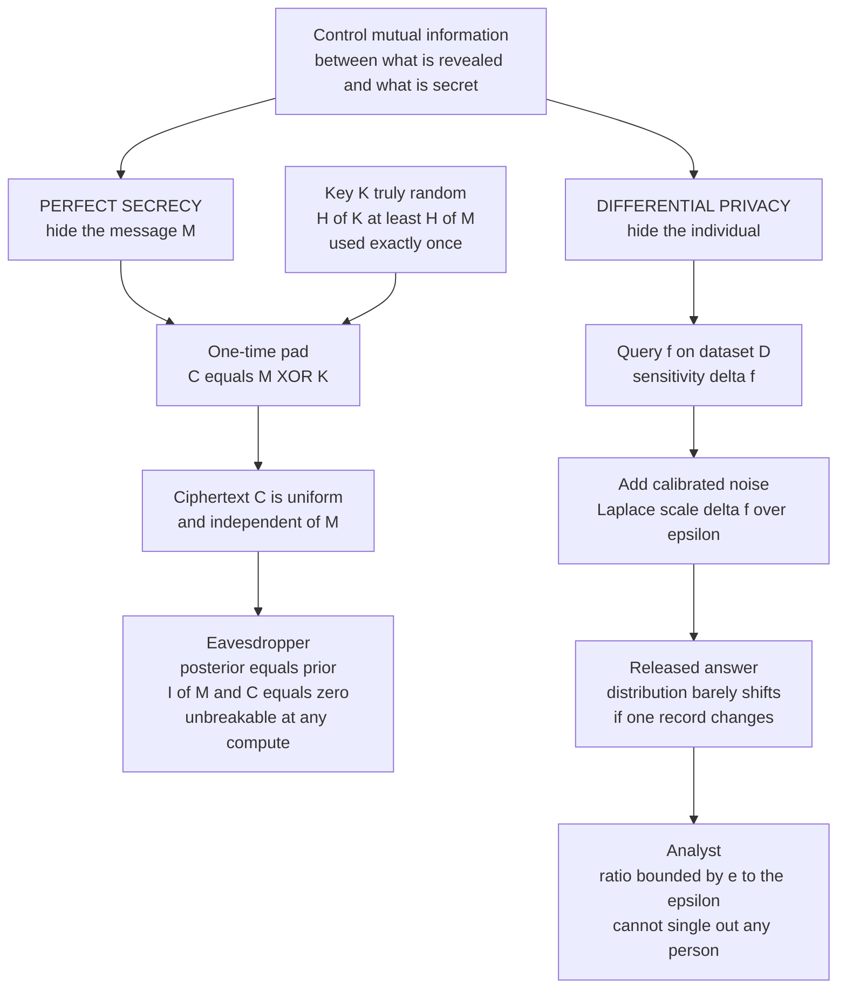

# 🛡️ Information-Theoretic Security and Privacy

> [!abstract] TL;DR
> Information theory gives two guarantees that hold **against any adversary, with any amount of computing power**, because they are statements about *information* rather than *effort*. **Perfect secrecy** (Shannon, 1949) means a ciphertext reveals literally nothing about the plaintext — I(message; ciphertext) = 0, so an eavesdropper's posterior equals their prior — and the **one-time pad** is the unique cipher that achieves it, at the price of a truly random key at least as long as the message. **Differential privacy** (Dwork et al., 2006) is the modern analogue for *data*: a randomized query is ε-differentially-private if adding or removing any single person barely changes the output distribution, bounding what an adversary can learn about any individual. Both are the same idea — **controlling the mutual information between what is revealed and what is secret.**

---

## Intuition

**Analogy (secrecy):** Imagine you scramble a message by adding a fresh, unguessable random number to it — a number you and only your partner know, used exactly once. The scrambled result is *equally likely to be any message of that length*. An eavesdropper who intercepts it, even with a galaxy of supercomputers running until the heat death of the universe, learns nothing: every possible plaintext remains exactly as plausible as before they saw the ciphertext. There is no puzzle to solve, because the ciphertext contains no puzzle. That is **perfect secrecy** — the ciphertext tells the adversary *literally nothing*.

**Analogy (privacy):** Now imagine a hospital wants to publish "how many patients have condition X" without anyone being able to tell whether *you* are in the dataset. Before releasing the count, they roll dice and add a little random noise to it. If the noise is calibrated just right, the published number looks *almost identical* whether or not your record is in the database — so an attacker comparing the two worlds cannot single you out. You are hidden not by a wall, but by **deliberate, measured static**. That is **differential privacy** — adding just enough noise that no individual can be reconstructed from the answer.

Both stories are the same move: make the thing you release **statistically independent (or nearly so) of the thing you must protect.** Secrecy hides a *message*; privacy hides an *individual*; both are governed by mutual information — see [[Joint_Conditional_Entropy_and_Mutual_Information]].

---

## How It Works

### Core Mechanics

**Thread 1 — Perfect secrecy and the one-time pad.**

Let the plaintext be a random variable M with prior distribution p(m), and let C be the ciphertext an eavesdropper observes. Shannon defined a cipher as **perfectly secret** if:

$$p(m \mid c) = p(m) \quad \text{for all } m, c \quad\Longleftrightarrow\quad I(M; C) = 0$$

The **posterior equals the prior**: seeing the ciphertext leaves the adversary's beliefs about the message unchanged. This is **unconditional** or **information-theoretic** security — it does not assume the adversary is computationally bounded, unlike the [[Symmetric_Encryption|computational cryptography]] behind AES or the hardness assumptions (factoring, discrete log) behind [[Asymmetric_Cryptography_and_PKI|public-key systems]]. Those schemes are "secure" only because *nobody knows a fast enough algorithm yet*; perfect secrecy is secure because there is **nothing to compute**.

The **one-time pad (Vernam cipher)** achieves it. Encrypt bit-by-bit by XOR-ing the message M with a key K:

$$C = M \oplus K$$

where K is (1) **truly random and uniform**, (2) **at least as long as M**, and (3) **used exactly once**. Because K is uniform and independent of M, C is uniform and independent of M, so I(M; C) = 0. Decryption is C ⊕ K = M.

**Shannon's impossibility bound** is the catch: *any* perfectly secret cipher must have a key whose entropy is at least the message entropy:

$$H(K) \ge H(M)$$

Intuition: to make the ciphertext independent of every possible message, the key must be able to "point to" any plaintext with equal probability, which requires at least as much randomness as the messages themselves carry. This is why the one-time pad is **impractical** for everyday use — you must securely pre-share as many key bits as you will ever send — and why it is reserved for the **highest-stakes channels** (historical diplomatic hotlines, the Moscow–Washington link, top-tier espionage).

**Thread 2 — The wiretap channel (secrecy without a shared key).** Wyner (1975) showed you can get secrecy *without* pre-shared keys if the eavesdropper's channel is physically **worse** (noisier) than the legitimate receiver's. By coding cleverly, you can transmit at any rate up to the **secrecy capacity** — the gap between the two channels' capacities — while I(message; eavesdropper's observation) → 0. This is the information-theoretic root of physical-layer security and of quantum key distribution (QKD), where measurement disturbance guarantees any eavesdropper is the "degraded" party.

**Thread 3 — Differential privacy (hiding individuals in aggregate data).** A randomized algorithm M is **ε-differentially private** if for every pair of **neighboring** datasets D and D′ (differing in one individual's record) and every possible output S:

$$\Pr[\mathcal{M}(D) \in S] \le e^{\varepsilon} \cdot \Pr[\mathcal{M}(D') \in S]$$

The output distribution barely moves when any one person is added or removed, so an adversary cannot confidently infer whether you are in the data. The knob **ε (the privacy budget)** trades privacy for accuracy: small ε = strong privacy = more noise; large ε = weak privacy = more accuracy.

The **Laplace mechanism** achieves ε-DP for a numeric query f by adding noise scaled to the query's **sensitivity** Δf (the most f can change when one record changes):

$$\mathcal{M}(D) = f(D) + \text{Laplace}\!\left(0, \tfrac{\Delta f}{\varepsilon}\right)$$

For a count query Δf = 1. The **Gaussian mechanism** gives the slightly weaker (ε, δ)-DP and composes better under many queries. **Composition** means privacy loss accumulates: answering k queries each at ε costs up to kε total (basic composition), so the budget must be *spent* carefully. **Local DP** adds noise on each user's device *before* it ever leaves (no trusted curator, weaker utility — Google RAPPOR, Apple); **central DP** trusts a curator to add noise once to the aggregate (better utility — US Census).

### The Two Threads of Information-Theoretic Guarantees



---

## Key Concepts

### Secondary (intuitive)
- **Perfect secrecy** = the scrambled message could equally be *any* message, so an eavesdropper learns nothing — no computer, however fast, can help.
- The **one-time pad** achieves this by adding a fresh random key as long as the message; its weakness is you need as much secret key as you have secret message.
- **Differential privacy** = before publishing a statistic, add a little random noise so nobody can tell whether *your* data was included.
- The **privacy budget ε** is the dial: less noise means more useful numbers but weaker privacy; more noise means the opposite.

### Undergraduate (formal)
- **Shannon secrecy:** perfect secrecy ⟺ p(m|c) = p(m) ⟺ I(M; C) = 0. Ciphertext and plaintext are statistically independent.
- **Key-length bound:** perfect secrecy requires H(K) ≥ H(M); the one-time pad meets it with equality and is essentially the *unique* perfectly secret cipher.
- **Computational vs unconditional security:** AES/RSA rely on *hardness assumptions* and a bounded adversary; the one-time pad relies on *no assumptions* — see [[Symmetric_Encryption]] and [[Asymmetric_Cryptography_and_PKI]].
- **Entropy of secrets:** password/key strength is measured in **bits of entropy**; the right measure for guessing resistance is **min-entropy** H∞(X) = −log₂ maxₓ p(x), the probability the single most likely guess is correct — see [[Entropy_and_Information_Content]].
- **ε-DP:** Pr[M(D)∈S] ≤ e^ε · Pr[M(D′)∈S] for all neighboring D, D′ and outputs S.
- **Laplace mechanism:** release f(D) + Lap(Δf/ε); the ε-DP proof is the ratio of two Laplace densities centered Δf apart, bounded by e^ε everywhere.

### Graduate (advanced)
- **Uniqueness / structure:** with |K| = |M| = |C| and every message possible, perfect secrecy forces the key to be uniform and the encryption to be a bijection for each key — Shannon's theorem pins down the one-time pad.
- **Wiretap channel & secrecy capacity:** Cₛ = maxₚ₍ₓ₎ [ I(X; Y) − I(X; Z) ] for main channel Y and eavesdropper channel Z; keyless secrecy is possible whenever the eavesdropper is degraded.
- **Approximate DP:** (ε, δ)-DP relaxes the guarantee by an additive δ (a small "failure probability"), enabling the Gaussian mechanism with noise σ ∝ Δf·√(2 ln(1.25/δ))/ε.
- **Divergence view:** ε-DP is a bound on the **max-divergence** between output distributions; **Rényi DP** and **zero-concentrated DP** use [[Relative_Entropy_and_Cross_Entropy|Rényi divergences]] for tighter composition than basic (kε) accounting.
- **Composition & amplification:** advanced composition gives ≈ √(k)·ε growth (not kε) for k mechanisms; **privacy amplification by subsampling** further reduces the effective ε — the backbone of DP-SGD in machine learning.
- **Continuous outputs:** Laplace and Gaussian mechanisms live in the continuous world of [[Differential_Entropy_and_Continuous_Variables|differential entropy]]; sensitivity is an L1 (Laplace) or L2 (Gaussian) notion.
- **Information leakage & side channels:** even a "secure" system leaks if I(secret; observable) > 0 — quantify leakage in bits via mutual information; **timing, power, and cache side channels** are exactly non-zero I(key; physical observation), defeating computational schemes without breaking their math.

---

## Python Demo

```python
# Differential privacy: the Laplace mechanism, its privacy-utility tradeoff,
# and a numerical verification of the epsilon-DP guarantee. numpy + matplotlib only.
import numpy as np
import matplotlib.pyplot as plt

rng = np.random.default_rng(0)

# ----- setup: a COUNT query, protected by the Laplace mechanism -----
# A count query has L1 sensitivity 1: adding/removing one person changes the
# count by at most 1. The Laplace mechanism releases  f(D) + Laplace(0, df/eps).
sensitivity = 1.0
true_count  = 1000.0        # the real answer we must protect

def laplace_pdf(x, mu, b):
    """Density of Laplace(mu, b): (1/2b) * exp(-|x-mu|/b)."""
    return np.exp(-np.abs(x - mu) / b) / (2.0 * b)

# ================================================================
# 1. PRIVACY-UTILITY TRADEOFF
#    Smaller epsilon  ->  larger noise scale b = df/eps  ->  worse accuracy.
#    For Laplace(0, b), the expected absolute error is exactly E|noise| = b.
# ================================================================
epsilons = np.logspace(-2, 1, 40)          # 0.01 (very private) .. 10 (barely private)
trials   = 40000
mae = np.empty_like(epsilons)
for i, eps in enumerate(epsilons):
    b = sensitivity / eps
    noisy = true_count + rng.laplace(0.0, b, size=trials)
    mae[i] = np.mean(np.abs(noisy - true_count))   # empirical mean absolute error

# ================================================================
# 2. VERIFY THE epsilon-DP GUARANTEE
#    Neighboring datasets D and D' differ by one record, so their true answers
#    differ by the sensitivity. epsilon-DP demands the output densities satisfy
#        p_D(x) / p_D'(x)  <=  e^epsilon   for EVERY output x.
# ================================================================
eps_demo = 1.0
b        = sensitivity / eps_demo
q_D, q_Dp = true_count, true_count + sensitivity      # answers on D and D'
xs   = np.linspace(true_count - 15, true_count + 15, 2000)
p_D  = laplace_pdf(xs, q_D,  b)
p_Dp = laplace_pdf(xs, q_Dp, b)
ratio = p_D / p_Dp
print(f"epsilon = {eps_demo}")
print(f"max likelihood ratio p_D/p_D' = {ratio.max():.4f}")
print(f"e^epsilon bound               = {np.exp(eps_demo):.4f}")
print(f"guarantee holds (max ratio <= e^eps): {ratio.max() <= np.exp(eps_demo) + 1e-9}")

# ----- plots -----
fig, ax = plt.subplots(1, 3, figsize=(15, 4.5))

ax[0].loglog(epsilons, mae, "o-", lw=2, label="empirical mean abs error")
ax[0].loglog(epsilons, sensitivity / epsilons, "--", label="theory  df / epsilon")
ax[0].set_xlabel("privacy parameter epsilon  (smaller = more private)")
ax[0].set_ylabel("error of released answer")
ax[0].set_title("Privacy-utility tradeoff")
ax[0].legend(); ax[0].grid(True, which="both", alpha=0.3)

ax[1].plot(xs, p_D,  lw=2, label="output on D   count = 1000")
ax[1].plot(xs, p_Dp, lw=2, label="output on D'  count = 1001")
ax[1].set_xlabel("released noisy answer")
ax[1].set_ylabel("probability density")
ax[1].set_title("Neighboring datasets, epsilon = 1")
ax[1].legend()

ax[2].plot(xs, ratio, lw=2, label="ratio  p_D / p_D'")
ax[2].axhline(np.exp(eps_demo),  color="red", ls=":", label="e^+epsilon bound")
ax[2].axhline(np.exp(-eps_demo), color="red", ls=":", label="e^-epsilon bound")
ax[2].set_xlabel("released noisy answer")
ax[2].set_ylabel("likelihood ratio")
ax[2].set_title("epsilon-DP: ratio stays within the bounds")
ax[2].legend()

plt.tight_layout()
plt.show()

# Takeaways:
#  * Left plot  -> accuracy degrades as 1/epsilon: strong privacy costs utility.
#  * Right plot -> the density ratio never exceeds e^epsilon, so the mechanism
#                  provably satisfies epsilon-DP: no single record can move the
#                  output by more than an e^epsilon factor.
```

Running it prints `max likelihood ratio ≈ 2.718 = e^1`, numerically confirming the ε-DP guarantee, and plots (1) accuracy falling off as Δf/ε, (2) two near-identical output densities for datasets differing by one person, and (3) their ratio pinned inside the [e⁻ᵉ, e⁺ᵉ] band.

---

## Real-World Applications

- **The one-time pad in practice:** the Moscow–Washington "hotline" and Cold-War diplomatic/espionage traffic used physically distributed pads for provably unbreakable messaging where the stakes justified the key-management burden.
- **US Census Bureau (2020):** adopted **central differential privacy** as its official disclosure-avoidance system, injecting calibrated noise into published tabulations to protect respondents while releasing national statistics — the largest DP deployment ever.
- **Apple & Google (local DP):** Apple uses local DP to learn popular emoji, typing, and health trends without collecting raw user data; Google's **RAPPOR** applied randomized response in Chrome to gather statistics on settings while giving each user plausible deniability.
- **DP-SGD in machine learning:** training models with per-example gradient clipping plus Gaussian noise gives provable per-record privacy, letting models learn from sensitive medical or financial data (links to [[Privacy_Surveillance_and_Data_Ethics|data ethics]] and modern AI regulation).
- **Physical-layer & quantum security:** wiretap-channel coding and quantum key distribution (BB84) provide keyless or key-establishing secrecy grounded in information theory and physics rather than computational hardness.
- **Password and key strength auditing:** entropy and **min-entropy** estimates quantify how many guesses an attacker needs, driving password policies and the sizing of cryptographic keys (see [[Symmetric_Encryption]] key-derivation discussion).
- **Side-channel defense:** constant-time cryptographic implementations exist precisely to drive I(secret key; timing/power observable) to zero, because a mathematically perfect cipher still leaks through physics.

---

## Common Pitfalls

- **Reusing a one-time pad ("two-time pad")** — encrypting two messages with the same key gives C₁ ⊕ C₂ = M₁ ⊕ M₂, leaking the XOR of the plaintexts and destroying secrecy. The VENONA project broke reused Soviet pads exactly this way. Pad reuse is the single most common OTP failure.
- **A "random" key that isn't random** — the OTP's guarantee is only as good as the key's entropy. A pad from a weak PRNG has far less than H(M) bits of true randomness, silently collapsing perfect secrecy into ordinary (breakable) computational security.
- **Confusing computational and information-theoretic security** — AES-256 is *not* perfectly secret; it is merely computationally infeasible to break today. Only unconditional schemes survive unlimited compute (and future quantum attacks).
- **Treating ε as an intuitive percentage** — ε is a *log-scale* multiplicative bound (e^ε), not a probability. ε = 1 already allows a 2.7× swing in output odds; production systems often need ε well below 1, and there is no universal "safe" value.
- **Ignoring composition / budget exhaustion** — every DP query spends budget. Answering many queries at ε each can blow the total privacy loss to kε; forgetting to account for composition leaks far more than intended.
- **Underestimating query sensitivity** — the noise must scale to the *worst-case* change one record can cause. A sum or max query can have huge (or unbounded) sensitivity; using count-level noise on a high-sensitivity query breaks the guarantee.
- **Post-processing myths vs auxiliary data** — DP is immune to *post-processing*, but the guarantee is about *any single individual*, not about hiding correlations across many people; linkage with external data can still reveal group-level facts. DP bounds individual influence, not all inference.
- **Local DP's utility cost** — pushing noise to each device (no trusted curator) multiplies error by roughly √n versus central DP; deploying local DP without accounting for this yields near-useless statistics at strong ε.

---

## Related Concepts

- [[Entropy_and_Information_Content]] — entropy quantifies a secret's uncertainty; Shannon's H(K) ≥ H(M) bound and min-entropy-based key strength are direct applications.
- [[Joint_Conditional_Entropy_and_Mutual_Information]] — the unifying quantity: perfect secrecy is I(M;C) = 0 and information leakage is I(secret; observable) > 0.
- [[Relative_Entropy_and_Cross_Entropy]] — ε-DP is a bound on the max-divergence between neighboring output distributions; Rényi-DP composition is stated in Rényi divergences.
- [[Differential_Entropy_and_Continuous_Variables]] — the Laplace and Gaussian mechanisms operate on continuous outputs, where sensitivity is an L1/L2 distance.
- [[Symmetric_Encryption]] — the modern *computational* counterpart to the one-time pad; secure by hardness assumptions and a bounded adversary rather than unconditionally.
- [[Asymmetric_Cryptography_and_PKI]] — public-key security rests on factoring/discrete-log hardness, the antithesis of the OTP's assumption-free guarantee.
- [[Post_Quantum_Cryptography]] — motivated by quantum attacks on computational schemes; unconditional secrecy is inherently quantum-safe, sharpening the contrast.
- [[Privacy_and_Data_Protection]] — the legal frame (GDPR, anonymization) that differential privacy operationalizes with a mathematical guarantee.
- [[Privacy_Surveillance_and_Data_Ethics]] — the ethical stakes of aggregate data release, re-identification, and the privacy-utility tradeoff DP formalizes.

---

## Review Questions

1. **Conceptual:** State perfect secrecy in terms of mutual information and explain why it implies "posterior equals prior." Then prove that perfect secrecy requires H(K) ≥ H(M), and use that bound to explain precisely why the one-time pad is impractical for most communication.
2. **Scenario:** A team answers a **count** query with the Laplace mechanism at ε = 0.5, then wants to also release the **average income** of the same group. Why can't they simply reuse the same noise scale? What two things must they reconsider (sensitivity and composition), and how does each change the required noise or the remaining privacy budget?
3. **Trade-off:** Contrast the one-time pad and AES-256 along the axes of *adversary assumptions*, *key management*, and *failure modes*, and separately contrast *local* vs *central* differential privacy along *trust model* and *utility*. In each pair, when is the stronger-guarantee option actually the wrong engineering choice?

---

## Sources

- [Shannon, "Communication Theory of Secrecy Systems," Bell System Technical Journal (1949)](https://ieeexplore.ieee.org/document/6769090)
- [Dwork, McSherry, Nissim & Smith, "Calibrating Noise to Sensitivity in Private Data Analysis," TCC (2006)](https://link.springer.com/chapter/10.1007/11681878_14)
- [Dwork & Roth, "The Algorithmic Foundations of Differential Privacy" (2014)](https://www.cis.upenn.edu/~aaroth/Papers/privacybook.pdf)
- [Wyner, "The Wire-Tap Channel," Bell System Technical Journal (1975)](https://ieeexplore.ieee.org/document/6772207)
- [Erlingsson, Pihur & Korolova, "RAPPOR: Randomized Aggregatable Privacy-Preserving Ordinal Response," ACM CCS (2014)](https://arxiv.org/abs/1407.6981)

---

#information-theory #perfect-secrecy #differential-privacy #cryptography #one-time-pad
