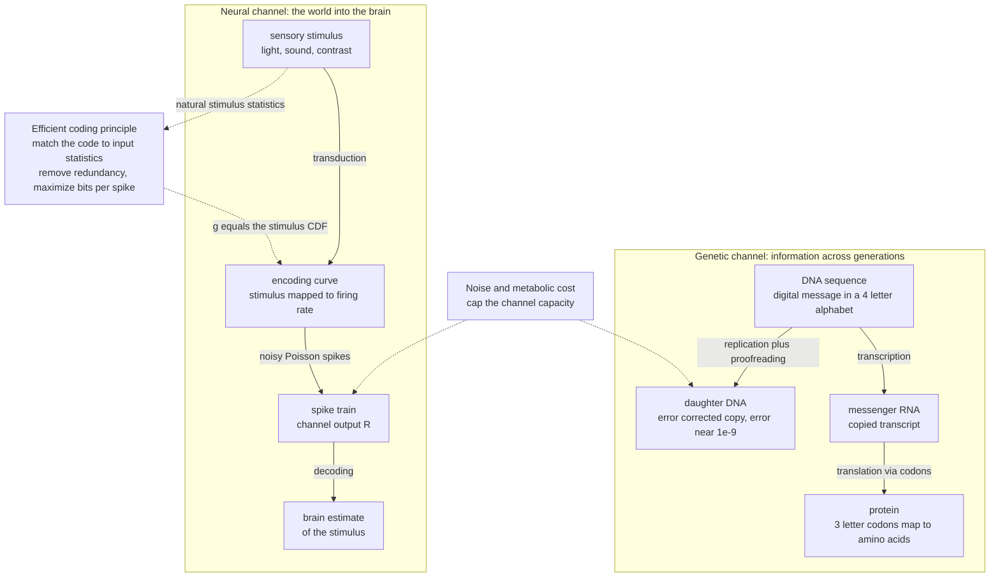

# 🧬 Information Theory in Biology and Neuroscience

> [!abstract] TL;DR
> Living systems are information-processing systems, and Shannon's mathematics measures them precisely. **DNA is a digital message** copied across generations through a noisy channel with error correction; **a neuron is a noisy channel** that encodes the world as spike trains, and we can measure the bits it carries about a stimulus with **mutual information**. The **efficient coding hypothesis** (Attneave, Barlow, Laughlin) says sensory systems are tuned to the statistics of natural inputs — a neuron transmits the most information when its response curve matches the *cumulative distribution* of the stimuli it sees (histogram equalization). The same lens explains signaling networks (~1–2 bits per pathway), evolution (natural selection accumulates information about the environment in the gene pool), and the thermodynamic price of biological computation.

---

## Intuition

**Analogy — life runs on information.** Think of two everyday communication systems and notice they are the *same problem* in disguise.

First, **heredity is a message copied down a very long chain of scribes.** Each generation copies a book (the genome) written in a 4-letter alphabet and hands it to the next. Copies drift because scribes make mistakes (mutations), so evolution invests in proofreading — spell-checkers that catch and fix errors before the book is passed on. The book survives billions of years not because any single copy is perfect, but because the copying channel is reliable enough that its *information* outlasts every physical molecule that ever carried it.

Second, **perception is a noisy phone line carrying the world into the brain.** Your eye cannot ship photons to the cortex; it can only send trains of electrical clicks (spikes) down a jittery, metabolically expensive wire. The retina must *encode* a rich visual scene into these clicks and the brain must *decode* it, all through a line that hisses with random noise. A well-designed sensory system, like a well-designed modem, spends its limited clicks on the parts of the signal that are surprising and skips the parts it could have predicted anyway.

Evolution and the brain are therefore both **information-processing systems operating over noisy channels under tight energy budgets** — exactly the setting Shannon formalized. That is why one set of equations, built for telegraphs and telephones, turns out to measure genes, synapses, and eyes.

---

## How It Works

### Core Mechanics

**1. A neuron as a communication channel.** A stimulus $S$ (light intensity, contrast, a limb angle) drives a neuron whose output is a **spike train** $R$. The neuron is not deterministic: repeat the same stimulus and you get different spike counts each time (trial-to-trial noise, often approximately Poisson). We quantify how much the response tells us about the stimulus with **mutual information**:
$$I(S;R) = H(R) - H(R\mid S)$$
$H(R)$ is the total variety of responses the neuron can produce (its raw capacity to signal); $H(R\mid S)$ is the *noise entropy* — the variability that remains even when the stimulus is fixed. Information is the difference: the response variability that is actually **locked to the stimulus** rather than to noise. This is the direct biological reading of [[Joint_Conditional_Entropy_and_Mutual_Information|mutual information]].

**2. Rate codes vs temporal codes.** If only the *number* of spikes in a window matters, the cell uses a **rate code** and $R$ is a spike count. If the *precise timing* of spikes carries information (millisecond-scale patterns), it uses a **temporal code** and $R$ is a spike-time sequence. Temporal codes can carry far more bits per spike, but reading them requires the downstream neuron and the experimenter to resolve fine timing against the noise floor. Measuring $I(S;R)$ under each assumption is how neuroscientists *test* which code a cell actually uses.

**3. Reliability and the noise floor.** Every biological channel has a capacity ceiling set by noise: ion-channel stochasticity, synaptic-vesicle release probability, and thermal fluctuations. A single spike typically carries on the order of **1–3 bits**, and a whole neuron a few tens of bits per second — small numbers that make efficient use of each spike a survival-relevant problem.

**4. The efficient coding hypothesis.** Attneave (1954) and Barlow (1961) proposed that sensory systems evolved to **encode natural stimuli efficiently**: remove redundancy (neighboring pixels in natural images are highly correlated, so re-sending them wastes spikes) and allocate the limited output range to maximize information *given* metabolic constraints. The prescription is **redundancy reduction** and, at the single-neuron level, **matching the code to the input statistics**.

**5. Laughlin's histogram-equalization result.** A neuron with a bounded, monotone input-output curve $g(s)$ and a fixed number of distinguishable output levels transmits the most information when **every output level is used equally often** — a uniform output distribution has maximum entropy. The response function that flattens the output histogram is exactly the **cumulative distribution function (CDF) of the stimulus**:
$$g^{\*}(s) = P(\text{stimulus} \le s) = \text{CDF}(s)$$
This is the *probability integral transform* (feeding any variable through its own CDF yields a uniform output) and is identical to **histogram equalization** in image processing. Laughlin (1981) measured the contrast-response curve of a fly's large monopolar cell and found it tracked the *cumulative distribution of natural contrasts* in the fly's habitat — a stunning quantitative confirmation. **Predictive / redundancy-reducing coding** generalizes this: circuits subtract off the predictable part of the input (surround inhibition in the retina "whitens" correlated signals), leaving spikes to encode the surprising residual — a theme that connects to the [[Predictive_Processing_and_Free_Energy|free energy principle and predictive processing]].

**6. Efficient representations and the bottleneck view.** Many of these ideas are unified by the goal of building a compressed representation $T$ of the input $X$ that keeps only what is relevant for a target $Y$ — maximize $I(T;Y)$ while minimizing $I(T;X)$. Sensory pathways can be read as trading representational cost against behavioral relevance, the same trade-off that governs compressed, task-relevant codes in the brain.

**7. Genetic and molecular information.** DNA is a **digital code**: 4 symbols, read in 3-letter codons, mapped by the genetic code to amino acids. The **central dogma is a channel** — DNA → mRNA → protein — and each stage has an error rate. Raw DNA replication error is ~$10^{-4}$–$10^{-5}$, but **proofreading and mismatch repair** drive it down to ~$10^{-9}$ per base, a biological error-correcting code. At the cellular level, gene regulatory networks and signaling pathways are **noisy biochemical channels**: a receptor sensing a hormone concentration transmits only a limited number of bits because molecule counts are small and reactions are stochastic. Direct measurements (Cheong et al., 2011) put a single signaling pathway at roughly **1–2 bits** of capacity — enough to distinguish "on/off" or a few concentration levels, not a smooth analog readout.

**8. Information in evolution.** Natural selection is an **information-gaining process**: the population accumulates information about its environment in the gene pool, because environments that favor certain alleles leave a statistical imprint on the surviving genomes. The **fitness value of information** formalizes how much a cue about a fluctuating environment can raise long-run growth rate — bounded by the mutual information between the cue and the environmental state (a biological version of Kelly-optimal betting).

**9. The metabolic cost of information.** Spikes, ion pumping, and molecular copying all cost ATP, and computation has a thermodynamic floor (Landauer's bound: erasing one bit dissipates at least $k_B T \ln 2$ of heat). Real neurons operate far above this floor, but the *principle* — that bits are not free and biology optimizes **bits per joule** — is why efficient coding matters at all. See [[Entropy_in_Thermodynamics_and_Statistical_Mechanics|entropy in thermodynamics and the Landauer limit]].

### Information channels in biology



---

## Key Concepts

**Secondary (intuitive).**
- **DNA is a message.** Genes are written in a 4-letter code and copied to the next generation; copying mistakes are mutations, and cells have spell-checkers to catch them.
- **Neurons are a noisy phone line.** The eye and ear cannot send the world directly — they send electrical clicks (spikes) that are a bit random, so the same scene gives slightly different signals each time.
- **Good senses do not waste effort.** Eyes and ears spend their limited signaling on surprising, informative parts of the world and ignore what is predictable.

**Undergraduate (formal).**
- **Mutual information of a neural code:** $I(S;R)=H(R)-H(R\mid S)$; noise entropy $H(R\mid S)$ vs total response entropy $H(R)$.
- **Rate vs temporal codes;** Poisson spiking model; bits per spike (~1–3) and bits per second per neuron.
- **Efficient coding hypothesis** (Attneave 1954, Barlow 1961): redundancy reduction, metabolic constraints, maximizing information.
- **Laughlin's result:** the information-maximizing response curve equals the stimulus CDF = histogram equalization = probability integral transform → uniform output distribution.
- **Central dogma as a channel;** codon degeneracy; replication error rates and proofreading as error correction.
- **Fitness value of information:** cues about the environment raise growth rate up to the mutual information between cue and environment.

**Graduate (advanced).**
- **Channel capacity of single neurons and synapses;** whitening/decorrelation and predictive coding as capacity-achieving strategies under natural-scene statistics; link to predictive processing and the free-energy principle.
- **Information bottleneck view** of neural representations: minimize $I(T;X)$ while maximizing $I(T;Y)$ to build compressed, task-relevant codes.
- **Information transduction in signaling networks:** $I \approx 1\text{–}2$ bits per pathway (Cheong et al. 2011); small-molecule-number noise; multiplexing and collective sensing raise capacity.
- **Information theory of evolution:** the genome as an accumulator of environmental information (Adami); fitness-value-of-information bounds (Bergstrom & Lachmann; Rivoire & Leibler) as biological Kelly betting.
- **MI estimation from limited data:** systematic upward bias, quadratic-extrapolation and shuffle corrections (Strong et al.; Panzeri–Treves), and why naive plug-in estimators overstate neural information.
- **Thermodynamics of biological computation:** Landauer's $k_B T\ln 2$ floor, energy per bit in spikes, and the bits-per-joule optimization pressure behind efficient coding.

---

## Python Demo

```python
# Information theory of a neuron, in two parts (numpy + matplotlib only):
#   PART 1 - estimate the information a noisy neuron carries about a stimulus:
#            firing rate follows a tuning curve, spike counts are Poisson, and we
#            compute I(S;N) = H(N) - H(N|S) analytically from the Poisson model.
#   PART 2 - the efficient-coding / Laughlin result: a neuron transmits the most
#            information when its response curve equals the stimulus CDF
#            (histogram equalization). We compare a matched vs mismatched curve.
import numpy as np
import matplotlib.pyplot as plt

rng = np.random.default_rng(42)

# ----------------------------------------------------------------------------
# PART 1 : mutual information between a stimulus and a neuron's spike count
# ----------------------------------------------------------------------------
stim_levels = np.linspace(-2.0, 2.0, 9)          # 9 discrete stimulus values
p_stim = np.full(len(stim_levels), 1.0 / len(stim_levels))   # uniform prior

def tuning_curve(s):                              # firing rate (Hz): Gaussian bump
    r_base, r_peak, width = 2.0, 40.0, 1.0
    return r_base + r_peak * np.exp(-(s ** 2) / (2 * width ** 2))

# Poisson pmf via a log-factorial table (numpy only, no scipy)
n_max = 150
n_vals = np.arange(n_max + 1)
log_fact = np.concatenate([[0.0], np.cumsum(np.log(np.arange(1, n_max + 1)))])

def poisson_pmf(lam):
    lam = max(lam, 1e-9)
    return np.exp(-lam + n_vals * np.log(lam) - log_fact)

def mi_spike_count(T):
    # P(n | s) for each stimulus level over an integration window T seconds
    P_ns = np.array([poisson_pmf(tuning_curve(s) * T) for s in stim_levels])
    P_n = p_stim @ P_ns                          # marginal spike-count distribution
    H_N = -np.sum(P_n * np.log2(P_n + 1e-12))    # total response entropy
    H_N_given_S = np.sum(                        # noise entropy, averaged over stimuli
        p_stim * (-np.sum(P_ns * np.log2(P_ns + 1e-12), axis=1)))
    return H_N - H_N_given_S

windows = np.linspace(0.02, 1.0, 40)             # integration window (s)
info_vs_T = np.array([mi_spike_count(T) for T in windows])
print("PART 1  information at T=1.0 s: %.3f bits" % info_vs_T[-1])

# ----------------------------------------------------------------------------
# PART 2 : efficient coding - response curve matched to the stimulus CDF
# ----------------------------------------------------------------------------
def mutual_information(a, b):                     # empirical MI of two integer labelings
    Na, Nb = int(a.max()) + 1, int(b.max()) + 1
    joint = np.zeros((Na, Nb))
    np.add.at(joint, (a, b), 1.0)
    joint /= joint.sum()
    pa = joint.sum(1, keepdims=True)
    pb = joint.sum(0, keepdims=True)
    nz = joint > 0
    return float(np.sum(joint[nz] * np.log2(joint[nz] / (pa * pb)[nz])))

N = 200_000
s_nat = rng.normal(0.0, 1.0, N)                  # natural stimulus ensemble (e.g. contrast)

# three candidate response functions mapping stimulus -> output range [0, 1]
cdf_ref = np.sort(rng.normal(0.0, 1.0, 20_000))  # samples defining the TRUE stimulus CDF
def r_matched(x):                                # g = empirical CDF of the stimulus
    return np.searchsorted(cdf_ref, x) / len(cdf_ref)

wide_ref = np.sort(rng.normal(0.0, 3.0, 20_000)) # CDF tuned to a much wider distribution
def r_mismatched(x):                             # -> too shallow, wastes output range
    return np.searchsorted(wide_ref, x) / len(wide_ref)

lo, hi = -3.0, 3.0
def r_linear(x):                                 # naive linear ramp over a fixed range
    return np.clip((x - lo) / (hi - lo), 0.0, 1.0)

K = 32                                            # distinguishable output levels
sensor_noise = 0.25                               # noise (std) the neuron reads on its input
s_edges = np.quantile(s_nat, np.linspace(0, 1, 65))
s_id = np.clip(np.digitize(s_nat, s_edges) - 1, 0, len(s_edges) - 2)  # stimulus identity

def transmitted_info(resp_fn):
    noisy = s_nat + rng.normal(0.0, sensor_noise, N)     # neuron reads a noisy stimulus
    out = np.clip((resp_fn(noisy) * K).astype(int), 0, K - 1)
    return mutual_information(s_id, out)

labels = ["matched\n(g = stimulus CDF)", "mismatched\n(wide CDF)", "linear ramp"]
infos = [transmitted_info(r_matched), transmitted_info(r_mismatched),
         transmitted_info(r_linear)]
for lab, val in zip([l.replace("\n", " ") for l in labels], infos):
    print("PART 2  %-28s %.3f bits" % (lab, val))

# ----------------------------------------------------------------------------
# Plots
# ----------------------------------------------------------------------------
fig, ax = plt.subplots(2, 2, figsize=(11, 8))

s_fine = np.linspace(-2, 2, 200)
ax[0, 0].plot(s_fine, tuning_curve(s_fine), color="crimson")
ax[0, 0].set(title="Neuron tuning curve", xlabel="stimulus s", ylabel="firing rate (Hz)")

ax[0, 1].plot(windows, info_vs_T, color="navy")
ax[0, 1].set(title="Information vs integration window",
             xlabel="window T (s)", ylabel="I(S ; spike count)  bits")

xg = np.linspace(-3.5, 3.5, 400)
ax[1, 0].plot(xg, r_matched(xg),    label="matched = stimulus CDF", lw=2)
ax[1, 0].plot(xg, r_mismatched(xg), label="mismatched (wide CDF)", ls="--")
ax[1, 0].plot(xg, r_linear(xg),     label="linear ramp",          ls=":")
ax[1, 0].set(title="Response functions vs stimulus CDF",
             xlabel="stimulus s", ylabel="normalized response g(s)")
ax[1, 0].legend(fontsize=8)

bars = ax[1, 1].bar(range(3), infos, color=["seagreen", "orange", "gray"])
ax[1, 1].set_xticks(range(3))
ax[1, 1].set_xticklabels(labels, fontsize=8)
ax[1, 1].set(title="Transmitted information (Laughlin)", ylabel="I(stimulus ; output)  bits")
ax[1, 1].axhline(np.log2(K), color="k", ls="--", lw=0.8, label="ceiling = log2(K)")
ax[1, 1].legend(fontsize=8)

plt.tight_layout()
plt.show()

# Expected: the CDF-matched response transmits the most bits, because it makes the
# output distribution uniform -> maximum output entropy -> histogram equalization.
```

Running this shows two results. Part 1: the mutual information rises and saturates as the integration window grows (more spikes → more evidence about the stimulus). Part 2: the **CDF-matched** response function transmits noticeably more bits than the mismatched or linear curves — the numerical demonstration of Laughlin's histogram-equalization principle.

---

## Real-World Applications

- **Neural decoding and brain–machine interfaces.** Mutual information quantifies how much a recorded population tells us about intended movement or a sensory stimulus, guiding electrode placement and decoder design in [[Population_Coding_and_Decoding|population decoding]] and neural prosthetics.
- **Bioinformatics — sequence entropy and motifs.** The information content (in bits) of each position in a set of aligned sequences produces **sequence logos**; conserved positions are low-entropy/high-information. Motif finding and transcription-factor binding-site discovery are information-content problems, as covered in [[Bioinformatics_Algorithms_and_Sequence_Analysis|sequence analysis algorithms]].
- **Phylogenetics.** Mutual information between sites and model-selection by information criteria underpin how [[Molecular_Evolution_and_Phylogenetics|molecular phylogenies]] are inferred and how coevolving residues are detected.
- **Systems biology / signaling.** Measuring the ~1–2 bits transmitted through pathways such as NF-κB or ERK explains why cells often make coarse, near-binary decisions and how multiplexing or population averaging buys precision — see [[Systems_Genetics_and_Gene_Networks|gene regulatory networks]].
- **Sensory engineering.** Histogram equalization in cameras and displays, adaptive gain control, and predictive/whitening filters in signal processing are direct engineering copies of retinal efficient coding.

---

## Common Pitfalls

- **Overestimating information from limited data.** Naive plug-in MI estimators are systematically biased *upward* when trials are few relative to the number of response states. Always apply bias correction (quadratic extrapolation, shuffle controls) before claiming a neuron carries N bits.
- **Assuming a rate code by default.** Binning spikes into counts throws away timing. A cell may carry far more information in precise spike timing; test temporal codes explicitly rather than assuming the rate code is the whole story.
- **Confusing correlation with information.** MI captures *any* dependence, but a large $I(S;R)$ does not prove the downstream brain *reads out* that information, nor does it establish causation.
- **Treating genetic "information" as literal Shannon bits of meaning.** DNA has a well-defined Shannon capacity, but biological *function* (semantics) is not captured by symbol entropy alone; a high-entropy sequence is not automatically more meaningful.
- **Reading teleology into evolution.** "Selection accumulates information about the environment" is a statistical statement about allele frequencies, not evidence of foresight or purpose in the process.
- **Forgetting units and the noise floor.** Bits vs nats, and ignoring that every biological channel has a hard capacity ceiling set by molecular noise and metabolic cost — efficient coding is optimization *under* that ceiling, not magic bandwidth.

---

## Related Concepts

- [[Joint_Conditional_Entropy_and_Mutual_Information]] — the core tool: $I(S;R)=H(R)-H(R\mid S)$ is exactly how we score a neural or molecular code.
- [[Neural_Coding_and_Spike_Trains]] — the biophysics of how stimuli become spikes, the substrate this note measures in bits.
- [[Population_Coding_and_Decoding]] — extends single-neuron information to populations and to decoding for brain–machine interfaces.
- [[Hodgkin_Huxley_Model_and_Computational_Neurons]] — the mechanistic spike-generation model behind the noisy channel.
- [[Sensory_Systems_and_Transduction]] — where natural-stimulus statistics enter and efficient coding is tested (retina, fly LMC).
- [[Predictive_Processing_and_Free_Energy]] — predictive/redundancy-reducing coding generalized into a whole-brain principle of surprise minimization.
- [[Entropy_in_Thermodynamics_and_Statistical_Mechanics]] — Landauer's bound and the thermodynamic price of biological computation (bits per joule).
- [[Biology/04_Molecular_Biology_of_the_Gene/DNA_Structure_and_Replication|DNA structure and replication]] — the digital medium and the copying channel with proofreading.
- [[Biology/04_Molecular_Biology_of_the_Gene/Translation_and_the_Genetic_Code|Translation and the genetic code]] — the central dogma as a DNA → mRNA → protein channel with codon degeneracy.
- [[Mutations_and_DNA_Repair]] — biological error correction that pushes replication error toward $10^{-9}$.
- [[Natural_Selection_and_Adaptation]] — evolution as an information-gaining process; the fitness value of information.
- [[Bioinformatics_Algorithms_and_Sequence_Analysis]] — sequence entropy, information content, and motif finding in practice.
- [[Molecular_Evolution_and_Phylogenetics]] — information criteria and coevolution signals in phylogenetic inference.
- [[Systems_Genetics_and_Gene_Networks]] — mutual information in gene regulatory and signaling networks (~1–2 bits per pathway).
- [[Information_and_Entropy_in_Systems]] — the systems-thinking view of information and entropy across living and non-living systems.
- [[Evolutionary_Dynamics_and_Fitness_Landscapes]] — how selection navigates fitness landscapes, the dynamical side of information accumulation.

---

## Review Questions

**Tier 1 — Conceptual.**
1. Explain in plain terms why $I(S;R)=H(R)-H(R\mid S)$ is the right measure of "how much a neuron tells you about a stimulus." What do the two entropy terms represent biologically?
2. Why does feeding a stimulus through its own cumulative distribution function produce a uniform output, and why is a uniform output the information-maximizing choice for a neuron with a limited number of distinguishable response levels?

**Tier 2 — Applied / scenario.**
3. You record a neuron and find $I(S;\text{spike count}) = 0.5$ bits but $I(S;\text{spike times}) = 2.0$ bits from the same data. What does this tell you about the code, and what confound must you rule out before trusting the larger number?
4. A signaling pathway is measured to have a capacity of ~1.3 bits. A colleague argues the cell must therefore only be able to sense "hormone present vs absent." Is that inference sound? How could a population of cells or temporal multiplexing change the picture?

**Tier 3 — Synthesis / open-ended.**
5. Laughlin's fly neuron matches the *current* natural-contrast distribution, but natural statistics vary across habitats and times of day. Discuss how adaptation, evolution, and predictive coding could each keep a sensory code near-optimal, and connect this to the free-energy principle and to the fitness value of information in a fluctuating environment.

---

## Sources

- Attneave, F. (1954). *Some informational aspects of visual perception.* Psychological Review 61(3): 183–193. [DOI](https://doi.org/10.1037/h0054663)
- Barlow, H. B. (1961). *Possible principles underlying the transformation of sensory messages.* In Rosenblith (ed.), *Sensory Communication*, MIT Press. [PDF](https://direct.mit.edu/books/book/4132/Sensory-Communication)
- Laughlin, S. B. (1981). *A simple coding procedure enhances a neuron's information capacity.* Zeitschrift für Naturforschung C 36(9–10): 910–912. [DOI](https://doi.org/10.1515/znc-1981-9-1040)
- Rieke, Warland, de Ruyter van Steveninck & Bialek (1997). *Spikes: Exploring the Neural Code.* MIT Press. [Publisher](https://mitpress.mit.edu/9780262681087/spikes/)
- Cheong, Rhee, Wang, Nemenman & Levchenko (2011). *Information transduction capacity of noisy biochemical signaling networks.* Science 334(6054): 354–358. [DOI](https://doi.org/10.1126/science.1204553)
- Tkačik, G. & Bialek, W. (2016). *Information processing in living systems.* Annual Review of Condensed Matter Physics 7: 89–117. [DOI](https://doi.org/10.1146/annurev-conmatphys-031214-014803)

---

#information-theory #neural-coding #efficient-coding #bioinformatics #biology
