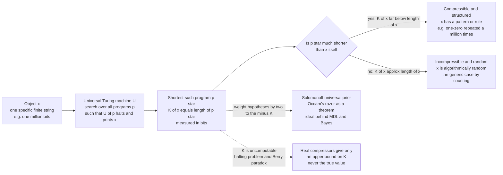

# 🧬 Kolmogorov Complexity and Algorithmic Information Theory

> [!abstract] TL;DR
> Where Shannon entropy measures the information in a **random variable** (a probability distribution), **Kolmogorov complexity** `K(x)` measures the information in a **single, individual object** `x`: it is the length in bits of the *shortest program* that outputs `x` and halts on a fixed universal Turing machine. A string is **algorithmically random** exactly when it is **incompressible** — when no program is meaningfully shorter than the string itself. This gives an objective, distribution-free definition of information, randomness, and simplicity. The price is steep: `K` is **uncomputable** (a corollary of the halting problem), so we can only ever *upper-bound* it with real compressors. Its two great payoffs are **Solomonoff induction** — a formalization of Occam's razor that weights every hypothesis by `2^(-K)` and is the theoretical ideal behind [[Minimum_Description_Length_and_Model_Selection|MDL]] — and **Chaitin's incompleteness**, an information-theoretic reason no finite theory can capture all mathematical truth.

---

## Intuition

**Analogy — the length of the shortest recipe.** Imagine you must dictate a string of a million bits to a friend over the phone, and you want to use as few words as possible. If the string is `1010101010...` a million times, you say five words: *"one-zero repeated five hundred thousand times."* Your friend can reconstruct all million bits exactly. The string is long, but its **shortest recipe is tiny** — that shortness is the sign of *structure*. Now suppose the string came from a million genuine coin flips. There is no clever recipe: no pattern to exploit, no rule that predicts the next bit from the previous ones. The only way to dictate it is to read out all million bits one by one. The **shortest recipe is as long as the string itself** — and that incompressibility is precisely what we mean by *random*.

Kolmogorov complexity turns this recipe length into a definition. `K(x)` is the length of the shortest program (the shortest recipe, written for a fixed universal computer) that prints `x`. A structured object has a short program and low complexity; a patternless object has no short program and maximal complexity. Crucially, this is a property of the **individual object**, not of any distribution it was drawn from — it makes sense to ask "how much information is in *this specific* string" even when there is no probability model at all. That is the entire shift from Shannon's world to Kolmogorov's: from *the average surprise of a source* to *the intrinsic describability of a thing*.

---

## How It Works

### From distributions to individual objects

[[Entropy_and_Information_Content|Shannon entropy]] `H(X)` answers: *given a source that emits symbols with known probabilities, how many bits per symbol are needed on average?* It is fundamentally about a **random variable** and its distribution. But many questions are not about a distribution at all. How much information is in the string of the first million digits of pi? In the human genome? In this specific 1024-bit key? There is only *one* such object and no repeatable random experiment. Algorithmic information theory (AIT), founded independently by Solomonoff (1964), Kolmogorov (1965), and Chaitin (1966), answers these with a single, distribution-free quantity.

### The definition of `K(x)`

Fix a **universal Turing machine** `U` — a computer that, given a program `p`, runs it and may print an output `U(p)`. The **Kolmogorov complexity** of a finite string `x` is:

$$K(x) = \min_{p \,:\, U(p) = x} |p|$$

the length in bits of the *shortest* program `p` that makes `U` output exactly `x` and halt. Intuitively, `K(x)` is "the amount of information in `x`" because it is the size of the most compressed description from which `x` can be perfectly regenerated. A billion zeros have `K` around `O(\log n)` bits (a program says "print 0, n times"); a billion truly random bits have `K` around `n` bits (the program must essentially *contain* the data).

### The invariance theorem — why the machine barely matters

An obvious worry: `K(x)` seems to depend on which universal machine `U` you picked. The **invariance theorem** dissolves it. For any two universal machines `U` and `V`, there is a constant `c` (independent of `x`) such that:

$$|K_U(x) - K_V(x)| \le c \quad \text{for all } x$$

The reason is simple: because `U` is universal, it can **simulate** `V`. Prepend to any `V`-program a fixed-length "interpreter for `V`" and `U` reproduces `V`'s output. That interpreter has a constant length, so the two complexities differ by at most that constant. For long, complex objects the constant is negligible, so `K(x)` is essentially machine-independent — an **objective** measure. (The catch: for short strings the constant dominates, so `K` is only meaningful asymptotically. See the halting-problem link in [[Universal_Compression_and_Lempel_Ziv|the theory of computation]] behind universality.)

### Randomness as incompressibility

A string is **algorithmically random** if it cannot be compressed: `K(x) \ge |x| - c` for a small constant `c`. Two facts make this the *right* definition of randomness:

1. **Most strings are incompressible (a counting argument).** There are `2^n` strings of length `n`, but only `2^n - 1` programs *shorter* than `n` bits. So fewer than half the strings can have `K(x) \le n - 1`; fewer than `1/2^k` can be compressed by even `k` bits. **The overwhelming majority of strings are essentially incompressible** — randomness is the generic case, structure the rare exception.
2. **It matches statistical randomness (Martin-Löf).** Per Levin and Schnorr, an infinite sequence is **Martin-Löf random** (passes every computable statistical test for randomness) if and only if its prefixes are incompressible: `K(x_{1:n}) \ge n - c`. Algorithmic randomness and statistical randomness are *the same concept*.

### The bridge back to Shannon

AIT does not replace Shannon; it refines and contains him. For a string `x^n` of `n` symbols drawn i.i.d. from a **computable** source with entropy `H`, the *expected* complexity converges to the entropy:

$$\frac{1}{n}\,\mathbb{E}\!\left[K(x^n)\right] \;\longrightarrow\; H$$

So on average, the shortest program is as long as the [[Source_Coding_Theorem_and_Data_Compression|Shannon source-coding limit]] demands. Entropy is the *average* over a distribution; `K` is the *worst-case, individual-object* refinement that also captures single strings for which no distribution exists.

### Uncomputability — you can never be sure

Here is the sting. **`K` is not computable.** No algorithm, given `x`, can output `K(x)`. The proof is a cousin of the halting problem and shows up as a formal **Berry paradox**: consider "the smallest string not describable in fewer than a billion bits." That very phrase is a short description — far shorter than a billion bits — of the string it names, a contradiction. Formally, if `K` were computable you could write a short program that searches for the first string `x` with `K(x) > k` and prints it, describing in `O(\log k)` bits a string of complexity above `k` — impossible for large `k`. A related consequence: `K` is upper semi-computable (you can find *ever shorter* programs by dovetailing) but you can **never prove you have found the shortest one**, because that would require solving the halting problem for all shorter candidates.

### Solomonoff induction and the universal prior

If `K` measures simplicity, it also solves *prediction*. **Solomonoff's theory of inductive inference** assigns every hypothesis (every program) a prior probability that decays exponentially with its length: the **universal prior** weights an explanation by `2^(-K)`. Simpler explanations — shorter programs — get exponentially more prior mass. This is **Occam's razor made into a theorem**: "prefer the shortest explanation" stops being an aesthetic preference and becomes the *provably* near-optimal prediction rule. Solomonoff's predictor, `M(x)`, dominates every computable predictor up to a constant and makes only a finite total number of prediction errors on any computable sequence. It is uncomputable — but it is the **ideal that [[Minimum_Description_Length_and_Model_Selection|MDL]] and [[Bayesian_Reasoning|Bayesian model selection]] approximate** in practice. Levin's **coding theorem** ties the two threads together: `-\log_2 M(x) = K(x) + O(1)`, so the universal prior probability of `x` *is* essentially `2^(-K(x))`.

### Chaitin's Omega and incompleteness

Chaitin pushed AIT into the foundations of mathematics. Define **Omega**, the **halting probability**: the probability that a random program halts, `\Omega = \sum_{p \text{ halts}} 2^{-|p|}`. Omega is a real number between 0 and 1 that is **maximally incompressible** — its first `n` bits have `K` around `n` — and **uncomputable**. Knowing Omega's bits would let you solve the halting problem. This yields **Chaitin's information-theoretic incompleteness**: any formal system with `K`-complexity around `c` bits can prove statements of the form "`K(x) > m`" only for `m` up to about `c`. A finite axiom system contains only a finite amount of information, so it cannot certify the randomness of numbers whose complexity exceeds its own. Gödel's incompleteness reappears as a statement about *information*: **you cannot squeeze more complexity out of a theory than you put into it.**

### Flow / Architecture



---

## Key Concepts

### Secondary (intuitive)
- **Complexity is the length of the shortest recipe.** The information in an object is the size of the smallest description from which it can be perfectly rebuilt.
- **Random means no shorter recipe exists.** If the only way to describe a string is to write it out in full, it is random; if a short rule generates it, it has structure.
- **A compressed file's size is an estimate of complexity.** Zipping a file gives an *upper bound* on how compressible it truly is — a practical, everyday shadow of `K`.
- **Simplicity equals shortness.** "The simplest explanation" can be made precise: the one with the shortest program. This is Occam's razor with a ruler.

### Undergraduate
- **Definition:** `K(x) = min { |p| : U(p) = x }`, the shortest program on a fixed universal machine `U` that outputs `x`.
- **Invariance theorem:** `K` is machine-independent up to an additive constant, because any universal machine can simulate any other with a fixed-length interpreter. This is what makes `K` *objective*.
- **Incompressibility by counting:** fewer than `2^{n-k}` of the `2^n` strings of length `n` can be compressed by `k` or more bits, so almost every string is (nearly) random.
- **Conditional complexity:** `K(x | y)` is the shortest program that outputs `x` *given* `y` for free. It measures the information in `x` *not already present* in `y`.
- **`E[K] approx H`:** for a computable i.i.d. source, expected per-symbol complexity converges to Shannon entropy — AIT recovers the [[Source_Coding_Theorem_and_Data_Compression|source coding limit]] as an average.
- **Uncomputability:** no program computes `K(x)`; you can find shorter descriptions forever but can never certify the shortest (halting problem / Berry paradox).

### Graduate
- **Plain vs prefix complexity:** plain complexity `C(x)` is not subadditive and its programs are not self-delimiting; **prefix complexity** `K(x)` restricts programs to a prefix-free set, satisfies the Kraft inequality `\sum 2^{-K(x)} \le 1`, and is the version used for probability. The two differ by `O(\log |x|)`.
- **Algorithmic mutual information:** `I(x : y) = K(x) + K(y) - K(x, y) = K(x) - K(x | y^*)` up to a log term (Gács–Körner–Levin symmetry of information) — the individual-object analogue of Shannon mutual information.
- **Universal prior and Levin's coding theorem:** the universal semi-measure `M(x) = \sum_{p : U(p) = x*} 2^{-|p|}` satisfies `-\log_2 M(x) = K(x) + O(1)`, so `2^{-K(x)}` *is* the universal a-priori probability. This is the engine of Solomonoff prediction.
- **Solomonoff induction:** Bayesian mixture prediction with prior `M` dominates every computable predictor and has bounded total prediction error on any computable environment; it is the theoretical optimum of induction — and the foundation of AIXI-style universal agents.
- **Martin-Löf randomness:** an infinite sequence is ML-random iff `K(x_{1:n}) \ge n - c` for all `n` (Levin–Schnorr) — algorithmic and statistical randomness coincide.
- **Chaitin's Omega and incompleteness:** `\Omega = \sum_{U(p)\downarrow} 2^{-|p|}` is uncomputable, ML-random, and normal; a theory of complexity `c` cannot prove `K(x) > c + O(1)` for any specific `x` — the information-theoretic form of Gödel.
- **Normalized Compression Distance:** `NCD(x,y) = \dfrac{C(xy) - \min(C(x), C(y))}{\max(C(x), C(y))}` approximates the (uncomputable) *normalized information distance* `\max(K(x|y), K(y|x)) / \max(K(x), K(y))` using a real compressor `C`, yielding a universal, parameter-free similarity metric.

---

## Python Demo

```python
# Approximating Kolmogorov complexity with a real compressor.
#
# K(x) -- the length of the SHORTEST program that outputs x -- is UNCOMPUTABLE.
# But any real lossless compressor gives a COMPUTABLE UPPER BOUND: if a program
# "decompress this blob" reproduces x, then K(x) <= |compressed blob| + const.
# So compressed size is an honest (if loose) proxy for algorithmic complexity.
#
# We build several byte-strings of IDENTICAL length, ordered from highly
# structured to fully random, compress each with zlib, and read off the
# compressed size as our K-proxy. Structured strings crush down to a handful
# of bytes (small K); true random bytes barely move (K ~ length).
#
# The punchline hides in the PI DIGITS: to zlib they look as random as a
# uniform random digit stream, yet the TRUE K of pi's first n digits is tiny
# (a short program prints them). zlib simply cannot SEE that deep structure --
# a vivid reminder that a compressor bounds K from ABOVE and never reaches it.
#
# numpy + matplotlib, plus zlib from the standard library for the compression.

import zlib
import numpy as np
import matplotlib.pyplot as plt

N = 6000  # every source is exactly N bytes -> compressed sizes are directly comparable


def pi_digit_stream(count):
    """Gibbons' unbounded spigot algorithm: yields decimal digits of pi, 3,1,4,1,5,..."""
    q, r, t, k, n, l = 1, 0, 1, 1, 3, 3
    produced = 0
    while produced < count:
        if 4 * q + r - t < n * t:
            yield n
            produced += 1
            q, r, t, k, n, l = (10 * q, 10 * (r - n * t), t, k,
                                (10 * (3 * q + r)) // t - 10 * n, l)
        else:
            q, r, t, k, n, l = (q * k, (2 * q + r) * l, t * l, k + 1,
                                (q * (7 * k + 2) + r * l) // (t * l), l + 2)


rng = np.random.default_rng(0)

# --- six byte-strings of identical length N, ordered MOST -> LEAST structured ---
constant   = bytes([65]) * N                                      # "AAAA..."  trivial K
periodic   = (b"ABCD" * (N // 4 + 1))[:N]                         # short pattern repeated
block      = rng.integers(0, 256, N // 8, dtype=np.uint8).tobytes()
repeated   = (block * 8)[:N]                                      # random 750B block tiled 8x
pi_bytes   = bytes(48 + d for d in pi_digit_stream(N))           # ASCII digits of pi
rand_digit = bytes(48 + int(d) for d in rng.integers(0, 10, N))  # uniform random digits 0-9
rand_bytes = rng.integers(0, 256, N, dtype=np.uint8).tobytes()   # true random bytes

sources = [
    ("constant\nAAAA...",         constant),
    ("periodic\nABCDABCD...",     periodic),
    ("random block\ntiled 8x",    repeated),
    ("pi digits\n(ASCII)",        pi_bytes),
    ("random digits\n0-9 ASCII",  rand_digit),
    ("true random\nbytes 0-255",  rand_bytes),
]

names, comp_sizes, ratios = [], [], []
for name, data in sources:
    c = len(zlib.compress(data, 9))   # compressed length in bytes = upper bound on K(x)
    names.append(name)
    comp_sizes.append(c)
    ratios.append(N / c)

# --------------------------------------------------------------------------
# Plot: K-proxy (compressed size) and compression ratio across the spectrum
# --------------------------------------------------------------------------
colors = plt.cm.viridis(np.linspace(0.15, 0.9, len(names)))
x = np.arange(len(names))

fig, ax = plt.subplots(1, 2, figsize=(15, 5.2))

ax[0].bar(x, comp_sizes, color=colors)
ax[0].axhline(N, ls="--", color="crimson", label=f"original size = {N} bytes  (K <= this)")
ax[0].set_xticks(x); ax[0].set_xticklabels(names, fontsize=8)
ax[0].set_ylabel("compressed size in bytes  (K-proxy)")
ax[0].set_title("Complexity proxy: structure is cheap, randomness is not")
ax[0].legend()
for xi, c in zip(x, comp_sizes):
    ax[0].text(xi, c + 60, str(c), ha="center", fontsize=8)

ax[1].bar(x, ratios, color=colors)
ax[1].axhline(1.0, ls=":", color="gray", label="ratio = 1  (incompressible)")
ax[1].set_xticks(x); ax[1].set_xticklabels(names, fontsize=8)
ax[1].set_ylabel("compression ratio  (original / compressed)")
ax[1].set_title("Structured objects compress; random objects do not")
ax[1].legend()

plt.tight_layout()
plt.show()

# --------------------------------------------------------------------------
# Console summary
# --------------------------------------------------------------------------
print(f"All sources are exactly {N} bytes.\n")
print(f"{'source':>22} | {'K-proxy (B)':>12} | {'ratio':>7}")
print("-" * 48)
for name, c, r in zip(names, comp_sizes, ratios):
    print(f"{name.replace(chr(10), ' '):>22} | {c:>12} | {r:>7.2f}")
print("\nNote 1: K is UNCOMPUTABLE; these are only UPPER BOUNDS on it.")
print("Note 2: zlib cannot tell pi's digits from random digits -- yet")
print("        the TRUE K(pi digits) is tiny. Weak compressors miss deep structure.")
```

**What the demo shows.** All six inputs are exactly 6000 bytes, so the compressed size is a clean, comparable proxy for `K`. The constant and periodic strings collapse to a few dozen bytes — their shortest recipe is trivially small. The tiled random block compresses to roughly the size of one block, because after the first copy the rest is "repeat that." The pi digits and the uniform random digits compress to *the same* size (only the alphabet redundancy of 10 symbols out of 256 is removed) — to zlib, pi is indistinguishable from noise. The true random bytes barely move: their compression ratio sits at about `1.0`, so `K` is essentially their length. Two lessons: **randomness is incompressibility**, and — from the pi case — **a real compressor is only an upper bound on `K`**; it can never see the short program that a cleverer machine (or a mathematician) knows generates pi.

---

## Real-World Applications

> **Example (Normalized Compression Distance for clustering):** The **NCD**, `NCD(x,y) = (C(xy) - min(C(x),C(y))) / max(C(x),C(y))`, plugs a real compressor into the uncomputable normalized information distance to give a **universal, parameter-free similarity metric**. If concatenating two objects compresses much better than compressing them separately, they share a lot of algorithmic information — they are "close." Cilibrasi and Vitányi used exactly this to build language phylogenies from raw text, cluster mitochondrial genomes into a correct evolutionary tree, and group music by composer, all *without any domain-specific features*.

- **Bioinformatics and phylogenetics:** compression-based distances measure sequence similarity between genomes without alignment, robust to insertions and rearrangements that break edit-distance methods.
- **Malware and plagiarism detection:** near-duplicate and variant detection via NCD — malware from the same family shares structure that shows up as anomalously high joint compressibility; the same trick flags copied source code and documents.
- **Model selection via [[Minimum_Description_Length_and_Model_Selection|MDL]]:** the practical, computable descendant of Solomonoff induction. "Pick the model that compresses the data most" is a rigorous, validation-free way to trade fit against complexity and avoid overfitting.
- **Randomness and PRNG testing:** incompressibility is a necessary condition for randomness. A pseudo-random generator whose output compresses is provably flawed; compression is a cheap first-line statistical test.
- **Anomaly detection:** an event stream that suddenly stops compressing (rising complexity) signals a regime change or intrusion; falling complexity can indicate a stuck sensor or a spoofed feed.
- **The "compression equals intelligence" thesis and the Hutter Prize:** the ongoing prize for compressing a Wikipedia snapshot rests on the claim that **better compression of human knowledge requires — and demonstrates — better understanding**. Prediction, compression, and intelligence are, on this view, the same problem seen from three angles.

---

## Common Pitfalls

- **Thinking a compressor gives you `K`.** Zip size is an *upper bound* only. `K` is uncomputable; no tool returns it, and no experiment can prove a string is "maximally compressed." The pi-digits demo is the canonical trap: zlib says "random," the truth says "tiny `K`."
- **Confusing `K(x)` with Shannon entropy `H`.** `H` is a property of a **distribution** (average over a random variable); `K` is a property of an **individual object** and needs no distribution at all. They meet only asymptotically, via `E[K]/n -> H` for computable sources — see [[Entropy_and_Information_Content]].
- **Reading low compressibility as proof of randomness.** It only proves *your compressor* found no structure. A weak compressor and a truly random source produce the same output; you can never conclude "random," only "no structure detected by this method."
- **Forgetting the additive constant.** `K` is defined only up to a machine-dependent constant, so complexities of *short* strings are not meaningful — a "10-bit" difference can be entirely the choice of universal machine. AIT statements are asymptotic.
- **Believing you can find the shortest program.** You can search for ever-shorter descriptions forever (upper semi-computability), but certifying that none is shorter requires solving the halting problem for every smaller candidate. There is no "compression complete" signal.
- **Mixing up plain and prefix complexity.** Only the **prefix** version `K` satisfies the Kraft inequality and underwrites `2^(-K)` as a probability. Using plain complexity `C` where you need self-delimiting programs breaks subadditivity and the coding theorem.
- **Treating Solomonoff induction as an algorithm.** It is the *ideal* predictor and is uncomputable. Real systems ([[Minimum_Description_Length_and_Model_Selection|MDL]], [[Bayesian_Reasoning|Bayesian priors]], neural compressors) are computable *approximations* to it, not the thing itself.

---

## Related Concepts

- [[Entropy_and_Information_Content]] — the Shannon counterpart: information of a **distribution/random variable** versus `K`'s information of an **individual object**; the two converge as `E[K]/n -> H`.
- [[Source_Coding_Theorem_and_Data_Compression]] — Shannon's `H`-floor on compression; `K` is the ultimate distribution-free floor for a single sequence, and every real compressor is a computable upper bound on `K`.
- [[Minimum_Description_Length_and_Model_Selection]] — the practical, computable shadow of Solomonoff's universal prior: "pick the model that compresses the data most" as Occam's razor in bits.
- [[Universal_Compression_and_Lempel_Ziv]] — LZ compressors are concrete, universal, computable proxies that approach the entropy rate and bound `K` from above without knowing the source.
- [[Bayesian_Reasoning]] — Solomonoff induction *is* Bayesian mixture prediction with the universal prior `2^(-K)`; the theoretical justification for favoring simpler hypotheses.
- [[Inductive_Logic]] — algorithmic information theory gives a formal, machine-independent solution to the age-old problem of induction and to Occam's razor.

---

## Review Questions

1. **(Secondary)** You are told a one-million-bit string compresses down to about 20 bytes with a standard zip tool, while a second one-million-bit string will not compress at all. What can you say about the *structure* of each string, and which one deserves the label "random"? Why does the shortness of a description capture the idea of simplicity?
2. **(Undergraduate)** Explain the invariance theorem and why it lets us speak of "the" Kolmogorov complexity of an object despite the choice of universal machine. Then contrast `K(x)` with Shannon entropy `H(X)`: which one is defined for a single fixed object with no probability model, and what precise relationship connects them for a computable i.i.d. source?
3. **(Graduate)** The first `n` digits of pi have Kolmogorov complexity `O(\log n)`, yet a strong compressor cannot shrink them below roughly `n \log_2 10 / 8` bytes. Reconcile these two facts. Then use the Berry-paradox / halting-problem argument to explain *why* `K` is uncomputable, and describe how Chaitin's `\Omega` turns that uncomputability into an information-theoretic incompleteness theorem — a bound on what any finite formal system can prove about complexity.

---

## Sources

- Li, M., & Vitányi, P. (2019). *An Introduction to Kolmogorov Complexity and Its Applications* (4th ed.). Springer. (The definitive reference; invariance, prefix complexity, randomness, Solomonoff induction.)
- Cover, T. M., & Thomas, J. A. (2006). *Elements of Information Theory* (2nd ed.), Chapter 14, "Kolmogorov Complexity." Wiley-Interscience.
- Chaitin, G. J. (1975). "A Theory of Program Size Formally Identical to Information Theory." *Journal of the ACM*, 22(3), 329–340. (Prefix complexity and Omega.)
- Solomonoff, R. J. (1964). "A Formal Theory of Inductive Inference, Parts I and II." *Information and Control*, 7(1), 1–22 and 7(2), 224–254. (The universal prior and induction.)
- Cilibrasi, R., & Vitányi, P. (2005). "Clustering by Compression." *IEEE Transactions on Information Theory*, 51(4), 1523–1545. (Normalized Compression Distance in practice.)

---

#information-theory #kolmogorov-complexity #algorithmic-information #solomonoff #randomness
