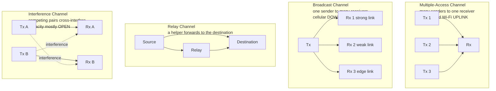

# 🕸️ Network and Multiuser Information Theory

> [!abstract] TL;DR
> **Network information theory** extends Shannon's point-to-point theory (see [[Channel_Capacity_and_the_Noisy_Channel_Theorem]]) to networks with **many senders and receivers sharing one medium**. The central shift: capacity is no longer a **single number** but a **region** — the set of all simultaneously achievable rate tuples $(R_1, R_2, \dots)$. A handful of canonical channels organize the field — the **multiple-access channel (MAC)** (many transmitters, one receiver; a pentagon-shaped region; the cellular/Wi-Fi uplink), the **broadcast channel** (one transmitter, many receivers; superposition coding; the cellular/TV downlink), the **interference channel** (competing pairs; still largely **open** after 50 years), and the **relay channel**. Two results shock newcomers: **Slepian–Wolf** says correlated sources can be compressed **separately** at the same total rate as if compressed jointly, without the encoders ever talking; and **network coding** says intermediate routers should **mix** packets (XOR them together) rather than merely forward them, provably beating store-and-forward on the multicast throughput. The theory underpins modern wireless — MIMO, massive MIMO, and 5G's NOMA — yet many multi-user capacity regions remain **unsolved**, making this one of the live frontiers of the field.

---

## Intuition

**Analogy — the cocktail party.** Shannon's original theory (1948) is a **phone call**: one person talks, one person listens, and the only enemy is line noise. The real world is a **crowded party**: dozens of people talk and listen *at the same time*, all sharing the same air. Now the enemy is not just background hiss — it is **each other**. When three guests speak toward you at once (a *multiple-access* situation), you cannot decode all three at full volume; there is a joint budget on how much total conversation your ears can pull out of the din. When one loud announcer addresses the whole room (a *broadcast* situation), the person by the door and the person across the hall hear the message at wildly different clarity, so a clever announcer layers the message — a coarse gist everyone catches, plus fine detail only the nearby guest resolves. When two separate pairs of friends try to hold private conversations at neighboring tables (an *interference* situation), each pair is the other pair's noise, and how to best share the room is a question nobody has fully answered.

The single deepest consequence of moving from one talker to many is this: **there is no single "speed of the room."** Instead there is a **trade-off surface** — a region of rate combinations. Give more airtime to guest 1 and guest 2 must accept less; the achievable pairs form a shape, and the whole science is about pinning down that shape and building schemes that reach its edges.

---

## How It Works

### 1. From a number to a region

Point-to-point Shannon theory answers "how fast?" with one number, $C = \max_{p(x)} I(X;Y)$. With $m$ users the question becomes "which **combinations** of $(R_1, \dots, R_m)$ are simultaneously achievable with vanishing error?" The answer is a **capacity region** $\mathcal{C} \subseteq \mathbb{R}^m_{\ge 0}$ — a convex body whose boundary encodes every fundamental trade-off among the users. The single-user capacity is just the special case $m = 1$, where the "region" collapses to the interval $[0, C]$. The mathematics that makes regions tractable is exactly the **joint and conditional entropy / mutual information** machinery (see [[Joint_Conditional_Entropy_and_Mutual_Information]]): each face of the region is a mutual-information inequality.

### 2. The multiple-access channel (MAC) — many-to-one

$m$ transmitters share one receiver: $Y$ depends on all inputs $X_1, \dots, X_m$. For **two users** the capacity region is the set of $(R_1, R_2)$ satisfying **three simultaneous constraints**:

$$R_1 \le I(X_1; Y \mid X_2), \qquad R_2 \le I(X_2; Y \mid X_1), \qquad R_1 + R_2 \le I(X_1, X_2; Y).$$

The first two are the *individual* bounds (what each user gets when the other is known and can be cancelled); the third is the **sum-rate** bound (the total the receiver can extract). Because the sum bound is *strictly less* than the sum of the individual bounds, the corner is sliced off and the region is a **pentagon**. The two corner points of the dominant (sum-rate) face are achieved by **successive interference cancellation (SIC)**: decode user 2 while treating user 1 as noise, **subtract** its reconstructed signal, then decode user 1 interference-free — and the mirror-image order gives the other corner. Time-sharing between the two corners sweeps the whole optimal face. This is the exact model for the **cellular uplink** and **Wi-Fi** (see [[Cellular_4G_5G]], [[WiFi_Standards_802_11]]) where many handsets talk to one base station or access point. The MAC is one of the *rare* multi-user channels whose region is **completely solved**.

### 3. The broadcast channel (BC) — one-to-many

One transmitter, several receivers with **different** channels (a user near the tower has a clean link; a user at the cell edge has a weak one). The trick is **superposition coding**: transmit a *layered* signal — a high-power coarse layer that even the weak receiver can decode, plus a low-power fine layer riding on top that only the strong receiver can resolve (after subtracting the coarse layer it already decoded). The degraded broadcast channel region is known; the general case is harder. This is the model for the **cellular downlink** and over-the-air **TV** (one broadcaster, millions of sets at different signal strengths).

### 4. The interference channel — the great open problem

Multiple transmitter–receiver **pairs**, each transmitter's signal leaking into the *other* pairs' receivers. The exact capacity region of even the **two-user** interference channel is **still unknown** after five decades — the best general achievable scheme is **Han–Kobayashi** (split each message into "common" and "private" parts). A landmark partial result is **interference alignment** (Cadambe–Jafar, 2008): by cleverly designing signals so that all interference at each receiver collapses into *half* the signal space, a $K$-user interference network achieves $K/2$ **degrees of freedom** — i.e., *each* user gets half a channel's worth regardless of how many interferers there are, a result that stunned the community.

### 5. The relay channel and cooperation

A source, a destination, and a **relay** that overhears the source and helps forward. Even this three-node channel's capacity is **open** in general; the known tools are the **cut-set upper bound** and two achievable strategies — **decode-and-forward** (relay fully decodes then re-encodes) and **compress-and-forward** (relay sends a quantized description of what it heard). Cooperative communication, where users act as relays for each other, generalizes this and underlies cooperative diversity in wireless.

### 6. Distributed source coding — Slepian–Wolf

Now the *sources* are correlated (two sensors observing the same event) but encoded by **separate** encoders that **cannot communicate**. Astonishingly, **Slepian–Wolf (1973)** proves that separate encoding costs **nothing** asymptotically: correlated $X$ and $Y$ can be compressed independently at any rates satisfying

$$R_X \ge H(X \mid Y), \qquad R_Y \ge H(Y \mid X), \qquad R_X + R_Y \ge H(X, Y),$$

which is the **same total rate** $H(X,Y)$ as if a single joint encoder saw both — see [[Source_Coding_Theorem_and_Data_Compression]] for the single-source baseline. The lossy extension is **Wyner–Ziv** coding (source coding with side information at the decoder). These results power distributed sensor networks and video compression schemes.

### 7. Network coding — routers should mix, not just forward

Classical networking treats intermediate nodes as **routers** that copy and forward packets. **Network coding** (Ahlswede–Cai–Li–Yeung, 2000) shows this is *suboptimal for multicast*: intermediate nodes should transmit **algebraic combinations** (e.g., XORs) of incoming packets. The canonical **butterfly network** has a bottleneck link that must carry two flows to two sinks; forwarding forces the two flows to *share* it and lose throughput, but sending the **XOR** $a \oplus b$ over the bottleneck lets each sink recover its missing packet from the XOR plus the packet it already has — hitting the **max-flow min-cut** multicast bound that pure routing cannot reach. This directly informs peer-to-peer content distribution and multicast at the **[[Content_Delivery_Network]]** / system-design layer.

### Canonical multi-user channels



---

## Key Concepts

### Secondary (intuitive)
- **Many talkers, one budget.** In a crowded room you cannot listen to everyone at full volume; there is a shared limit on total conversation.
- **Capacity is a shape, not a number.** With multiple users the answer is a set of allowed rate *combinations* — give more to one user and another must accept less.
- **Layer the message for a broadcast.** A good announcer sends a coarse version everyone catches plus fine detail only nearby listeners resolve.
- **Take turns cleverly.** Successive interference cancellation is "listen to the loud one, mentally subtract them, then hear the quiet one clearly."
- **Mixing beats forwarding.** Sometimes a relay should combine two messages into one (an XOR) instead of passing them along separately.

### Undergraduate (working level)
- **Capacity region:** the set of achievable $(R_1, \dots, R_m)$; convex, and its boundary is the object of interest.
- **Two-user MAC region:** the pentagon $R_1 \le I(X_1;Y|X_2)$, $R_2 \le I(X_2;Y|X_1)$, $R_1 + R_2 \le I(X_1,X_2;Y)$.
- **Gaussian MAC:** $R_1 \le \tfrac12\log_2(1+P_1/N)$, $R_2 \le \tfrac12\log_2(1+P_2/N)$, $R_1+R_2 \le \tfrac12\log_2(1+(P_1+P_2)/N)$.
- **Successive interference cancellation (SIC):** achieves the corner points; decode-subtract-decode. Time-sharing between corners reaches the full face.
- **Superposition coding:** the broadcast counterpart — power-split layers decoded by receivers of different quality.
- **Slepian–Wolf:** separate encoding of correlated sources at joint total rate $H(X,Y)$, no encoder cooperation needed.
- **Network coding vs routing:** mixing packets can achieve the max-flow min-cut multicast rate that forwarding cannot.

### Graduate (theoretical level)
- **Why regions are hard:** single-letter characterizations, tight converses, and matching inner/outer bounds all become subtle; many regions (interference, general broadcast, relay) are **open**.
- **MAC is solved; the pentagon is a polymatroid**, and the corner points are vertices of a contra-polymatroid — SIC + time-sharing is optimal, and the region equals the *convex hull over input distributions* $\bigcup_{p(x_1)p(x_2)}$.
- **Han–Kobayashi** achievable region for the interference channel (common/private message splitting) — best known, general optimality unproven.
- **Interference alignment** (Cadambe–Jafar 2008): the $K$-user interference channel has $K/2$ degrees of freedom; interference is squeezed into half the signal dimensions.
- **Cut-set bound** as the universal (generally loose) outer bound for networks; **decode-and-forward** / **compress-and-forward** as relay inner bounds.
- **Slepian–Wolf via random binning**; **Wyner–Ziv** rate-distortion with decoder side information (links to [[Rate_Distortion_Theory_and_Lossy_Compression]]); the Berger–Tung inner bound for multiterminal source coding.
- **Network coding theorems:** linear network codes suffice for single-source multicast (Li–Yeung–Cai); random linear network coding achieves capacity w.h.p.; multi-source/multicast is far harder.
- **MIMO and DoF:** the multi-user MIMO downlink capacity is achieved by **dirty-paper coding** (Costa); massive MIMO and 5G **NOMA** are engineering realizations of superposition + SIC.

---

## Python Demo

```python
# Two-user Gaussian Multiple-Access Channel (MAC).
# Both users share ONE receiver:  Y = X1 + X2 + Z,  Z ~ Normal(0, N).
#
# The key lesson of multi-user information theory: capacity is a REGION of
# achievable rate pairs (R1, R2), NOT a single number. For the Gaussian MAC
# that region is the PENTAGON defined by
#     R1        <= C1   = 0.5 * log2(1 + P1/N)     (user 1 alone / cancelled)
#     R2        <= C2   = 0.5 * log2(1 + P2/N)     (user 2 alone / cancelled)
#     R1 + R2   <= Csum = 0.5 * log2(1 + (P1+P2)/N) (total the Rx can extract)
#
# The two CORNER points of the sum-rate face are reached by SUCCESSIVE
# INTERFERENCE CANCELLATION (SIC): decode one user treating the other as
# noise, subtract it, then decode the second user interference-free.
#
# numpy + matplotlib only.

import numpy as np
import matplotlib.pyplot as plt


def cap(snr):
    """AWGN single-link capacity 0.5*log2(1+snr) in bits per channel use."""
    return 0.5 * np.log2(1.0 + snr)


# ---- Channel parameters (linear power units; P/N is the SNR) -------------
P1, P2, N = 4.0, 2.0, 1.0
C1 = cap(P1 / N)                 # user 1 rate when user 2 is silent/cancelled
C2 = cap(P2 / N)                 # user 2 rate when user 1 is silent/cancelled
Csum = cap((P1 + P2) / N)        # joint sum-rate bound I(X1,X2 ; Y)

# ---- Pentagon vertices (counter-clockwise from the origin) ---------------
# Corner A: decode U2 first (treat U1 as noise), cancel it, decode U1 clean
#           -> U1 hits its full single-user rate C1.
# Corner B: decode U1 first, cancel it, decode U2 clean -> U2 hits full C2.
A = (C1, Csum - C1)
B = (Csum - C2, C2)
verts = np.array([(0.0, 0.0), (C1, 0.0), A, B, (0.0, C2)])

print(f"C1   = {C1:.4f} bits/use   (user 1 alone)")
print(f"C2   = {C2:.4f} bits/use   (user 2 alone)")
print(f"Csum = {Csum:.4f} bits/use  (sum-rate bound)")
print(f"C1 + C2 = {C1 + C2:.4f}  >  Csum  ->  corner is sliced  ->  PENTAGON")
print(f"SIC corner A = ({A[0]:.3f}, {A[1]:.3f})   [U1 at full rate]")
print(f"SIC corner B = ({B[0]:.3f}, {B[1]:.3f})   [U2 at full rate]")

# ---- Plot ----------------------------------------------------------------
fig, ax = plt.subplots(figsize=(7.5, 6.8))

# Shade the achievable capacity REGION.
ax.fill(verts[:, 0], verts[:, 1], color="#60a5fa", alpha=0.35,
        label="achievable MAC capacity region")
ax.plot(np.append(verts[:, 0], verts[0, 0]),
        np.append(verts[:, 1], verts[0, 1]),
        color="#1e3a8a", lw=2)

# Single-user rate ceilings.
ax.axvline(C1, ls=":", color="gray")
ax.axhline(C2, ls=":", color="gray")
ax.text(C1, -0.04, "C1", ha="center", va="top")
ax.text(-0.04, C2, "C2", ha="right", va="center")

# Sum-rate face label.
mid = ((A[0] + B[0]) / 2, (A[1] + B[1]) / 2)
ax.annotate("R1 + R2 = Csum\n(optimal sum-rate face)", xy=mid,
            xytext=(mid[0] + 0.12, mid[1] + 0.28),
            arrowprops=dict(arrowstyle="->"), fontsize=9)

# Mark the two SIC corner points.
ax.scatter(*A, color="crimson", zorder=5, s=70)
ax.scatter(*B, color="crimson", zorder=5, s=70)
ax.annotate("corner A: decode U2 -> cancel -> decode U1", xy=A,
            xytext=(A[0] - 0.02, A[1] - 0.20),
            arrowprops=dict(arrowstyle="->"), fontsize=8)
ax.annotate("corner B: decode U1 -> cancel -> decode U2", xy=B,
            xytext=(B[0] + 0.02, B[1] + 0.06),
            arrowprops=dict(arrowstyle="->"), fontsize=8)

# Orthogonal sharing (TDMA / time-division) baseline: a straight chord between
# the two single-user points. It lies strictly INSIDE the pentagon, so
# SIC + superposition strictly beats naive turn-taking.
ax.plot([C1, 0.0], [0.0, C2], "--", color="darkgreen",
        label="orthogonal sharing (TDMA): strictly suboptimal")

ax.set_xlabel("R1  (user 1 rate, bits/use)")
ax.set_ylabel("R2  (user 2 rate, bits/use)")
ax.set_title("Two-user MAC: capacity is a REGION, not a single number")
ax.set_xlim(-0.05, C1 + 0.30)
ax.set_ylim(-0.05, C2 + 0.40)
ax.legend(loc="upper right", fontsize=8)
ax.grid(alpha=0.3)
plt.tight_layout()
plt.show()

# Expected console output (approximately):
# C1   = 1.1610 bits/use   (user 1 alone)
# C2   = 0.7925 bits/use   (user 2 alone)
# Csum = 1.4037 bits/use  (sum-rate bound)
# C1 + C2 = 1.9535  >  Csum  ->  corner is sliced  ->  PENTAGON
# SIC corner A = (1.161, 0.243)   [U1 at full rate]
# SIC corner B = (0.611, 0.793)   [U2 at full rate]
```

**What you see.** The blue **pentagon** is every rate pair the two users can hit *simultaneously* with vanishing error — the whole point being that there is no single "MAC capacity," only a **region**. Its two axis-parallel walls are the single-user ceilings $C_1, C_2$; the slanted top-right edge is the **sum-rate face** $R_1 + R_2 = C_{\text{sum}}$, and because $C_1 + C_2 > C_{\text{sum}}$ that face slices the corner off, producing the pentagon shape. The two red dots are the **SIC corner points**: at corner A user 1 transmits at its *full* interference-free rate $C_1$ because the receiver decodes and cancels user 2 first; corner B is the mirror. The dashed green chord is naive **orthogonal (TDMA) sharing** — it sits strictly *inside* the pentagon, visual proof that jointly decoding with interference cancellation beats simply taking turns. See [[The_Gaussian_Channel_and_Shannon_Hartley]] for the single-user $\tfrac12\log_2(1+\text{SNR})$ that each face reduces to.

---

## Real-World Applications

- **Cellular uplink (LTE/5G) = MAC.** Many handsets transmit to one base station. Receivers use SIC (and in 5G, **NOMA** — non-orthogonal multiple access) to operate at the pentagon's corner/face rather than wasting spectrum on strict orthogonal scheduling — see [[Cellular_4G_5G]].
- **Cellular downlink / TV = broadcast channel.** One tower serves users at very different signal strengths; **superposition coding** (and MU-MIMO dirty-paper-style precoding) layers the signal so near and far users each decode what their link supports.
- **Massive MIMO = multi-user MIMO channel.** A base station with 64–256 antennas serves many users on the same time-frequency resource by spatial multiplexing; the capacity theory is the multi-user MIMO broadcast/MAC region, and beamforming is its practical realization (see [[Cellular_4G_5G]]).
- **Wi-Fi (802.11ax/be) uplink OFDMA + MU-MIMO** lets multiple stations transmit to the access point at once — a scheduled MAC (see [[WiFi_Standards_802_11]], [[Physical_Layer]]).
- **Sensor networks / distributed compression = Slepian–Wolf.** Spatially correlated sensors compress *independently* yet achieve near-joint efficiency; used in distributed video coding and low-power telemetry.
- **Multicast and peer-to-peer distribution = network coding.** Random linear network coding improves throughput and resilience in content distribution and wireless mesh/relay networks, informing multicast design at the **[[Content_Delivery_Network]]** layer.

---

## Common Pitfalls

- **Expecting a single capacity number.** For any multi-user channel the answer is a **region**; quoting "the capacity of the MAC" is meaningless without specifying which rate pair. The sum-rate is only *one* face of the pentagon.
- **Assuming users just add up their single-user capacities.** They do **not**: $C_1 + C_2 > C_{\text{sum}}$, so the sum constraint binds and the naive sum overcounts. The receiver has a *shared* extraction budget.
- **Thinking orthogonal sharing (TDMA/FDMA) is optimal.** Turn-taking lands strictly *inside* the region; joint decoding with SIC/superposition reaches the boundary. Orthogonal access is simpler but leaves throughput on the table.
- **Believing separate source encoders must lose to a joint encoder.** Slepian–Wolf says they lose **nothing** asymptotically — a genuinely counterintuitive result. The catch is it needs long blocks and knowledge of the correlation structure.
- **Treating routers as mere forwarders.** For multicast, forwarding cannot always reach the max-flow min-cut bound; **mixing** packets (network coding) can. Assuming "store and forward is optimal" is wrong for multicast.
- **Assuming the interference channel is solved.** Its capacity region is **open** even for two users; treating interference as plain noise is often far from optimal (interference alignment and Han–Kobayashi do much better in regimes where interference is strong).
- **Confusing degrees of freedom with capacity.** Interference alignment's "$K/2$ DoF" is a *high-SNR pre-log* statement about how capacity scales, not an exact rate at finite SNR — do not read it as an achievable region at real operating points.

---

## Related Concepts

- [[Channel_Capacity_and_the_Noisy_Channel_Theorem]] — the single-user baseline; network theory generalizes its one-number capacity into a multi-dimensional region.
- [[Source_Coding_Theorem_and_Data_Compression]] — the single-source compression floor $H$ that Slepian–Wolf extends to *separately* encoded correlated sources at joint rate $H(X,Y)$.
- [[Joint_Conditional_Entropy_and_Mutual_Information]] — supplies the $I(X_1;Y|X_2)$ and $H(X|Y)$ quantities that literally form the faces of every multi-user region.
- [[The_Gaussian_Channel_and_Shannon_Hartley]] — the $\tfrac12\log_2(1+\text{SNR})$ formula each MAC face reduces to; the building block of the Gaussian MAC/broadcast regions.
- [[Rate_Distortion_Theory_and_Lossy_Compression]] — the lossy foundation that Wyner–Ziv (source coding with decoder side information) generalizes to the distributed setting.
- [[Cellular_4G_5G]] — 5G NOMA, massive MIMO, and multi-user scheduling are direct engineering realizations of MAC/broadcast/MIMO capacity theory.
- [[WiFi_Standards_802_11]] — Wi-Fi 6/7 uplink OFDMA and MU-MIMO are scheduled multiple-access channels.
- [[Physical_Layer]] — the OSI layer where multiple-access coding and interference management physically live.
- [[Content_Delivery_Network]] — multicast/peer-to-peer distribution where network coding improves throughput and resilience over pure forwarding.

*Forthcoming siblings in this section (not yet written): Quantum Information Theory; Information-Theoretic Security and Wiretap Channels; Information Bottleneck and Machine Learning.*

---

## Review Questions

**Tier 1 — Conceptual (explain to a peer):**
1. Using the cocktail-party analogy, explain why the capacity of a multi-user channel is a *region* rather than a single number, and what "moving along the boundary" means for the users.
2. In the broadcast channel a near user has a clean link and an edge user a weak one. Explain, without equations, how **superposition coding** lets one transmitted signal serve both well.

**Tier 2 — Applied (compute / reason):**
3. A two-user Gaussian MAC has $P_1 = 4$, $P_2 = 2$, $N = 1$. Compute $C_1$, $C_2$, and $C_{\text{sum}}$, and give the coordinates of the two SIC corner points. Verify that decoding user 2 first (as noise), cancelling it, then decoding user 1 achieves the sum-rate exactly.
4. Two correlated binary sources have $H(X) = H(Y) = 1$ bit and $H(X,Y) = 1.5$ bits. Give a valid Slepian–Wolf rate pair with $R_X = 1$, and explain why separate encoders can still hit total rate $1.5$ without ever communicating.

**Tier 3 — Theoretical (deep understanding):**
5. On the butterfly network, show why store-and-forward routing cannot deliver both packets to both sinks at the multicast max-flow rate, and how transmitting the XOR over the bottleneck link fixes it. What general theorem does this illustrate?
6. The two-user interference channel's capacity region has been open for 50 years. Explain what makes it fundamentally harder than the MAC (which is solved), and describe how interference alignment sidesteps the difficulty at high SNR by reasoning about *degrees of freedom* instead of exact rates.

---

## Sources

- El Gamal, A., & Kim, Y.-H. (2011). *Network Information Theory.* Cambridge University Press. — the definitive modern treatment of capacity regions, relay, broadcast, and interference channels.
- Cover, T. M., & Thomas, J. A. (2006). *Elements of Information Theory* (2nd ed.), Chapter 15 "Network Information Theory." Wiley.
- Slepian, D., & Wolf, J. K. (1973). "Noiseless Coding of Correlated Information Sources." *IEEE Transactions on Information Theory*, 19(4), 471–480. — the distributed source coding theorem.
- Ahlswede, R., Cai, N., Li, S.-Y. R., & Yeung, R. W. (2000). "Network Information Flow." *IEEE Transactions on Information Theory*, 46(4), 1204–1216. — the foundational network coding paper and butterfly example.
- Cadambe, V. R., & Jafar, S. A. (2008). "Interference Alignment and Degrees of Freedom of the K-User Interference Channel." *IEEE Transactions on Information Theory*, 54(8), 3425–3441.

---

#information-theory #network-information-theory #multiple-access #broadcast-channel #network-coding
