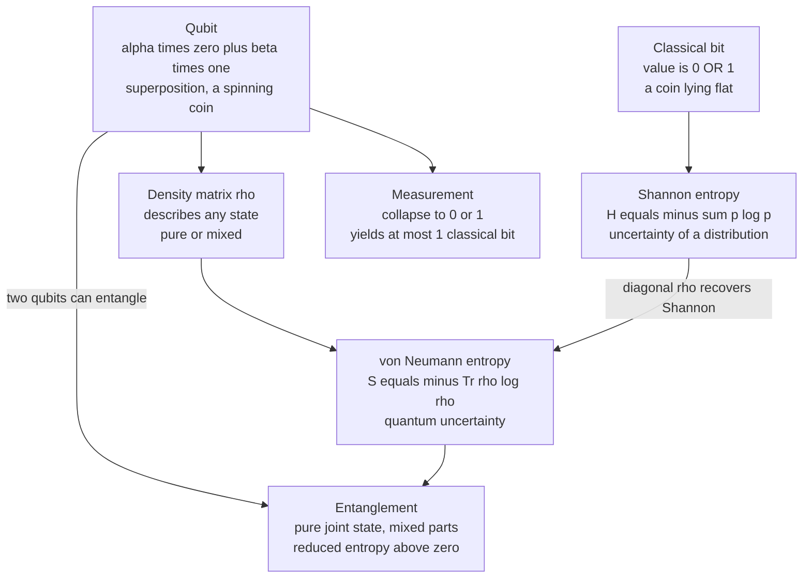

# ⚛️ Quantum Information Theory

> [!abstract] TL;DR
> **Quantum information theory** is Shannon's theory rebuilt on the laws of quantum mechanics. The atom of information is no longer the **bit** but the **qubit** — a two-level quantum system that can sit in a *superposition* $\alpha\lvert 0\rangle + \beta\lvert 1\rangle$ of both values at once, described by complex amplitudes on the **Bloch sphere**. Shannon's entropy $H = -\sum p\log p$ generalizes to the **von Neumann entropy** $S(\rho) = -\mathrm{Tr}(\rho\log\rho)$ of a density matrix. Uniquely quantum resources — **superposition**, **entanglement**, and the **no-cloning theorem** — produce phenomena with no classical analog: correlations stronger than any classical model allows, provably secure key exchange (**BB84**), and the ability to trade quantum for classical communication (**superdense coding**, **teleportation**). The catch is **Holevo's bound**: a qubit hides a continuum of amplitudes, yet you can *read out* at most **1 classical bit** per qubit.

---

## Intuition

**Analogy — the spinning coin.** A classical bit is a coin lying flat on the table: it shows **heads (0)** or **tails (1)**, and if you cover it, it is *still* definitely one or the other — you simply do not know which. A **qubit** is a coin *spinning* in the air. While it spins it is not secretly heads-or-tails; it is in a genuine **superposition** of both, and its state carries more structure than "50/50" — it has a definite phase, an orientation you could describe by *where on a sphere the spin axis points*. The instant you slam your hand down to look — a **measurement** — the spin **collapses** to a single face, heads or tails, and everything you could have known about the spinning motion is gone. You get exactly one classical bit out, and the rich spinning state is destroyed.

That single sentence hides the whole subject: quantum information lets you *store and process* information in the spinning — in amplitudes and phases that have no classical counterpart — but the laws of measurement ration how much of it you are ever allowed to *extract*. Everything below is about the arithmetic of that trade.

---

## How It Works

### 1. The qubit versus the classical bit and the probabilistic bit

A **classical bit** is an element of $\{0, 1\}$. A **probabilistic bit** is a distribution $(p_0, p_1)$ with $p_0 + p_1 = 1$ — a *convex mixture* of the two values, and if you look, you get 0 or 1. A **qubit** is a unit vector in a 2-dimensional complex space:

$$\lvert\psi\rangle = \alpha\lvert 0\rangle + \beta\lvert 1\rangle, \qquad \alpha,\beta \in \mathbb{C}, \qquad |\alpha|^2 + |\beta|^2 = 1.$$

The difference from a probabilistic bit is decisive: the amplitudes $\alpha,\beta$ are **complex** and can **interfere** (cancel or reinforce), which probabilities never do. Writing $\alpha = \cos\tfrac{\theta}{2}$ and $\beta = e^{i\phi}\sin\tfrac{\theta}{2}$ maps every pure qubit onto a point $(\theta,\phi)$ on the **Bloch sphere** — the north pole is $\lvert 0\rangle$, the south pole $\lvert 1\rangle$, and the equator holds equal-weight superpositions distinguished only by their *phase* $\phi$. A classical bit lives at just the two poles; a qubit fills the entire ball.

**Measurement** in the computational basis returns $0$ with probability $|\alpha|^2$ and $1$ with probability $|\beta|^2$, and then **collapses** the state onto the observed outcome. The continuum of $(\alpha,\beta)$ is *not directly readable* — you extract a single classical bit and the rest is destroyed. A physical realization is a spin-$\tfrac12$ particle (see [[Angular_Momentum_and_Spin]]), whose two spin projections are the two levels.

### 2. Density matrices: the general state

A pure state $\lvert\psi\rangle$ is not enough once a system is noisy or is *part of a larger entangled whole*. The general description is the **density matrix** $\rho$ — a Hermitian, positive-semidefinite operator with $\mathrm{Tr}(\rho) = 1$. A pure state is $\rho = \lvert\psi\rangle\langle\psi\rvert$ (a rank-1 projector); a **mixed state** is a probabilistic blend $\rho = \sum_i p_i\lvert\psi_i\rangle\langle\psi_i\rvert$. The eigenvalues of $\rho$ are a genuine probability distribution over an orthonormal basis — this is the bridge back to Shannon (the same $\rho$ also governs thermal states in [[Quantum_Statistical_Mechanics]]).

### 3. Von Neumann entropy — Shannon's quantum generalization

The **von Neumann entropy** measures the uncertainty *in* a quantum state:

$$S(\rho) = -\mathrm{Tr}\big(\rho\log_2\rho\big) = -\sum_i \lambda_i\log_2\lambda_i,$$

where $\lambda_i$ are the eigenvalues of $\rho$. The second form says it plainly: **$S(\rho)$ is the Shannon entropy of the eigenvalue distribution.** Consequences:

- A **pure state** has one eigenvalue $= 1$ and the rest $0$, so $S = 0$ — no uncertainty, even for a wild superposition. Superposition is *not* ignorance.
- The **maximally mixed** qubit $\rho = I/2$ has eigenvalues $(\tfrac12,\tfrac12)$, so $S = 1$ **bit** — maximal ignorance about a single qubit.
- For a **classical (diagonal) $\rho$**, $S(\rho)$ reduces *exactly* to the Shannon entropy $H$ of its diagonal — quantum information theory *contains* classical information theory as the commuting special case (see [[Entropy_and_Information_Content]]).

### 4. Superposition and quantum parallelism

Apply a unitary to $\tfrac{1}{\sqrt{2}}(\lvert 0\rangle + \lvert 1\rangle)$ and it acts on **both** branches simultaneously — extend to $n$ qubits and one operation touches all $2^n$ basis strings at once. This "quantum parallelism" is the raw fuel of quantum algorithms, but by itself it is useless: measurement collapses the superposition to one random answer. Algorithms like **Shor's** (factoring in polynomial time) and **Grover's** ($O(\sqrt{N})$ unstructured search) work by arranging **interference** so that wrong answers cancel and the right answer's amplitude is amplified *before* you measure.

### 5. Entanglement — correlations with no classical analog

Two qubits can occupy a joint state that does **not** factor into a state of each part. The canonical example is the **Bell state**

$$\lvert\Phi^+\rangle = \tfrac{1}{\sqrt{2}}\big(\lvert 00\rangle + \lvert 11\rangle\big).$$

This joint state is **pure**, so $S(\rho_{AB}) = 0$ — you know the *whole* perfectly. Yet the **reduced state** of either qubit alone, obtained by the **partial trace** $\rho_A = \mathrm{Tr}_B(\rho_{AB})$, is the *maximally mixed* $I/2$ with $S(\rho_A) = 1$ bit. **The parts are maximally uncertain even though the whole is fully known** — a situation that is *impossible* classically, where marginal entropies never exceed the joint entropy. This $S(\rho_A)$ is the **entropy of entanglement**: it *is* the measure of how entangled a pure bipartite state is. Entanglement also produces **nonlocal** correlations that violate **Bell inequalities**, ruling out any local-hidden-variable explanation.

### 6. No-cloning, Holevo, and quantum channels

- **No-cloning theorem.** There is no unitary that copies an *unknown* qubit: $\lvert\psi\rangle\lvert 0\rangle \to \lvert\psi\rangle\lvert\psi\rangle$ cannot hold for all $\lvert\psi\rangle$ (it would have to be both linear and, absurdly, respect inner products). You cannot back up quantum information the way you `Ctrl-C` a file. This *bug* is the *feature* underlying quantum cryptography: an eavesdropper cannot copy the qubits in transit.
- **Holevo bound.** A qubit holds a *continuum* of amplitudes, but the **accessible information** — the classical bits a receiver can reliably extract — obeys $I(X{:}Y) \le \chi \le \log_2 d$, giving **at most 1 classical bit per qubit**. The extra "space" in the amplitudes is real for computation and correlation but *not* freely downloadable as classical data.
- **Quantum channels** are the completely-positive trace-preserving (CPTP) maps that noise applies to $\rho$. Their **quantum capacity** — the qubits per use you can send with vanishing error after quantum error correction — is the quantum analog of Shannon's channel capacity (see [[Channel_Capacity_and_the_Noisy_Channel_Theorem]]), governed by the **coherent information** rather than mutual information.

### 7. Reversibility and the physics of information

Every quantum gate is a **unitary** operator, hence **reversible** — quantum computation, run coherently, erases nothing and (ideally) dissipates no heat. This ties directly to **Landauer's principle**: irreversible bit *erasure* costs at least $k_B T\ln 2$ of heat, while reversible logic can in principle avoid that cost. Measurement, which *is* irreversible and discards information, is where the thermodynamic bill comes due (compare the thermodynamic arrow in [[Entropy_and_Second_Law]]).

### Flow — classical bit versus qubit, Shannon versus von Neumann



---

## Key Concepts

### Secondary (intuitive level)
- A **bit** is heads or tails; a **qubit** is a spinning coin that is *both at once* until you look.
- **Looking (measuring)** forces the qubit to pick one face — you get one ordinary bit and destroy the spin.
- **Entanglement** is a "spooky" link: two qubits can be perfectly correlated as a pair while each one alone looks totally random.
- You **cannot photocopy** an unknown qubit (no-cloning) — which is exactly what makes quantum-secured messages tamper-evident.

### Undergraduate (working level)
- **State vector** $\lvert\psi\rangle = \alpha\lvert 0\rangle + \beta\lvert 1\rangle$, $|\alpha|^2+|\beta|^2=1$; the **Bloch sphere** parametrization $(\theta,\phi)$.
- Measurement probabilities $|\alpha|^2, |\beta|^2$ and **collapse**; why a qubit differs from a probabilistic bit (complex amplitudes **interfere**).
- **Density matrix** $\rho$: Hermitian, $\rho\succeq 0$, $\mathrm{Tr}\rho=1$; pure ($\mathrm{Tr}\rho^2=1$) vs mixed.
- **Von Neumann entropy** $S(\rho)=-\sum_i\lambda_i\log_2\lambda_i$; $S=0$ for pure, $S=1$ for $I/2$; reduces to Shannon $H$ for diagonal $\rho$.
- **Bell states**, **partial trace** $\rho_A=\mathrm{Tr}_B\rho_{AB}$, and **entanglement entropy** $S(\rho_A)$.
- **No-cloning theorem** and the idea of **BB84** quantum key distribution.

### Graduate (theoretical level)
- **Holevo bound**: accessible information $\le \chi(\{p_i,\rho_i\}) = S\!\big(\sum_i p_i\rho_i\big) - \sum_i p_i S(\rho_i)$; caps classical readout at $\log_2 d$ per system.
- **Subadditivity** and **strong subadditivity** of $S$; note $S$ can *violate* classical monotonicity — $S(\rho_{AB})$ can be $0$ while $S(\rho_A)>0$, so conditional entropy $S(A\mid B)$ can be **negative** (the resource quantified by negative conditional entropy underlies state merging).
- **Quantum mutual information** $I(A{:}B)=S(\rho_A)+S(\rho_B)-S(\rho_{AB})$ and quantum **relative entropy** $S(\rho\Vert\sigma)=\mathrm{Tr}\rho(\log\rho-\log\sigma)$.
- **Quantum channels** as CPTP maps (Kraus / Stinespring); **coherent information** and the **quantum capacity** via the LSD theorem; **superadditivity** and non-additivity phenomena with no classical parallel.
- **Schumacher compression**: $S(\rho)$ is the operational qubits-per-symbol limit for compressing a quantum source — the exact analog of Shannon's source coding theorem.
- **Quantum error correction** (stabilizer codes, the **surface code**) and **fault tolerance** protecting information forbidden from being copied.

---

## Python Demo

```python
# Von Neumann entropy S(rho) = -Tr(rho log2 rho), computed from the eigenvalues of rho.
# Shows: (1) a PURE qubit has S=0 (no uncertainty), a MAXIMALLY MIXED qubit has S=1 bit;
#        (2) a BELL state is PURE (S=0) yet each half is maximally mixed (S=1) -- entanglement;
#        (3) entropy vs an entanglement parameter theta and vs a mixing parameter p.
import numpy as np
import matplotlib.pyplot as plt


def von_neumann_entropy(rho, base=2):
    """S(rho) = -sum lambda_i log lambda_i  (bits when base=2). rho is Hermitian, PSD."""
    evals = np.linalg.eigvalsh(rho)           # real eigenvalues of a Hermitian matrix
    evals = evals[evals > 1e-12]              # 0*log0 := 0, so drop numerical zeros
    return float(-np.sum(evals * (np.log(evals) / np.log(base))))


def partial_trace_B(rho, dimA=2, dimB=2):
    """Trace out subsystem B from a bipartite density matrix (basis index = dimB*a + b)."""
    r = rho.reshape(dimA, dimB, dimA, dimB)   # indices (a, b, c, d)
    return np.trace(r, axis1=1, axis2=3)      # rho_A[a,c] = sum_b rho[a,b,c,b]


# --- 1. Single-qubit entropies -------------------------------------------
ket0 = np.array([1, 0], dtype=complex)
rho_pure  = np.outer(ket0, ket0.conj())       # |0><0|  : a pure state
rho_mixed = 0.5 * np.eye(2, dtype=complex)    # I/2     : maximally mixed

print(f"Pure state |0><0|    S = {von_neumann_entropy(rho_pure):.3f} bits   (expect 0)")
print(f"Maximally mixed I/2  S = {von_neumann_entropy(rho_mixed):.3f} bits   (expect 1)")

# --- 2. Bell state: pure whole, maximally mixed parts (the hallmark) ------
bell = np.array([1, 0, 0, 1], dtype=complex) / np.sqrt(2)   # (|00> + |11>)/sqrt(2)
rho_bell = np.outer(bell, bell.conj())
rho_A = partial_trace_B(rho_bell)

print(f"\nBell joint state     S = {von_neumann_entropy(rho_bell):.3f} bits   (expect 0, pure)")
print(f"Reduced qubit rho_A  S = {von_neumann_entropy(rho_A):.3f} bits   (expect 1, entangled)")
print("=> whole is fully known, yet each half is maximally uncertain: entanglement.")

# --- 3. Entropy vs entanglement angle theta:  cos(t)|00> + sin(t)|11> -----
thetas = np.linspace(0.0, np.pi / 2, 200)
S_ent = []
for t in thetas:
    psi = np.array([np.cos(t), 0, 0, np.sin(t)], dtype=complex)
    S_ent.append(von_neumann_entropy(partial_trace_B(np.outer(psi, psi.conj()))))

# --- 4. Entropy vs mixing p:  (1-p)|0><0| + p * I/2 ----------------------
ps = np.linspace(0.0, 1.0, 200)
S_mix = [von_neumann_entropy((1 - p) * rho_pure + p * rho_mixed) for p in ps]

fig, ax = plt.subplots(1, 2, figsize=(11, 4))
ax[0].plot(thetas, S_ent, color="#7c3aed", lw=2)
ax[0].axhline(1.0, ls="--", color="gray")
ax[0].set_title("Entanglement entropy of  cos t|00> + sin t|11>")
ax[0].set_xlabel("theta  [rad]")
ax[0].set_ylabel("S(rho_A)  [bits]")
ax[0].annotate("Bell state: max 1 bit at theta = pi/4",
               xy=(np.pi / 4, 1.0), xytext=(0.10, 0.55),
               arrowprops=dict(arrowstyle="->"))

ax[1].plot(ps, S_mix, color="#059669", lw=2)
ax[1].set_title("Entropy of  (1-p)|0><0| + p * I/2")
ax[1].set_xlabel("mixing parameter p")
ax[1].set_ylabel("S(rho)  [bits]")

plt.tight_layout()
plt.show()

# Expected output:
# Pure state |0><0|    S = 0.000 bits   (expect 0)
# Maximally mixed I/2  S = 1.000 bits   (expect 1)
#
# Bell joint state     S = 0.000 bits   (expect 0, pure)
# Reduced qubit rho_A  S = 1.000 bits   (expect 1, entangled)
```

The printout is the whole lesson in four numbers: a pure state carries **zero** von Neumann entropy no matter how exotic its superposition, and yet a **pure** two-qubit Bell state has a **maximally mixed** single-qubit reduction — $S(\rho_A) = 1$ bit while $S(\rho_{AB}) = 0$. That inversion (the part more uncertain than the whole) is impossible for Shannon entropy and is the mathematical signature of **entanglement**.

---

## Real-World Applications

- **Quantum key distribution (BB84 / E91).** Alice sends qubits in randomly chosen bases; because an eavesdropper cannot **clone** or measure them without disturbance, any interception raises the error rate and is *detected*. The result is a shared secret key whose security rests on the **laws of physics**, not on the assumed hardness of a math problem — a form of information-theoretic security. Systems from Chinese metropolitan-area QKD networks to the **Micius** satellite (space-to-ground entanglement distribution over 1200 km) implement exactly this.
- **Post-quantum threat model.** **Shor's algorithm** on a large fault-tolerant quantum computer would break **RSA** and **elliptic-curve** cryptography by factoring / discrete-log in polynomial time — the entire motivation for migrating to lattice-based schemes (see [[Post_Quantum_Cryptography]] and [[Asymmetric_Cryptography_and_PKI]]).
- **Superdense coding and teleportation.** Sharing a Bell pair as a resource lets you send **2 classical bits by transmitting 1 qubit** (superdense coding), and **move an unknown qubit using 2 classical bits plus the shared entanglement** (teleportation) — the operational backbone of proposed **quantum repeaters** and a future quantum internet.
- **Quantum computing at scale.** Superconducting (IBM, Google) and trapped-ion (Quantinuum, IonQ) processors run **Grover**-style search and quantum simulation; Google's 2019 and later "quantum supremacy" experiments sampled distributions believed classically intractable. **Surface-code error correction** is the leading path to protecting the fragile qubits long enough to compute.
- **Randomness and metrology.** Measurement collapse yields **certified true randomness** (device-independent QRNGs), and entangled probes beat the classical shot-noise limit in **quantum sensing** and atomic clocks.

---

## Common Pitfalls

- **"Superposition = ignorance / a random mixture."** No. A pure superposition has $S(\rho)=0$: it is a *definite* state that can **interfere**. A statistical mixture is diagonal and has positive entropy. Confusing $\tfrac{1}{\sqrt2}(\lvert0\rangle+\lvert1\rangle)$ with a coin flip loses the phase — and the phase is where the quantum advantage lives.
- **"A qubit stores infinitely many classical bits."** It *holds* a continuum of amplitudes, but **Holevo's bound** caps *readout* at 1 classical bit per qubit. The amplitudes are usable for computation and correlation, not for free data storage.
- **"Entanglement lets you signal faster than light."** Measurement outcomes are locally random; the correlations only appear once the two parties **compare classical results**. Teleportation and superdense coding *both* require a classical channel — no superluminal communication.
- **Forgetting the log base and the $0\log 0$ convention.** Use $\log_2$ for bits (natural log gives *nats*), and diagonalize $\rho$ before taking the log — dropping zero eigenvalues, exactly as the demo does, or you get `nan`.
- **Treating $S(A\mid B)$ like a classical conditional entropy.** Quantum conditional entropy **can be negative** for entangled states; do not assume $S(\rho_{AB}) \ge S(\rho_A)$ — that classical inequality fails.
- **Assuming no-cloning forbids all copying.** You *can* clone *orthogonal* (known-basis) states and you can copy *classical* information; no-cloning only forbids a universal copier of **unknown, arbitrary** states.

---

## Related Concepts

- [[Entropy_and_Information_Content]] — Shannon entropy $H=-\sum p\log p$ is the classical special case that von Neumann entropy $-\mathrm{Tr}(\rho\log\rho)$ reduces to for a diagonal $\rho$.
- [[Relative_Entropy_and_Cross_Entropy]] — the KL divergence generalizes to quantum relative entropy $S(\rho\Vert\sigma)$, the parent quantity of quantum mutual information and the Holevo $\chi$.
- [[Joint_Conditional_Entropy_and_Mutual_Information]] — quantum mutual information $S(\rho_A)+S(\rho_B)-S(\rho_{AB})$ mirrors this construction but allows *negative* conditional entropy for entangled states.
- [[Channel_Capacity_and_the_Noisy_Channel_Theorem]] — quantum capacity (via coherent information) is the qubit-per-use analog of Shannon's noisy-channel theorem.
- [[Wave_Particle_Duality_and_Uncertainty]] — superposition and measurement collapse are the quantum-mechanical foundations the qubit is built on.
- [[Schrodinger_Equation]] — unitary (Schrödinger) evolution is exactly the reversible gate model of quantum computation.
- [[Angular_Momentum_and_Spin]] — a spin-$\tfrac12$ particle is the archetypal physical qubit; its two spin projections are $\lvert 0\rangle$ and $\lvert 1\rangle$.
- [[Quantum_Statistical_Mechanics]] — the same density matrix $\rho$ and von Neumann entropy describe thermal states, linking quantum information to statistical physics.
- [[Entropy_and_Second_Law]] — reversibility of quantum gates and the thermodynamic cost of irreversible measurement connect to Landauer's principle and the second law.
- [[Post_Quantum_Cryptography]] — Shor's algorithm is the quantum threat driving the migration to quantum-resistant schemes; QKD is the physics-based alternative.
- [[Asymmetric_Cryptography_and_PKI]] — RSA and ECC, whose hardness Shor's algorithm would demolish on a large quantum computer.

---

## Review Questions

**Tier 1 — Conceptual (explain to a peer):**
1. Using the spinning-coin analogy, explain why a qubit is *not* the same as a probabilistic bit, and why measurement gives you only one classical bit.
2. The no-cloning theorem says you cannot copy an unknown qubit. Why is this a *feature* rather than a limitation from the point of view of quantum key distribution?

**Tier 2 — Applied (compute / reason):**
3. Compute the von Neumann entropy of (a) the pure state $\tfrac{1}{\sqrt2}(\lvert0\rangle+\lvert1\rangle)$ and (b) the mixed state $\tfrac12\lvert0\rangle\langle0\rvert+\tfrac12\lvert1\rangle\langle1\rvert$. Both "look 50/50" on measurement — why is one entropy $0$ and the other $1$ bit?
4. For the Bell state $\lvert\Phi^+\rangle$, take the partial trace to find $\rho_A$ and its entropy. Explain how $S(\rho_{AB})=0$ but $S(\rho_A)=1$ is impossible for classical joint distributions.

**Tier 3 — Theoretical (deep understanding):**
5. State the Holevo bound and reconcile it with the fact that a qubit is parametrized by a continuum $(\theta,\phi)$. If a qubit "contains" continuous information, why can Bob extract at most one bit?
6. Quantum conditional entropy $S(A\mid B)=S(\rho_{AB})-S(\rho_B)$ can be negative. Exhibit a state where it is, and explain what operational resource (hint: state merging / superdense coding) this negativity represents.

---

## Sources

- Nielsen, M. A. & Chuang, I. L. (2010). *Quantum Computation and Quantum Information* (10th Anniversary ed.). Cambridge University Press. — the standard reference; Chs. 2, 11–12 cover qubits, von Neumann entropy, and Holevo.
- Wilde, M. M. (2017). *Quantum Information Theory* (2nd ed.). Cambridge University Press. [arXiv:1106.1445](https://arxiv.org/abs/1106.1445) — modern, entropy-centric treatment.
- Bennett, C. H. & Brassard, G. (1984). *Quantum cryptography: Public key distribution and coin tossing.* Proc. IEEE Int. Conf. on Computers, Systems and Signal Processing, 175–179. — the original BB84 paper.
- Wootters, W. K. & Zurek, W. H. (1982). *A single quantum cannot be cloned.* Nature, 299, 802–803. — the no-cloning theorem.
- Preskill, J. *Quantum Information* (Caltech Ph219 lecture notes). [Online](http://theory.caltech.edu/~preskill/ph219/) — free, rigorous, widely used.

---

#information-theory #quantum-information #qubits #von-neumann-entropy #entanglement
