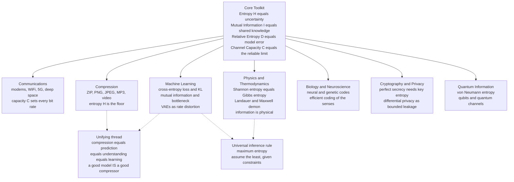

# 🌐 The Reach of Information Theory

> [!abstract] TL;DR
> One 1948 paper introduced a handful of quantities — **entropy** (uncertainty), **mutual information** (shared knowledge), **relative entropy / KL** (the cost of a wrong model), and **channel capacity** (the ultimate rate of reliable communication) — and those few numbers turned out to be the hidden grammar of *communication, compression, learning, physics, biology, cryptography, and quantum mechanics alike*. The deepest thread running through all of it is a single equivalence: **compression = prediction = understanding = learning** — a good model of the world *is* a good compressor of it. That equivalence is why the same mathematics that sizes a ZIP file also defines the loss function of an LLM, why erasing a bit costs energy, and why some thinkers now place **information alongside matter and energy as a fundamental constituent of reality**. This capstone synthesizes the whole vault and shows just how far Shannon's idea reaches.

---

## Intuition

**Analogy — information is a universal currency.** Money is astonishing because a single scalar — the dollar — prices things that have *nothing physically in common*: a loaf of bread, an hour of a surgeon's time, a barrel of oil, a share of stock. Once you can put everything on one scale, you can trade, budget, arbitrage, and optimize across wildly different worlds. Money is not the bread; it is a *measure* that lets incomparable things be compared and exchanged.

Information theory hands you exactly such a currency, and its unit is the **bit**. A bit prices the surprise in a coin flip, the uncertainty removed by a Mars rover's transmission, the redundancy squeezed out of a photograph, the predictability a language model captures in text, the choices encoded in a strand of DNA, the secrecy protecting a password, and the disorder in a box of gas. Before Shannon, these lived in unrelated disciplines with unrelated units — decibels, entropy in joules per kelvin, error rates, probabilities. After 1948, they all trade in bits. That is the "reach": **a tiny toolkit for answering one question — *how much do you know, and how much could you know?* — turns out to be the same question hiding inside communication, computation, thermodynamics, life, and intelligence.**

And just as a currency reveals hidden equivalences (a wage equals a rent equals a price), the information currency reveals that many apparently different *limits* — the smallest a file can shrink, the fastest a channel can carry data, the least energy to erase memory, the best a model can predict — are, on inspection, **the same limit wearing different clothes**.

---

## How It Works

### The core toolkit (a four-quantity recap of the foundations)

Everything in this vault is built from four functionals of probability distributions. They are worth stating once more, because the whole point of the capstone is that *these four numbers are all you need* to reach every domain below (full development in [[Entropy_and_Information_Content]], [[Joint_Conditional_Entropy_and_Mutual_Information]], [[Relative_Entropy_and_Cross_Entropy]], and [[Channel_Capacity_and_the_Noisy_Channel_Theorem]]).

| Quantity | Plain meaning | Definition | The limit it sets |
|----------|---------------|------------|-------------------|
| **Entropy** `H(X)` | How uncertain / how surprising a source is | `-Σ p log p` | Compression floor — you cannot beat `H` bits/symbol |
| **Mutual information** `I(X;Y)` | How much knowing `Y` tells you about `X` | `H(X) − H(X\|Y)` | Communication ceiling via `C = max I(X;Y)` |
| **Relative entropy** `D(P‖Q)` | Extra cost of believing `Q` when the truth is `P` | `Σ P log(P/Q)` | Model error, and the exponent of test errors |
| **Channel capacity** `C` | Fastest reliable rate over a noisy medium | `max_{p(x)} I(X;Y)` | The hard speed limit of every link |

`H` measures a *single* distribution, `I` measures *dependence* between two, `D` measures the *gap* between a model and reality, and `C` is `I` optimized into a hard engineering bound. That is the entire vocabulary.

### Why one toolkit reaches everywhere: many limits are the same limit

The reason four quantities suffice is that the *proofs* in every domain lean on the same two engines.

1. **The typical set / AEP.** Long random sequences concentrate onto roughly `2^{nH}` almost-equiprobable "typical" strings. This single geometric fact proves the source coding theorem (there are only `2^{nH}` things worth naming, so `H` bits/symbol suffice), the channel coding theorem (you can pack about `2^{nC}` distinguishable codewords into the noise), and the equipartition of statistical mechanics — one idea, three theorems.

2. **KL divergence as the universal exchange rate of error.** `D(P‖Q)` is not just "model error." It is the *same* number that appears as:
   - the **excess bits** wasted when you compress `P`-data with a code built for `Q` (source coding),
   - the **error exponent** of distinguishing two hypotheses (Stein's lemma: the best test's error decays like `2^{-nD}`),
   - the **rate function** governing how improbable a rare deviation is (Sanov's theorem, large deviations),
   - the **regret / suboptimality gap** in variational inference and online learning (the ELBO is `log-evidence − D`),
   - and, through nonequilibrium statistical mechanics, the **dissipated free energy** of a process driven away from equilibrium.

When you see the *same* `D(P‖Q)` controlling the price of a wrong codebook, a wrong hypothesis, a wrong forecast, and a wrongly-driven physical process, you stop seeing coincidences and start seeing **one law**. The "reach" of information theory is really the reach of the typical set and of KL divergence.

### The master thread: compression = prediction = understanding = learning

The deepest and most modern strand: **to predict is to compress, and to compress is to understand.** A model that assigns probability `q(x)` to the next symbol lets you encode that symbol in `−log₂ q(x)` bits (arithmetic coding realizes this). Averaged over real data drawn from `p`, the bill is the **cross-entropy** `H(p, q) = H(p) + D(p‖q)`. You pay the irreducible `H(p)` plus a penalty `D(p‖q)` for every way your model is wrong. Therefore:

- **Better prediction (lower cross-entropy / perplexity) is *literally* better compression (fewer bits).** They are the same objective measured in the same units.
- **Minimizing cross-entropy loss = maximum likelihood = minimum description length.** The loss function of essentially every classifier and language model *is* a coding cost. Training a neural net is finding the shortest description of the data.
- **A good compressor must model structure**, and structure that predicts is structure that is "understood." This is why an LLM's quality is reported as perplexity, why "language modeling is compression" is provably true, and why intelligence and information theory are now intertwined (see [[Information_Theory]], [[LLM_Architecture_Deep_Dive]]).

The Python demo below turns this equivalence into a number you can watch: as a model's *prediction* improves, its *compression* improves in lockstep, both converging on the source's entropy rate.

### The reach, as a map



---

## Key Concepts

### Secondary (the big picture)
- **Information is a measurable thing.** Just as we measure distance in metres and energy in joules, we measure information in bits — and one measure works across telephones, DNA, and physics.
- **The two great limits.** You can never shrink data below its entropy, and you can never send it faster than a channel's capacity without errors. Everything else is engineering toward these walls.
- **Understanding = compression.** Knowing the pattern in something lets you describe it in fewer words. A model that predicts the world well can also *compress* the world well — the same skill, two names.
- **One 1948 paper.** Claude Shannon's *A Mathematical Theory of Communication* created the whole field almost complete, and it quietly rebuilt the modern world of phones, internet, storage, and AI.

### Undergraduate (the working machinery)
- **The four quantities** `H`, `I`, `D`, `C` and how each sets a limit (compression floor, communication ceiling, model-error cost, reliable-rate cap).
- **Cross-entropy decomposition:** `H(p, q) = H(p) + D(p‖q)`. Training minimizes `D` toward zero; the residual `H(p)` is the irreducible Bayes/entropy floor. This links a *learning metric* (loss) to a *coding metric* (bits) exactly (see [[Relative_Entropy_and_Cross_Entropy]], [[Maximum_Likelihood_and_Information]]).
- **Maximum entropy as universal inference:** among all distributions consistent with what you know, pick the one with the highest entropy — it assumes the least. This single rule derives the Boltzmann distribution in physics, the Gaussian as the max-entropy distribution for fixed variance, and much of Bayesian priors (see [[Maximum_Entropy_Principle]]).
- **Rate–distortion:** lossy compression trades bits for fidelity, and a **VAE is a rate–distortion machine** whose ELBO rate term is `I(X; Z)` (see [[Rate_Distortion_Theory_and_Lossy_Compression]], [[Variational_Autoencoders]]).
- **The information bottleneck:** a good representation maximizes `I(T; Y)` (keep what predicts the target) while minimizing `I(T; X)` (compress away the rest) — a lens on all of representation learning (see [[Information_Bottleneck_and_Sufficient_Statistics]], [[Mutual_Information_and_Representation_Learning]]).

### Graduate (the frontier and the unification)
- **KL as the master quantity:** Stein's lemma (`error exponent = D`), Sanov's theorem (`large-deviation rate = D`), Pinsker's inequality (`D` bounds total-variation distance), and the ELBO all reduce inference and testing to relative entropy. Differentiating `D` locally yields the **Fisher information** metric, tying information geometry to the Cramér–Rao bound (see [[Fisher_Information_and_the_Cramer_Rao_Bound]]).
- **Physics of information:** Shannon `H` and Gibbs `S = −k_B Σ p ln p` are the same functional up to `k_B`; **Landauer's principle** makes information physical (`k_B T ln 2` joules to erase one bit), which exorcises **Maxwell's demon** by charging it for the bits it stores and erases (see [[Landauer_Principle_and_Thermodynamics_of_Computation]], [[Entropy_in_Thermodynamics_and_Statistical_Mechanics]]). The **free-energy principle** recasts perception and life itself as minimizing a variational free energy — a KL bound on surprise.
- **Quantum generalization:** the **von Neumann entropy** `S(ρ) = −Tr(ρ log ρ)` replaces `H`; the **Holevo bound** caps classical information extractable from quantum states; entanglement entropy and quantum channel capacities extend every classical theorem, with new phenomena (superadditivity, no-cloning) that have no classical analog.
- **The information theory of deep learning:** Tishby's information-bottleneck theory of training, the "language modeling is compression" equivalence (a trained transformer is a state-of-the-art general-purpose compressor), scaling laws as loss-vs-compute curves, and the open question of *why* minimizing description length generalizes.
- **Network information theory (still largely open):** the capacity region of a general multi-user network — broadcast, interference, and relay channels — remains unsolved after decades; there is no complete multi-terminal analog of Shannon's single-channel theorems.

---

## Python Demo

This demo makes the capstone's central claim numerical: **compression = prediction = learning.** We generate a stream from a hidden order-2 Markov source, then build predictive models of increasing quality — uniform, unigram, bigram, trigram. For each model the *ideal code length* is exactly its **cross-entropy on held-out data**, so a model that *predicts* better (lower cross-entropy / perplexity, the LLM quality metric) is *provably* a better *compressor* (fewer bits, the coding metric). We plot compression cost against model quality, mark the source's true entropy rate as the unbeatable floor, and drop in `zlib` (DEFLATE) as a real-world codec for reference.

```python
# Compression = Prediction = Learning, made numerical.
#
# Ideal code length to encode a stream under a model q is exactly its cross-entropy:
#     bits = sum_t  -log2 q(x_t | context)      (arithmetic coding realizes this)
# So a BETTER predictor (lower cross-entropy / perplexity) IS a BETTER compressor.
import numpy as np
import zlib
import matplotlib.pyplot as plt
from collections import defaultdict

rng = np.random.default_rng(7)

# ---- 1. A hidden order-2 Markov source over a 4-symbol alphabet -------------
K = 4
# Random-but-structured transition tensor T[a, b, c] = p(next = c | prev2 = a, prev1 = b).
# Cubing sharpens it, giving the source genuine predictable structure (low entropy rate).
T = rng.random((K, K, K)) ** 3.0
T /= T.sum(axis=2, keepdims=True)

def sample_stream(n):
    x = np.empty(n, dtype=int)
    x[0], x[1] = 0, 1
    for t in range(2, n):
        x[t] = rng.choice(K, p=T[x[t - 2], x[t - 1]])
    return x

train = sample_stream(60_000)   # models are fit here
test  = sample_stream(20_000)   # and scored on held-out data (honest ML setup)

# ---- 2. True entropy rate H(X_t | X_{t-2}, X_{t-1}) = the compression floor --
def entropy_rate():
    s = sample_stream(200_000)
    pair = np.zeros((K, K))
    for a, b in zip(s[:-1], s[1:]):
        pair[a, b] += 1
    pair /= pair.sum()                                  # stationary context distribution
    H = 0.0
    for a in range(K):
        for b in range(K):
            if pair[a, b] == 0:
                continue
            c = T[a, b][T[a, b] > 0]
            H -= pair[a, b] * np.sum(c * np.log2(c))
    return H

H_rate = entropy_rate()

# ---- 3. Models of increasing Markov order (Laplace-smoothed) ----------------
ALPHA = 1.0   # smoothing so a never-before-seen symbol never costs infinite bits

def fit(stream, order):
    table = defaultdict(lambda: np.zeros(K))
    for t in range(order, len(stream)):
        table[tuple(stream[t - order:t])][stream[t]] += 1
    return table

def cross_entropy_bits(stream, order, table):
    """Average bits/symbol to encode `stream` under a smoothed order-`order` model.
    This equals the ideal arithmetic-code length per symbol."""
    bits, n = 0.0, 0
    for t in range(order, len(stream)):
        counts = table.get(tuple(stream[t - order:t]), np.zeros(K))
        p = (counts + ALPHA) / (counts.sum() + ALPHA * K)
        bits += -np.log2(p[stream[t]])
        n += 1
    return bits / n

models = {"uniform":  None,   # no learning at all -> log2(K) bits, always
          "unigram":  0,
          "bigram":   1,
          "trigram":  2}

names, bits_per_sym = [], []
for name, order in models.items():
    bps = np.log2(K) if order is None else cross_entropy_bits(test, order, fit(train, order))
    names.append(name)
    bits_per_sym.append(bps)
    print(f"{name:9s}  cross-entropy = {bps:.3f} bits/sym   perplexity = {2**bps:.2f}")

print(f"\nTrue source entropy rate (floor): {H_rate:.3f} bits/sym")

# ---- 4. A real-world codec for comparison: zlib / DEFLATE on the raw bytes ---
raw = test.astype(np.uint8).tobytes()               # one byte per symbol
zlib_bps = 8.0 * len(zlib.compress(raw, level=9)) / len(test)
print(f"zlib (DEFLATE) achieves:          {zlib_bps:.3f} bits/sym")

# ---- 5. Plot: prediction quality drives compression cost --------------------
fig, ax1 = plt.subplots(figsize=(8.5, 5))
xs = np.arange(len(names))
ax1.bar(xs, bits_per_sym, color="steelblue", alpha=0.85, label="code length (bits/sym)")
ax1.axhline(H_rate,   color="red",   ls="--", lw=2, label=f"true entropy rate = {H_rate:.2f}")
ax1.axhline(zlib_bps, color="green", ls=":",  lw=2, label=f"zlib = {zlib_bps:.2f}")
ax1.set_xticks(xs); ax1.set_xticklabels(names)
ax1.set_ylabel("compression cost  (bits / symbol)")
ax1.set_title("Better prediction = fewer bits: compression IS learning")
ax1.legend(loc="upper right")

ax2 = ax1.twinx()                                    # perplexity = 2^bits, the LLM metric
ax2.plot(xs, [2**b for b in bits_per_sym], "ko-")
ax2.set_ylabel("perplexity  (2 ^ bits/sym)")
plt.tight_layout()
plt.show()

# What you see: bits/symbol falls monotonically uniform -> unigram -> bigram -> trigram,
# converging on the true entropy rate. The model that PREDICTS best COMPRESSES best.
# Perplexity (the language-model quality metric) and bits (the coding metric) are the
# same curve on two axes -- the compression = prediction equivalence, made concrete.
```

**What it shows.** The trigram model — which matches the true order-2 structure — drives cross-entropy down to the source's entropy rate, the theoretical floor no coder can beat. Each step up in model quality buys a step down in bits, and `perplexity = 2^{bits/symbol}` rides the identical curve. The generic `zlib` compressor lands in the same neighborhood without being told the source, because *any* good compressor is implicitly a good predictor. You have just linked an AI training metric to a data-coding metric with a single line of code.

---

## Real-World Applications

- **Communications — the limit of every link.** Shannon's two coding theorems set the specifications of every modem, Wi-Fi radio, 5G handset, and deep-space probe. Capacity `C = (1/2) log₂(1 + S/N)` bounds the bit rate; **LDPC and turbo codes** now operate within a fraction of a decibel of that bound, and Voyager still phones home across billions of kilometres because of it (see [[Channel_Capacity_and_the_Noisy_Channel_Theorem]], [[The_Gaussian_Channel_and_Shannon_Hartley]], [[Modern_Codes_LDPC_and_Turbo]]).
- **Compression — entropy is the floor, codecs chase it.** Lossless coders (gzip/DEFLATE, PNG, FLAC) approach the source entropy; lossy coders (JPEG, MP3, AAC, H.265) are governed by rate–distortion theory, discarding perceptually irrelevant bits (see [[Source_Coding_Theorem_and_Data_Compression]], [[Universal_Compression_and_Lempel_Ziv]], [[Rate_Distortion_Theory_and_Lossy_Compression]]).
- **Machine learning — the loss function *is* a coding cost.** Cross-entropy loss = maximum likelihood = minimum description length; KL divergence regularizes VAEs and diffusion models; mutual information powers contrastive representation learning; and an LLM's perplexity is exactly its compression rate on text (see [[Information_Theory]], [[Loss_Functions]], [[Mutual_Information_and_Representation_Learning]], [[Information_Bottleneck_and_Sufficient_Statistics]], [[Variational_Autoencoders]], [[Transformer_Architecture]], [[LLM_Architecture_Deep_Dive]], [[Minimum_Description_Length_and_Model_Selection]]).
- **Physics — information is physical.** Shannon entropy equals Gibbs entropy up to `k_B`; **Landauer's principle** charges `k_B T ln 2` per erased bit; **Maxwell's demon** is defeated by that bookkeeping; and Jaynes' maximum-entropy programme rebuilds statistical mechanics as inference (see [[Entropy_in_Thermodynamics_and_Statistical_Mechanics]], [[Landauer_Principle_and_Thermodynamics_of_Computation]], [[Entropy_and_Second_Law]], [[Classical_Statistical_Mechanics]], [[Maximum_Entropy_Principle]]).
- **Biology and neuroscience.** DNA is a genetic code with a measurable channel capacity; sensory neurons follow **efficient-coding / InfoMax** principles, maximizing information transmitted about the stimulus under metabolic and noise constraints; spike trains are analyzed as information channels (bits per spike).
- **Cryptography and privacy — secrecy as controlled information.** Shannon's 1949 notion of **perfect secrecy** requires key entropy at least equal to message entropy (the one-time pad); password and key strength are quoted in *bits of entropy*; and **differential privacy** bounds the information any single record leaks, a modern information-theoretic guarantee behind census and telemetry pipelines.
- **Quantum information.** Von Neumann entropy generalizes `H` to density matrices, qubits generalize bits, and quantum Shannon theory extends compression and channel coding to entangled resources — the theoretical bedrock of quantum communication and computing.

---

## Common Pitfalls

- **Overselling the reach — "information theory explains everything."** The framework is astonishingly general, but it is *silent on meaning and value*. Shannon information measures statistical surprise, not semantic content, importance, or truth. A page of random noise has maximal entropy and zero meaning. The theory's power comes precisely from *excluding* semantics; do not smuggle meaning back in and call it math.
- **Treating all "entropies" as the same thing.** Shannon entropy (discrete, in bits) and Boltzmann/Gibbs entropy (thermodynamic, in J/K) coincide only after multiplying by `k_B` and choosing a log base; **differential entropy** (continuous) can be negative and is *not* coordinate-invariant; **von Neumann entropy** is quantum. They rhyme, but conflating their units and properties produces nonsense. Report the log base and the domain.
- **Believing "compression = intelligence" naively.** Better prediction is better compression — but a lookup table that memorizes the training stream compresses it perfectly while *understanding* nothing and generalizing not at all. The equivalence holds for *held-out* data; overfitting breaks the metaphor. Compression predicts intelligence only when it *generalizes* (which is why the demo scores on a test split).
- **Confusing capacity with a guarantee at any speed.** The noisy channel theorem promises arbitrarily low error *only below* capacity and *only asymptotically* in block length — at a real cost in latency and decoder complexity. Push past `C` and reliable communication is flatly impossible.
- **Treating KL divergence as a distance.** `D(P‖Q)` is asymmetric and violates the triangle inequality; swapping arguments changes both the value and the qualitative behavior (mass-covering vs. mode-seeking). It is the master quantity of the field, but it is *not* a metric.
- **Assuming single-channel theorems transfer to networks.** Shannon closed the single-link problem in 1948; the capacity region of a *general* network is still open. Do not assume clean, tight limits exist for every multi-user setting — often they genuinely don't.

---

## Related Concepts

- [[Information_Theory_Overview]] — the front door to the whole vault; this capstone is its mirror image, looking outward from the same foundations.
- [[Entropy_and_Information_Content]] — the source of the central quantity `H`; entropy is the floor every application is measured against.
- [[Joint_Conditional_Entropy_and_Mutual_Information]] — defines `I(X;Y)`, the currency of dependence, capacity, and representation quality.
- [[Relative_Entropy_and_Cross_Entropy]] — `D(P‖Q)`, the master quantity linking coding cost, model error, and hypothesis-testing exponents.
- [[Channel_Capacity_and_the_Noisy_Channel_Theorem]] — the communication ceiling that bounds every modem, radio, and deep-space link.
- [[Source_Coding_Theorem_and_Data_Compression]] — establishes entropy as the compression floor that codecs chase.
- [[Rate_Distortion_Theory_and_Lossy_Compression]] — the lossy generalization behind JPEG/MP3 and the VAE's rate term.
- [[Maximum_Entropy_Principle]] — the universal inference rule bridging thermodynamics, Bayesian priors, and machine learning.
- [[Minimum_Description_Length_and_Model_Selection]] — model selection as compression; the formal version of "compression = understanding."
- [[Maximum_Likelihood_and_Information]] — shows minimizing cross-entropy loss *is* maximum likelihood, tying learning to coding.
- [[Fisher_Information_and_the_Cramer_Rao_Bound]] — the local, geometric face of KL divergence and information in estimation.
- [[Information_Bottleneck_and_Sufficient_Statistics]] — reframes representation learning as compressing input while keeping label-relevant bits.
- [[Mutual_Information_and_Representation_Learning]] — MI maximization as the engine of modern self-supervised learning.
- [[Entropy_in_Thermodynamics_and_Statistical_Mechanics]] — the identity of Shannon and Gibbs entropy; the physics side of the bridge.
- [[Landauer_Principle_and_Thermodynamics_of_Computation]] — "information is physical": the energy cost of erasing a bit and the exorcism of Maxwell's demon.
- [[Information_Theory]] — the AI-ML companion note on cross-entropy, KL, and mutual information in deep learning.
- [[Loss_Functions]] — cross-entropy loss is literally the coding cost of the labels under the model's predicted distribution.
- [[Variational_Autoencoders]] — a rate–distortion machine whose ELBO rate term is `I(X; Z)`.
- [[Transformer_Architecture]] — the model class whose training objective is a next-token cross-entropy, i.e. a compression cost.
- [[LLM_Architecture_Deep_Dive]] — where "language modeling is compression" becomes a state-of-the-art general-purpose compressor.
- [[Entropy_and_Second_Law]] — the thermodynamic entropy Shannon's `H` turned out to equal.
- [[Classical_Statistical_Mechanics]] — where the maximum-entropy principle rederives the Boltzmann distribution.

---

## Review Questions

**Secondary**
1. Explain, in plain language and using the "universal currency" analogy, how the *same* unit — the bit — can measure the surprise in a coin flip, the size of a compressed photo, the quality of a language model, and the disorder in a gas. What is the one common question all four are answering?

**Undergraduate**
2. Starting from the decomposition `H(p, q) = H(p) + D(p‖q)`, explain precisely why "a model that predicts better compresses better." Identify which term is the irreducible floor, which term training drives toward zero, and why the equivalence requires evaluation on *held-out* data rather than the training set. Then state why minimizing cross-entropy loss is the same as maximum likelihood.

**Graduate**
3. The claim "many limits are the same limit" rests on KL divergence appearing across domains. Choose three of: the source-coding excess-bits penalty, Stein's lemma error exponent, Sanov's large-deviation rate function, the variational-inference (ELBO) gap, and nonequilibrium dissipated free energy. For each, state the quantity it bounds and argue why it reduces to `D(P‖Q)`. Then take a position on the philosophical claim "it from bit": does the cross-domain success of information theory imply information is *ontologically fundamental* alongside matter and energy, or merely an unusually good descriptive language? Defend your answer.

---

## Sources

- [Shannon, C. E. — *A Mathematical Theory of Communication* (1948)](https://people.math.harvard.edu/~ctm/home/text/others/shannon/entropy/entropy.pdf)
- [Cover, T. & Thomas, J. — *Elements of Information Theory* (2nd ed., Wiley)](https://onlinelibrary.wiley.com/doi/book/10.1002/047174882X)
- [MacKay, D. — *Information Theory, Inference, and Learning Algorithms* (free full text)](https://www.inference.org.uk/mackay/itila/book.html)
- [Wheeler, J. A. — *Information, Physics, Quantum: The Search for Links* (1989) — the "it from bit" thesis](https://philpapers.org/rec/WHEIPQ)
- [Delétang et al. — *Language Modeling Is Compression* (DeepMind, 2023)](https://arxiv.org/abs/2309.10668)
- [Jaynes, E. T. — *Information Theory and Statistical Mechanics* (1957)](https://bayes.wustl.edu/etj/articles/theory.1.pdf)

---

#information-theory #entropy #unification #compression-is-prediction #capstone
