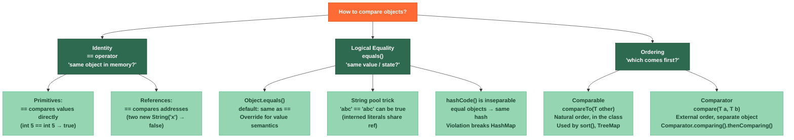

# ⚖️ Identity and Equality

> [!abstract] TL;DR
> `==` tests **object identity** — whether two variables point to the exact same memory address. `equals()` tests **logical equivalence** — whether two objects represent the same value, and must be overridden to mean anything useful beyond `==`. The **hashCode contract** requires that equal objects always produce the same hash code (the reverse — unequal objects having the same hash — is allowed but hurts performance). **Comparable** defines the natural ordering intrinsic to a class (`compareTo`); **Comparator** defines an external, ad-hoc ordering without touching the class. Violating the `equals`/`hashCode` contract silently corrupts `HashMap`, `HashSet`, and any hash-based collection.

---

## Intuition

Imagine **two identical twins**, Alice and Alice-clone, and **one real person** named Bob.

- `twin1 == twin2` → **false** — they are different physical people at different locations, even though they look identical.
- `twin1.equals(twin2)` → **true** — they have the same name, birthday, and DNA fingerprint (logical equivalence).
- `bob == bob` → **true** — same person, same location.

The `hashCode` is like their **postal district** — the post office (HashMap) uses the district to narrow down where to deliver mail. Two people in the same district doesn't mean they're the same person, but the same person must always be in the same district.

---

## How It Works

### Equality vs Ordering Diagram



### Method Contract Summary

| Method | Contract | When to Override | Pitfall |
|--------|---------|-----------------|---------|
| `==` | Reference equality; never overridable | Never (operator, not method) | Comparing boxed Integer > 127; String literals vs `new String()` |
| `equals(Object o)` | Reflexive, Symmetric, Transitive, Consistent, Null-safe | Whenever logical equality differs from identity | Forgetting `hashCode`; using mutable fields |
| `hashCode()` | Equal objects → equal hash; Consistent across calls; Unequal objects MAY share hash | Always when you override `equals` | Using mutable fields; returning constant (legal but O(n) hash maps) |
| `compareTo(T t)` | Returns negative/zero/positive; Consistent with `equals` recommended | When class has natural ordering | Subtracting ints directly (overflow risk); inconsistency with `equals` |
| `compare(T a, T b)` | Same sign semantics as `compareTo`; Transitive | Implement `Comparator` for external ordering | Subtraction trick; not handling nulls |

---

## Key Concepts

### 1. The `equals()` Contract

`Object.equals()` defines five requirements (from the Javadoc):

1. **Reflexive**: `x.equals(x)` must be `true`
2. **Symmetric**: `x.equals(y)` iff `y.equals(x)`
3. **Transitive**: if `x.equals(y)` and `y.equals(z)`, then `x.equals(z)`
4. **Consistent**: repeated calls return the same result (unless state changes)
5. **Null-safe**: `x.equals(null)` must return `false`, never throw NPE

```java
public final class Money {
    private final long amountCents;
    private final String currency;

    public Money(long amountCents, String currency) {
        this.amountCents = amountCents;
        this.currency = Objects.requireNonNull(currency);
    }

    // ── Correct equals implementation ──────────────────────────────────────
    @Override
    public boolean equals(Object o) {
        if (this == o) return true;                    // reflexive fast path
        if (!(o instanceof Money other)) return false; // null-safe + type check (Java 16 pattern)
        return amountCents == other.amountCents
            && currency.equals(other.currency);
    }

    // ── hashCode MUST be overridden alongside equals ───────────────────────
    @Override
    public int hashCode() {
        return Objects.hash(amountCents, currency);    // safe, null-tolerant
    }

    @Override
    public String toString() {
        return amountCents / 100 + "." + String.format("%02d", amountCents % 100)
               + " " + currency;
    }
}
```

### 2. The `hashCode` Contract — and Why It Matters

```java
// What HashMap does internally:
//   1. bucket = key.hashCode() & (capacity - 1)
//   2. Scan bucket's linked list/tree for key.equals(k)

// BROKEN: equals without hashCode
class BrokenPoint {
    int x, y;
    @Override public boolean equals(Object o) {
        if (!(o instanceof BrokenPoint p)) return false;
        return x == p.x && y == p.y;
    }
    // hashCode NOT overridden → inherits Object.hashCode() (identity-based)
}

var map = new HashMap<BrokenPoint, String>();
var p1 = new BrokenPoint(); p1.x = 1; p1.y = 2;
map.put(p1, "origin");

var p2 = new BrokenPoint(); p2.x = 1; p2.y = 2;
map.get(p2);  // null!  p1.equals(p2) is true but hashCodes differ → different bucket

// FIXED: always override both
class Point {
    final int x, y;
    Point(int x, int y) { this.x = x; this.y = y; }

    @Override public boolean equals(Object o) {
        if (!(o instanceof Point p)) return false;
        return x == p.x && y == p.y;
    }

    @Override public int hashCode() {
        return Objects.hash(x, y);  // 31 * x + y (same as manual prime formula)
    }
}
```

### 3. String `==` vs `equals()` — and the String Pool

```java
// String literals are interned — same literal → same object
String s1 = "hello";
String s2 = "hello";
System.out.println(s1 == s2);       // true  (same interned reference)

// new String() explicitly creates a new heap object
String s3 = new String("hello");
System.out.println(s1 == s3);       // false (different objects)
System.out.println(s1.equals(s3));  // true  (same content)

// intern() manually puts a string into the pool and returns the canonical ref
String s4 = s3.intern();
System.out.println(s1 == s4);       // true  (s4 IS the interned "hello")

// Practical rule: ALWAYS use equals() for String comparison
// The only safe use of == on Strings is comparing against a known literal on the LEFT:
if ("expected".equals(userInput)) { ... }  // NPE-safe even if userInput is null
```

### 4. Comparable vs Comparator

```java
// ── Comparable: natural, built into the class ───────────────────────────────
public class Employee implements Comparable<Employee> {
    private final String lastName;
    private final String firstName;
    private final int salary;

    // Natural order: alphabetical by last name, then first name
    @Override
    public int compareTo(Employee other) {
        // Use String.compareTo, Integer.compare, Long.compare, etc. — NEVER subtract!
        int lastCmp = this.lastName.compareTo(other.lastName);
        if (lastCmp != 0) return lastCmp;
        return this.firstName.compareTo(other.firstName);
    }
}

// ── Comparator: external, ad-hoc ordering ───────────────────────────────────
List<Employee> employees = getEmployees();

// Sort by salary descending, then name ascending
employees.sort(
    Comparator.comparingInt(Employee::getSalary).reversed()
              .thenComparing(Employee::getLastName)
              .thenComparing(Employee::getFirstName)
);

// Null-safe comparator (nulls last)
Comparator<Employee> nullSafe =
    Comparator.comparing(Employee::getLastName,
                         Comparator.nullsLast(Comparator.naturalOrder()));

// TreeMap with custom ordering
var map = new TreeMap<Employee, String>(
    Comparator.comparingInt(Employee::getSalary)
);

// Subtraction anti-pattern — NEVER do this (integer overflow):
// BAD:  return this.salary - other.salary;  // 2000000000 - (-2000000000) overflows!
// GOOD: return Integer.compare(this.salary, other.salary);
```

### 5. Records Auto-Generate Correct Equals/HashCode

Java 16+ Records automatically generate `equals()`, `hashCode()`, and `toString()` based on all components:

```java
// Record: canonical equals/hashCode for free
record Point(int x, int y) {}

var p1 = new Point(1, 2);
var p2 = new Point(1, 2);
System.out.println(p1.equals(p2)); // true
System.out.println(p1.hashCode() == p2.hashCode()); // true
System.out.println(p1);            // Point[x=1, y=2]

// Records are final — no subclassing, which preserves Liskov substitutability in equals
// Records are immutable by convention (components are final fields)

// If you need custom equals for a record (rare), you can override:
record Range(int start, int end) {
    @Override
    public boolean equals(Object o) {
        if (!(o instanceof Range r)) return false;
        return start == r.start && end == r.end;
        // Or: normalize and compare (e.g., treat [1,3] == [3,1] as same range)
    }
    @Override
    public int hashCode() { return Objects.hash(start, end); }
}
```

---

## Real-World Notes

- **JPA Entity equality**: Hibernate proxies make identity-based `==` unreliable for entities. The recommended approach is ID-based equality: `equals` on the `@Id` field, with null-ID objects never equal to anything (including themselves) until persisted.
  ```java
  @Override public boolean equals(Object o) {
      if (!(o instanceof User other)) return false;
      return id != null && id.equals(other.getId());
  }
  @Override public int hashCode() { return getClass().hashCode(); }
  ```
- **DTO equality**: DTOs used in REST responses typically *should* generate `equals`/`hashCode` based on all fields — use Records or Lombok `@Value` / `@EqualsAndHashCode`.
- **Set deduplication**: `HashSet.add()` uses `hashCode` to find the bucket and `equals` to check for duplicates. A broken contract means duplicates silently survive in a `Set`.
- **TreeMap/TreeSet**: these use `compareTo` (or a `Comparator`) for ordering and equality — `equals` is **not** used. If `compareTo` returns 0, the objects are considered equal by the tree, regardless of `equals`.

---

## Common Pitfalls

| Pitfall | Example | Consequence | Fix |
|---------|---------|-------------|-----|
| Override `equals` without `hashCode` | Custom class in `HashMap` key | `get()` returns `null` for logically equal key | Always override both; IDEs warn; Lombok `@EqualsAndHashCode` |
| Mutable fields in `hashCode` | Hash computed from a field that changes | Key disappears from `HashMap` after mutation | Use only immutable / identity fields in `hashCode`; or avoid as map keys |
| `null` in `equals` without guard | `this.name.equals(other.name)` | NPE if `name` is null | Use `Objects.equals(name, other.name)` |
| `compareTo` subtraction overflow | `return this.value - other.value;` | Wraps to wrong sign for large values | Use `Integer.compare(this.value, other.value)` |

---

## Related Notes

- [[_MOC_Java_Fundamentals|↑ Section MOC — Java Fundamentals]]
- [[Java_Types_and_Variables]] — primitives use `==` for value comparison; reference types need `equals`
- [[Collection_Hierarchy_and_Choosing]] — HashMap, HashSet, TreeMap rely on correct contracts
- [[_MOC_Java_Collections]] — Section 03: full collections coverage
- [[_MOC_Java_OOP]] — Liskov Substitution Principle and how it constrains `equals` in inheritance

---

## Review Questions

1. A developer adds `User` objects to a `HashSet` to deduplicate a list. After adding 100 users (50 unique), the set contains all 100. `User` has `@Override public boolean equals()` correctly implemented. What did they forget and what is the exact mechanism that causes the bug?

2. You are implementing a `compareTo` for a `Transaction` class. The comparison key is `amount` (a `long` field). A colleague suggests `return (int)(this.amount - other.amount)`. Why is this dangerous and what is the correct implementation?

3. Explain why `"abc" == "abc"` can return `true` in Java even though `String` is a reference type, and give a scenario where the same two logically equal `String` values return `false` with `==`.

---

#Java #Fundamentals #Equality #hashCode #Comparable #Comparator #Beginner
