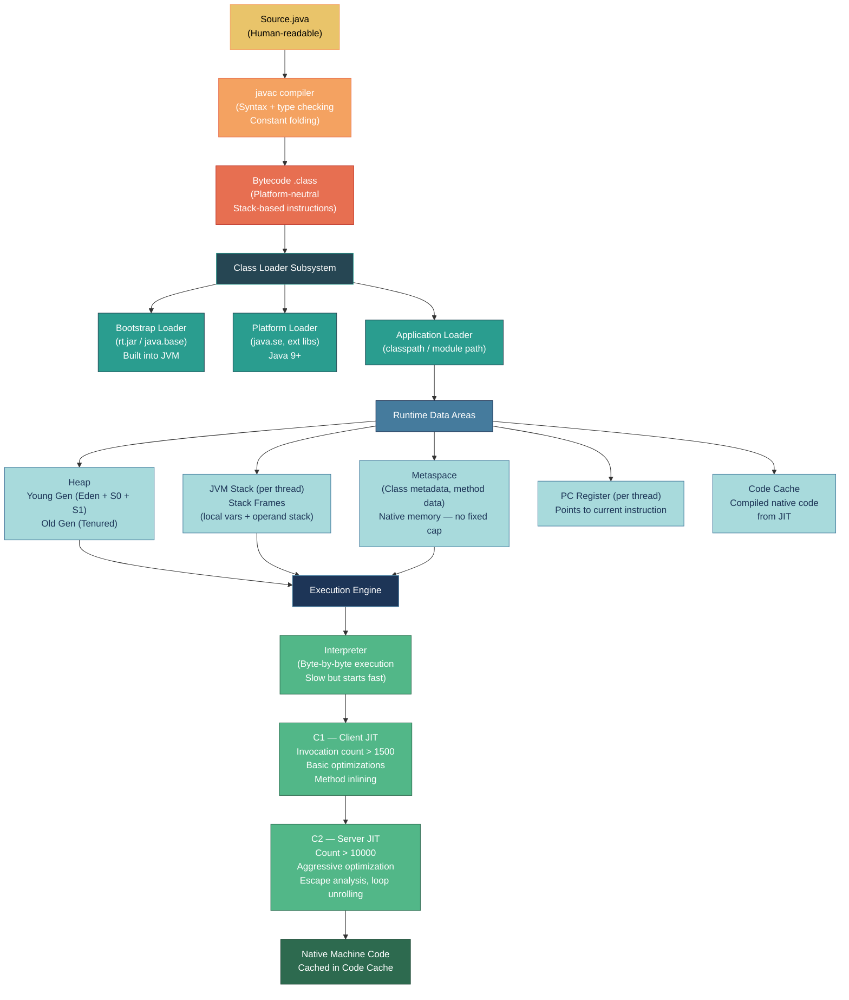

# ☕ JVM Execution Model

> [!abstract] TL;DR
> The JVM compiles Java source to **platform-independent bytecode** via `javac`. The **class loader subsystem** loads, links, and initializes `.class` files using a three-tier parent-delegation hierarchy (Bootstrap → Platform → Application). The **execution engine** runs code first through an interpreter, then promotes hot methods through **tiered JIT compilation** (C1 client compiler → C2 server compiler). **Runtime data areas** include the Heap (Young/Old generation), per-thread Stack (frames), Metaspace (class metadata), PC registers, and Code Cache.

---

## Intuition

Think of the JVM as a **universal translator** for software. When a UN speech is delivered, the speaker (developer) writes in their native language (Java). A transcription service (`javac`) converts it to a universal script (bytecode). Now any interpreter in the room (Windows JVM, Linux JVM, macOS JVM) can translate it to their audience's language at runtime.

The "hot phrases" the interpreter hears repeatedly — JIT compilation — it memorizes and delivers faster without re-translating, the same way a live interpreter eventually stops looking up common phrases.

---

## How It Works

### Execution Pipeline



### Runtime Data Areas

| Area | What It Stores | Thread-Shared? | Notes |
|------|----------------|---------------|-------|
| **Heap — Young Gen** | Newly allocated objects (Eden + 2 Survivor spaces) | Yes | Minor GC clears Eden frequently |
| **Heap — Old Gen** | Long-lived objects promoted from Young | Yes | Major/Full GC is expensive |
| **JVM Stack** | Stack frames (local variables, operand stack, return address) | No (per-thread) | `StackOverflowError` on deep recursion |
| **Metaspace** | Class definitions, method bytecode, constant pool | Yes | Native memory; grows until OS limit or `-XX:MaxMetaspaceSize` |
| **PC Register** | Address of currently executing bytecode instruction | No (per-thread) | Undefined for native methods |
| **Code Cache** | JIT-compiled native code | Yes | Bounded; use `-XX:ReservedCodeCacheSize` |
| **Native Method Stack** | Native (C/C++) method execution | No (per-thread) | Used by JNI calls |

### Class Loading Demonstration

```java
public class ClassLoadingDemo {

    public static void main(String[] args) throws ClassNotFoundException {
        // 1. Get the class loader hierarchy
        ClassLoader appLoader = ClassLoadingDemo.class.getClassLoader();
        ClassLoader platformLoader = appLoader.getParent();
        ClassLoader bootstrapLoader = platformLoader.getParent(); // null — native

        System.out.println("App loader:      " + appLoader);
        // → sun.misc.Launcher$AppClassLoader@...
        System.out.println("Platform loader: " + platformLoader);
        // → jdk.internal.loader.ClassLoaders$PlatformClassLoader@...
        System.out.println("Bootstrap:       " + bootstrapLoader);
        // → null  (it's implemented natively in C++)

        // 2. Class.forName triggers loading + initialization
        Class<?> cls = Class.forName("com.example.MyService");
        System.out.println("Loaded: " + cls.getName());

        // 3. Custom class loader skeleton
        ClassLoader custom = new ClassLoader(appLoader) {
            @Override
            protected Class<?> findClass(String name) throws ClassNotFoundException {
                // Load bytes from custom source (DB, network, encrypted jar, etc.)
                byte[] classBytes = loadBytesFromCustomSource(name);
                return defineClass(name, classBytes, 0, classBytes.length);
            }

            private byte[] loadBytesFromCustomSource(String name) {
                // Implementation: read from file, decrypt, download, etc.
                throw new UnsupportedOperationException("Implement me");
            }
        };
    }
}
```

---

## Key Concepts

### 1. Bytecode Compilation (`javac` Phases)

`javac` transforms source through several phases:

1. **Parse** — tokenize and build AST
2. **Symbol resolution** — resolve type names and imports
3. **Type checking** — enforce the static type system
4. **Constant folding** — `3 * 4` becomes `12` at compile time
5. **Code generation** — emit stack-based bytecode into `.class` files

The `.class` file structure contains: magic number (`0xCAFEBABE`), version, **constant pool** (string/type/method refs), access flags, field and method descriptors, and attribute tables (including the `Code` attribute containing bytecode).

```java
// javap -c MyClass  — disassemble bytecode
// int add(int a, int b) { return a + b; }  →
//   0: iload_1      // push a
//   1: iload_2      // push b
//   2: iadd         // pop two, push sum
//   3: ireturn      // return top of stack
```

### 2. Class Loading — Parent Delegation Model

```
           ClassLoader.loadClass(name)
                    │
            Ask parent first
                    │
          ┌─────────▼──────────┐
          │   Bootstrap Loader  │  ← loads java.lang.*, java.util.*, etc.
          │   (native C++)      │
          └─────────┬──────────┘
                    │ not found
          ┌─────────▼──────────┐
          │  Platform Loader   │  ← loads java.xml.*, jdk.*, javax.*
          └─────────┬──────────┘
                    │ not found
          ┌─────────▼──────────┐
          │  Application Loader│  ← loads classpath / module path
          └─────────┬──────────┘
                    │ not found → ClassNotFoundException
```

**Why parent delegation?** Security and consistency — `java.lang.String` can only be loaded by Bootstrap, preventing a rogue class from hijacking core APIs.

Each loaded class goes through three sub-phases:
- **Loading**: find and read the `.class` bytes
- **Linking**: verify bytecode legality → prepare static fields → (optionally) resolve symbolic refs
- **Initialization**: run `<clinit>` static initializer blocks in class declaration order

### 3. Interpreter + Tiered JIT Compilation

The JVM balances startup speed against peak throughput using five tiers:

| Tier | Engine | Condition | Notes |
|------|--------|-----------|-------|
| 0 | Interpreter | Always starts here | Collects profiling data (call counts, branch frequencies) |
| 1 | C1 (no profiling) | Simple methods | Fast compile, no profile instrumentation |
| 2 | C1 (limited profiling) | Medium methods | Light counters |
| 3 | C1 (full profiling) | Hot methods | Full profiling; feeds C2 |
| 4 | C2 (server JIT) | Very hot methods (`-XX:CompileThreshold=10000`) | Aggressive: escape analysis, loop unrolling, dead code elim, speculative optimizations |

```java
// Force JIT to compile a specific method (for benchmarking)
// -XX:+PrintCompilation   prints each JIT compilation event
// -XX:+UnlockDiagnosticVMOptions -XX:+PrintInlining  shows inlining decisions

public class JitDemo {
    // This loop will be JIT-compiled after ~10,000 iterations
    public static long sumRange(int n) {
        long sum = 0;
        for (int i = 0; i < n; i++) {
            sum += i;            // C2 will optimize this to sum = n*(n-1)/2
        }
        return sum;
    }

    public static void main(String[] args) {
        // Warm up the JIT
        for (int i = 0; i < 20_000; i++) {
            sumRange(1000);
        }
        // Now sumRange is running as compiled native code
        long result = sumRange(1_000_000);
        System.out.println(result);
    }
}
```

### 4. Runtime Data Areas — Detail

**Young Generation (Eden + S0 + S1)**
- All new objects are allocated in Eden
- Minor GC copies live objects to a Survivor space (alternating S0/S1)
- Objects surviving `MaxTenuringThreshold` (default 15) promotions move to Old Gen

**Stack Frame**
Each method invocation creates a frame containing:
- **Local variable array** — method parameters + local vars (index 0 = `this` for instance methods)
- **Operand stack** — values being computed (JVM is a stack machine, not register machine)
- **Frame data** — constant pool reference, return address

**Metaspace vs PermGen**
Before Java 8, class metadata lived in PermGen (heap-adjacent, fixed size) — a common source of `java.lang.OutOfMemoryError: PermGen space`. Java 8 replaced it with **Metaspace** backed by native memory, which grows on demand (constrained by `-XX:MaxMetaspaceSize`).

---

## Real-World JVM Flags

```bash
# Heap sizing
java -Xms512m -Xmx4g -jar app.jar

# Metaspace cap (prevent unbounded class loader leaks)
java -XX:MaxMetaspaceSize=256m -jar app.jar

# GC logging (Java 17+)
java -Xlog:gc*:file=gc.log:time,uptime,level,tags -jar app.jar

# Print JIT compilation events
java -XX:+PrintCompilation -jar app.jar

# Disable tiered compilation (interpreter only — useful for debugging)
java -Xint -jar app.jar

# Code Cache size (important for large Spring Boot apps)
java -XX:ReservedCodeCacheSize=512m -jar app.jar

# Enable escape analysis (default on; shown for clarity)
java -XX:+DoEscapeAnalysis -jar app.jar
```

---

## Common Pitfalls

| Pitfall | Explanation | Fix |
|---------|-------------|-----|
| **`ClassNotFoundException` vs `NoClassDefFoundError`** | `CNFE` = class not on classpath at load time (recoverable exception). `NCDFE` = class was on classpath during compile but missing at runtime (error, usually build issue). | Verify runtime classpath; check fat-jar assembly |
| **Metaspace `OutOfMemoryError`** | Class loaders not being GC'd (common in OSGi, hot-reload scenarios); classes accumulate. | Set `-XX:MaxMetaspaceSize`; profile with heap dump; fix loader leaks |
| **Cold JIT on first requests** | First requests are slow because JIT hasn't compiled hot paths yet; problematic in latency-sensitive services. | Warm up endpoints before shifting traffic; consider AOT with GraalVM |
| **Code Cache too small** | JVM stops compiling new methods (`CodeCache is full`) and falls back to interpreter, causing sudden performance cliff. | Increase `-XX:ReservedCodeCacheSize`; monitor with `jstat` or Micrometer |

---

## Related Notes

- [[_MOC_Java_Fundamentals|↑ Section MOC — Java Fundamentals]]
- [[JVM_Memory_Areas]] — deep dive into GC algorithms and heap tuning
- [[Garbage_Collection_Algorithms]] — G1, ZGC, Shenandoah comparisons
- [[Java_Types_and_Variables]] — how the type system maps to runtime data areas
- [[_MOC_JVM_Memory]] — Section 08: full JVM memory and performance section

---

## Review Questions

1. A Spring Boot microservice restarts cleanly but a dependency class that was available at compile time fails to load at runtime with `NoClassDefFoundError`. What is the most likely cause and how do you diagnose it?

2. Explain what happens — step by step in the JVM — when you call `new ArrayList<>()` for the very first time in a program. Include class loading, linking, initialization, and object allocation.

3. Your application's throughput drops sharply after several hours under load. JVM logs show `CodeCache is full. Compiler has been disabled`. What flags do you change and what long-term architectural options exist?

---

#Java #Fundamentals #JVM #ClassLoading #JIT #ByteCode #Intermediate
