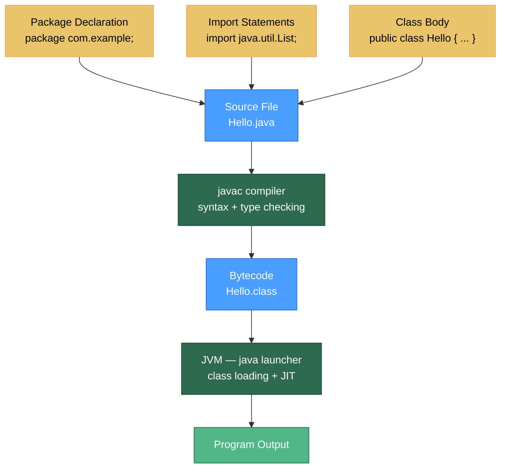

# 📝 Java Syntax Basics

> [!abstract] TL;DR
> A Java program lives in a `.java` file whose public class name must match the filename. Code is organized into **packages** (dot-separated namespaces mirrored as directory trees) and pulled in via `import`. **Access modifiers** (`public`, `protected`, package-private, `private`) control visibility across class and package boundaries. `static` members belong to the class itself; instance members belong to each object. The `main(String[] args)` method is the JVM entry point, and `javac` compiles source to bytecode while `java` (the launcher) runs it.

---

## Intuition

Think of a Java project like a large office building:

- **Packages** are the floors and departments — they namespace everything and prevent departments with the same employee names from clashing.
- **Access modifiers** are the keycards — `public` is a lobby badge that opens every door; `private` is a keycard that only opens your own desk drawer.
- **Classes** are offices; **static** members are on the whiteboard in the hallway (shared by everyone); **instance** members are on each person's desk (unique per object).
- **`javac`** is the architect who checks the blueprints and produces machine-readable construction plans (`.class` files). **`java`** is the construction crew that actually executes those plans.

---

## How It Works



---

## Key Concepts

### 1. Java Program Structure

Every `.java` file follows this skeleton (order matters):

```java
// 1. Package declaration — MUST be first non-comment line
package com.example.myapp;

// 2. Import statements — after package, before class
import java.util.List;
import java.util.ArrayList;
import static java.lang.Math.PI;       // static import: use PI directly
import java.util.*;                    // wildcard import (avoid in production)

// 3. Class declaration — public class name must match filename: MyApp.java
public class MyApp {

    // 4. Static (class-level) field
    private static final String APP_NAME = "MyApp";

    // 5. Instance field
    private int instanceCounter;

    // 6. Static block — runs once when class is loaded
    static {
        System.out.println("Class loaded: " + APP_NAME);
    }

    // 7. Constructor
    public MyApp(int start) {
        this.instanceCounter = start;
    }

    // 8. Instance method
    public void incrementAndPrint() {
        instanceCounter++;
        System.out.println("Counter: " + instanceCounter);
    }

    // 9. Static method — entry point
    public static void main(String[] args) {
        MyApp app = new MyApp(0);
        app.incrementAndPrint();                   // Counter: 1
        System.out.println("PI = " + PI);          // static import
    }
}
```

### 2. Packages and the Directory Structure

Packages map directly to directory structure. `com.example.myapp` lives at `com/example/myapp/MyApp.java`.

```java
// File: src/com/example/domain/User.java
package com.example.domain;

public class User {
    private String name;
    // ...
}

// File: src/com/example/service/UserService.java
package com.example.service;

import com.example.domain.User;       // fully qualified import
// OR: import com.example.domain.*;   // wildcard — avoid in large codebases

public class UserService {
    public User findUser(String name) {
        return new User();             // User is resolved via import
    }
}
```

**Compilation and packaging:**
```bash
# Compile all files preserving package structure
javac -d out src/com/example/**/*.java

# Run: class name is fully qualified
java -cp out com.example.service.UserService

# Package into JAR
jar cf app.jar -C out .
java -cp app.jar com.example.service.UserService
```

### 3. Access Modifiers

| Modifier | Same Class | Same Package | Subclass (any pkg) | Everywhere |
|---|---|---|---|---|
| `public` | ✅ | ✅ | ✅ | ✅ |
| `protected` | ✅ | ✅ | ✅ | ❌ |
| *(package-private, no keyword)* | ✅ | ✅ | ❌ | ❌ |
| `private` | ✅ | ❌ | ❌ | ❌ |

```java
package com.example;

public class Account {
    public    String ownerId;        // anyone can read/write (bad for fields)
    protected double balance;        // subclasses + same package
    double    limit;                 // package-private: only com.example classes
    private   String secretPin;      // only Account itself

    // Best practice: make fields private, expose via methods
    private double interestRate;

    public double getInterestRate() {          // controlled read
        return interestRate;
    }
    protected void setInterestRate(double r) { // only subclasses can update
        if (r < 0) throw new IllegalArgumentException("Rate must be >= 0");
        this.interestRate = r;
    }
}
```

**Access modifiers on classes:**
- Top-level classes can only be `public` or package-private (no keyword).
- Nested classes can use all four modifiers.

### 4. Static vs Instance Members

```java
public class Counter {
    // Static: one copy per class, shared by all instances
    private static int totalCreated = 0;

    // Instance: one copy per object
    private int id;
    private String name;

    public Counter(String name) {
        this.name = name;
        totalCreated++;            // increments the single shared counter
        this.id = totalCreated;    // assigns unique ID to this instance
    }

    // Static method: no 'this', cannot access instance fields
    public static int getTotalCreated() {
        return totalCreated;
        // return name; // COMPILE ERROR: cannot reference instance field
    }

    // Instance method: has 'this', can access both static and instance members
    public String describe() {
        return "Counter #" + id + " ('" + name + "'), total=" + totalCreated;
    }
}

// Usage:
Counter a = new Counter("A");
Counter b = new Counter("B");
System.out.println(Counter.getTotalCreated()); // 2 — called on class, not instance
System.out.println(a.describe());              // Counter #1 ('A'), total=2
System.out.println(b.describe());              // Counter #2 ('B'), total=2
```

**Static context rules:**
- `static` method → cannot call non-static methods or access non-static fields directly (no implicit `this`).
- Instance method → can freely call both static and instance members.
- `static` fields are initialized in declaration order; `static {}` blocks run at class loading time.

### 5. The `main` Method — JVM Entry Point

```java
public class App {
    // Canonical signature — all four modifiers matter:
    // public  → JVM can call it from outside the class
    // static  → JVM calls without instantiating App
    // void    → JVM ignores any return value
    // String[] args → command-line arguments (never null, may be empty)
    public static void main(String[] args) {
        if (args.length == 0) {
            System.out.println("No arguments provided.");
        } else {
            for (String arg : args) {
                System.out.println("Arg: " + arg);
            }
        }
    }
}

// Java 21+ instance main (preview): simplified for teaching, no 'static' needed
// void main() { System.out.println("Hello!"); }
```

**Running with arguments:**
```bash
java App hello world "foo bar"
# args[0] = "hello", args[1] = "world", args[2] = "foo bar"
```

### 6. Compilation Cycle: `javac` → `.class` → `java`

```
Source (.java)
     │
     ▼ javac (compiler)
  Bytecode (.class)  ← platform-independent
     │
     ▼ java / JVM (launcher)
  Class Loader → Verifier → JIT Compiler → Native Execution
```

**Common `javac` flags:**
```bash
javac -source 17 -target 17 MyApp.java   # target Java version
javac -cp lib/gson.jar -d out src/*.java  # classpath + output dir
javac -Xlint:all MyApp.java               # enable all lint warnings
```

**Common `java` flags:**
```bash
java -cp out:lib/gson.jar com.example.Main   # classpath
java -jar app.jar                             # executable JAR (Main-Class in manifest)
java -Xmx512m -Xms128m com.example.Main      # heap sizing
java --enable-preview --source 21 Main.java  # enable preview features
```

---

## Real-World Notes

- **Build tools replace manual `javac`**: In production, Maven or Gradle handle compilation, classpath management, and packaging. You rarely invoke `javac` directly.
- **Module system (Java 9+)**: `module-info.java` adds a layer above packages. `requires` and `exports` explicitly declare inter-module dependencies, making classpath scanning unnecessary.
- **Spring component scanning**: Spring relies on package structure — `@SpringBootApplication` auto-scans the package it's in and all sub-packages. Putting components in sibling packages outside that root silently breaks discovery.
- **Static imports for test readability**: `import static org.assertj.core.api.Assertions.*;` lets you write `assertThat(...)` instead of `Assertions.assertThat(...)` in tests.

---

## Common Pitfalls

| Pitfall | Symptom | Fix |
|---|---|---|
| Public class name ≠ filename | `MyClass.java` with `public class MyApp` | `error: class MyApp is public, should be in file MyApp.java` — rename to match |
| Missing package declaration | Class in wrong package at runtime | Add `package com.example;` as first statement |
| Calling instance method from `static main` | `error: non-static method foo() cannot be referenced from static context` | Create an instance first: `new App().foo()` |
| Wildcard import hiding a class | `import java.util.*; import java.awt.*;` — both have `List` | Fully qualify: `java.util.List` where ambiguous |
| `static` field mutation from multiple threads | Race condition, corrupted state | Use `AtomicInteger` or synchronize access |

---

## Related Notes

- [[_MOC_Java_Fundamentals|↑ Section MOC — Java Fundamentals]]
- [[Java_Types_and_Variables]] — the type system behind variable declarations
- [[Operators_and_Control_Flow]] — expressions and control structures within method bodies
- [[JVM_Execution_Model]] — what the JVM does with the `.class` bytecode at runtime

---

## Review Questions

1. A colleague's project compiles fine on their machine but throws `NoClassDefFoundError` when you run it. The class exists in the JAR. What are the most likely causes and how do you diagnose them?

2. Why can't a top-level class be declared `protected` or `private` in Java? What alternative exists if you want restricted visibility?

3. Explain the difference between a `static` initializer block and a constructor. When does each run, and what happens if you have both?

---

#Java #Fundamentals #Syntax #Packages #AccessModifiers #Compilation #Beginner
