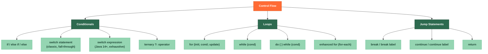

# 🔀 Operators and Control Flow

> [!abstract] TL;DR
> Java operators cover arithmetic (`+`, `-`, `*`, `/`, `%`), bitwise (`&`, `|`, `^`, `~`, `<<`, `>>`), logical (`&&`, `||`, `!`), comparison, and assignment. **Operator precedence** follows mathematical conventions with bitwise lowest — always parenthesize to be explicit. Control flow includes `if/else`, classic `switch` statements, `for`/`while`/`do-while`/enhanced-for loops, and `break`/`continue` (with optional labels). **Java 14+** introduced switch expressions that return a value and require exhaustiveness, eliminating fall-through bugs and making switch a powerful expression rather than a statement.

---

## Intuition

Think of operators as the verbs of Java and control flow as the decision-making GPS:

- **Operators** are actions your program takes on data — calculating, comparing, combining bits.
- **`if/else`** is a fork in the road — you take exactly one path.
- **`switch`** is a roundabout with multiple exits — classic switch has dangerous fall-through (no curb), switch expressions have concrete dividers between exits.
- **Loops** are the repeat button on a playlist — `for` when you know how many times, `while` when you don't, `do-while` when you need at least one play.

---

## How It Works



---

## Key Concepts

### 1. Arithmetic and Assignment Operators

```java
int a = 10, b = 3;

// Arithmetic
int sum   = a + b;   // 13
int diff  = a - b;   // 7
int prod  = a * b;   // 30
int quot  = a / b;   // 3  — integer division truncates!
int rem   = a % b;   // 1  — modulus (sign follows dividend in Java)

// Integer division pitfall
double ratio = a / b;          // 3.0 — already truncated!
double ratio2 = (double) a / b; // 3.333... — cast BEFORE division

// Compound assignment
a += 5;   // a = 15
a -= 2;   // a = 13
a *= 2;   // a = 26
a /= 4;   // a = 6
a %= 4;   // a = 2

// Pre vs post increment
int x = 5;
int y = x++;  // y = 5, x = 6 — postfix: use then increment
int z = ++x;  // z = 7, x = 7 — prefix: increment then use
```

### 2. Bitwise Operators

```java
int m = 0b1010;  // 10 in binary
int n = 0b1100;  // 12 in binary

int and  = m & n;   // 0b1000 = 8   — both bits must be 1
int or   = m | n;   // 0b1110 = 14  — at least one bit must be 1
int xor  = m ^ n;   // 0b0110 = 6   — bits must differ
int not  = ~m;      // inverts all bits (two's complement: -(m+1) = -11)

int shl  = m << 2;  // 0b101000 = 40  — left shift = multiply by 2^n
int shr  = m >> 1;  // 0b0101  = 5   — signed right shift = divide by 2^n
int ushr = -1 >>> 1; // logical shift: fills with 0s (useful for unsigned)

// Common bitwise tricks
boolean isEven    = (x & 1) == 0;      // check last bit
int     cleared   = x & ~(1 << 3);     // clear bit 3
int     set       = x | (1 << 3);      // set bit 3
int     toggled   = x ^ (1 << 3);      // toggle bit 3
int     swapNoVar = a ^ b; b ^= a; a ^= b; // XOR swap (no temp variable)
```

### 3. Logical Operators and Short-Circuit Evaluation

```java
boolean t = true, f = false;

// Short-circuit: right side not evaluated if result already determined
boolean r1 = t || expensiveCall();  // expensiveCall() NOT called (true || anything = true)
boolean r2 = f && expensiveCall();  // expensiveCall() NOT called (false && anything = false)

// Non-short-circuit (both sides always evaluated — rare need)
boolean r3 = t | f;   // always evaluates both
boolean r4 = t & f;   // always evaluates both

// Null-safe guard pattern (short-circuit saves you from NPE)
String s = null;
if (s != null && s.length() > 0) {  // s.length() safe because of short-circuit
    System.out.println(s.toUpperCase());
}
```

### 4. Operator Precedence (High to Low)

| Precedence | Operators |
|---|---|
| 1 (highest) | `()`, `[]`, `.`, `++` / `--` (postfix) |
| 2 | `++` / `--` (prefix), `~`, `!`, unary `+`/`-`, `(cast)` |
| 3 | `*`, `/`, `%` |
| 4 | `+`, `-` (binary) |
| 5 | `<<`, `>>`, `>>>` |
| 6 | `<`, `>`, `<=`, `>=`, `instanceof` |
| 7 | `==`, `!=` |
| 8 | `&` (bitwise AND) |
| 9 | `^` (bitwise XOR) |
| 10 | `\|` (bitwise OR) |
| 11 | `&&` (logical AND) |
| 12 | `\|\|` (logical OR) |
| 13 | `?:` (ternary) |
| 14 (lowest) | `=`, `+=`, `-=`, etc. |

**Rule of thumb**: When in doubt, add parentheses. `(a + b) * c` is always clearer than relying on precedence.

### 5. Conditional Statements

```java
// ── if / else if / else ──────────────────────────────────────────────────────
int score = 85;
String grade;
if (score >= 90) {
    grade = "A";
} else if (score >= 80) {
    grade = "B";
} else if (score >= 70) {
    grade = "C";
} else {
    grade = "F";
}

// ── Ternary operator ─────────────────────────────────────────────────────────
String label = score >= 60 ? "Pass" : "Fail";  // concise for simple cases
// Avoid nested ternary — kills readability
// String nested = a ? b ? "AB" : "A" : "None";  // ❌ confusing

// ── Classic switch statement (pre-Java 14) ───────────────────────────────────
int day = 3;
String dayName;
switch (day) {
    case 1:
        dayName = "Monday";
        break;            // ← CRITICAL: omitting break causes fall-through!
    case 2:
        dayName = "Tuesday";
        break;
    case 3:
    case 4:               // intentional fall-through: groups 3 and 4
        dayName = "Mid-week";
        break;
    default:
        dayName = "Other";
}
// Switch supports: byte, short, int, char, String, enum (NOT long, float, double)
```

### 6. Switch Expressions (Java 14+)

```java
// ── Arrow switch expression — no fall-through, returns a value ───────────────
int day = 3;
String dayName = switch (day) {
    case 1 -> "Monday";
    case 2 -> "Tuesday";
    case 3, 4 -> "Mid-week";       // multiple labels per case
    case 5 -> "Friday";
    default -> "Weekend";
};  // semicolon required: this is an expression, not a statement

// ── yield keyword — for multi-line case blocks ───────────────────────────────
String result = switch (day) {
    case 1 -> "Monday";
    case 3 -> {
        String prefix = "Mid";
        yield prefix + "-week";    // yield, not return, produces the value
    }
    default -> "Other";
};

// ── Pattern switch (Java 21+) — exhaustive over sealed hierarchy ─────────────
sealed interface Shape permits Circle, Rectangle {}
record Circle(double radius) implements Shape {}
record Rectangle(double w, double h) implements Shape {}

static double area(Shape shape) {
    return switch (shape) {
        case Circle c          -> Math.PI * c.radius() * c.radius();
        case Rectangle r       -> r.w() * r.h();
        // No default needed — sealed hierarchy is exhaustive
    };
}

// ── Guarded patterns ─────────────────────────────────────────────────────────
static String classify(Object obj) {
    return switch (obj) {
        case Integer i when i < 0  -> "negative int";
        case Integer i             -> "non-negative int";
        case String s when s.isEmpty() -> "empty string";
        case String s              -> "string: " + s;
        case null                  -> "null value";
        default                    -> "other: " + obj;
    };
}
```

### 7. Loops

```java
// ── Classic for loop ─────────────────────────────────────────────────────────
for (int i = 0; i < 10; i++) {
    System.out.print(i + " ");  // 0 1 2 3 4 5 6 7 8 9
}

// Multiple variables in for loop
for (int i = 0, j = 10; i < j; i++, j--) {
    System.out.print(i + "-" + j + " ");  // 0-10 1-9 2-8 3-7 4-6
}

// ── Enhanced for (for-each) ──────────────────────────────────────────────────
int[] numbers = {1, 2, 3, 4, 5};
for (int n : numbers) {
    System.out.print(n + " ");  // 1 2 3 4 5
}
// Works on arrays, Iterable<T> (List, Set, etc.) — NOT index-based

// ── while loop ───────────────────────────────────────────────────────────────
int count = 0;
while (count < 5) {
    System.out.print(count + " ");
    count++;
}
// Condition checked BEFORE each iteration; body may run 0 times

// ── do-while loop ────────────────────────────────────────────────────────────
int input;
do {
    input = readUserInput();   // body executes at least once
} while (input < 0);          // condition checked AFTER
```

### 8. Break, Continue, and Labels

```java
// ── break — exits the innermost loop/switch ───────────────────────────────────
for (int i = 0; i < 10; i++) {
    if (i == 5) break;         // stops at 5
    System.out.print(i + " "); // 0 1 2 3 4
}

// ── continue — skips rest of current iteration ────────────────────────────────
for (int i = 0; i < 10; i++) {
    if (i % 2 == 0) continue;  // skip even numbers
    System.out.print(i + " "); // 1 3 5 7 9
}

// ── Labeled break/continue — exits/continues outer loop ──────────────────────
outer:
for (int i = 0; i < 3; i++) {
    for (int j = 0; j < 3; j++) {
        if (i == 1 && j == 1) break outer;    // exits BOTH loops
        System.out.print("(" + i + "," + j + ") ");
    }
}
// Output: (0,0) (0,1) (0,2) (1,0)

// Labels are rare in modern code — prefer extracting to a method with return
```

---

## Real-World Notes

- **Switch expressions in Spring controllers**: Pattern switch on an enum or sealed type lets you return different response types cleanly without `if/else` chains, and the compiler enforces exhaustiveness so new enum values don't silently fall to `default`.
- **Bitwise flags in JVM/frameworks**: `java.nio.StandardOpenOption` values are often combined with `|` for file-open flags. Many low-level APIs (JDBC, NIO) use int bitmasks.
- **Short-circuit in bean validation**: Chain validations with `&&` so expensive checks (database lookup) only run after cheap ones (null check, length check) pass.
- **Loop label for matrix traversal**: Searching a 2D matrix for a target and breaking both loops on find is a legitimate label use case — cleaner than a boolean `found` flag.

---

## Common Pitfalls

| Pitfall | Example | Consequence | Fix |
|---|---|---|---|
| Integer division | `double r = 5 / 2` | Result is `2.0`, not `2.5` | Cast: `(double) 5 / 2` |
| Missing `break` in switch | Omit `break;` in case | Falls through to next case | Use switch expressions (arrow syntax) or always add `break` |
| `==` for String equality | `if (s == "hello")` | May fail for non-interned strings | Use `"hello".equals(s)` |
| Precedence surprise | `x & 0xFF == 0` | Parsed as `x & (0xFF == 0)` → `x & false` → always 0 | Add parens: `(x & 0xFF) == 0` |
| Infinite loop from missing update | `while (x < 10) { doWork(); }` | Never increments `x` | Ensure loop variable is updated in body or for-loop update clause |

---

## Related Notes

- [[_MOC_Java_Fundamentals|↑ Section MOC — Java Fundamentals]]
- [[Java_Types_and_Variables]] — the types that operators act upon
- [[Java_Syntax_Basics]] — overall program structure these constructs live inside
- [[Pattern_Matching]] — Java 21 switch pattern matching extends switch expressions further

---

## Review Questions

1. What is the output of `int x = 5; System.out.println(x++ + ++x);`? Explain step by step using operator evaluation rules.

2. A developer writes `switch (status) { case "ACTIVE": doA(); case "INACTIVE": doB(); }`. When `status` is `"ACTIVE"`, which methods get called? Why? How would you fix this with a switch expression?

3. Why does `double result = 7 / 2;` produce `3.0` instead of `3.5`, and what is the minimal change to get `3.5`?

---

#Java #Fundamentals #Operators #ControlFlow #Switch #Loops #Beginner
