# ☕ Java Fundamentals — Section MOC

> **Section 01 of 50** | Part I: Core Java
> Covers the bedrock of Java: how code executes, how types work, and how Java determines identity vs. logical equality.

---

## Concept Map

```mermaid
graph TD
    JF["Java Fundamentals"]:::root

    JF --> JVM["JVM Execution Model"]:::concept
    JF --> TYPES["Types & Variables"]:::concept
    JF --> EQ["Identity & Equality"]:::concept

    JVM --> CL["Class Loading\nBootstrap → Platform → App"]:::detail
    JVM --> BC["Bytecode & JIT\nC1 (client) → C2 (server)"]:::detail
    JVM --> RDA["Runtime Data Areas\nHeap / Stack / Metaspace / PC"]:::detail

    TYPES --> PRIM["Primitives\nbyte short int long\nfloat double char boolean"]:::detail
    TYPES --> REF["Reference Types\nClasses · Interfaces · Arrays"]:::detail
    TYPES --> AB["Autoboxing\nInteger cache –128..127\nNPE on unbox null"]:::detail
    TYPES --> VAR["var (Java 10)\nLocal type inference"]:::detail

    EQ --> ID["== Identity\nSame memory address"]:::detail
    EQ --> EQL["equals()\nLogical equivalence\nContractual override"]:::detail
    EQ --> HC["hashCode()\nBucket assignment\nMust be consistent with equals"]:::detail
    EQ --> COMP["Comparable / Comparator\nNatural vs external ordering"]:::detail

    classDef root fill:#FF6B35,stroke:#CC4400,color:#fff,font-weight:bold
    classDef concept fill:#2D6A4F,stroke:#1B4332,color:#fff
    classDef detail fill:#95D5B2,stroke:#52B788,color:#1B4332
```



---

## Learning Path

```
[Start here]
    │
    ▼
[[JVM_Execution_Model]]          ← How Java code actually runs (classloader, JIT, memory areas)
    │
    ▼
[[Java_Types_and_Variables]]     ← Primitives, references, autoboxing, var, widening/narrowing
    │
    ▼
[[Identity_and_Equality]]        ← ==, equals, hashCode, Comparable, Comparator
    │
    ▼
[Continue to Section 02 → [[_MOC_Java_OOP]]]
```

---

## Notes in This Section

| Note | Core Topic | Difficulty | Status |
|------|------------|-----------|--------|
| [[JVM_Execution_Model]] | Class loading, JIT tiers, runtime data areas | Intermediate | Complete |
| [[Java_Types_and_Variables]] | Primitives, references, autoboxing, var | Beginner | Complete |
| [[Identity_and_Equality]] | ==, equals, hashCode, Comparable, Comparator | Beginner | Complete |

---

## Key Questions This Section Answers

1. **How does the JVM achieve platform independence?**
   Write Once, Run Anywhere — the compiler produces bytecode; the JVM on each platform interprets or JIT-compiles it natively. See [[JVM_Execution_Model]].

2. **When does autoboxing fail silently?**
   When you unbox a `null` `Integer` (NPE), compare two `Integer` objects with `==` outside the –128..127 cache range (wrong result), or autobox inside a tight loop (GC pressure). See [[Java_Types_and_Variables]].

3. **What breaks the equals/hashCode contract?**
   Overriding `equals()` without `hashCode()`, using mutable fields in `hashCode()`, or violating symmetry/transitivity. Broken contracts corrupt `HashMap` and `HashSet`. See [[Identity_and_Equality]].

4. **What is the parent delegation model in class loading?**
   A class loader always delegates to its parent before attempting to load a class itself, preventing duplicate/rogue class definitions. See [[JVM_Execution_Model]].

5. **How does `var` differ from dynamic typing?**
   `var` is purely a compile-time convenience — the type is inferred once and fixed; it cannot change at runtime unlike Python/JavaScript dynamic typing. See [[Java_Types_and_Variables]].

---

## Key Java Snippets at a Glance

```java
// Platform independence — compile once
javac Hello.java          // → Hello.class (bytecode)
java Hello                // JVM interprets/JIT-compiles on each platform

// Autoboxing trap
Integer a = 200, b = 200;
System.out.println(a == b);     // false  (outside cache range)
System.out.println(a.equals(b)); // true

// equals/hashCode contract
@Override public boolean equals(Object o) { ... }
@Override public int hashCode() { ... }  // MUST override both together

// Comparator chaining
list.sort(Comparator.comparing(Person::lastName)
                    .thenComparing(Person::firstName));
```

---

## Pre-Requisites & What Comes Next

| Direction | Link | Why |
|-----------|------|-----|
| Up | [[_MOC_Java_Master]] | Full vault index |
| Next section | [[_MOC_Java_OOP]] | Builds on types and JVM to explore class design |
| Related | [[_MOC_JVM_Memory]] | Deep-dive on heap, GC, Metaspace |
| Cross-vault | [[_MOC_DSA_Master]] | Data structures built on Java's type system |

---

## Section Summary

Java Fundamentals establishes three pillars every Java developer must internalize:

- **Execution model** — code travels as bytecode through a class loader hierarchy and is optimized by tiered JIT compilation before running on the physical CPU
- **Type system** — a dual world of eight primitives (stack-friendly, value semantics) and reference types (heap-allocated, identity semantics), bridged by autoboxing with several subtle pitfalls
- **Equality semantics** — `==` is raw pointer comparison; `equals()` is a contractual agreement between two objects; `hashCode()` is `equals()`'s inseparable sibling; and `Comparable`/`Comparator` give ordering

Mastering these three topics prevents the class of bugs — wrong equality checks, mysterious `null` pointer exceptions during unboxing, and `ClassNotFoundException` confusion — that trip up even experienced developers.

---

*Parent: [[_MOC_Java_Master]] | Section: 01 / 50 | Created: 2026-07-26*

#Java #Fundamentals #MOC
