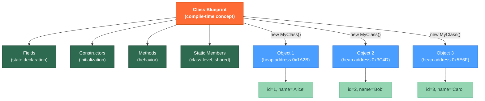

# 🏛️ Classes and Objects

> [!abstract] TL;DR
> A **class** is a blueprint defining fields (state) and methods (behavior); an **object** is a live instance of that blueprint on the heap. Constructors initialize objects and can chain with `this(...)` for DRY construction logic. The `this` keyword refers to the current instance, disambiguates field shadowing, and enables constructor chaining. **Static** members belong to the class; **instance** members belong to each object. **Record classes** (Java 16+) auto-generate immutable value types with `equals`, `hashCode`, and `toString`, dramatically reducing boilerplate for data carriers.

---

## Intuition

A class is the **architectural blueprint** of a building — it says "this building has 3 bedrooms and a kitchen." An object is the **actual constructed building** at a specific address. Many buildings (objects) can be built from the same blueprint (class), each with different interior details (field values) but the same structural layout (methods).

`this` is like referring to "this very building I'm standing inside" versus the blueprint in the architect's office.

---

## How It Works



---

## Key Concepts

### 1. Class Anatomy

```java
public class BankAccount {

    // ── Static fields: one copy per class ────────────────────────────────────
    private static int nextId = 1;
    public  static final double INTEREST_RATE = 0.05;  // constant

    // ── Instance fields: one copy per object ─────────────────────────────────
    private final int    accountId;    // final: set once in constructor, never changed
    private final String owner;
    private double       balance;

    // ── Static initializer (runs once when class is loaded) ───────────────────
    static {
        System.out.println("BankAccount class loaded, nextId=" + nextId);
    }

    // ── Primary constructor ───────────────────────────────────────────────────
    public BankAccount(String owner, double initialBalance) {
        if (owner == null || owner.isBlank()) throw new IllegalArgumentException("Owner required");
        if (initialBalance < 0)              throw new IllegalArgumentException("Balance cannot be negative");
        this.accountId = nextId++;           // this.field to disambiguate from param
        this.owner     = owner;
        this.balance   = initialBalance;
    }

    // ── Overloaded constructor (chains to primary with this(...)) ─────────────
    public BankAccount(String owner) {
        this(owner, 0.0);   // constructor chaining: this(...) must be FIRST statement
    }

    // ── Instance methods ──────────────────────────────────────────────────────
    public void deposit(double amount) {
        if (amount <= 0) throw new IllegalArgumentException("Deposit must be positive");
        this.balance += amount;
    }

    public void withdraw(double amount) {
        if (amount > balance) throw new IllegalStateException("Insufficient funds");
        balance -= amount;     // 'this.' optional when no shadowing
    }

    public double applyInterest() {
        double interest = balance * INTEREST_RATE;  // static field: no instance needed
        balance += interest;
        return interest;
    }

    // ── Static factory method (alternative to constructor) ────────────────────
    public static BankAccount createSavings(String owner) {
        BankAccount acct = new BankAccount(owner, 0.0);
        // could set savings-specific behavior here
        return acct;
    }

    // ── Getters (no setters for immutable fields) ─────────────────────────────
    public int    getAccountId() { return accountId; }
    public String getOwner()     { return owner; }
    public double getBalance()   { return balance; }

    // ── toString for debugging ────────────────────────────────────────────────
    @Override
    public String toString() {
        return "BankAccount{id=" + accountId + ", owner='" + owner + "', balance=" + balance + "}";
    }
}
```

### 2. Object Creation and the Heap

```java
// 'new' allocates on heap, calls constructor, returns reference
BankAccount alice = new BankAccount("Alice", 1000.0);
BankAccount bob   = new BankAccount("Bob");           // uses overloaded ctor

alice.deposit(500.0);
System.out.println(alice.getBalance()); // 1500.0

// References can point to same object
BankAccount ref = alice;                // ref and alice → same object
ref.deposit(100.0);
System.out.println(alice.getBalance()); // 1600.0 — same object mutated!

// Static member: accessed via class name (not instance)
System.out.println(BankAccount.INTEREST_RATE);  // 0.05
// alice.INTEREST_RATE also compiles but is misleading — avoid
```

### 3. The `this` Keyword — Three Uses

```java
public class Point {
    private double x, y;

    // Use 1: Disambiguate field from parameter of same name
    public Point(double x, double y) {
        this.x = x;  // 'this.x' = field; 'x' alone = parameter
        this.y = y;
    }

    // Use 2: Constructor chaining with this(...)
    public Point() {
        this(0.0, 0.0);   // calls Point(double, double); must be first statement
    }

    // Use 3: Pass current instance as argument to another method
    public void register(PointRegistry registry) {
        registry.add(this);  // 'this' = the current Point object
    }

    // Use 4 (advanced): Return this for method chaining (builder-style)
    public Point translate(double dx, double dy) {
        this.x += dx;
        this.y += dy;
        return this;           // enables chaining: p.translate(1,2).translate(3,4)
    }
}
```

### 4. Static vs Instance — Rules and Pitfalls

```java
public class StaticDemo {
    private static int count = 0;   // shared across ALL instances
    private int id;                 // unique per instance

    public StaticDemo() {
        this.id = ++count;
    }

    // ❌ ILLEGAL: static method cannot reference instance field
    // public static void printId() { System.out.println(id); }  // compile error

    // ✅ LEGAL: instance method can reference both static and instance
    public void printInfo() {
        System.out.println("id=" + id + ", total=" + count);
    }

    // Static utility method (no 'this')
    public static int getCount() { return count; }

    // ❌ Common mistake: calling static via instance (compiles but misleading)
    public static void main(String[] args) {
        StaticDemo a = new StaticDemo();
        StaticDemo b = new StaticDemo();
        // a.getCount() compiles but suggests instance context — use StaticDemo.getCount()
        System.out.println(StaticDemo.getCount()); // 2
    }
}
```

### 5. Record Classes (Java 16+)

Records are immutable data carriers — the compiler auto-generates constructor, accessors, `equals`, `hashCode`, and `toString`.

```java
// Declare a record — fields are final (the "components")
public record Point(double x, double y) {

    // Compact constructor: validates or normalizes without repeating 'this.x = x'
    public Point {
        if (Double.isNaN(x) || Double.isNaN(y)) throw new IllegalArgumentException("NaN not allowed");
        // assignment 'this.x = x' happens automatically at end of compact ctor
    }

    // Custom method (records can have instance methods)
    public double distanceTo(Point other) {
        double dx = this.x - other.x;
        double dy = this.y - other.y;
        return Math.sqrt(dx * dx + dy * dy);
    }

    // Static factory
    public static Point origin() { return new Point(0, 0); }
}

// Usage:
Point p1 = new Point(3.0, 4.0);
Point p2 = new Point(0.0, 0.0);
System.out.println(p1.x());             // accessor (no 'get' prefix for records)
System.out.println(p1.distanceTo(p2));  // 5.0
System.out.println(p1);                 // Point[x=3.0, y=4.0]  — auto toString

Point p3 = new Point(3.0, 4.0);
System.out.println(p1.equals(p3));      // true — auto equals (structural)
System.out.println(p1 == p3);           // false — different objects

// Records cannot have non-final instance fields; cannot extend classes
// BUT they CAN implement interfaces
public record NamedPoint(String name, double x, double y) implements Printable {
    @Override public void print() { System.out.println(name + ": (" + x + ", " + y + ")"); }
}
```

### 6. Static Factory Methods vs Constructors

```java
public class Color {
    private final int r, g, b;

    private Color(int r, int g, int b) {   // private constructor
        this.r = r; this.g = g; this.b = b;
    }

    // Named factories communicate intent better than constructors
    public static Color ofRGB(int r, int g, int b) { return new Color(r, g, b); }
    public static Color ofHex(String hex) {
        int rgb = Integer.parseInt(hex.replaceAll("#", ""), 16);
        return new Color((rgb >> 16) & 0xFF, (rgb >> 8) & 0xFF, rgb & 0xFF);
    }
    public static Color red()   { return new Color(255, 0,   0); }
    public static Color green() { return new Color(0,   255, 0); }

    // Can return cached instances (unlike constructors which always create new objects)
    private static final Color WHITE = new Color(255, 255, 255);
    public static Color white() { return WHITE; }  // always same instance
}
```

---

## Real-World Notes

- **DTOs as Records**: Replace `@Data` Lombok-annotated classes with records for request/response DTOs in Spring — less boilerplate, guaranteed immutability, no accidental mutation.
- **Domain Models with Business Logic**: For entities with behavior (not just data), use full classes. Records are best for pure data carriers without state transitions.
- **Builder Pattern for Complex Objects**: When a class has many optional parameters, add an inner static `Builder` class rather than telescoping constructors. Lombok's `@Builder` generates this automatically.
- **Spring Beans are Singletons by Default**: Spring-managed beans with `@Component`/`@Service` are created once and shared (like static-access objects). Avoid mutable instance fields in beans unless you know the threading implications.

---

## Common Pitfalls

| Pitfall | Example | Consequence | Fix |
|---|---|---|---|
| `this()` not first statement | Constructor calling `this()` after other code | Compile error | Move `this(...)` to first line |
| Mutable fields in records | Records can't have non-final instance fields | Compile error | Use regular class if you need mutable state |
| Static field as instance state | `private static int balance` shared across all accounts | All accounts share one balance | Remove `static` |
| Missing null check in constructor | `this.name = name` when name could be null | NPE later in code | Validate in constructor: `Objects.requireNonNull(name)` |
| Comparing objects with `==` | `acct1 == acct2` | Compares references, not logical equality | Implement/use `equals()` |

---

## Related Notes

- [[_MOC_Java_OOP|↑ Section MOC — Java OOP]]
- [[Encapsulation_and_Abstraction]] — controlling field access and hiding implementation details
- [[Inheritance_and_Polymorphism]] — extending classes, overriding methods
- [[Java_Types_and_Variables]] — the types used in field and parameter declarations
- [[Records_and_Sealed_Classes]] — deeper dive into records and sealed hierarchies

---

## Review Questions

1. A class has three constructors: `Foo()`, `Foo(int x)`, and `Foo(int x, String s)`. How would you use constructor chaining to ensure all initialization logic runs through `Foo(int x, String s)` without code duplication?

2. You add a `private static List<Account> registry = new ArrayList<>()` field to an `Account` class and add each new account to it in the constructor. What happens if multiple threads create accounts concurrently? How would you fix it?

3. Given `record Person(String name, int age)`, what methods does the compiler auto-generate, what are their signatures, and which ones can you customize without re-generating the others?

---

#Java #OOP #Classes #Objects #Constructors #Records #Beginner
