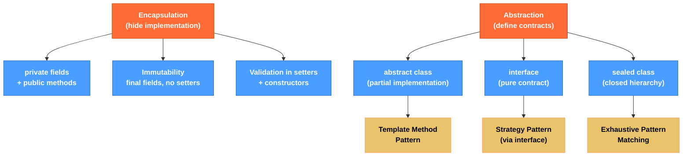

# 🔒 Encapsulation and Abstraction

> [!abstract] TL;DR
> **Encapsulation** bundles state and behavior together, hiding internal implementation behind a controlled public API — fields are `private`, accessed only through methods that enforce invariants. **Immutability** is encapsulation taken to its logical extreme: once created, an object never changes, eliminating entire classes of bugs. **Abstraction** separates *what* a type does from *how* it does it: abstract classes provide a partial implementation with template methods; interfaces define pure contracts. **Sealed classes** (Java 17+) give you a closed hierarchy where the compiler knows all permitted subtypes, enabling exhaustive pattern matching.

---

## Intuition

- **Encapsulation**: A bank vault has a door (public API — deposit/withdraw) and a locked interior (private balance). You interact through the door; the vault's internal cash layout is none of your business.
- **Immutability**: A printed contract — once signed, no one can modify it. Everyone who holds a copy sees exactly the same text, always. Thread-safe by design.
- **Abstract class**: An architectural blueprint with some rooms already built (concrete methods) and some rooms marked "design to be determined by the contractor" (abstract methods).
- **Sealed class**: A company org chart where only HR can add new job titles — the set of subtypes is closed and known at compile time.

---

## How It Works



---

## Key Concepts

### 1. Encapsulation — Fields Private, API Public

```java
public class Temperature {
    // Encapsulated state — internal representation is in Celsius
    private double celsius;

    // Constructor enforces invariant at creation time
    public Temperature(double celsius) {
        if (celsius < -273.15) throw new IllegalArgumentException("Below absolute zero: " + celsius);
        this.celsius = celsius;
    }

    // Public accessors expose logical value, not internal representation
    public double getCelsius()    { return celsius; }
    public double getFahrenheit() { return celsius * 9.0 / 5.0 + 32; }
    public double getKelvin()     { return celsius + 273.15; }

    // Setter enforces the same invariant
    public void setCelsius(double celsius) {
        if (celsius < -273.15) throw new IllegalArgumentException("Below absolute zero");
        this.celsius = celsius;
    }

    // We can change the internal representation to Kelvin later without
    // breaking ANY code that uses this class — that's encapsulation's value
}
```

**Key insight**: If you ever need to change how data is stored internally (e.g., switch from Celsius to Kelvin storage), no calling code changes — only the class internals change. Without encapsulation (public field), every caller would break.

### 2. Immutability — The Gold Standard of Encapsulation

```java
// Immutable class recipe:
// 1. Declare class final (prevents subclasses from adding mutable state)
// 2. All fields private and final
// 3. No setters
// 4. Defensive copies of mutable inputs/outputs
// 5. Initialize all fields in constructor

public final class Money {
    private final long       amount;    // stored in minor units (cents)
    private final String     currency;
    private final java.time.LocalDate created;  // LocalDate is immutable — safe to share

    // Defensive copy of mutable parameter (if any — LocalDate is immutable so not needed here)
    public Money(long amount, String currency, java.time.LocalDate created) {
        if (amount < 0)       throw new IllegalArgumentException("Amount must be >= 0");
        if (currency == null) throw new NullPointerException("Currency required");
        this.amount   = amount;
        this.currency = currency;
        this.created  = created;  // LocalDate is immutable — no defensive copy needed
    }

    // Return new instances for "mutations" — never modify 'this'
    public Money add(Money other) {
        if (!this.currency.equals(other.currency)) throw new IllegalArgumentException("Currency mismatch");
        return new Money(this.amount + other.amount, this.currency, java.time.LocalDate.now());
    }

    public long getAmount()                 { return amount; }
    public String getCurrency()             { return currency; }
    public java.time.LocalDate getCreated() { return created; }

    // equals/hashCode/toString should be implemented for value equality
    @Override public boolean equals(Object o) {
        if (!(o instanceof Money m)) return false;
        return amount == m.amount && currency.equals(m.currency);
    }
    @Override public int hashCode() { return java.util.Objects.hash(amount, currency); }
    @Override public String toString() { return amount / 100.0 + " " + currency; }
}

// Immutable objects are inherently thread-safe — no synchronization needed
// String, Integer, LocalDate, BigDecimal are all immutable in the JDK
```

**Defensive copy for mutable fields:**
```java
public final class Schedule {
    private final java.util.Date startDate;  // Date IS mutable — dangerous!

    public Schedule(java.util.Date startDate) {
        this.startDate = new java.util.Date(startDate.getTime()); // defensive copy IN
    }

    public java.util.Date getStartDate() {
        return new java.util.Date(startDate.getTime()); // defensive copy OUT
    }
    // Prefer java.time (LocalDate, Instant) which are immutable — avoids this issue
}
```

### 3. Abstract Classes — Template Method Pattern

```java
// Abstract class: some behavior defined, some deferred to subclasses
public abstract class DataProcessor {

    // Template method — defines the ALGORITHM (final = cannot be overridden)
    public final void process(java.io.InputStream input) {
        Object raw  = readData(input);    // step 1: abstract (subclass decides format)
        Object clean = validate(raw);     // step 2: abstract (subclass decides rules)
        Object result = transform(clean); // step 3: concrete (shared logic)
        writeOutput(result);              // step 4: abstract (subclass decides output)
    }

    // Abstract methods — subclass MUST override
    protected abstract Object readData(java.io.InputStream input);
    protected abstract Object validate(Object raw);
    protected abstract void   writeOutput(Object result);

    // Concrete method — shared implementation, can be overridden (hook method)
    protected Object transform(Object clean) {
        System.out.println("Default transform: " + clean);
        return clean;
    }
}

// Concrete subclass fills in the abstract pieces
public class CsvDataProcessor extends DataProcessor {
    @Override
    protected Object readData(java.io.InputStream input) {
        // parse CSV...
        return "csv-data";
    }
    @Override
    protected Object validate(Object raw) {
        // validate CSV fields...
        return raw;
    }
    @Override
    protected void writeOutput(Object result) {
        System.out.println("Writing CSV result: " + result);
    }
    @Override
    protected Object transform(Object clean) {
        // Override hook to add CSV-specific transformation
        return super.transform(clean) + " [csv-processed]";
    }
}
```

**Abstract class vs interface:**
| | Abstract Class | Interface |
|---|---|---|
| Constructor | ✅ Yes | ❌ No |
| Fields | Any visibility, any mutability | `public static final` only |
| Multiple inheritance | ❌ One superclass only | ✅ Many interfaces |
| Default methods | ✅ Regular methods | ✅ `default` keyword |
| When to use | Shared state + partial implementation | Pure contract, mixin behavior |

### 4. Sealed Classes (Java 17+) — Closed Hierarchies

```java
// Sealed class: only permitted subtypes can extend it
public sealed class Shape
    permits Circle, Rectangle, Triangle { // exhaustive list in same package/module

    public abstract double area();
}

// Each subtype must be final, sealed, or non-sealed
public final class Circle extends Shape {
    private final double radius;
    public Circle(double radius) { this.radius = radius; }
    @Override public double area() { return Math.PI * radius * radius; }
    public double radius() { return radius; }
}

public final class Rectangle extends Shape {
    private final double width, height;
    public Rectangle(double w, double h) { this.width = w; this.height = h; }
    @Override public double area() { return width * height; }
    public double width()  { return width; }
    public double height() { return height; }
}

public non-sealed class Triangle extends Shape {
    // non-sealed: anyone can extend Triangle (open again)
    private final double base, height;
    public Triangle(double b, double h) { this.base = b; this.height = h; }
    @Override public double area() { return 0.5 * base * height; }
}

// Pattern matching with sealed classes — compiler verifies exhaustiveness
static String describe(Shape shape) {
    return switch (shape) {
        case Circle c    -> "Circle with radius " + c.radius();
        case Rectangle r -> "Rectangle " + r.width() + "x" + r.height();
        case Triangle t  -> "Triangle";
        // No 'default' needed — compiler knows Circle|Rectangle|Triangle is complete
    };
}
```

### 5. Comparing Abstract Class vs Sealed Class

```java
// Abstract class: open — anyone can extend it (library authors: beware!)
public abstract class Vehicle {
    public abstract String fuelType();
}
// External code can add: public class HoverCraft extends Vehicle { ... }
// Your switch over Vehicle needs a default — you don't know all subtypes

// Sealed class: closed — you control all subtypes, compiler can verify exhaustiveness
public sealed interface Result<T> permits Success, Failure {
    record Success<T>(T value)         implements Result<T> {}
    record Failure<T>(String error)    implements Result<T> {}
}

// Exhaustive switch — no default needed
static <T> void handle(Result<T> result) {
    switch (result) {
        case Result.Success<T> s  -> System.out.println("Got: " + s.value());
        case Result.Failure<T> f  -> System.err.println("Error: " + f.error());
    }
}
```

---

## Real-World Notes

- **JPA Entity Classes**: JPA entities often need a no-arg constructor (required by Hibernate) and mutable fields, making true immutability impossible. Encapsulate with package-private setters and use `@Column(updatable=false)` for creation-time-only fields.
- **Spring `@ConfigurationProperties`**: Spring binds externalized configuration by calling setters. If you want immutability, use a `record` with `@ConstructorBinding` — Spring will use the constructor instead.
- **`Optional` as Encapsulated Absence**: `Optional<T>` is a sealed-like abstraction over nullable values. Use it as a return type from methods that explicitly might not return a value, not as a field type.
- **Sealed classes for Error Handling**: Model `Result<T>` as `sealed` with `Success`/`Failure` subtypes — a functional alternative to checked exceptions, enabling exhaustive handling in switch expressions.

---

## Common Pitfalls

| Pitfall | Consequence | Fix |
|---|---|---|
| Public mutable fields | Any code can corrupt internal state | Make fields `private`, add controlled setters |
| Defensive copy omitted for mutable field | Caller retains reference to internal mutable state | Copy mutable inputs in constructor, copy mutable outputs in getter |
| Abstract class with too much state | Subclasses become tightly coupled to superclass fields | Prefer interfaces + composition; use abstract class only when shared state is truly needed |
| `non-sealed` defeats sealed hierarchy benefit | External subtypes can be added, exhaustiveness lost | Avoid `non-sealed` unless intentionally opening an extension point |
| Getter returns mutable collection reference | Caller can modify internal collection | Return `Collections.unmodifiableList(list)` or `List.copyOf(list)` |

---

## Related Notes

- [[_MOC_Java_OOP|↑ Section MOC — Java OOP]]
- [[Classes_and_Objects]] — class anatomy and object lifecycle
- [[Interfaces_and_Default_Methods]] — pure contracts and default method behavior
- [[Inheritance_and_Polymorphism]] — IS-A relationships and method dispatch
- [[Records_and_Sealed_Classes]] — records as immutable value types, sealed hierarchies in depth

---

## Review Questions

1. You have a class with a `private List<String> tags` field. The getter returns `this.tags` directly. How can a caller corrupt the object's state, and what are two ways to prevent it?

2. An abstract class `Report` has a final `generate()` template method calling three abstract methods. A new team member adds `@Override` to `generate()` in a subclass — what happens and why?

3. You're modeling an HTTP result type with Java 17 sealed classes. Sketch the sealed hierarchy for responses that are either `Ok<T>` (body), `ClientError` (4xx with message), or `ServerError` (5xx with message). How would a switch expression handle all cases without a default?

---

#Java #OOP #Encapsulation #Abstraction #AbstractClasses #SealedClasses #Immutability #Intermediate
