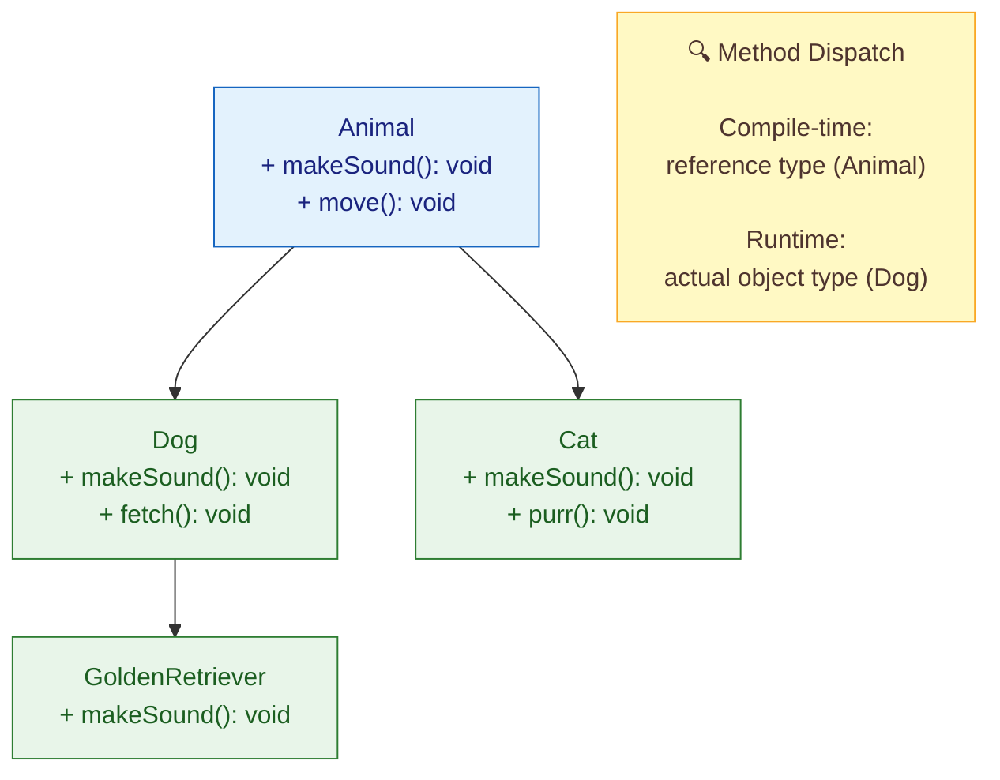
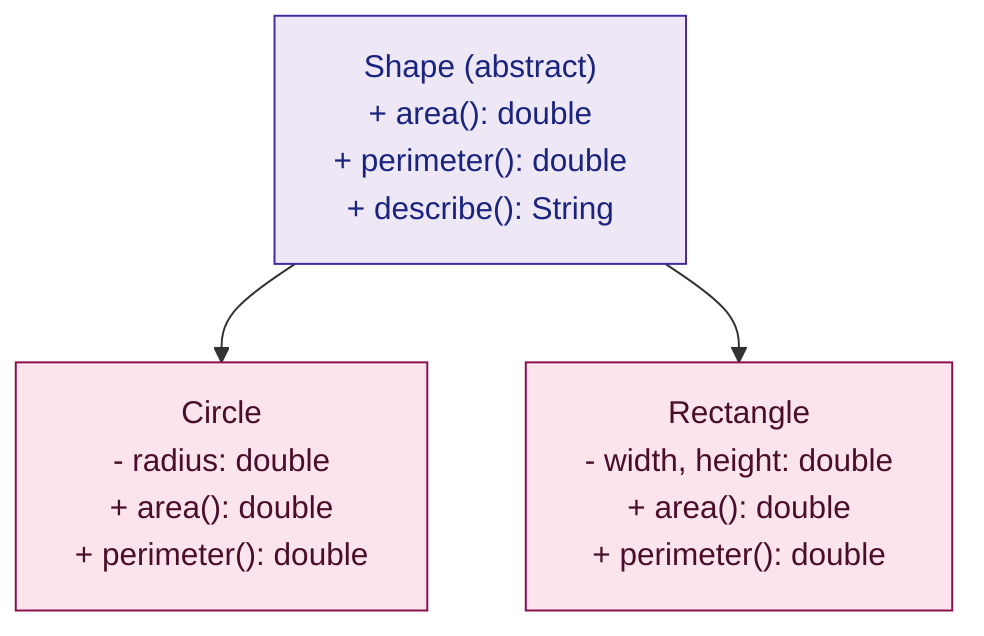

# 🧬 Inheritance and Polymorphism

> [!tldr] TL;DR
> Java supports **single class inheritance** (`extends`) with multiple interface implementation; `@Override` enables **dynamic dispatch** at runtime (runtime polymorphism); the `super` keyword accesses parent members and chains constructors; **covariant return types** (Java 5+) allow a subclass to return a narrower type in an override; prefer **composition over inheritance** to avoid the fragile base class problem; abstract classes bridge the gap between interface contracts and concrete implementations by carrying state and partial behaviour.

---

## Intuition

Think of a biology taxonomy. `Animal` is the parent class — it knows that every animal *makes a sound* and *moves*. `Dog` and `Cat` are concrete subclasses that fulfil those promises in their own way.

When you call `animal.makeSound()` on a variable whose static type is `Animal` but whose runtime type is `Dog`, the **JVM resolves the call to `Dog.makeSound()`** — not `Animal.makeSound()`. That resolution at runtime is dynamic dispatch, the engine behind polymorphism.

---

## How It Works

### Class Hierarchy & Method Dispatch





---

### Core Java Code: Animal Hierarchy

```java
// Abstract base class — cannot be instantiated directly
public abstract class Animal {
    private final String name;   // encapsulated, immutable
    private int age;

    // Constructor — subclasses MUST call super(name)
    protected Animal(String name, int age) {
        this.name = name;
        this.age  = age;
    }

    // Concrete method — inherited as-is
    public void move() {
        System.out.println(name + " is moving.");
    }

    // Abstract method — subclasses MUST override
    public abstract String makeSound();

    // Template method pattern: orchestrates abstract steps
    public final void describe() {
        System.out.println("I am " + name + " and I say: " + makeSound());
    }

    // Getters (no setters — prefer immutability where possible)
    public String getName() { return name; }
    public int    getAge()  { return age;  }
}

// ── Dog ────────────────────────────────────────────────────────────────────
public class Dog extends Animal {

    public Dog(String name, int age) {
        super(name, age);   // mandatory: calls Animal(String, int)
    }

    @Override               // compile-time safety: fails if no parent method matches
    public String makeSound() {
        return "Woof!";
    }

    // Dog-specific behaviour not in Animal
    public void fetch() {
        System.out.println(getName() + " fetches the ball!");
    }
}

// ── Cat ────────────────────────────────────────────────────────────────────
public class Cat extends Animal {

    public Cat(String name, int age) {
        super(name, age);
    }

    @Override
    public String makeSound() {
        return "Meow!";
    }
}

// ── GoldenRetriever: deeper hierarchy ──────────────────────────────────────
public class GoldenRetriever extends Dog {

    public GoldenRetriever(String name, int age) {
        super(name, age);   // chains to Dog(String,int) → Animal(String,int)
    }

    @Override
    public String makeSound() {
        // Call parent's implementation then add extra behaviour
        return super.makeSound() + " (extra friendly!)";
    }
}
```

### Dynamic Dispatch in Action

```java
public class PolymorphismDemo {
    public static void main(String[] args) {
        // Static type = Animal; Runtime type = Dog / Cat / GoldenRetriever
        List<Animal> zoo = new ArrayList<>();
        zoo.add(new Dog("Rex", 3));
        zoo.add(new Cat("Whiskers", 5));
        zoo.add(new GoldenRetriever("Buddy", 2));

        // JVM calls the RUNTIME type's makeSound(), not Animal.makeSound()
        for (Animal a : zoo) {
            a.describe();   // template method — polymorphic makeSound() inside
        }
        // Output:
        // I am Rex     and I say: Woof!
        // I am Whiskers and I say: Meow!
        // I am Buddy   and I say: Woof! (extra friendly!)

        // instanceof + pattern-matching (Java 16+)
        for (Animal a : zoo) {
            if (a instanceof Dog dog) {   // pattern variable 'dog' is already cast
                dog.fetch();              // can call Dog-specific method safely
            }
        }
    }
}
```

### Covariant Return Type Example

```java
// Java 5+: overriding method can return a subtype of the parent's return type
public class AnimalFactory {
    public Animal create() {
        return new Animal("Generic", 0) {
            @Override public String makeSound() { return "..."; }
        };
    }
}

public class DogFactory extends AnimalFactory {
    @Override
    public Dog create() {   // return type narrowed from Animal → Dog (covariant)
        return new Dog("Fido", 1);
    }
}

// Callers through DogFactory.create() get a Dog without casting
DogFactory df  = new DogFactory();
Dog d          = df.create();   // no cast needed — covariant return type
```

### Overriding vs Overloading vs Static Hiding

| Feature | Overriding | Overloading | Static Method Hiding |
|---------|-----------|-------------|---------------------|
| Resolved at | **Runtime** (dynamic dispatch) | **Compile-time** (static dispatch) | Compile-time (reference type) |
| Annotation | `@Override` | N/A | N/A |
| Same signature? | Yes — identical name + params | No — different params | Yes — but `static` |
| Polymorphic? | Yes | No | No — hidden, not overridden |
| Applies to | Instance methods | Methods | Static methods only |
| Example | `dog.makeSound()` → `Dog.makeSound()` | `print(int)` vs `print(String)` | `Animal.type()` vs `Dog.type()` |

---

## Key Concepts

### `extends` — Single Inheritance & Constructor Chaining

Java allows a class to extend **exactly one** parent class (preventing the diamond problem for classes). Every constructor must either explicitly call `super(...)` or the compiler inserts a no-arg `super()` call automatically.

```java
public class Vehicle {
    protected final String brand;
    public Vehicle(String brand) { this.brand = brand; }
}

public class Car extends Vehicle {
    private final int doors;
    public Car(String brand, int doors) {
        super(brand);      // MUST be first statement
        this.doors = doors;
    }
}

public class ElectricCar extends Car {
    private final int batteryKwh;
    public ElectricCar(String brand, int doors, int batteryKwh) {
        super(brand, doors);   // chains: ElectricCar → Car → Vehicle
        this.batteryKwh = batteryKwh;
    }
}
```

---

### `@Override` — Compile-Time Safety

`@Override` tells the compiler: *"I believe I am overriding a parent method — verify this."* Without it, a typo like `makesoung()` would silently become a new, unrelated method instead of an override.

```java
public class BrokenCat extends Animal {
    // Typo — no @Override means this compiles silently as a NEW method
    public String makesound() { return "Meow!"; }

    // With @Override: COMPILE ERROR — no makesoung() in Animal to override
    @Override
    public String makesoung() { return "Meow!"; }   // fails fast
}
```

---

### Dynamic Dispatch — The JVM's vtable

The JVM stores a **virtual method table (vtable)** per class. When `animal.makeSound()` executes, the JVM:
1. Looks up the vtable of the *actual* runtime object (e.g., `Dog`)
2. Finds `Dog.makeSound` at the relevant vtable slot
3. Invokes it — regardless of the reference type (`Animal`)

`final` methods bypass the vtable (they are inlined by the JIT). `static` and `private` methods are not in the vtable at all — they are resolved at compile-time via *invokestatic* / *invokespecial* bytecodes.

---

### `super` — Accessing Parent Members

```java
public class Dog extends Animal {
    @Override
    public String makeSound() {
        String parentResult = super.makeSound();  // call Animal.makeSound()
        return parentResult + " Woof!";
    }

    // super() in constructor must be FIRST statement
    public Dog(String name) {
        super(name, 0);
    }
}
```

---

### Composition over Inheritance — Avoiding the Fragile Base Class

Inheritance exposes internal implementation details to subclasses. A change in the base class can silently break all subclasses (the *fragile base class* problem). Prefer **composition (HAS-A)** over deep inheritance (IS-A) for behaviour reuse.

```java
// BAD — deep inheritance tightly couples EmailLogger to Logger internals
public class Logger { public void log(String msg) { /* writes to stdout */ } }
public class FileLogger extends Logger { /* overrides log */ }
public class EmailLogger extends FileLogger { /* overrides log — now fragile */ }

// GOOD — composition: EmailNotifier delegates to any Logger via interface
public interface Logger { void log(String msg); }
public class FileLogger implements Logger { /* ... */ }

public class EmailNotifier {
    private final Logger logger;            // HAS-A, injected
    public EmailNotifier(Logger logger) { this.logger = logger; }
    public void notify(String msg) {
        logger.log("EMAIL: " + msg);        // delegate — not inherit
    }
}
```

---

### Abstract Classes — The Middle Ground

An abstract class cannot be instantiated but can carry:
- **State** (instance fields)
- **Constructors** (for subclass chaining)
- **Concrete methods** (shared implementation)
- **Abstract methods** (subclass-defined behaviour)

This makes the *Template Method Pattern* natural: define the algorithm skeleton in the abstract class and let subclasses fill in the steps.

```java
public abstract class DataProcessor {
    // Template method — final so subclasses cannot change the algorithm
    public final void process(List<String> data) {
        List<String> validated = validate(data);   // step 1 — abstract
        List<String> transformed = transform(validated); // step 2 — abstract
        persist(transformed);                       // step 3 — concrete
    }

    protected abstract List<String> validate(List<String> data);
    protected abstract List<String> transform(List<String> data);

    private void persist(List<String> data) {
        System.out.println("Persisting " + data.size() + " records.");
    }
}

public class CsvProcessor extends DataProcessor {
    @Override
    protected List<String> validate(List<String> data) {
        return data.stream().filter(s -> !s.isBlank()).toList();
    }
    @Override
    protected List<String> transform(List<String> data) {
        return data.stream().map(String::toUpperCase).toList();
    }
}
```

---

## Real-World Notes

- **Spring AOP proxying**: Spring creates CGLIB proxy subclasses of your `@Service` beans. If a `@Transactional` method is `final`, Spring cannot override it in the proxy — the transaction is silently skipped. Always leave Spring-managed methods non-final.
- **JPA Entity Hierarchies**: JPA maps inheritance with three strategies:
  - `SINGLE_TABLE` — all subclasses share one table; discriminator column identifies type; fast queries, nullable columns.
  - `JOINED` — each class gets its own table; normalized; requires joins.
  - `TABLE_PER_CLASS` — one table per concrete class; duplicates columns; poor for polymorphic queries.
- **Overriding `equals` in subclasses**: if `Dog.equals()` adds a field check, the symmetry contract (`a.equals(b) == b.equals(b)`) can break between `Animal` and `Dog` instances. Effective Java recommends favouring composition for equality-sensitive hierarchies.

---

## Common Pitfalls

| # | Pitfall | Example | Fix |
|---|---------|---------|-----|
| 1 | Calling overridable methods from constructor | `Animal()` calls `makeSound()` — `Dog` field not yet initialized | Make the method `final`, or don't call overridable methods in constructors |
| 2 | Overriding `equals` in subclass breaks symmetry | `dog.equals(animal)` ≠ `animal.equals(dog)` | Use `getClass()` check instead of `instanceof`, or use composition |
| 3 | Static method hiding confused with overriding | `Dog.type()` doesn't override `Animal.type()` | Remember: static methods are hidden, not overridden — no polymorphism |
| 4 | Forgetting `super()` in subclass constructor | Compiler error if parent has no no-arg constructor | Always explicitly call `super(args)` as first statement |
| 5 | Deep inheritance hierarchies (> 3 levels) | Hard to trace which `makeSound()` runs | Flatten hierarchy; use interfaces + composition |

---

## Review Questions

1. A `Dog` class extends `Animal`. Both define a `static` method `type()`. When you call `type()` on an `Animal` reference pointing to a `Dog`, which `type()` runs, and why?
2. Why does the JVM need a vtable? Which Java keywords remove a method from the vtable, and what performance benefit does that provide?
3. You have a `Stack<E> extends Vector<E>` (as in the JDK). Explain how this violates the Liskov Substitution Principle.

---

Related: [[_MOC_Java_OOP|↑ Section MOC]] | [[Interfaces_and_Modern_Types]] | [[SOLID_Principles]] | [[Structural_Patterns]]

*Tags: #Java #OOP #Inheritance #Polymorphism*
