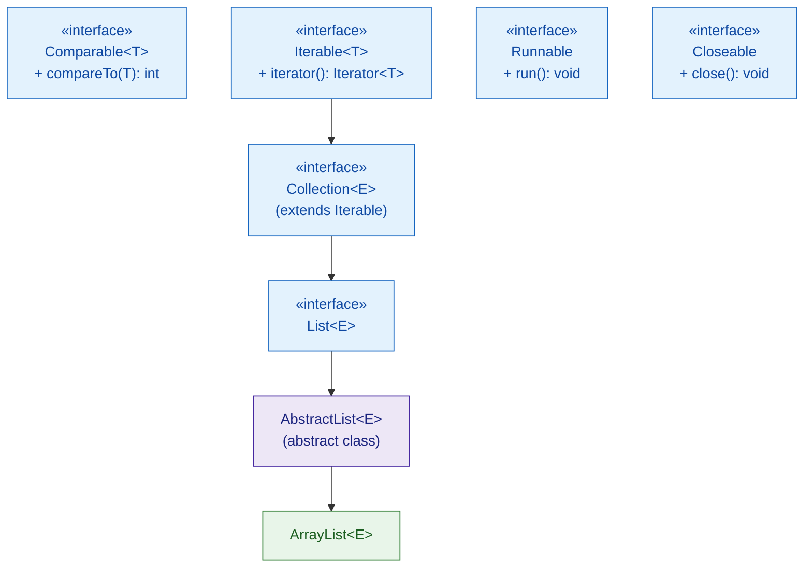
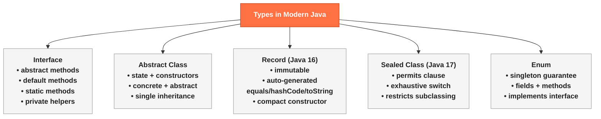

# 🔷 Interfaces and Modern Types

> [!tldr] TL;DR
> **Interfaces** define contracts with abstract, `default`, and `static` methods (Java 8+) and `private` helper methods (Java 9+); **abstract classes** add state and constructors for partial implementations; **Records** (Java 16) are immutable data carriers with auto-generated `equals`, `hashCode`, `toString`, and accessors; **sealed classes** (Java 17) restrict which classes may extend a type, enabling exhaustive pattern-matching `switch`; **enums** are type-safe constant classes that can carry methods, fields, and implement interfaces.

---

## Intuition

- **Interface** = a *job description*. It tells you what skills the employee (implementing class) must have, not how they do the work. A `Printable` interface says *you must be able to print yourself* — the actual printing logic is yours.
- **Abstract class** = *partial employee training*. Some work is already done (shared behaviour), but certain tasks are left for specialised trainees.
- **Record** = an *immutable report form*. Once you fill in the fields and submit the form, no one can change it — but you can derive new data from it via accessor methods.
- **Sealed class** = a *closed club*. Only approved members (permitted subclasses) can join the hierarchy — making it safe to `switch` over every possible member exhaustively.

---

## How It Works

### Interface & Type Hierarchy





---

### Java Code: Interface Evolution (Java 8 → 9+)

```java
// ── Java 8: default + static methods ──────────────────────────────────────
public interface Greeter {
    // Abstract method — implementors must provide this
    String greet(String name);

    // Default method — backward-compatible addition; implementors may override
    default String greetLoudly(String name) {
        return greet(name).toUpperCase();
    }

    // Static utility — called on interface itself: Greeter.defaultPrefix()
    static String defaultPrefix() {
        return "Hello";
    }

    // Java 9: private helper shared by default methods (not visible to implementors)
    private String format(String name) {
        return defaultPrefix() + ", " + name + "!";
    }
}

// ── Functional Interface (SAM — Single Abstract Method) ───────────────────
@FunctionalInterface
public interface Transformer<T, R> {
    R transform(T input);   // exactly one abstract method → can be a lambda

    default Transformer<T, R> andLog() {
        return input -> {
            R result = this.transform(input);
            System.out.println("Transformed: " + input + " → " + result);
            return result;
        };
    }
}

// Lambda satisfies the functional interface
Transformer<String, Integer> lengthOf = String::length;
System.out.println(lengthOf.transform("hello")); // 5
```

---

### Java Code: Abstract Class with Template Method

```java
public abstract class ReportGenerator {
    // Fields — interfaces cannot have instance state
    private final String reportTitle;

    protected ReportGenerator(String reportTitle) {
        this.reportTitle = reportTitle;
    }

    // Template method — sealed from override
    public final String generate(List<String> rows) {
        StringBuilder sb = new StringBuilder();
        sb.append(header());
        rows.forEach(row -> sb.append(formatRow(row)).append("\n"));
        sb.append(footer());
        return sb.toString();
    }

    protected String header()          { return "=== " + reportTitle + " ===\n"; }
    protected abstract String formatRow(String row);
    protected String footer()          { return "--- END ---\n"; }
}

public class CsvReportGenerator extends ReportGenerator {
    public CsvReportGenerator() { super("CSV Report"); }

    @Override
    protected String formatRow(String row) { return row.replace(" ", ","); }
}
```

---

### Java Code: Records (Java 16)

```java
// Record — immutable data carrier. Compiler generates:
//   - private final fields
//   - canonical constructor
//   - accessors: id(), name(), email()
//   - equals(), hashCode(), toString()
public record Person(int id, String name, String email) {

    // Compact constructor — validate, normalize (no `this.x = x` needed)
    public Person {
        if (id <= 0)           throw new IllegalArgumentException("id must be positive");
        if (name == null || name.isBlank()) throw new IllegalArgumentException("name required");
        name = name.strip();   // reassign — compact constructor can modify params before assignment
    }

    // Custom accessor (same name as field — permitted)
    public String email() {
        return email.toLowerCase();   // normalize on read
    }

    // Additional methods — records are not "just" data, they can have behaviour
    public String displayName() {
        return name + " <" + email() + ">";
    }

    // "Wither" pattern — produce a modified copy (records are immutable)
    public Person withName(String newName) {
        return new Person(id, newName, email);
    }
}

// Usage
Person p  = new Person(1, "  Alice ", "Alice@Example.COM");
Person p2 = p.withName("Alicia");
System.out.println(p.displayName());    // Alice <alice@example.com>
System.out.println(p.equals(p2));       // false — name differs
```

---

### Java Code: Sealed Classes + Pattern Matching Switch (Java 17+)

```java
// Sealed hierarchy — only the three listed types may extend Shape
public sealed interface Shape permits Circle, Rectangle, Triangle {}

public record Circle(double radius) implements Shape {}
public record Rectangle(double width, double height) implements Shape {}
public record Triangle(double base, double height) implements Shape {}

// Pattern-matching switch — compiler guarantees exhaustiveness
public class AreaCalculator {
    public static double area(Shape shape) {
        return switch (shape) {
            case Circle    c -> Math.PI * c.radius() * c.radius();
            case Rectangle r -> r.width() * r.height();
            case Triangle  t -> 0.5 * t.base() * t.height();
            // No default needed — sealed + permits guarantees all cases covered
        };
    }

    // Guarded patterns (Java 21 — preview in 17/18)
    public static String classify(Shape shape) {
        return switch (shape) {
            case Circle c when c.radius() > 100 -> "Large circle";
            case Circle c                       -> "Small circle";
            case Rectangle r when r.width() == r.height() -> "Square";
            case Rectangle r                    -> "Rectangle";
            case Triangle  t                    -> "Triangle";
        };
    }
}
```

---

### Java Code: Enums with Methods and Interface Implementation

```java
public interface Describable {
    String describe();
}

public enum Planet implements Describable {
    MERCURY(3.303e+23, 2.4397e6),
    VENUS  (4.869e+24, 6.0518e6),
    EARTH  (5.976e+24, 6.37814e6);

    private final double mass;    // kg
    private final double radius;  // m
    static final double G = 6.67300E-11;

    Planet(double mass, double radius) {
        this.mass   = mass;
        this.radius = radius;
    }

    public double surfaceGravity() {
        return G * mass / (radius * radius);
    }

    public double surfaceWeight(double otherMass) {
        return otherMass * surfaceGravity();
    }

    @Override
    public String describe() {
        return name() + ": gravity=" + String.format("%.2f", surfaceGravity()) + " m/s²";
    }
}

// EnumSet / EnumMap — highly optimized for enum keys
EnumSet<Planet>        innerPlanets = EnumSet.of(Planet.MERCURY, Planet.VENUS, Planet.EARTH);
EnumMap<Planet,Double> weights      = new EnumMap<>(Planet.class);
weights.put(Planet.EARTH, 75.0 * Planet.EARTH.surfaceGravity());
```

---

## Feature Comparison Table

| Feature | Interface | Abstract Class | Record | Sealed Class | Enum |
|---------|-----------|----------------|--------|--------------|------|
| Instantiable directly | No | No | Yes | Depends on subtypes | No (instances are constants) |
| Instance fields | No | Yes | Yes (final) | Yes | Yes |
| Constructors | No | Yes | Yes (canonical) | Yes | Yes (private) |
| Multiple inheritance | Yes (implement many) | No (extend one) | Can implement interfaces | Can implement interfaces | Can implement interfaces |
| State mutability | N/A | Mutable | Immutable | Mutable/immutable | Typically immutable |
| Auto-generated methods | No | No | equals/hashCode/toString/accessors | No | values()/valueOf()/name()/ordinal() |
| Exhaustive switch | No | No | If sealed | Yes | Yes |
| Java version | All | All | 16 (stable) | 17 (stable) | 5 |

---

## Key Concepts

### Interface Evolution (Java 8/9+)

Before Java 8, adding a method to an interface broke all implementing classes. `default` methods solved this — they provide a fallback implementation that existing classes inherit automatically. This enabled the Stream API to be added to `Collection` without modifying every collection library.

```java
// Backward-compatible API addition
public interface Collection<E> {
    // ... existing methods ...

    // Java 8 addition — all existing Collections (ArrayList, HashSet, ...) get this for free
    default Stream<E> stream() {
        return StreamSupport.stream(spliterator(), false);
    }
}
```

### The Diamond Problem with Default Methods

When a class implements two interfaces that both provide a `default` method with the same signature, the class **must** override it to resolve the ambiguity:

```java
interface A { default String hello() { return "A"; } }
interface B { default String hello() { return "B"; } }

class C implements A, B {
    @Override
    public String hello() {
        return A.super.hello() + B.super.hello(); // explicitly choose/combine
    }
}
```

### Comparable vs Iterable Contracts

```java
// Comparable — natural ordering; used by Collections.sort(), TreeSet, TreeMap
public class Student implements Comparable<Student> {
    private final String name;
    private final double gpa;

    @Override
    public int compareTo(Student other) {
        return Double.compare(other.gpa, this.gpa); // descending by GPA
    }
}

// Iterable — enables for-each loops; must provide an Iterator
public class NumberRange implements Iterable<Integer> {
    private final int start, end;
    public NumberRange(int start, int end) { this.start = start; this.end = end; }

    @Override
    public Iterator<Integer> iterator() {
        return new Iterator<>() {
            int current = start;
            public boolean hasNext() { return current <= end; }
            public Integer next()    { return current++; }
        };
    }
}
// for (int n : new NumberRange(1, 5)) { ... }  ← works!
```

---

## Real-World Notes

- **Spring's interface-driven architecture**: `@Component`, `@Service`, `@Repository` beans are typically programmed to interfaces (`UserRepository extends JpaRepository<User, Long>`). Spring generates the proxy at runtime, implementing the interface — pure OCP.
- **Jackson + Records**: Jackson 2.12+ deserializes records using the canonical constructor. Annotate with `@JsonProperty` on the record component if the JSON key differs.
- **Sealed hierarchies for domain modeling**: A `Result<T>` sealed type (`Success<T>`, `Failure`) models outcomes without exceptions, and the compiler enforces that callers handle both cases in a `switch`.
- **EnumSet/EnumMap performance**: Backed by bit vectors and arrays respectively — O(1) operations, no boxing overhead. Always prefer over `HashSet<MyEnum>` when the key is an enum.

---

## Common Pitfalls

| # | Pitfall | Code Smell | Fix |
|---|---------|-----------|-----|
| 1 | Diamond problem with default methods | Two interfaces both define `default sort()` | Override in implementing class, delegate explicitly via `A.super.sort()` |
| 2 | Record with mutable field type | `record Order(List<Item> items)` — list is mutable | Return `Collections.unmodifiableList(items)` from accessor, or copy in compact constructor |
| 3 | Non-permitted subclass of sealed class | Class outside same package tries to extend sealed type | All permitted subclasses must be in the same package (or module, Java 17) |
| 4 | Enum singleton and serialization | `INSTANCE.equals(deserializedInstance)` may be `false` with custom serialization | Enums are serialization-safe by default — never override `readResolve()` unless you know why |
| 5 | Implementing too many interfaces (fat interface) | `class God implements Printable, Saveable, Loggable, Auditable, Notifiable ...` | Apply Interface Segregation; keep interfaces small and focused |

---

## Review Questions

1. A `default` method in `interface A` and a concrete method in `abstract class B` both have the same signature `String hello()`. Class `C extends B implements A`. Which one wins, and why?
2. Records cannot extend other classes. Why? What mechanism does this interact with?
3. Explain why a `sealed interface` combined with `switch` expressions gives you a stronger guarantee than a plain abstract class hierarchy.

---

Related: [[_MOC_Java_OOP|↑ Section MOC]] | [[Inheritance_and_Polymorphism]] | [[SOLID_Principles]] | [[Lambdas_and_Functional_Interfaces]]

*Tags: #Java #OOP #Interfaces #Records #Sealed*
