# 🏗️ SOLID Principles

> [!tldr] TL;DR
> **SOLID** is an acronym for five object-oriented design principles: **S**ingle Responsibility (one reason to change), **O**pen/Closed (open for extension, closed for modification), **L**iskov Substitution (subtypes must be substitutable for their base types), **I**nterface Segregation (clients should not depend on interfaces they don't use), **D**ependency Inversion (depend on abstractions, not concretions). Together they guide maintainable, testable, and extensible Java and Spring code that resists decay as requirements evolve.

---

## Intuition

- **SRP** — A Swiss army knife is convenient but terrible for surgery. Each class should be the best *scalpel* for one job.
- **OCP** — An electrical outlet: you can plug in any device (extend) without rewiring the wall (modify). The outlet is closed for internal change but open for new devices.
- **LSP** — Substituting a USB-C adapter for a USB-A: everything that works with the original socket still works. A subtype that breaks caller assumptions is a bad adapter.
- **ISP** — A waiter doesn't need to know how to cook or do accounting. Give clients only the menu (interface) they actually read.
- **DIP** — A lamp doesn't care whether its power comes from a coal plant or a solar farm — it depends on the *socket standard* (abstraction), not the *generator* (concretion).

---

## All Five Principles at a Glance

```mermaid
graph TD
    SOLID["🏗️ SOLID Principles"]:::root

    SOLID --> SRP["S — Single Responsibility\nOne class, one reason to change"]:::principle
    SOLID --> OCP["O — Open / Closed\nExtend without modifying"]:::principle
    SOLID --> LSP["L — Liskov Substitution\nSubtypes must honour contracts"]:::principle
    SOLID --> ISP["I — Interface Segregation\nNo fat interfaces"]:::principle
    SOLID --> DIP["D — Dependency Inversion\nDepend on abstractions"]:::principle

    SRP --> SRP_B["BAD: UserService sends email"]:::bad
    SRP --> SRP_G["GOOD: UserService + EmailService"]:::good

    OCP --> OCP_B["BAD: if-else per shape type"]:::bad
    OCP --> OCP_G["GOOD: Shape.area() + Strategy"]:::good

    LSP --> LSP_B["BAD: Square extends Rectangle\nbreaks setWidth invariant"]:::bad
    LSP --> LSP_G["GOOD: Shape hierarchy, no shared setters"]:::good

    ISP --> ISP_B["BAD: Worker.eat()+work()+sleep()"]:::bad
    ISP --> ISP_G["GOOD: Workable + Eatable + Sleepable"]:::good

    DIP --> DIP_B["BAD: new MySQLDatabase() inside Service"]:::bad
    DIP --> DIP_G["GOOD: @Autowired DatabaseRepository"]:::good

    classDef root fill:#FF7043,stroke:#BF360C,color:#fff,font-weight:bold
    classDef principle fill:#1565C0,stroke:#0D47A1,color:#fff
    classDef bad fill:#FFCDD2,stroke:#C62828,color:#B71C1C
    classDef good fill:#C8E6C9,stroke:#1B5E20,color:#1B5E20
```



---

## Principle Reference Table

| Principle | Acronym Letter | Violation Sign | Fix Pattern |
|-----------|---------------|----------------|-------------|
| Single Responsibility | S | Class has multiple reasons to change; methods from different concerns mixed | Extract class; one concern per class |
| Open / Closed | O | `if/else` or `switch` on type tags inside core logic | Strategy / Template Method / Decorator |
| Liskov Substitution | L | Subclass throws UnsupportedOperationException for parent method; postcondition weakened | Redesign hierarchy; prefer composition |
| Interface Segregation | I | Interface forces `throws UnsupportedOperationException` stubs; clients import methods they never call | Split interface into smaller, role-specific interfaces |
| Dependency Inversion | D | `new ConcreteService()` inside business logic; hard to test/mock | Inject via constructor; depend on interface |

---

## S — Single Responsibility Principle

> "A class should have one, and only one, reason to change." — Robert C. Martin

### BAD — UserService does too much

```java
// BAD: UserService is responsible for user logic AND email sending AND PDF generation
public class UserService {
    public void registerUser(String name, String email) {
        // 1. Persist user — database concern
        database.save(new User(name, email));

        // 2. Send welcome email — communication concern
        String subject = "Welcome, " + name;
        emailClient.send(email, subject, "Thanks for joining!");

        // 3. Generate audit PDF — reporting concern
        pdfGenerator.generate("Audit", name + " registered");
    }
}
// When the email template changes, UserService must change.
// When PDF format changes, UserService must change.
// When persistence logic changes, UserService must change.
// THREE reasons to change → SRP violated.
```

### GOOD — Responsibilities split by concern

```java
// Each class has exactly one reason to change
public class UserRepository {
    public void save(User user) { /* DB logic */ }
}

public class WelcomeEmailService {
    public void sendWelcome(User user) { /* email logic */ }
}

public class AuditService {
    public void logRegistration(User user) { /* PDF / audit logic */ }
}

public class UserRegistrationOrchestrator {
    private final UserRepository    repo;
    private final WelcomeEmailService email;
    private final AuditService        audit;

    public UserRegistrationOrchestrator(UserRepository repo,
                                        WelcomeEmailService email,
                                        AuditService audit) {
        this.repo  = repo;
        this.email = email;
        this.audit = audit;
    }

    public void register(String name, String emailAddr) {
        User user = new User(name, emailAddr);
        repo.save(user);
        email.sendWelcome(user);
        audit.logRegistration(user);
    }
}
```

---

## O — Open / Closed Principle

> "Software entities should be open for extension, but closed for modification." — Bertrand Meyer

### BAD — Adding a new shape requires modifying AreaCalculator

```java
// BAD: every new Shape type requires modifying this class
public class AreaCalculator {
    public double calculate(Object shape) {
        if (shape instanceof Circle c) {
            return Math.PI * c.radius() * c.radius();
        } else if (shape instanceof Rectangle r) {
            return r.width() * r.height();
        }
        // Adding Triangle means modifying this class — OCP violated
        throw new IllegalArgumentException("Unknown shape: " + shape.getClass());
    }
}
```

### GOOD — Strategy: extend by adding new Shape implementations

```java
// GOOD: new shapes extend the system without modifying existing code
public interface Shape {
    double area();
}

public record Circle(double radius) implements Shape {
    public double area() { return Math.PI * radius * radius; }
}

public record Rectangle(double width, double height) implements Shape {
    public double area() { return width * height; }
}

// Adding Triangle: zero changes to existing classes
public record Triangle(double base, double height) implements Shape {
    public double area() { return 0.5 * base * height; }
}

public class AreaCalculator {
    public double calculate(Shape shape) {
        return shape.area();   // always works — no modification needed
    }
}
```

**Spring OCP Example**: `@ConditionalOnProperty` and `@Profile` let you swap implementations without modifying the core service. Adding a `@Service @Profile("aws")` bean extends the system without touching the `@Service @Profile("local")` bean.

---

## L — Liskov Substitution Principle

> "Subtypes must be substitutable for their base types without altering the correctness of the program." — Barbara Liskov, 1987

### BAD — Square extends Rectangle violates LSP

```java
// BAD: Square.setWidth() also changes height — violates Rectangle's postcondition
public class Rectangle {
    protected int width, height;
    public void setWidth(int w)  { this.width  = w; }
    public void setHeight(int h) { this.height = h; }
    public int area() { return width * height; }
}

public class Square extends Rectangle {
    @Override
    public void setWidth(int w)  { this.width = this.height = w; } // silent side-effect!
    @Override
    public void setHeight(int h) { this.width = this.height = h; }
}

// Caller expects Rectangle behaviour
Rectangle r = new Square();
r.setWidth(5);
r.setHeight(4);
// Rectangle: area = 5 * 4 = 20  ✓
// Square:    area = 4 * 4 = 16  ✗ — LSP violated
assert r.area() == 20; // FAILS for Square
```

### GOOD — Separate hierarchy, no shared mutable setters

```java
// GOOD: Shape hierarchy without problematic shared mutation
public sealed interface Shape permits Circle, Rectangle, Square {}

public record Rectangle(int width, int height) implements Shape {
    public int area() { return width * height; }
}

public record Square(int side) implements Shape {
    public int area() { return side * side; }
}

// No caller can assume setWidth/setHeight behaviour — LSP safe
```

**LSP Checklist**: a subtype must (1) accept all inputs the parent accepts, (2) return outputs within the parent's postconditions, (3) not throw exceptions the parent doesn't declare, (4) maintain all invariants the parent guarantees.

---

## I — Interface Segregation Principle

> "Clients should not be forced to depend on methods they do not use." — Robert C. Martin

### BAD — Fat interface forces Robot to stub out human-only methods

```java
// BAD: one giant interface forces all implementors to implement everything
public interface Worker {
    void work();
    void eat();    // robots don't eat
    void sleep();  // robots don't sleep
}

public class Robot implements Worker {
    public void work()  { /* does work */ }
    public void eat()   { throw new UnsupportedOperationException(); } // BAD
    public void sleep() { throw new UnsupportedOperationException(); } // BAD
}
```

### GOOD — Role-specific interfaces

```java
// GOOD: small, focused interfaces — clients implement only what they use
public interface Workable  { void work(); }
public interface Eatable   { void eat(); }
public interface Sleepable { void sleep(); }

public class HumanWorker implements Workable, Eatable, Sleepable {
    public void work()  { System.out.println("Working..."); }
    public void eat()   { System.out.println("Eating lunch..."); }
    public void sleep() { System.out.println("Sleeping..."); }
}

public class Robot implements Workable {
    public void work() { System.out.println("Executing tasks..."); }
    // No forced stubs — clean!
}
```

**Spring ISP Example**: Spring's `Aware` interfaces (`BeanNameAware`, `ApplicationContextAware`, `InitializingBean`) are tiny single-method interfaces. Your bean implements only the `Aware` interfaces it needs — not a monolithic `SpringBean` interface.

---

## D — Dependency Inversion Principle

> "High-level modules should not depend on low-level modules. Both should depend on abstractions." — Robert C. Martin

### BAD — Business logic coupled to concrete implementation

```java
// BAD: OrderService directly instantiates MySQLOrderRepository
public class OrderService {
    // Hard-coded concrete dependency — impossible to swap for testing or other DBs
    private final MySQLOrderRepository repo = new MySQLOrderRepository();

    public Order placeOrder(Cart cart) {
        Order order = buildOrder(cart);
        repo.save(order);   // tightly coupled
        return order;
    }
}

// Unit testing OrderService requires a live MySQL database — painful
```

### GOOD — Depend on the abstraction; inject the concretion

```java
// GOOD: depend on the interface; inject concrete implementation from outside
public interface OrderRepository {
    void save(Order order);
    Optional<Order> findById(long id);
}

// Concretion 1 — production
@Repository
public class MySQLOrderRepository implements OrderRepository {
    @Override public void save(Order order) { /* JPA/JDBC logic */ }
    @Override public Optional<Order> findById(long id) { /* ... */ }
}

// Concretion 2 — used in unit tests
public class InMemoryOrderRepository implements OrderRepository {
    private final Map<Long, Order> store = new HashMap<>();
    @Override public void save(Order o) { store.put(o.id(), o); }
    @Override public Optional<Order> findById(long id) { return Optional.ofNullable(store.get(id)); }
}

// High-level module — depends ONLY on the interface
@Service
public class OrderService {
    private final OrderRepository repo;   // interface, not concrete class

    // Constructor injection — preferred over @Autowired field injection
    // (makes dependencies explicit; supports final fields; easy to test)
    public OrderService(OrderRepository repo) {
        this.repo = repo;
    }

    public Order placeOrder(Cart cart) {
        Order order = buildOrder(cart);
        repo.save(order);
        return order;
    }
}

// In a test: inject InMemoryOrderRepository — no Spring context needed
class OrderServiceTest {
    @Test void placeOrder_savesOrder() {
        var repo    = new InMemoryOrderRepository();
        var service = new OrderService(repo);
        service.placeOrder(new Cart());
        // assert against in-memory repo — fast, no DB, no mocks
    }
}
```

**Spring IoC IS Dependency Inversion**: the Spring container reads `@Autowired`/constructor injection, resolves which bean implements the required interface, and injects it. Your service never calls `new ConcreteX()` — the container does it, honouring DIP.

---

## Real-World Notes

- **Spring IoC container** is the canonical Java implementation of DIP — it inverts control of dependency creation from the class to the framework.
- **`@Service` / `@Repository` layering** enforces SRP at the architectural level: web layer (controller), business layer (service), data layer (repository) — each with a single level of responsibility.
- **JPA Repositories are OCP-friendly**: extending `JpaRepository<T, ID>` adds dozens of methods without modifying existing repository code. Custom query methods are added by declaring methods — no `if-else` required.
- **Circular dependencies** are a DIP violation symptom: if A depends on B and B depends on A, both depend on concretions. Introduce a third abstraction or restructure responsibilities (often an SRP issue too).

---

## Common Pitfalls

| # | Pitfall | Description | Fix |
|---|---------|-------------|-----|
| 1 | Over-engineering with ISP | Creating a new interface for every single method | Group by cohesive role/client need, not one-to-one method mapping |
| 2 | LSP violations in JPA hierarchies | `SINGLE_TABLE` inheritance forces nullable columns in subtypes; subclasses may ignore parent invariants | Use `@DiscriminatorColumn` carefully; prefer `JOINED` or rethink hierarchy |
| 3 | SRP at wrong granularity | Splitting too fine (nano-classes with one method each) or too coarse (God classes) | Apply SRP at the *reason-to-change* level, not the method-count level |
| 4 | Field injection breaks DIP testability | `@Autowired` on a private field — cannot inject in tests without Spring context | Always prefer constructor injection for required dependencies |
| 5 | OCP violated by feature flags | Adding `if (featureFlag) { ... }` inside existing logic repeatedly | Encapsulate variants in Strategy/Decorator; toggle at injection time via `@ConditionalOnProperty` |

---

## Review Questions

1. You have a `PaymentService` that processes payments AND sends receipts AND writes audit logs. Identify which SOLID principle is violated, and sketch the refactored class structure.
2. Explain why `Stack<E> extends Vector<E>` in the JDK violates LSP. What would a proper design look like?
3. A teammate argues that DIP makes code harder to understand because you have to trace interfaces to find the real implementation. How do you respond?

---

Related: [[_MOC_Java_OOP|↑ Section MOC]] | [[Inheritance_and_Polymorphism]] | [[_MOC_Design_Patterns]] | [[_MOC_Java_Testing]]

*Tags: #Java #OOP #SOLID #Design*
