# Java OOP — Map of Content

Object-Oriented Programming is the backbone of every Java system — from a 50-line utility to a million-line enterprise platform. This section maps the four canonical pillars (Encapsulation, Inheritance, Polymorphism, Abstraction) to their modern Java incarnations and to the SOLID design principles that keep large codebases maintainable.

---

## Concept Map

```mermaid
graph TD
    OOP["☕ Java OOP"]:::root

    OOP --> ENC["🔒 Encapsulation"]:::pillar
    OOP --> INH["🧬 Inheritance"]:::pillar
    OOP --> POLY["🔄 Polymorphism"]:::pillar
    OOP --> ABS["🔷 Abstraction"]:::pillar
    OOP --> MOD["✨ Modern Types"]:::pillar
    OOP --> SOLID["🏗️ SOLID Principles"]:::pillar

    ENC --> AM["Access Modifiers\nprivate / protected / public"]:::topic
    ENC --> IMM["Immutability\nfinal / Records"]:::topic

    INH --> EXT["extends keyword\nSingle Inheritance"]:::topic
    INH --> SUP["super keyword\nConstructor Chaining"]:::topic
    INH --> OVR["@Override\nMethod Overriding"]:::topic

    POLY --> DD["Dynamic Dispatch\nRuntime Resolution"]:::topic
    POLY --> OVL["Method Overloading\nCompile-time"]:::topic

    ABS --> IFACE["Interfaces\ndefault / static methods"]:::topic
    ABS --> AC["Abstract Classes\nPartial Implementation"]:::topic

    MOD --> REC["Records (Java 16)\nImmutable Data Carriers"]:::topic
    MOD --> SEAL["Sealed Classes (Java 17)\nExhaustive Hierarchies"]:::topic
    MOD --> ENUM["Enums\nType-Safe Constants"]:::topic

    SOLID --> SRP["Single Responsibility"]:::topic
    SOLID --> OCP["Open / Closed"]:::topic
    SOLID --> LSP["Liskov Substitution"]:::topic
    SOLID --> ISP["Interface Segregation"]:::topic
    SOLID --> DIP["Dependency Inversion"]:::topic

    classDef root fill:#4A90D9,stroke:#2C5F8A,color:#fff,font-weight:bold
    classDef pillar fill:#2ECC71,stroke:#1A8A4A,color:#fff,font-weight:bold
    classDef topic fill:#F0F4F8,stroke:#B0BEC5,color:#333
```



---

## Learning Path

| Step | Topic | Note | Why |
|------|-------|------|-----|
| 1 | Inheritance & Polymorphism | [[Inheritance_and_Polymorphism]] | Foundational — everything else builds on extends/override |
| 2 | Interfaces & Modern Types | [[Interfaces_and_Modern_Types]] | Contracts, default methods, Records, Sealed — the modern Java toolkit |
| 3 | SOLID Principles | [[SOLID_Principles]] | Turn raw OOP into maintainable, testable architecture |
| 4 | Design Patterns | [[_MOC_Design_Patterns]] | Apply SOLID to reusable GOF/enterprise patterns |
| 5 | Generics | [[_MOC_Java_Generics]] | Type-safe collections and API design complement OOP well |

---

## Notes in This Section

| Note | Description | Difficulty |
|------|-------------|-----------|
| [[Inheritance_and_Polymorphism]] | extends, @Override, dynamic dispatch, abstract classes, covariant returns, composition vs inheritance | Intermediate |
| [[Interfaces_and_Modern_Types]] | Interface evolution (Java 8/9), Records (16), Sealed classes (17), Enums, @FunctionalInterface | Intermediate |
| [[SOLID_Principles]] | All five principles with Java BAD/GOOD code, Spring mapping, violation detection | Intermediate |

---

## Key Interview Questions

1. **What is the difference between method overriding and method overloading, and how does the JVM resolve each at runtime vs compile time?**
2. **Why does Java support multiple interface implementation but only single class inheritance? What problem does this avoid?**
3. **Explain the Liskov Substitution Principle with a concrete Java example of a violation and its fix.**
4. **When would you choose an abstract class over an interface in Java 17+ (given interfaces now have default methods and private methods)?**
5. **How do sealed classes and pattern-matching switch expressions work together to create exhaustive, type-safe domain models?**

---

## Related Sections

| Section | Relevance |
|---------|-----------|
| [[_MOC_Java_Fundamentals]] | Prerequisites — types, control flow, memory model |
| [[_MOC_Design_Patterns]] | OOP principles applied to structural/behavioral/creational patterns |
| [[_MOC_Java_Generics]] | Type-parametric OOP — wildcards, bounded types, type erasure |
| [[_MOC_Java_Testing]] | Testing OOP code — mocking, dependency injection, Mockito |

---

## Quick Reference

```java
// The four pillars in 20 lines
public abstract class Shape {          // Abstraction
    private final String color;        // Encapsulation (private + final)

    protected Shape(String color) { this.color = color; }
    public String getColor() { return color; }

    public abstract double area();     // Abstraction — subclasses must implement
}

public class Circle extends Shape {   // Inheritance
    private final double radius;
    public Circle(String color, double radius) {
        super(color);                  // Constructor chaining
        this.radius = radius;
    }

    @Override
    public double area() {            // Polymorphism — overriding
        return Math.PI * radius * radius;
    }
}

// Runtime polymorphism in action
List<Shape> shapes = List.of(new Circle("red", 5), new Rectangle("blue", 4, 6));
shapes.forEach(s -> System.out.println(s.area())); // JVM dispatches to correct area()
```

---

*Tags: #Java #OOP #MOC*
