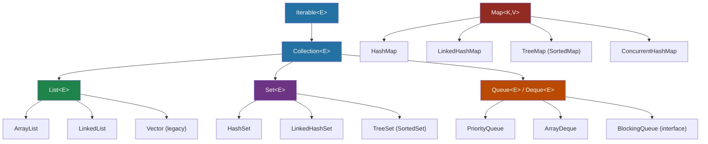

---
tags:
  - Java
  - Collections
  - DataStructures
difficulty: Intermediate
created: 2026-07-26
---

# 📚 Collection Hierarchy and Choosing

## TL;DR

Java Collections Framework: `Iterable → Collection → List / Set / Queue`; `Map` is separate.

- **ArrayList** — random access O(1), insertions O(n) in middle; backed by array
- **LinkedList** — O(1) head/tail insert; O(n) random access; more memory per node
- **HashSet / HashMap** — O(1) average; no ordering guarantee
- **TreeSet / TreeMap** — O(log n); sorted by natural order or Comparator
- **PriorityQueue** — min-heap; O(log n) insert/poll; O(1) peek
- **ArrayDeque** — resizable circular array; faster than `Stack` and `LinkedList` as queue
- `Collections.unmodifiableList()` wraps (original still mutable); `List.of()` is truly immutable (Java 9+)

---

## Intuition

Think of choosing a collection as choosing office furniture:

| Mental Model | Collection |
|---|---|
| Filing cabinet with numbered drawers | `ArrayList` — jump to any position instantly |
| Circular notebook — easy to add/remove first page | `LinkedList` — efficient at ends |
| Dictionary / phonebook | `HashMap` — look up by key in O(1) |
| Phone book with A–Z tabs | `TreeMap` — keys always sorted |
| Mailbox with exactly one slot per name | `HashSet` — no duplicates, fast membership |
| Priority inbox (most urgent first) | `PriorityQueue` — smallest element always on top |
| Double-ended stack of trays | `ArrayDeque` — push/pop from either end |

---

## How It Works

### Full Hierarchy



---

### Code Examples for Each Major Type

```java
import java.util.*;

public class CollectionShowcase {

    public static void main(String[] args) {

        // ── ArrayList ────────────────────────────────────────────────
        // Backed by Object[]; doubles capacity when full
        List<String> arrayList = new ArrayList<>();
        arrayList.add("Alpha");
        arrayList.add("Beta");
        arrayList.add(0, "Zeta");           // O(n) — shifts elements right
        String item = arrayList.get(1);     // O(1) — direct index access
        arrayList.remove("Beta");           // O(n) — linear scan + shift
        System.out.println("ArrayList: " + arrayList); // [Zeta, Alpha]

        // ── LinkedList ───────────────────────────────────────────────
        // Doubly-linked nodes; O(1) add/remove at ends, O(n) random access
        LinkedList<String> linkedList = new LinkedList<>();
        linkedList.addFirst("First");
        linkedList.addLast("Last");
        linkedList.add("Middle");
        System.out.println("LinkedList head: " + linkedList.peekFirst());

        // ── HashSet ──────────────────────────────────────────────────
        // Hash table; O(1) avg; no ordering; no duplicates
        Set<Integer> hashSet = new HashSet<>(Arrays.asList(3, 1, 4, 1, 5, 9, 2, 6));
        System.out.println("HashSet size: " + hashSet.size()); // 7 — deduplicated

        // ── LinkedHashSet ────────────────────────────────────────────
        // Hash table + doubly-linked list; preserves insertion order
        Set<String> linkedHashSet = new LinkedHashSet<>();
        linkedHashSet.add("banana");
        linkedHashSet.add("apple");
        linkedHashSet.add("cherry");
        System.out.println("LinkedHashSet: " + linkedHashSet); // [banana, apple, cherry]

        // ── TreeSet ──────────────────────────────────────────────────
        // Red-black tree; O(log n); elements sorted naturally
        Set<String> treeSet = new TreeSet<>(Arrays.asList("banana", "apple", "cherry"));
        System.out.println("TreeSet: " + treeSet); // [apple, banana, cherry]
        System.out.println("First: " + ((TreeSet<String>) treeSet).first()); // apple

        // ── HashMap ──────────────────────────────────────────────────
        Map<String, Integer> hashMap = new HashMap<>();
        hashMap.put("one", 1);
        hashMap.put("two", 2);
        hashMap.put("three", 3);
        hashMap.putIfAbsent("one", 99);          // no-op — key exists
        hashMap.merge("two", 10, Integer::sum);   // two → 12
        System.out.println("HashMap: " + hashMap);

        // ── LinkedHashMap ────────────────────────────────────────────
        // Iteration in insertion order — great for LRU caches
        Map<String, Integer> linkedHashMap = new LinkedHashMap<>();
        linkedHashMap.put("first", 1);
        linkedHashMap.put("second", 2);
        linkedHashMap.put("third", 3);
        System.out.println("LinkedHashMap: " + linkedHashMap); // predictable order

        // ── TreeMap ──────────────────────────────────────────────────
        // Red-black tree; keys sorted; O(log n) operations
        Map<String, Integer> treeMap = new TreeMap<>();
        treeMap.put("banana", 2);
        treeMap.put("apple", 1);
        treeMap.put("cherry", 3);
        System.out.println("TreeMap first key: " + ((TreeMap<?,?>) treeMap).firstKey()); // apple

        // ── PriorityQueue ────────────────────────────────────────────
        // Binary min-heap; poll() returns smallest element
        PriorityQueue<Integer> minHeap = new PriorityQueue<>();
        minHeap.addAll(Arrays.asList(5, 1, 8, 3));
        System.out.println("Min: " + minHeap.peek());  // 1 — O(1)
        System.out.println("Poll: " + minHeap.poll()); // 1 — O(log n)

        // Max-heap via reversed comparator
        PriorityQueue<Integer> maxHeap = new PriorityQueue<>(Comparator.reverseOrder());
        maxHeap.addAll(Arrays.asList(5, 1, 8, 3));
        System.out.println("Max: " + maxHeap.peek());  // 8

        // ── ArrayDeque ───────────────────────────────────────────────
        // Resizable circular array; use as stack OR queue; faster than Stack/LinkedList
        ArrayDeque<String> deque = new ArrayDeque<>();
        deque.push("A");         // stack push (addFirst)
        deque.push("B");
        System.out.println("Stack pop: " + deque.pop()); // B (LIFO)

        deque.offer("X");        // queue enqueue (addLast)
        deque.offer("Y");
        System.out.println("Queue poll: " + deque.poll()); // A (FIFO)

        // ── Immutability ─────────────────────────────────────────────
        List<String> mutable = new ArrayList<>(Arrays.asList("a", "b", "c"));
        List<String> unmodifiable = Collections.unmodifiableList(mutable);
        // unmodifiable.add("d"); // UnsupportedOperationException
        mutable.add("d");        // But this still works — unmodifiable is just a view!
        System.out.println("Unmodifiable sees mutation: " + unmodifiable);

        // List.of() is truly immutable and rejects nulls
        List<String> immutable = List.of("x", "y", "z");
        // immutable.add("w");  // UnsupportedOperationException
        // immutable.set(0, null); // NullPointerException

        // List.copyOf() makes an immutable deep copy
        List<String> copied = List.copyOf(mutable);
        mutable.add("e");
        System.out.println("CopyOf NOT affected: " + copied); // [a, b, c, d]
    }
}
```

---

### Complexity Reference Table

| Collection | Add (end) | Add (middle) | Get by Index | Contains | Order Preserved | Sorted | Thread-Safe | Null Allowed |
|---|---|---|---|---|---|---|---|---|
| `ArrayList` | O(1) amort. | O(n) | O(1) | O(n) | Yes (insertion) | No | No | Yes |
| `LinkedList` | O(1) | O(1)* | O(n) | O(n) | Yes (insertion) | No | No | Yes |
| `HashSet` | O(1) avg | — | — | O(1) avg | No | No | No | Yes (1 null) |
| `LinkedHashSet` | O(1) avg | — | — | O(1) avg | Yes (insertion) | No | No | Yes (1 null) |
| `TreeSet` | O(log n) | — | — | O(log n) | Yes (sorted) | Yes | No | No |
| `HashMap` | O(1) avg | — | — | O(1) avg | No | No | No | Yes (1 null key) |
| `LinkedHashMap` | O(1) avg | — | — | O(1) avg | Yes (insertion) | No | No | Yes |
| `TreeMap` | O(log n) | — | — | O(log n) | Yes (sorted) | Yes | No | No (keys) |
| `PriorityQueue` | O(log n) | — | peek O(1) | O(n) | No (heap order) | By priority | No | No |
| `ArrayDeque` | O(1) amort. | — | — | O(n) | Yes (insertion) | No | No | No |
| `ConcurrentHashMap` | O(1) avg | — | — | O(1) avg | No | No | Yes | No |

> *LinkedList add-at-node is O(1) once you hold the node reference; traversal to the position is O(n).

---

## Key Concepts

### List: ArrayList vs LinkedList

`ArrayList` stores elements in a contiguous `Object[]`. This gives cache-friendly sequential access and O(1) random access via index math. The cost is O(n) insertion in the middle because all subsequent elements must shift. When the backing array fills, Java allocates a new array of 1.5× size and copies — this is the **amortized O(1)** guarantee.

`LinkedList` stores each element in a `Node<E>` that holds `prev`, `next`, and `item` references. Head and tail insertions are O(1), but random access is O(n) because the list must be traversed. Each node adds ~32 bytes of overhead — significant for large collections.

**Rule of thumb**: default to `ArrayList`. Use `LinkedList` only if you're doing heavy manipulation at the head and never need random access — and even then, consider `ArrayDeque`.

### Set: HashSet vs LinkedHashSet vs TreeSet

- **HashSet** delegates entirely to `HashMap` internally. Element duplication is prevented via `equals()` + `hashCode()`. No ordering guarantee whatsoever.
- **LinkedHashSet** extends `HashSet` but uses a `LinkedHashMap` internally to maintain a doubly-linked list of buckets. Iteration is in insertion order. Slightly slower write operations but predictable iteration.
- **TreeSet** uses a `TreeMap` (red-black tree) internally. Elements must implement `Comparable` or a `Comparator` must be provided. O(log n) for all operations. Provides `first()`, `last()`, `headSet()`, `tailSet()`, `subSet()`.

### Queue/Deque: PriorityQueue vs ArrayDeque

`PriorityQueue` is a binary min-heap stored in an array. The root is always the smallest element (natural ordering). `poll()` removes and returns the root in O(log n). `peek()` is O(1). Useful for Dijkstra's algorithm, scheduling tasks by priority, "top K" problems.

`ArrayDeque` is a resizable circular array. It implements both `Queue` (FIFO via `offer/poll`) and `Deque` (double-ended via `push/pop/addFirst/addLast`). It is faster than `Stack` for LIFO and faster than `LinkedList` for FIFO because of better cache locality. Prefer `ArrayDeque` over `Stack` unconditionally.

### Immutability: Three Levels

```java
// Level 1: Synchronized wrapper — prevents concurrent modification
List<String> syncList = Collections.synchronizedList(new ArrayList<>());

// Level 2: Unmodifiable wrapper — prevents structural modification, BUT
//           if the underlying list changes, the view reflects it
List<String> base = new ArrayList<>(List.of("a", "b"));
List<String> unmod = Collections.unmodifiableList(base);
base.add("c");
System.out.println(unmod); // [a, b, c] — unmod "saw" the change!

// Level 3: Truly immutable — List.of(), Set.of(), Map.of() (Java 9+)
//           Cannot add, remove, set, or add nulls
List<String> immutable = List.of("a", "b", "c");
```

### Utility Methods

```java
List<Integer> nums = new ArrayList<>(Arrays.asList(3, 1, 4, 1, 5, 9));
Collections.sort(nums);                  // [1, 1, 3, 4, 5, 9]
Collections.shuffle(nums);               // random order
System.out.println(Collections.frequency(nums, 1));   // 2
System.out.println(Collections.disjoint(Set.of(1,2), Set.of(3,4))); // true
List<String> fives = Collections.nCopies(5, "x");     // [x, x, x, x, x]
Collections.reverse(nums);
int idx = Collections.binarySearch(nums, 3); // list must be sorted first
```

---

## Real-World Usage

- **Spring MVC** controller methods often return `List<T>` wrapped in `ResponseEntity`. Spring wraps service-layer results in `Collections.unmodifiableList()` to prevent accidental mutation by serialization layers.
- **Jackson** serializes `ArrayList`, `LinkedList`, `HashSet`, `TreeSet` — any `Iterable` — to JSON arrays. `Map` types become JSON objects. `LinkedHashMap` preserves key order in JSON output.
- **JPA/Hibernate** `em.createQuery(...).getResultList()` returns a plain `ArrayList`. Be careful not to pass this directly as an API response without defensive copying.

---

## Common Pitfalls

1. **Forgetting `equals()`/`hashCode()` for Set/Map keys** — if your custom class doesn't override both, `HashSet` uses identity equality and will allow "duplicate" objects that are semantically equal.
2. **Using `LinkedList` for queue when `ArrayDeque` is better** — `ArrayDeque` has no node overhead and better cache locality. The Java docs themselves recommend `ArrayDeque` over `LinkedList`.
3. **Trusting `Collections.unmodifiableList()` as truly immutable** — a caller holding a reference to the original mutable list can still modify it, and the unmodifiable view will reflect the change.
4. **Calling `remove(int)` vs `remove(Object)` on `List<Integer>`** — `list.remove(1)` removes by index; `list.remove(Integer.valueOf(1))` removes by value. Autoboxing doesn't resolve this ambiguity automatically.

---

## Review Questions

1. You need a collection that deduplicates entries, remembers insertion order, and allows O(1) membership tests. Which do you choose and why?
2. What is the difference between `List.copyOf(source)` and `Collections.unmodifiableList(source)` when the original `source` list is later modified?
3. Explain why `ArrayDeque` is preferred over both `Stack` and `LinkedList` for stack/queue operations.

---

## Related

- [[_MOC_Java_Collections|↑ Section MOC]]
- [[HashMap_and_Concurrent_Collections]]
- [[Sorting_and_Iteration]]
- [[_MOC_Java_Generics]]

---

*Tags: #Java #Collections #DataStructures #Intermediate*
