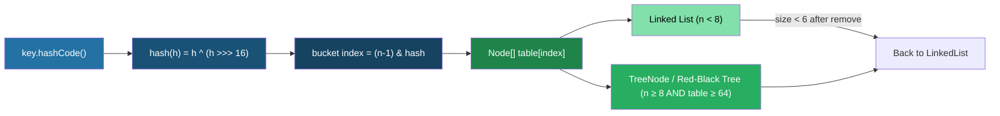

---
tags:
  - Java
  - Collections
  - HashMap
  - Concurrency
difficulty: Advanced
created: 2026-07-26
---

# 🗺️ HashMap and Concurrent Collections

## TL;DR

- **HashMap** uses an array of buckets with chaining (linked list, then `TreeNode` at threshold 8 / table size ≥ 64); hash is computed via `key.hashCode()` XORed with `h >>> 16`; initial capacity 16, load factor 0.75, resize doubles capacity.
- **ConcurrentHashMap** (Java 8+) uses per-bucket `synchronized` + CAS for empty buckets — no global lock; volatile reads; `computeIfAbsent` is atomic; no null keys or values.
- **CopyOnWriteArrayList** copies the entire backing array on every write — ideal for read-heavy, infrequent-write scenarios (event listener lists).
- **BlockingQueue** variants (`ArrayBlockingQueue`, `LinkedBlockingQueue`) enable producer-consumer patterns without explicit locking.

---

## Intuition

Imagine a post office with **16 pigeonholes** (buckets). Each letter's destination (hash) determines its pigeonhole. When one box gets crowded (≥8 letters), the postmaster alphabetically sorts that box using a tree — *treeification*. When 75% of all boxes have at least one letter, the post office doubles to 32 boxes and reshuffles every letter — *rehashing*.

`ConcurrentHashMap` is the same post office but with individual locks per pigeonhole — clerks can work on different boxes simultaneously.

---

## How It Works

### Internal Data Flow



---

### HashMap Internals: Annotated Code

```java
import java.util.*;
import java.util.concurrent.*;

// ── Part 1: Custom Key with correct hashCode / equals ─────────────
class Point {
    final int x, y;

    Point(int x, int y) { this.x = x; this.y = y; }

    @Override
    public boolean equals(Object o) {
        if (this == o) return true;
        if (!(o instanceof Point)) return false;
        Point p = (Point) o;
        return x == p.x && y == p.y;
    }

    @Override
    public int hashCode() {
        // Good: combine fields in a way that distributes evenly
        return 31 * x + y;
    }

    @Override
    public String toString() { return "(" + x + "," + y + ")"; }
}

public class HashMapInternals {

    public static void main(String[] args) {

        // ── HashMap basic usage ──────────────────────────────────────
        Map<Point, String> map = new HashMap<>();
        map.put(new Point(1, 2), "A");
        map.put(new Point(3, 4), "B");

        // Works because equals+hashCode are properly overridden
        System.out.println(map.get(new Point(1, 2))); // "A"

        // ── Exploring bucket behavior (conceptual) ───────────────────
        // Default capacity = 16
        // Load factor = 0.75 → resize when size > 16 * 0.75 = 12
        // After resize: capacity = 32, threshold = 24
        Map<String, Integer> wordCount = new HashMap<>(32, 0.75f); // explicit settings
        String[] words = {"apple", "banana", "apple", "cherry", "banana", "apple"};
        for (String word : words) {
            wordCount.merge(word, 1, Integer::sum);
        }
        System.out.println("Word counts: " + wordCount);

        // ── Useful Java 8+ Map methods ──────────────────────────────
        Map<String, List<String>> grouping = new HashMap<>();
        grouping.computeIfAbsent("fruits", k -> new ArrayList<>()).add("apple");
        grouping.computeIfAbsent("fruits", k -> new ArrayList<>()).add("banana");
        grouping.computeIfAbsent("veggies", k -> new ArrayList<>()).add("carrot");

        grouping.getOrDefault("missing", Collections.emptyList())
                .forEach(System.out::println); // nothing printed

        grouping.replaceAll((k, v) -> {
            Collections.sort(v);
            return v;
        });

        // forEach
        grouping.forEach((category, items) ->
            System.out.println(category + " → " + items));

        // ── ConcurrentHashMap ────────────────────────────────────────
        // Thread-safe; per-bucket locking; no null keys or values
        Map<String, Integer> concurrentMap = new ConcurrentHashMap<>();
        concurrentMap.put("a", 1);
        concurrentMap.put("b", 2);

        // Atomic conditional operations
        concurrentMap.putIfAbsent("c", 3);
        concurrentMap.computeIfAbsent("d", k -> k.length()); // atomic — safe under concurrency
        concurrentMap.compute("a", (k, v) -> v == null ? 1 : v + 10); // a → 11

        // Aggregate operations (approximate under concurrent access)
        long count = concurrentMap.mappingCount();
        System.out.println("ConcurrentHashMap size: " + count);

        // ── CopyOnWriteArrayList ─────────────────────────────────────
        // Every write creates a new copy of the backing array
        // Reads are lock-free and use a snapshot — safe during iteration
        List<String> listeners = new CopyOnWriteArrayList<>();
        listeners.add("Listener1");
        listeners.add("Listener2");

        // Iterating while another thread might add — SAFE, no CME
        for (String listener : listeners) {
            System.out.println("Notifying: " + listener);
            // Simulating: another thread adds "Listener3" here
            // Iterator uses the original snapshot — sees only Listener1, Listener2
        }

        // ── BlockingQueue: Producer-Consumer ─────────────────────────
        BlockingQueue<String> queue = new ArrayBlockingQueue<>(10); // bounded

        // Producer thread
        new Thread(() -> {
            try {
                queue.put("task-1"); // blocks if full
                queue.put("task-2");
                queue.put("POISON"); // sentinel to signal done
            } catch (InterruptedException e) {
                Thread.currentThread().interrupt();
            }
        }).start();

        // Consumer thread
        new Thread(() -> {
            try {
                while (true) {
                    String task = queue.take(); // blocks if empty
                    if ("POISON".equals(task)) break;
                    System.out.println("Processing: " + task);
                }
            } catch (InterruptedException e) {
                Thread.currentThread().interrupt();
            }
        }).start();
    }
}
```

---

### HashMap `put()` Logic — Pseudocode with Commentary

```java
// Simplified pseudocode of HashMap.put(K key, V value)
void put(K key, V value) {
    // 1. Compute hash — XOR high bits into low bits to spread entropy
    int hash = (key == null) ? 0 : key.hashCode() ^ (key.hashCode() >>> 16);

    // 2. If table is null or empty, resize (lazy initialization)
    if (table == null || table.length == 0) resize();

    // 3. Compute bucket index
    int index = (table.length - 1) & hash;  // fast modulo via bit-AND

    // 4. If bucket is empty — CAS insert (fast path, no lock in CHM)
    if (table[index] == null) {
        table[index] = new Node(hash, key, value, null);
        return;
    }

    // 5. Bucket has entries — traverse to find existing key or tail
    Node current = table[index];
    if (current instanceof TreeNode) {
        // Treeified bucket — O(log n) insertion
        ((TreeNode) current).putTreeVal(this, table, hash, key, value);
    } else {
        // Linked list — O(n) traversal
        int binCount = 0;
        for (Node e = current; ; e = e.next, binCount++) {
            if (e.hash == hash && Objects.equals(e.key, key)) {
                e.value = value; // Update existing
                return;
            }
            if (e.next == null) {
                e.next = new Node(hash, key, value, null); // Append
                if (binCount >= TREEIFY_THRESHOLD - 1) // 7 (0-indexed)
                    treeifyBin(table, hash); // Convert to TreeNode if table >= 64
                break;
            }
        }
    }

    // 6. Increment size; resize if size > capacity * loadFactor
    if (++size > threshold) resize(); // threshold = capacity * 0.75
}
```

---

### Concurrent Collections Comparison Table

| Collection | Thread-Safe | Read Perf | Write Perf | Key Use Case | Null Keys/Values |
|---|---|---|---|---|---|
| `HashMap` | No | O(1) avg | O(1) avg | Single-threaded maps | Yes (1 null key) |
| `Hashtable` | Yes (global lock) | O(1) avg | O(1) avg — slow due to lock | Legacy; avoid | No |
| `ConcurrentHashMap` | Yes (per-bucket) | O(1) avg, lock-free reads | O(1) avg | Thread-safe maps | No |
| `Collections.synchronizedMap` | Yes (global lock) | O(1) avg | O(1) avg | Wrapping existing map | Depends on wrapped |
| `CopyOnWriteArrayList` | Yes | O(1), no lock | O(n) — copy array | Read-heavy listener lists | Yes |
| `ArrayBlockingQueue` | Yes | O(1) | O(1) (bounded, blocks) | Producer-consumer | No |
| `LinkedBlockingQueue` | Yes | O(1) | O(1) (optionally bounded) | High-throughput queue | No |
| `PriorityBlockingQueue` | Yes | O(log n) | O(log n) | Priority producer-consumer | No |

---

## Key Concepts

### HashMap Internals Deep Dive

The bucket array (`Node<K,V>[] table`) starts null and is lazily initialized to capacity 16 on first use. Each `Node` holds: `hash`, `key`, `value`, `next`. The bucket index formula `(n-1) & hash` is a fast power-of-two modulo. The hash spreading step `h ^ (h >>> 16)` mixes high-order bits into low-order bits to reduce collisions for poorly distributed `hashCode()` implementations.

**Treeification** occurs when a single bucket accumulates ≥8 entries **AND** the overall table has ≥64 slots. Below 64, a full resize is preferred over treeification. Treeified buckets revert to linked lists when their size drops to ≤6 after removals.

### Java 8 Treeification

```java
static final int TREEIFY_THRESHOLD = 8;   // Tree if bucket ≥ 8
static final int UNTREEIFY_THRESHOLD = 6; // Back to list if bucket ≤ 6
static final int MIN_TREEIFY_CAPACITY = 64; // Only treeify if table ≥ 64
```

Below 64 buckets, a resize is cheaper than treeifying — the entries get redistributed across twice as many buckets, reducing collision depth.

### ConcurrentHashMap (Java 8+)

Java 8 replaced Java 7's segment-based locking with a finer-grained approach:
- **Empty bucket** → CAS (compare-and-swap) insert; no lock acquired
- **Non-empty bucket** → `synchronized` on the bucket's head node only
- **Reads** → volatile reads of `Node.val` and `Node.next`; never block
- `computeIfAbsent`, `compute`, `merge` — all atomic at the bucket level
- `mappingCount()` returns a `long` (preferred over `size()` for large maps)
- Null keys AND null values are **prohibited** (ambiguity: does `get(key)` return null because key absent or because value is null?)

### Special-Purpose Maps

```java
// WeakHashMap — keys collected by GC when no strong reference
Map<Object, String> weakMap = new WeakHashMap<>();
Object key = new Object();
weakMap.put(key, "data");
key = null; // GC may now collect the entry — useful for caches

// IdentityHashMap — uses == instead of equals() for key comparison
Map<String, String> identityMap = new IdentityHashMap<>();
String a = new String("hello");
String b = new String("hello");
identityMap.put(a, "first");
identityMap.put(b, "second"); // different reference → two entries!
System.out.println(identityMap.size()); // 2 (would be 1 in HashMap)

// EnumMap — highly optimized for enum keys; backed by array indexed by ordinal
enum Day { MON, TUE, WED, THU, FRI, SAT, SUN }
Map<Day, String> schedule = new EnumMap<>(Day.class);
schedule.put(Day.MON, "Stand-up at 9am");
// Iteration in enum declaration order; no hashing overhead
```

---

## Real-World Usage

- **Spring ApplicationContext** uses `ConcurrentHashMap` for its bean registry — multiple threads may request bean initialization concurrently; `computeIfAbsent` ensures only one instance is created.
- **Caffeine** (Spring Boot's default cache) uses `ConcurrentHashMap` extended with a window-TinyLFU eviction policy. Understanding `ConcurrentHashMap`'s atomic operations is essential to understanding Caffeine's thread-safety guarantees.
- **Event bus frameworks** (Guava EventBus, Spring's `ApplicationEventMulticaster`) use `CopyOnWriteArrayList` for their listener registries — reads (event dispatch) vastly outnumber writes (listener registration/removal).

---

## Common Pitfalls

1. **Mutable key in HashMap** — if you modify a field used in `hashCode()` after inserting the key, the bucket index changes but the entry stays in the old bucket. `get()` with the modified key will return `null` — effectively a memory leak.
2. **ConcurrentModificationException** — iterating a `HashMap` while structurally modifying it (add/remove) in the same thread throws CME. Use `Iterator.remove()`, `removeIf()`, or `entrySet().stream().filter().collect()` instead.
3. **Null in ConcurrentHashMap** — `concurrentMap.put(null, value)` and `concurrentMap.put(key, null)` both throw `NullPointerException`. This is by design — null return from `get()` must unambiguously mean "key not present."
4. **Java 7 HashMap infinite loop under concurrent access** — two threads resizing `HashMap` simultaneously could create a cycle in the linked list during rehashing, causing `get()` to loop forever. This is fixed in Java 8 (separate `hi`/`lo` chains during resize), but using `HashMap` in multithreaded code is still wrong — use `ConcurrentHashMap`.

---

## Review Questions

1. Walk through what happens internally when you call `hashMap.put("key", "value")` on a HashMap with 12 existing entries (capacity 16, load factor 0.75).
2. Why does `ConcurrentHashMap` prohibit null keys and values, while `HashMap` allows them?
3. When would you choose `CopyOnWriteArrayList` over `Collections.synchronizedList(new ArrayList<>())`? What is the performance trade-off?

---

## Related

- [[_MOC_Java_Collections|↑ Section MOC]]
- [[Collection_Hierarchy_and_Choosing]]
- [[Sorting_and_Iteration]]
- [[_MOC_Java_Concurrency]]

---

*Tags: #Java #Collections #HashMap #Concurrency #Advanced*
