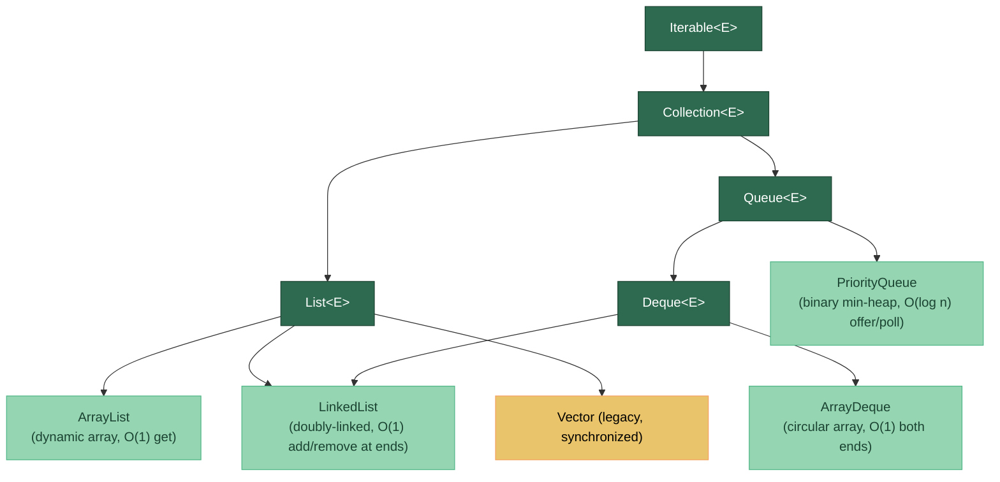

# 📋 Lists and Queues

> [!abstract] TL;DR
> **ArrayList** offers O(1) random access and is the default List choice; **LinkedList** offers O(1) head/tail insertion but is rarely worth it due to poor cache locality. **ArrayDeque** outperforms both `Stack` and `LinkedList` as a stack or queue. **PriorityQueue** is a binary min-heap giving O(log n) offer/poll and O(1) peek. Prefer **List.of()** for immutable lists and **ArrayDeque** for any LIFO/FIFO need.

---

## Intuition

Think of a supermarket:

- **ArrayList** = numbered shelf slots. Grabbing item #42 takes one step regardless of how full the shelf is, but inserting in the middle means sliding every item over.
- **LinkedList** = a chain of shopping carts, each cart pointing to the next. Adding/removing at the front or back is just a pointer swap, but finding cart #42 means walking the whole chain.
- **ArrayDeque** = a circular conveyor belt — you can add or remove from either end instantly, and there's no wasted pointer overhead.
- **PriorityQueue** = a priority lane at checkout — the most urgent customer (lowest priority value) always moves to the front automatically.

---

## How It Works

### Collection Hierarchy — Lists and Queues



### Performance Comparison Table

| Operation | ArrayList | LinkedList | ArrayDeque | PriorityQueue |
|-----------|-----------|------------|------------|---------------|
| `get(i)` | **O(1)** | O(n) | O(n) | O(n) |
| `add(E)` at tail | O(1) amortized | **O(1)** | **O(1)** | O(log n) |
| `add(i, E)` at index | O(n) | O(n)* | — | — |
| `remove(i)` | O(n) | O(n)* | — | — |
| `addFirst/addLast` | — | **O(1)** | **O(1)** | — |
| `peek()` | — | O(1) | O(1) | **O(1)** |
| `poll()` | — | O(1) | O(1) | **O(log n)** |
| Memory overhead | Low | High (2 pointers/node) | Low | Low |

*LinkedList add/remove at head/tail is O(1); at an arbitrary index it still requires O(n) traversal.

---

## Key Concepts

### 1. ArrayList — The Default Choice

```java
import java.util.*;

public class ListDemo {

    public static void arrayListDemo() {
        // Specify initial capacity to avoid repeated resizing
        List<String> names = new ArrayList<>(64);

        names.add("Alice");
        names.add("Bob");
        names.add("Charlie");

        // O(1) random access
        String first = names.get(0);  // "Alice"

        // O(n) insert in middle — slides elements right
        names.add(1, "Zara");         // [Alice, Zara, Bob, Charlie]

        // O(n) remove by index — slides elements left
        names.remove(2);              // removes "Bob"

        // Resize: backing array doubles when capacity is exceeded
        // Default initial capacity = 10; grows to 15, 22, 33, ...

        // Index-loop is fastest — no iterator object, direct array access
        for (int i = 0; i < names.size(); i++) {
            System.out.println(names.get(i));
        }

        // subList — backed by the original! Mutations propagate.
        List<String> sub = names.subList(0, 2);
        sub.clear();          // removes elements from names too!
        // Safe copy to avoid this:
        List<String> safeSub = new ArrayList<>(names.subList(0, 2));
    }

    // Immutable lists (Java 9+)
    public static void immutableLists() {
        List<String> fixed = List.of("a", "b", "c");    // null rejected, immutable
        // fixed.add("d");  → UnsupportedOperationException

        List<String> copy = List.copyOf(new ArrayList<>(List.of("x", "y")));
        // copy is a defensive immutable snapshot

        // List.of() vs Arrays.asList():
        // Arrays.asList allows set() but not add/remove; List.of allows nothing
        List<String> semiMutable = Arrays.asList("p", "q", "r");
        semiMutable.set(0, "P");    // OK
        // semiMutable.add("s");    → UnsupportedOperationException
    }
}
```

### 2. LinkedList — When (Rarely) to Use It

```java
public class LinkedListDemo {

    public static void whenToUse() {
        // LinkedList implements BOTH List and Deque
        LinkedList<Integer> deque = new LinkedList<>();

        // O(1) operations at head/tail
        deque.addFirst(1);   // [1]
        deque.addLast(2);    // [1, 2]
        deque.addFirst(0);   // [0, 1, 2]
        int head = deque.removeFirst();  // 0, list = [1, 2]

        // Memory cost: each node = data + 2 pointers (~40 bytes per node on 64-bit JVM)
        // vs ArrayList: data stored directly in array (~16 bytes per reference)

        // Cache miss cost: linked-list nodes are scattered in heap memory;
        // iterating causes repeated cache misses unlike ArrayList's contiguous array.

        // Verdict: prefer ArrayDeque for queue/deque needs; prefer ArrayList for list needs.
        // LinkedList is mainly useful if you hold iterators and do mid-list insertions
        // while iterating — Iterator.remove() is O(1) vs O(n) for ArrayList.
    }
}
```

### 3. ArrayDeque — Preferred Stack and Queue

```java
public class ArrayDequeDemo {

    public static void stackUsage() {
        // ArrayDeque as Stack (faster than java.util.Stack which is synchronized)
        Deque<String> stack = new ArrayDeque<>();
        stack.push("first");    // addFirst
        stack.push("second");   // addFirst → [second, first]
        String top = stack.pop();          // removeFirst → "second"
        String peek = stack.peek();        // peekFirst → "first", no remove

        // Never use java.util.Stack — it extends Vector (synchronized, legacy)
    }

    public static void queueUsage() {
        // ArrayDeque as Queue (FIFO)
        Queue<String> queue = new ArrayDeque<>();
        queue.offer("a");    // enqueue at tail
        queue.offer("b");
        queue.offer("c");

        String front = queue.peek();   // "a", no remove
        String removed = queue.poll(); // "a", removes from head

        // Deque full API:
        Deque<String> d = new ArrayDeque<>();
        d.offerFirst("X");  // add to head
        d.offerLast("Y");   // add to tail
        d.peekFirst();      // view head without removing
        d.peekLast();       // view tail without removing
        d.pollFirst();      // remove and return head
        d.pollLast();       // remove and return tail
    }
}
```

### 4. PriorityQueue — Binary Min-Heap

```java
import java.util.PriorityQueue;
import java.util.Comparator;

public class PriorityQueueDemo {

    record Task(String name, int priority) {}

    public static void minHeap() {
        // Default: min-heap (natural ordering)
        PriorityQueue<Integer> minHeap = new PriorityQueue<>();
        minHeap.offer(5);
        minHeap.offer(1);
        minHeap.offer(3);

        System.out.println(minHeap.peek());   // 1 — min element, O(1)
        System.out.println(minHeap.poll());   // 1 — removes min, O(log n)
        System.out.println(minHeap.poll());   // 3
    }

    public static void maxHeap() {
        // Max-heap: reverse the comparator
        PriorityQueue<Integer> maxHeap = new PriorityQueue<>(Comparator.reverseOrder());
        maxHeap.offer(5);
        maxHeap.offer(1);
        maxHeap.offer(3);
        System.out.println(maxHeap.poll());   // 5
    }

    public static void customObjects() {
        // Priority by task priority (lower number = higher urgency)
        PriorityQueue<Task> taskQueue = new PriorityQueue<>(
            Comparator.comparingInt(Task::priority)
        );
        taskQueue.offer(new Task("Low priority",  10));
        taskQueue.offer(new Task("High priority",  1));
        taskQueue.offer(new Task("Medium",         5));

        Task next = taskQueue.poll();   // Task{name=High priority, priority=1}

        // Note: PriorityQueue does NOT guarantee FIFO order for equal-priority elements
        // Iteration order is NOT sorted — only poll() guarantees order
    }

    public static void heapSort() {
        // Drain a PriorityQueue to get sorted output:
        PriorityQueue<Integer> pq = new PriorityQueue<>(List.of(5, 2, 8, 1, 9));
        List<Integer> sorted = new ArrayList<>();
        while (!pq.isEmpty()) sorted.add(pq.poll());  // [1, 2, 5, 8, 9]
    }
}
```

### 5. Iterator vs Index Loop Performance

```java
public class IterationDemo {

    public static void comparison(List<Integer> data) {
        // For ArrayList: index loop is marginally faster (no iterator object allocation)
        // For LinkedList: iterator IS faster (index loop = O(n^2) due to get(i) traversal)

        // Best for ArrayList:
        for (int i = 0; i < data.size(); i++) {
            process(data.get(i));  // O(1) direct array access
        }

        // Best for LinkedList (and works for ArrayList too):
        for (Integer item : data) {  // uses Iterator — O(1) per step for both
            process(item);
        }

        // Stream — functionally clean, slight overhead but JIT optimizes well:
        data.stream().forEach(ListDemo::process);
    }

    private static void process(int v) {}
}
```

---

## Real-World Notes

- **Spring Data page results** return `List<T>` backed by `ArrayList`. If you call `subList()` to slice pages, copy it first — the backing list reference is kept alive causing memory leaks in long-lived caches.
- **BFS/DFS in graph algorithms**: use `ArrayDeque` for the frontier queue in BFS and as a stack in iterative DFS. It avoids the synchronization overhead of `Stack` and the node overhead of `LinkedList`.
- **Event queues**: `PriorityQueue` is not thread-safe. Use `PriorityBlockingQueue` in concurrent settings (e.g., a thread-pool's task scheduler).
- **K-th largest element**: keep a min-heap of size K while streaming data — when the heap exceeds K elements, poll the minimum. The heap's peek() is the K-th largest.
- **List.of() in tests**: use `List.of()` for quick immutable fixtures; it throws on null, which catches accidental `null` test data early.

---

## Common Pitfalls

| Pitfall | Example | Consequence | Fix |
|---------|---------|-------------|-----|
| `subList` mutation surprise | `list.subList(0,3).clear()` | Modifies original list | Copy with `new ArrayList<>(subList)` |
| Using `Stack` class | `new Stack<>()` | Synchronized legacy class; slow | Use `ArrayDeque` with `push/pop` |
| `LinkedList` for random access | `linkedList.get(n/2)` | O(n) traversal per call → O(n²) loop | Use `ArrayList` for index access |
| `PriorityQueue` assumes sorted iteration | `for (var x : pq)` | Iteration order is NOT sorted | Drain with `poll()` loop for sorted output |
| Forgetting initial capacity | `new ArrayList<>()` in hot loop | Repeated array copies as it grows from 10 | Pre-size: `new ArrayList<>(expectedSize)` |
| `null` in `List.of()` | `List.of("a", null)` | `NullPointerException` at construction | Use `Arrays.asList()` if null is required |

---

## Related Notes

- [[_MOC_Java_Collections|↑ Section MOC — Java Collections]]
- [[Sets_and_Trees]] — HashSet, TreeSet, NavigableSet
- [[Maps_and_Hashing]] — HashMap, LinkedHashMap, TreeMap
- [[Java_Types_and_Variables]] — autoboxing overhead in generic collections
- [[Streams_and_Pipelines]] — processing lists with streams

---

## Review Questions

1. A developer uses `LinkedList<String>` to store 10,000 log entries and then calls `entries.get(5000)` in a loop that runs 10,000 times. What is the total time complexity, and how should they fix it?

2. Explain why `ArrayDeque` is preferred over `java.util.Stack` and `LinkedList` for both stack and queue use cases. What specific characteristics make it better?

3. You need to find the top-5 highest-priority tasks from a stream of 1 million tasks without loading them all into memory at once. Which data structure do you use, how large do you keep it, and what operation triggers when it exceeds that size?

---

#Java #Collections #List #Queue #ArrayList #LinkedList #ArrayDeque #PriorityQueue #Intermediate
