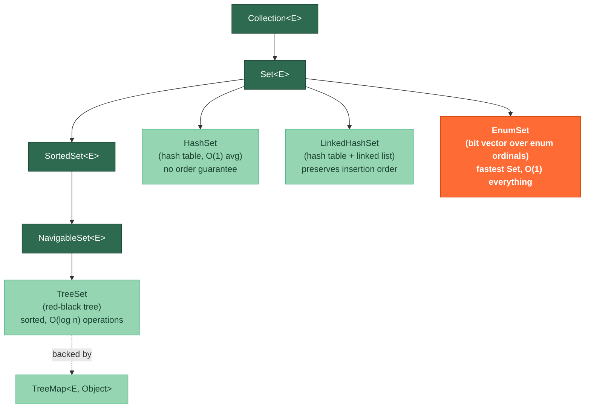

# 🌳 Sets and Trees

> [!abstract] TL;DR
> **HashSet** gives O(1) average add/contains/remove and is the default choice when order doesn't matter. **LinkedHashSet** preserves insertion order with minimal overhead. **TreeSet** keeps elements sorted in a red-black tree, giving O(log n) operations and powerful range-query methods (`headSet`, `tailSet`, `floor`, `ceiling`). **EnumSet** is the fastest Set of all — a bit-vector over enum ordinals with O(1) everything and zero boxing. Use the right Set for the right contract: membership → HashSet, sorted range queries → TreeSet, all-of-one-enum-type → EnumSet.

---

## Intuition

Imagine organizing books in a library:

- **HashSet** = books thrown into numbered bins by a hash of their ISBN. Finding a book is one lookup, but walking the shelf gives you random order.
- **LinkedHashSet** = same hash bins, but each book also carries a "next arrival" tag. You can iterate in the order books were added.
- **TreeSet** = books arranged alphabetically on a shelf. Finding a book is fast (binary search on the shelf), and you can ask "give me all books whose title comes after N" trivially.
- **EnumSet** = a single 64-bit bitmask where each bit represents one day of the week (or any enum). Checking membership is a single bit-AND — nothing is faster.

---

## How It Works

### Set Hierarchy and Implementations



### Performance and Characteristics Comparison

| Feature | HashSet | LinkedHashSet | TreeSet | EnumSet |
|---------|---------|---------------|---------|---------|
| `add` | O(1) avg | O(1) avg | O(log n) | O(1) |
| `contains` | O(1) avg | O(1) avg | O(log n) | O(1) |
| `remove` | O(1) avg | O(1) avg | O(log n) | O(1) |
| Iteration order | None | Insertion order | Sorted (natural/Comparator) | Enum declaration order |
| Null elements | 1 allowed | 1 allowed | Not allowed | Not allowed |
| Memory | Low | Medium | Medium-High | Extremely low (1–2 longs) |
| When to use | Default membership | Ordered dedup | Range queries, sorted view | Flags from a single enum |

---

## Key Concepts

### 1. HashSet and LinkedHashSet

```java
import java.util.*;

public class HashSetDemo {

    public static void hashSetBasics() {
        Set<String> visited = new HashSet<>();

        visited.add("alice.com");
        visited.add("bob.com");
        visited.add("alice.com");  // duplicate — silently ignored

        System.out.println(visited.size());         // 2
        System.out.println(visited.contains("alice.com")); // true
        visited.remove("bob.com");

        // Iteration order is NOT guaranteed — may differ between JVM runs
        for (String site : visited) {
            System.out.println(site);   // arbitrary order
        }

        // Initial capacity and load factor
        // Default: capacity=16, load factor=0.75 (resize at 12 entries)
        // Resize doubles capacity → O(n) rehash event, amortized O(1) per add
        Set<String> sized = new HashSet<>(256, 0.75f);  // pre-sized to avoid rehash
    }

    public static void linkedHashSetOrdering() {
        // LinkedHashSet: same O(1) operations, but iteration follows insertion order
        Set<String> recent = new LinkedHashSet<>();
        recent.add("step1");
        recent.add("step2");
        recent.add("step3");
        recent.add("step1");  // no-op: already present, ORDER NOT UPDATED

        System.out.println(recent);  // [step1, step2, step3]

        // Use case: LRU cache base structure, dedup while preserving order
    }
}
```

### 2. TreeSet and NavigableSet

```java
import java.util.*;

public class TreeSetDemo {

    public static void sortedOperations() {
        // Natural ordering (String is Comparable)
        TreeSet<String> names = new TreeSet<>();
        names.add("Charlie");
        names.add("Alice");
        names.add("Bob");

        System.out.println(names.first());   // "Alice"
        System.out.println(names.last());    // "Charlie"

        // NavigableSet methods — range queries
        System.out.println(names.floor("B"));    // "Alice"  — greatest element ≤ "B"
        System.out.println(names.ceiling("B"));  // "Bob"    — least element ≥ "B"
        System.out.println(names.lower("Bob"));  // "Alice"  — strictly less than "Bob"
        System.out.println(names.higher("Bob")); // "Charlie" — strictly greater than "Bob"

        // headSet / tailSet / subSet — views backed by the original TreeSet
        SortedSet<String> upToC = names.headSet("Charlie");       // [Alice, Bob] — exclusive
        SortedSet<String> fromB  = names.tailSet("Bob");           // [Bob, Charlie] — inclusive
        NavigableSet<String> range = names.subSet("Alice", true, "Charlie", false); // [Alice, Bob]

        // Mutations to the view propagate to the original set
        // fromB.add("Zara");  → also adds to names
    }

    public static void customComparator() {
        // Sort integers by absolute value
        TreeSet<Integer> byAbs = new TreeSet<>(Comparator.comparingInt(Math::abs));
        byAbs.add(-3);
        byAbs.add(1);
        byAbs.add(-2);
        System.out.println(byAbs);  // [1, -2, -3]

        // Chaining comparators
        TreeSet<String> byLengthThenAlpha = new TreeSet<>(
            Comparator.comparingInt(String::length)
                      .thenComparing(Comparator.naturalOrder())
        );
        byLengthThenAlpha.addAll(List.of("banana", "fig", "apple", "date", "kiwi"));
        System.out.println(byLengthThenAlpha); // [fig, date, kiwi, apple, banana]
    }

    public static void treeMapDemo() {
        // TreeSet is backed by a TreeMap<E, Object>
        // Use TreeMap directly for key-value pairs with sorted-key queries
        TreeMap<String, Integer> scores = new TreeMap<>();
        scores.put("Alice", 95);
        scores.put("Bob",   78);
        scores.put("Zara",  88);

        // Red-black tree guarantees: O(log n) put/get/remove, height ≤ 2*log(n+1)
        System.out.println(scores.firstKey());   // "Alice"
        System.out.println(scores.lastKey());    // "Zara"

        // floorKey / ceilingKey
        System.out.println(scores.floorKey("C"));    // "Bob"
        System.out.println(scores.ceilingKey("C"));  // "Zara"

        // headMap / tailMap — useful for pagination or range filters
        Map<String, Integer> aToM = scores.headMap("N");  // keys < "N"
    }
}
```

### 3. EnumSet and EnumMap — The Fastest Collections

```java
import java.util.*;

public class EnumDemo {

    enum Day { MON, TUE, WED, THU, FRI, SAT, SUN }

    public static void enumSetUsage() {
        // EnumSet — bit-vector, faster than HashSet for enum types
        EnumSet<Day> weekdays = EnumSet.of(Day.MON, Day.TUE, Day.WED, Day.THU, Day.FRI);
        EnumSet<Day> weekend  = EnumSet.of(Day.SAT, Day.SUN);
        EnumSet<Day> allDays  = EnumSet.allOf(Day.class);
        EnumSet<Day> noDays   = EnumSet.noneOf(Day.class);

        // Set operations are bitwise — extremely fast
        EnumSet<Day> workWeek = EnumSet.copyOf(weekdays);
        workWeek.retainAll(allDays);   // intersection — single AND instruction

        System.out.println(weekdays.contains(Day.SAT));  // false, O(1) bit check
        System.out.println(weekdays.size());             // 5

        // Iteration order follows enum declaration order, always predictable
        for (Day d : weekdays) System.out.print(d + " ");  // MON TUE WED THU FRI
    }

    public static void enumMapUsage() {
        // EnumMap — array indexed by enum ordinal, faster than HashMap for enum keys
        EnumMap<Day, String> schedule = new EnumMap<>(Day.class);
        schedule.put(Day.MON, "Standup 9am");
        schedule.put(Day.FRI, "Retrospective 3pm");

        System.out.println(schedule.get(Day.MON));  // O(1) array index, no hashing
        // EnumMap never needs rehashing; fixed-size array = perfect performance
    }
}
```

### 4. Comparator.comparing() Chains

```java
import java.util.*;

public class ComparatorDemo {

    record Employee(String name, String department, int salary) {}

    public static void comparatorChaining() {
        List<Employee> employees = List.of(
            new Employee("Alice",   "Engineering", 95_000),
            new Employee("Bob",     "Marketing",   70_000),
            new Employee("Charlie", "Engineering", 85_000),
            new Employee("Zara",    "Marketing",   70_000)
        );

        // Chain: primary = department, secondary = salary desc, tertiary = name
        Comparator<Employee> comp = Comparator
            .comparing(Employee::department)                          // asc
            .thenComparingInt(Employee::salary).reversed()            // desc
            .thenComparing(Employee::name);                           // asc

        List<Employee> sorted = employees.stream().sorted(comp).toList();

        // Use same comparator in TreeSet/TreeMap for consistent ordering
        TreeSet<Employee> sortedSet = new TreeSet<>(comp);
        sortedSet.addAll(employees);
    }
}
```

---

## Real-World Notes

- **Deduplication pipelines**: stream into a `LinkedHashSet` to deduplicate while preserving first-seen order — a common pattern for processing event logs.
- **Feature flags with enums**: `EnumSet<Feature> enabledFeatures` is cleaner, faster, and more type-safe than `Set<String>` for feature toggles. It also serializes compactly.
- **Range queries in databases**: `TreeMap<LocalDate, DailyReport>` mirrors a B-tree index — `subMap(start, end)` gives the same "range scan" semantics as an SQL `BETWEEN` clause.
- **TreeSet as a priority structure**: when you need both sorted iteration AND contains/remove by value (not just min/max), `TreeSet` beats `PriorityQueue` — PQ can't remove arbitrary elements in O(log n) without a trick.
- **Null in TreeSet**: adding `null` throws `NullPointerException` because comparison calls `compareTo(null)`. If null-safety is needed, use `Comparator.nullsFirst/nullsLast`.

---

## Common Pitfalls

| Pitfall | Example | Consequence | Fix |
|---------|---------|-------------|-----|
| `equals/hashCode` mismatch in HashSet | Custom class without `hashCode` override | Duplicate entries allowed, `contains` returns false | Always override both `equals` and `hashCode` together |
| Mutating a TreeSet element | Changing a field used in comparison after adding | Set ordering corrupted; `contains` fails | Make keys immutable or re-insert after mutation |
| `null` in TreeSet/EnumSet | `treeSet.add(null)` | `NullPointerException` | Guard inputs; use `HashSet` if null is valid |
| Using `subSet/headSet` result after backing set change | `SortedSet<X> view = ts.headSet(x); ts.clear();` | View reflects the cleared set | Work with a copy if the backing set changes |
| `LinkedHashSet` insertion-order confusion | Adding existing element expects order update | Order is NOT updated on re-add | Remove and re-add to move element to end |
| `EnumSet` for non-enum types | Using `HashSet` for `Day` flags | 5-10x slower, more memory | Always use `EnumSet` for pure-enum sets |

---

## Related Notes

- [[_MOC_Java_Collections|↑ Section MOC — Java Collections]]
- [[Lists_and_Queues]] — ArrayList, ArrayDeque, PriorityQueue
- [[Maps_and_Hashing]] — HashMap, TreeMap, LinkedHashMap internals
- [[Java_Types_and_Variables]] — autoboxing in generic collections
- [[Streams_and_Pipelines]] — `distinct()` uses Set semantics internally

---

## Review Questions

1. You need to store a collection of `String` URLs and frequently check "have I already visited this URL?" The insertion order matters for debugging but not for lookups. Which Set implementation do you choose and why? What is the time complexity of `contains`?

2. A `TreeSet<Employee>` is sorted by `employee.getSalary()`. After inserting 100 employees you change Alice's salary via `alice.setSalary(200_000)` and then call `set.contains(alice)`. What happens and how do you fix it?

3. An application manages user permissions using `Set<String> permissions`. A code reviewer suggests replacing it with `EnumSet<Permission>`. List three concrete advantages of the `EnumSet` approach beyond just performance.

---

#Java #Collections #Set #HashSet #TreeSet #LinkedHashSet #EnumSet #NavigableSet #Intermediate
