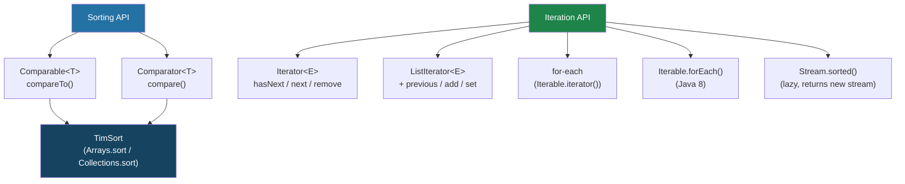

---
tags:
  - Java
  - Collections
  - Sorting
  - Iteration
difficulty: Intermediate
created: 2026-07-26
---

# 🔢 Sorting and Iteration

## TL;DR

- **`Comparable`** defines *natural* ordering via `compareTo()`; baked into the class itself.
- **`Comparator`** defines *external* ordering; composable via `comparing().thenComparing().reversed()`.
- Java's sort uses **TimSort** — O(n log n) stable; O(n) for nearly-sorted data.
- `Collections.sort`, `Arrays.sort`, `List.sort`, `Stream.sorted` — all available.
- **Iterator/ListIterator** for safe traversal and element removal.
- Enhanced **for-each** works via `Iterable.iterator()`.
- **`ConcurrentModificationException`** is thrown when a collection is structurally modified during iteration; fix with `Iterator.remove()`, `removeIf()`, or `CopyOnWriteArrayList`.

---

## Intuition

Think of **`Comparable`** as a birthday cake where each candle knows its own age — the cake *naturally* orders itself youngest-to-oldest. The cake understands its own rank in the world.

**`Comparator`** is an external judge at a baking contest. The contest organizer (your code) decides the ranking criterion — weight, tier count, frosting color — completely independent of the cake itself. The same cake can be judged differently by different comparators.

---

## How It Works

### API Overview



---

### Comparable and Comparator in Code

```java
import java.util.*;
import java.util.stream.*;

// ── Domain class implementing Comparable ────────────────────────────
class Employee implements Comparable<Employee> {
    String name;
    int department;
    double salary;

    Employee(String name, int department, double salary) {
        this.name = name;
        this.department = department;
        this.salary = salary;
    }

    // Natural order: alphabetical by name
    @Override
    public int compareTo(Employee other) {
        return this.name.compareTo(other.name);  // negative/zero/positive
    }

    @Override
    public String toString() {
        return name + "($" + salary + ",dept=" + department + ")";
    }
}

public class SortingDemo {

    public static void main(String[] args) {
        List<Employee> employees = new ArrayList<>(Arrays.asList(
            new Employee("Charlie", 2, 75000),
            new Employee("Alice",   1, 90000),
            new Employee("Bob",     1, 80000),
            new Employee("Diana",   2, 95000)
        ));

        // ── Natural order (Comparable) ───────────────────────────────
        Collections.sort(employees);            // uses compareTo
        System.out.println("Natural: " + employees);
        // [Alice, Bob, Charlie, Diana] — alphabetical

        // ── Comparator.comparing (single key) ───────────────────────
        employees.sort(Comparator.comparingDouble(e -> e.salary));
        System.out.println("By salary asc: " + employees);

        // ── Reversed ────────────────────────────────────────────────
        employees.sort(Comparator.comparingDouble(Employee::getSalary).reversed());
        // Note: method reference works if field is accessed via getter

        // ── Multi-level sort: department asc, then salary desc ───────
        Comparator<Employee> multiSort = Comparator
            .comparingInt((Employee e) -> e.department)
            .thenComparingDouble((Employee e) -> e.salary)
            .reversed();
        // Careful: reversed() flips the entire comparator, not just last key

        // Correct multi-level:
        Comparator<Employee> correct = Comparator
            .comparingInt((Employee e) -> e.department)
            .thenComparing(Comparator.comparingDouble((Employee e) -> e.salary).reversed());
        employees.sort(correct);
        System.out.println("By dept asc, salary desc: " + employees);

        // ── nullsFirst / nullsLast ───────────────────────────────────
        List<String> withNulls = Arrays.asList("banana", null, "apple", null, "cherry");
        withNulls.sort(Comparator.nullsFirst(Comparator.naturalOrder()));
        System.out.println("Nulls first: " + withNulls); // [null, null, apple, banana, cherry]

        withNulls.sort(Comparator.nullsLast(Comparator.naturalOrder()));
        System.out.println("Nulls last: " + withNulls);  // [apple, banana, cherry, null, null]

        // ── Arrays.sort (primitive — Dual-Pivot Quicksort; objects — TimSort) ─
        int[] primitiveArr = {5, 2, 8, 1, 9};
        Arrays.sort(primitiveArr);
        System.out.println("Sorted int[]: " + Arrays.toString(primitiveArr));

        String[] objArr = {"banana", "apple", "cherry"};
        Arrays.sort(objArr, Comparator.reverseOrder());
        System.out.println("Sorted String[] reversed: " + Arrays.toString(objArr));

        // ── Stream.sorted (lazy — creates new sorted stream) ─────────
        List<String> sorted = employees.stream()
            .sorted(Comparator.comparing(e -> e.name))
            .map(e -> e.name)
            .collect(Collectors.toList());
        System.out.println("Stream sorted: " + sorted);
    }
}
```

---

### Iterator, ListIterator, and ConcurrentModificationException

```java
import java.util.*;

public class IterationDemo {

    public static void main(String[] args) {
        List<Integer> numbers = new ArrayList<>(Arrays.asList(1, 2, 3, 4, 5, 6));

        // ── Safe removal via Iterator ────────────────────────────────
        Iterator<Integer> it = numbers.iterator();
        while (it.hasNext()) {
            int n = it.next();
            if (n % 2 == 0) {
                it.remove(); // Safe — uses Iterator's own remove, not list's
            }
        }
        System.out.println("After removing evens: " + numbers); // [1, 3, 5]

        // ── ListIterator: bidirectional, supports set/add ────────────
        numbers = new ArrayList<>(Arrays.asList(10, 20, 30, 40, 50));
        ListIterator<Integer> lit = numbers.listIterator(numbers.size()); // start at end
        System.out.print("Reverse: ");
        while (lit.hasPrevious()) {
            System.out.print(lit.previous() + " "); // 50 40 30 20 10
        }
        System.out.println();

        // ListIterator.set() replaces last element returned
        lit = numbers.listIterator();
        while (lit.hasNext()) {
            int val = lit.next();
            lit.set(val * 2); // doubles each element in-place
        }
        System.out.println("Doubled: " + numbers); // [20, 40, 60, 80, 100]

        // ── forEach (Java 8) ─────────────────────────────────────────
        numbers.forEach(n -> System.out.print(n + " "));
        System.out.println();

        // ── WRONG: modifying list inside for-each ────────────────────
        List<String> fruits = new ArrayList<>(Arrays.asList("apple", "banana", "cherry"));
        try {
            for (String fruit : fruits) {
                if (fruit.equals("banana")) {
                    fruits.remove(fruit); // ConcurrentModificationException!
                }
            }
        } catch (ConcurrentModificationException e) {
            System.out.println("CME thrown: " + e.getClass().getSimpleName());
        }

        // ── CORRECT alternatives to avoid CME ────────────────────────
        fruits = new ArrayList<>(Arrays.asList("apple", "banana", "cherry"));

        // Option 1: Iterator.remove()
        Iterator<String> iter = fruits.iterator();
        while (iter.hasNext()) {
            if ("banana".equals(iter.next())) iter.remove();
        }

        // Option 2: removeIf (Java 8) — cleanest
        fruits = new ArrayList<>(Arrays.asList("apple", "banana", "cherry"));
        fruits.removeIf(f -> f.equals("banana"));

        // Option 3: collect to new list via stream
        fruits = new ArrayList<>(Arrays.asList("apple", "banana", "cherry"));
        List<String> kept = fruits.stream()
            .filter(f -> !f.equals("banana"))
            .collect(java.util.stream.Collectors.toList());

        // Option 4: CopyOnWriteArrayList — iteration uses snapshot
        List<String> cowList = new java.util.concurrent.CopyOnWriteArrayList<>(
            Arrays.asList("apple", "banana", "cherry")
        );
        for (String f : cowList) {
            if ("banana".equals(f)) cowList.remove(f); // Safe — iterates snapshot
        }

        System.out.println("Kept after removal: " + kept);
    }
}
```

---

### Sort Method Reference Table

| Sort Method | Stability | Algorithm | Primitive Support | Null Handling | Best For |
|---|---|---|---|---|---|
| `Arrays.sort(int[])` | N/A | Dual-Pivot Quicksort | Yes | N/A (primitives) | Primitive arrays |
| `Arrays.sort(Object[])` | Stable | TimSort | Object[] only | Depends on compareTo | Object arrays |
| `Arrays.sort(T[], Comparator)` | Stable | TimSort | No | `nullsFirst/Last` wrapper | Custom order on array |
| `Collections.sort(List)` | Stable | TimSort (delegates to list) | No | Depends on compareTo | List with natural order |
| `Collections.sort(List, Comparator)` | Stable | TimSort | No | Explicit in comparator | List with custom order |
| `List.sort(Comparator)` | Stable | TimSort (Java 8+) | No | Explicit in comparator | In-place list sort |
| `Stream.sorted()` | Stable | TimSort | No | NPE if null present | Functional pipeline |
| `Stream.sorted(Comparator)` | Stable | TimSort | No | Explicit in comparator | Functional pipeline |

---

## Key Concepts

### Comparable — The Contract

```java
// The compareTo contract:
// Returns < 0 if this < other
// Returns   0 if this == other (recommended consistent with equals)
// Returns > 0 if this > other
//
// Transitivity: if a.compareTo(b) < 0 && b.compareTo(c) < 0 → a.compareTo(c) < 0
// Consistency with equals (recommended, not required):
//   a.compareTo(b) == 0  ↔  a.equals(b)
// WARNING: TreeSet/TreeMap use compareTo for equality — if not consistent
//   with equals, the set may appear to have "missing" elements

class Version implements Comparable<Version> {
    int major, minor, patch;

    @Override
    public int compareTo(Version other) {
        if (this.major != other.major) return Integer.compare(this.major, other.major);
        if (this.minor != other.minor) return Integer.compare(this.minor, other.minor);
        return Integer.compare(this.patch, other.patch);
    }
}
```

### Comparator — Composable External Ordering

`Comparator` is a `@FunctionalInterface` with a rich set of static factory methods and default composition methods:

```java
Comparator<Employee> comp = Comparator
    .comparing(Employee::getDepartment)          // primary key
    .thenComparing(Employee::getName)            // secondary key
    .thenComparingDouble(Employee::getSalary)    // tertiary key (numeric)
    .reversed();                                 // flip entire comparator

// Natural order helpers
Comparator<String> natural  = Comparator.naturalOrder();
Comparator<String> reversed = Comparator.reverseOrder();
Comparator<String> nullSafe = Comparator.nullsFirst(Comparator.naturalOrder());
```

### TimSort

TimSort is a hybrid sorting algorithm combining **merge sort** (for large inputs) and **insertion sort** (for small runs, typically ≤32 elements). Key properties:

- **Stable** — equal elements preserve their relative order (essential for multi-key sorting)
- **O(n log n)** worst case
- **O(n)** best case for already-sorted or nearly-sorted data (detects natural "runs")
- Used for all object sorting in Java (primitive arrays use Dual-Pivot Quicksort, which is not stable but faster in practice)

### ConcurrentModificationException

Java's fail-fast iterators track a `modCount` field on the collection. Every structural modification (add, remove, clear) increments `modCount`. When an iterator checks `hasNext()`/`next()`, it compares the current `modCount` to the one captured at iterator creation — mismatch throws `CME`.

**Important**: `CME` is a best-effort check, not a guaranteed concurrency guarantee. It should not be used for thread-safety — use `ConcurrentHashMap` or `CopyOnWriteArrayList` for that.

---

## Real-World Usage

- **Spring Data** `Sort` and `Pageable` objects wrap `Comparator`-like ordering that gets translated into SQL `ORDER BY` clauses. Understanding `Comparator.comparing().thenComparing()` is essential for constructing `Sort` correctly.
- **JPA `@OrderBy`** annotation uses JPQL property paths to sort collection associations. The Java-side iteration order of the resulting `ArrayList` reflects the database ordering.
- **Jackson** serializes `LinkedHashMap` keys in insertion order. When building API responses where key order matters (documentation, deterministic tests), use `LinkedHashMap` and control insertion order explicitly.

---

## Common Pitfalls

1. **Returning a constant from `compareTo()`** — `return 1` always makes the collection think every element is greater than every other, breaking sorting and `TreeSet` membership. Always use `Integer.compare(a, b)` or `Double.compare(a, b)` — never subtract (overflow risk).
2. **`reversed()` flips the entire chain** — `Comparator.comparingInt(f1).thenComparing(f2).reversed()` reverses both levels. To reverse only the second key: `Comparator.comparingInt(f1).thenComparing(Comparator.comparing(f2).reversed())`.
3. **Forgetting that `Stream.sorted()` is lazy** — the sort doesn't execute until a terminal operation is called. Multiple `sorted()` calls in a pipeline are computed in sequence, each O(n log n) — usually a design smell.
4. **Modifying during enhanced for-each** — the for-each loop calls `iterator()` implicitly. Any structural modification of the underlying collection (except `Iterator.remove()`) will cause `ConcurrentModificationException` on the next call to `next()`.

---

## Review Questions

1. You have a `List<Product>` and need to sort by category ascending, then by price descending, then by name ascending. Write the single `Comparator` expression.
2. Explain why `Integer.compare(a, b)` is safer than `a - b` when implementing `compareTo()`.
3. A colleague's code throws `ConcurrentModificationException` during a `for (String s : list)` loop. What are three different ways to fix it, and when would you choose each?

---

## Related

- [[_MOC_Java_Collections|↑ Section MOC]]
- [[Collection_Hierarchy_and_Choosing]]
- [[HashMap_and_Concurrent_Collections]]
- [[Stream_Pipeline_and_Collectors]]

---

*Tags: #Java #Collections #Sorting #Iteration #Intermediate*
