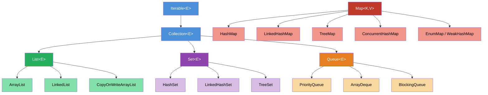

# Java Collections — Map of Content

> The Java Collections Framework (JCF) is the backbone of nearly every Java program. Understanding which container to reach for — and why — separates journeyman Java from expert Java.

---

## Concept Map



---

## Learning Path

| Step | Topic | Notes | Prerequisite |
|------|-------|-------|--------------|
| 1 | Collection hierarchy & selection | [[Collection_Hierarchy_and_Choosing]] | Java basics |
| 2 | HashMap internals & concurrent collections | [[HashMap_and_Concurrent_Collections]] | Step 1 |
| 3 | Sorting (Comparable/Comparator) & Iteration | [[Sorting_and_Iteration]] | Step 1 |
| 4 | Generics with Collections | [[_MOC_Java_Generics]] | Step 1–3 |
| 5 | Thread-safe collections deep dive | [[_MOC_Java_Concurrency]] | Step 2 |

---

## Notes in This Section

| Note | Summary | Difficulty |
|------|---------|------------|
| [[Collection_Hierarchy_and_Choosing]] | Full JCF hierarchy, when to use each type, immutability, complexity table | Intermediate |
| [[HashMap_and_Concurrent_Collections]] | HashMap bucket internals, treeification, ConcurrentHashMap, CopyOnWriteArrayList | Advanced |
| [[Sorting_and_Iteration]] | Comparable vs Comparator, TimSort, Iterator, ConcurrentModificationException | Intermediate |

---

## Key Interview Questions

| Question | Key Answer Points | See Note |
|----------|-------------------|----------|
| How does HashMap work internally? | Array of Node[], hash function, bucket index `(n-1) & hash`, chaining, treeify at ≥8 entries | [[HashMap_and_Concurrent_Collections]] |
| When would you use LinkedHashSet over HashSet? | When insertion order must be preserved with O(1) lookup (e.g., LRU-style dedup) | [[Collection_Hierarchy_and_Choosing]] |
| What causes ConcurrentModificationException? | Structural modification during iteration detected via `modCount`; use `Iterator.remove()` or `removeIf()` | [[Sorting_and_Iteration]] |
| HashMap vs ConcurrentHashMap vs Hashtable? | HashMap not thread-safe; Hashtable fully synchronized (slow); CHM per-bucket locking with CAS | [[HashMap_and_Concurrent_Collections]] |
| ArrayList vs LinkedList — when to prefer each? | ArrayList O(1) random access; LinkedList O(1) head/tail insert but poor cache locality | [[Collection_Hierarchy_and_Choosing]] |
| What is the difference between `List.of()` and `Collections.unmodifiableList()`? | `List.of()` truly immutable, rejects nulls; `unmodifiableList` wraps — original can still mutate | [[Collection_Hierarchy_and_Choosing]] |

---

## Quick-Reference Cheat Sheet

```
Need indexed access?              → ArrayList
Frequent head/tail ops?           → ArrayDeque (or LinkedList)
No duplicates, fast lookup?       → HashSet
No duplicates, insertion order?   → LinkedHashSet
No duplicates, sorted?            → TreeSet
Key-value, fast lookup?           → HashMap
Key-value, insertion order?       → LinkedHashMap
Key-value, sorted keys?           → TreeMap
Key-value, thread-safe?           → ConcurrentHashMap
Priority / min-max heap?          → PriorityQueue
Bounded blocking producer/consumer → ArrayBlockingQueue
```

---

## Related Sections

- [[_MOC_Java_Fundamentals]] — OOP, primitives, strings
- [[_MOC_Java_Generics]] — type parameters, wildcards, erasure
- [[_MOC_Java_Concurrency]] — threads, locks, concurrent utilities
- [[_MOC_Streams_Functional]] — stream pipeline, collectors
