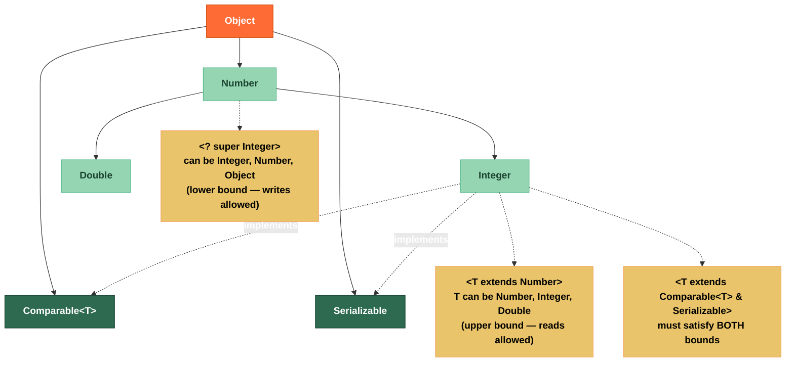

# 🔒 Bounded Type Parameters

> [!abstract] TL;DR
> **Upper bounds** (`<T extends Comparable<T>>`) constrain a type parameter to a subtype — you can read but not safely write. **Lower bounds** (`<? super T>`) constrain to a supertype — you can write but can only read as `Object`. The **PECS** rule summarizes this: **Producer Extends, Consumer Super**. **Multiple bounds** (`<T extends Serializable & Comparable<T>>`) require the class first, then interfaces. You cannot instantiate `new T()` due to type erasure, but a `Class<T>` or `Supplier<T>` passed at runtime is the standard workaround.

---

## Intuition

Think of a water pipe system:

- **Upper bound** (`extends`) = a pipe that only accepts water flowing **downward** from a specific reservoir (Comparable). You can read the flow (call `compareTo`), but you can't safely pour in water of an unknown sub-type because you might break the pressure seal.
- **Lower bound** (`super`) = a pipe that accepts water flowing **upward** into any basin above a certain level. You can pour in your water (write a `T`), but when you try to read out, you only know it came "from somewhere above" — so all you get is the universal `Object` bucket.
- The **PECS** mnemonic is your label on the pipe: if the generic structure **produces** values for you to read, use **Extends**; if you're **consuming** (writing into) it, use **Super**.

---

## How It Works

### Bounded Type Hierarchy



---

## Key Concepts

### 1. Upper Bounded — `<T extends Bound>` and `<? extends Bound>`

```java
import java.util.*;

public class UpperBoundDemo {

    // T extends Comparable<T>: T must support compareTo — enables sorting, min, max
    public static <T extends Comparable<T>> T max(List<T> list) {
        if (list.isEmpty()) throw new NoSuchElementException();
        T result = list.get(0);
        for (T item : list) {
            if (item.compareTo(result) > 0) result = item;
        }
        return result;
    }

    // Wildcard form: ? extends Number — read-only view of a number list
    // PRODUCER: the list produces numbers for us to consume
    public static double sumList(List<? extends Number> numbers) {
        double sum = 0;
        for (Number n : numbers) {        // safe: any Number can be read as Number
            sum += n.doubleValue();
        }
        // numbers.add(3.14);             // COMPILE ERROR — ? might be List<Integer>!
        return sum;
    }

    public static void demo() {
        List<Integer> ints    = List.of(1, 2, 3);
        List<Double>  doubles = List.of(1.5, 2.5);

        System.out.println(sumList(ints));    // 6.0 — works: Integer extends Number
        System.out.println(sumList(doubles)); // 4.0 — works: Double extends Number

        System.out.println(max(List.of("banana", "apple", "cherry"))); // "cherry"
        System.out.println(max(List.of(3, 1, 4, 1, 5)));               // 5
    }
}
```

### 2. Lower Bounded — `<? super T>`

```java
public class LowerBoundDemo {

    // CONSUMER: the collection consumes T values we add to it
    // ? super Integer means the list can be List<Integer>, List<Number>, or List<Object>
    public static void addNumbers(List<? super Integer> list) {
        list.add(1);    // safe: Integer IS-A "? super Integer"
        list.add(2);
        list.add(3);
        // Integer x = list.get(0);  // COMPILE ERROR — could be List<Number>
        Object o = list.get(0);      // only Object is guaranteed when reading
    }

    public static void demo() {
        List<Integer> intList    = new ArrayList<>();
        List<Number>  numList    = new ArrayList<>();
        List<Object>  objList    = new ArrayList<>();

        addNumbers(intList);   // works: Integer super Integer
        addNumbers(numList);   // works: Number  super Integer
        addNumbers(objList);   // works: Object  super Integer

        // Comparator.super — real example from JDK
        // Comparator<? super T> in TreeSet constructor accepts any comparator
        // that can compare T or any of T's supertypes
        TreeSet<Integer> ts = new TreeSet<>(Comparator.<Number>comparingDouble(Number::doubleValue));
    }
}
```

### 3. PECS in Practice

```java
import java.util.*;

public class PECSDemo {

    // Classic PECS example — copy from src (producer) to dst (consumer)
    public static <T> void copy(List<? extends T> src,   // extends: produces T
                                List<? super T>   dst) { // super:   consumes T
        for (T item : src) {
            dst.add(item);
        }
    }

    public static void demo() {
        List<Integer> source = List.of(1, 2, 3);
        List<Number>  dest   = new ArrayList<>();

        copy(source, dest);   // Integer extends Number; Number super Integer
        System.out.println(dest);  // [1, 2, 3]
    }
}
```

### 4. Multiple Bounds

```java
import java.io.Serializable;

public class MultipleBoundsDemo {

    // Rules: class must come FIRST, then interfaces, separated by &
    // <T extends ClassBound & Interface1 & Interface2>
    public static <T extends Comparable<T> & Serializable> T clampAndSerialize(
            T value, T min, T max) {
        if (value.compareTo(min) < 0) return min;
        if (value.compareTo(max) > 0) return max;
        return value;
    }

    // Recursive type bound — T's compareTo accepts another T
    // Enables expressing "T can compare itself to other T instances"
    public static <T extends Comparable<T>> T min(T a, T b) {
        return a.compareTo(b) <= 0 ? a : b;
    }

    // Fluent builder with recursive bound (self-referential)
    // B extends Builder<B> — allows method chaining to return the concrete subtype
    abstract static class Builder<B extends Builder<B>> {
        private String name;

        @SuppressWarnings("unchecked")
        public B name(String name) {
            this.name = name;
            return (B) this;   // returns the concrete subtype, not Builder
        }

        public abstract Object build();
    }

    static class PersonBuilder extends Builder<PersonBuilder> {
        private int age;

        public PersonBuilder age(int age) { this.age = age; return this; }

        @Override public String build() { return "Person{name, age=" + age + "}"; }
    }

    public static void fluentDemo() {
        String person = new PersonBuilder()
            .name("Alice")   // returns PersonBuilder (not Builder)
            .age(30)         // PersonBuilder method accessible after name()
            .build();
    }

    public static void demo() {
        System.out.println(clampAndSerialize(150, 0, 100));  // 100
        System.out.println(min("apple", "banana"));          // "apple"
    }
}
```

### 5. Cannot Instantiate `new T()` — Workarounds

```java
import java.util.function.Supplier;

public class InstantiationWorkaround {

    // ILLEGAL — T is erased at runtime; JVM doesn't know what class to construct
    // public static <T> T create() { return new T(); }  // COMPILE ERROR

    // Workaround 1: Class<T> token — reflective instantiation
    public static <T> T createViaClass(Class<T> clazz) throws ReflectiveOperationException {
        return clazz.getDeclaredConstructor().newInstance();
        // Requires public no-arg constructor; throws checked exceptions
    }

    // Workaround 2: Supplier<T> — preferred in modern Java
    public static <T> T createViaSupplier(Supplier<T> factory) {
        return factory.get();
        // Clean, no reflection, works with constructors that have args
    }

    // Workaround 3: Factory method pattern
    interface Factory<T> { T create(); }

    public static void demo() throws Exception {
        // Class<T> approach
        String s = createViaClass(String.class);  // ""

        // Supplier<T> approach — most idiomatic
        var list = createViaSupplier(java.util.ArrayList::new);

        // In generic repository pattern:
        // new GenericRepository<>(User::new)
    }
}
```

### 6. Wildcard Capture

```java
public class WildcardCapture {

    // Sometimes the compiler needs help to "name" an unknown wildcard
    // Private helper captures the wildcard and gives it a name

    public static void reverse(List<?> list) {
        // Direct approach fails: list.set(i, list.get(j)) won't compile
        // because the compiler can't verify type safety with ?
        reverseHelper(list);   // delegate to capture helper
    }

    private static <T> void reverseHelper(List<T> list) {
        // Now T is a concrete (if unknown) type — set is allowed
        for (int i = 0, j = list.size() - 1; i < j; i++, j--) {
            T temp = list.get(i);
            list.set(i, list.get(j));
            list.set(j, temp);
        }
    }
}
```

---

## Real-World Notes

- **Spring's `ResolvableType`** uses bounded wildcards extensively in its generic type resolution to allow consumers of `ApplicationContext` to retrieve beans by `? extends BaseEvent` without knowing the exact event type.
- **Jackson deserialization**: `TypeReference<List<? extends BaseDto>>` uses upper bounds to handle polymorphic response lists while keeping the deserializer generic.
- **JDK `Collections.sort(List<T>, Comparator<? super T>)`**: lower bound allows a `Comparator<Object>` to sort a `List<String>` — you don't need an exact-match comparator.
- **Generic DAOs**: `class GenericRepository<T, ID> { T findById(ID id); }` avoids raw types and enables compile-time type-safe queries across entity types.
- **Recursive bounds in Lombok `@Builder`**: Lombok generates fluent builders using the same `Builder<B extends Builder<B>>` recursive pattern under the hood.

---

## Common Pitfalls

| Pitfall | Example | Consequence | Fix |
|---------|---------|-------------|-----|
| Wildcard in return type | `public List<?> getItems()` | Callers can't add anything | Return a concrete `List<T>` or use a type parameter |
| Forgetting `? extends` prevents writes | `List<? extends Number> list; list.add(1)` | Compile error | Use `List<Number>` if you need both read and write |
| Class bound after interface bound | `<T extends Runnable & Thread>` | Compile error — class must come first | `<T extends Thread & Runnable>` |
| Raw type bypass | `List raw = new ArrayList<String>(); raw.add(1)` | Heap pollution, ClassCastException later | Never use raw types; enable `-Xlint:unchecked` |
| Instantiating `new T[]` | `T[] arr = new T[10]` | Unchecked warning; creates `Object[]` | Use `(T[]) new Object[10]` with `@SuppressWarnings` or pass `Class<T>` |

---

## Related Notes

- [[_MOC_Java_Generics|↑ Section MOC — Java Generics]]
- [[Generic_Methods]] — generic methods, type inference, type witnesses
- [[Generic_Best_Practices]] — wildcards vs type params, heterogeneous containers
- [[Java_Types_and_Variables]] — type system foundation
- [[Streams_and_Pipelines]] — Stream uses bounded wildcards in `flatMap`, `collect`

---

## Review Questions

1. A method needs to accept both `List<Cat>` and `List<Dog>` (both extend `Animal`) and print each element. Should the parameter be `List<Animal>`, `List<? extends Animal>`, or `List<? super Animal>`? Explain why, and state what operation would become illegal with your choice.

2. You are writing a method `copyInto(List<? extends T> src, List<? super T> dst)`. A colleague argues `<T> void copyInto(List<T> src, List<T> dst)` is simpler. Give a concrete example where the PECS version accepts a call that the colleague's version rejects.

3. Why can't you write `new T()` in a generic method, and what are the two idiomatic Java solutions to construct a new instance of an unknown type `T`? Compare their trade-offs.

---

#Java #Generics #BoundedTypes #Wildcards #PECS #UpperBound #LowerBound #Intermediate
