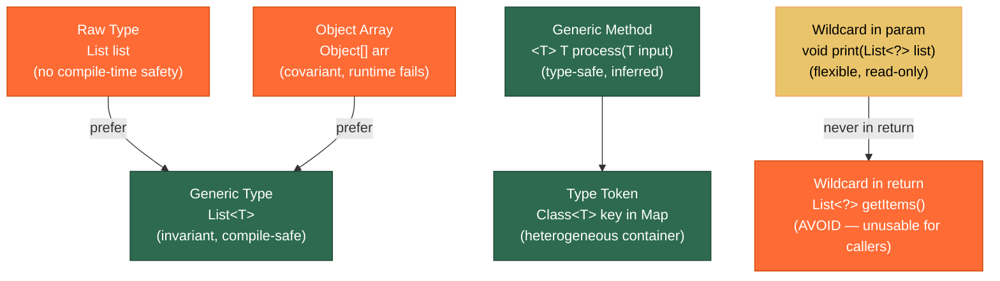

# 🏆 Generic Best Practices

> [!abstract] TL;DR
> Prefer generic methods and types over raw types and `Object[]` to catch errors at compile time rather than runtime. **Never put wildcards in return positions** — it forces callers to use awkward casts. Use **type tokens** (`Class<T>`) as map keys in heterogeneous containers to regain type safety after erasure. Annotate unavoidable unchecked casts with `@SuppressWarnings("unchecked")` narrowly — and always explain why it is safe. Arrays are covariant and fail at runtime; generics are invariant and fail at compile time — prefer `List<T>` over `T[]` in generic APIs.

---

## Intuition

Generics are a compile-time contract: the compiler is your type-checker. When you abandon generics (raw types, `Object[]`, unchecked casts), you fire the type-checker. The bugs don't disappear — they just hide until runtime, where they show up as `ClassCastException` in production at 2 AM.

Think of generics like a **labelled shipping container system**: each container is stamped with the type of goods it holds. A **raw type** is an unlabeled container — customs has no idea what's inside and lets anything through. An **unchecked cast** is forging a label — you're telling customs "trust me, it's electronics" without verification.

---

## How It Works

### Key Generic Relationships



---

## Key Concepts

### 1. Prefer Generic Methods to Raw Types

```java
import java.util.*;

public class RawTypeVsGeneric {

    // BAD: raw type — no compile-time check
    public static Object firstRaw(List list) {
        return list.get(0);   // returns Object; caller must cast
    }

    // BAD: Object param — too broad, loses type info
    public static Object firstObject(List<Object> list) {
        return list.get(0);
        // List<String> cannot be passed here! List<Object> ≠ List<String>
    }

    // GOOD: generic method — type-safe, inferred by compiler
    public static <T> T first(List<T> list) {
        if (list.isEmpty()) throw new NoSuchElementException();
        return list.get(0);   // returns T, no cast needed at call site
    }

    public static void demo() {
        List<String> names = List.of("Alice", "Bob");
        String name = first(names);         // T inferred as String — clean
        // String name = (String) firstRaw(names);  // cast needed, runtime risk

        // Type witness — explicitly specify T when inference fails
        List<Number> numbers = Generic.<Number>first(List.of(1, 2.0));
    }
}
```

### 2. Don't Use Wildcards in Return Positions

```java
public class WildcardReturnAntiPattern {

    // BAD: wildcard in return type — forces caller to deal with ?
    public List<?> getItems() {
        return new ArrayList<String>();
    }

    // Caller cannot do anything useful:
    public void callerProblem() {
        List<?> items = getItems();
        Object o = items.get(0);    // only Object — useless
        // items.add("x");          // COMPILE ERROR — can't add to List<?>
    }

    // GOOD: use a type parameter on the method or class
    public <T> List<T> getTypedItems(Class<T> type) {
        @SuppressWarnings("unchecked")
        List<T> result = (List<T>) loadFromCache(type);
        return result;
    }

    // GOOD: return concrete type if it's always known
    public List<String> getNames() {
        return new ArrayList<>();  // caller knows exactly what they get
    }

    private Object loadFromCache(Class<?> type) { return new ArrayList<>(); }
}
```

### 3. Generic Singleton Factory

```java
import java.util.function.*;

public class GenericSingleton {

    // Collections.emptyList() pattern — one instance serves all element types
    // because it's always empty, no actual T ever stored
    @SuppressWarnings("unchecked")
    private static final UnaryOperator<Object> IDENTITY = t -> t;

    public static <T> UnaryOperator<T> identityFunction() {
        return (UnaryOperator<T>) IDENTITY;  // safe: erasure makes T = Object at runtime
    }

    // Optional.empty() uses the same pattern internally
    // The same empty Optional instance is shared across all types

    public static void demo() {
        UnaryOperator<String> strId = identityFunction();  // T = String
        UnaryOperator<Integer> intId = identityFunction(); // T = Integer — same object!

        System.out.println(strId.apply("hello"));  // "hello"
        System.out.println(intId.apply(42));        // 42
    }
}
```

### 4. Heterogeneous Containers with Type Tokens

```java
import java.util.*;

public class TypeSafeContainer {

    // Problem: Map<Class<?>, Object> loses type-safety — you can put String under Integer key
    private final Map<Class<?>, Object> container = new HashMap<>();

    // Type token: Class<T> is the key; value is guaranteed to be T
    public <T> void put(Class<T> type, T value) {
        container.put(Objects.requireNonNull(type), type.cast(value));
        //                                           ^^^^^^^^^^^^^^
        //   type.cast() validates value IS instance of T — prevents heap pollution
    }

    public <T> T get(Class<T> type) {
        return type.cast(container.get(type));  // checked cast, safe
    }

    public <T> boolean contains(Class<T> type) {
        return container.containsKey(type);
    }

    public static void demo() {
        TypeSafeContainer ctx = new TypeSafeContainer();

        ctx.put(String.class,  "Hello");
        ctx.put(Integer.class, 42);
        ctx.put(Double.class,  3.14);

        String  s = ctx.get(String.class);   // no cast needed at call site
        Integer i = ctx.get(Integer.class);  // compile-time typed

        // Limitation: cannot use parameterized types as tokens
        // ctx.put(List<String>.class, ...)  → SYNTAX ERROR — not expressible
        // Use Guava's TypeToken or Spring's ResolvableType for this
    }
}
```

### 5. Checked Casts and @SuppressWarnings Discipline

```java
import java.util.*;

public class SuppressWarningsDemo {

    // RULE: @SuppressWarnings("unchecked") must be on the SMALLEST scope possible
    // ALWAYS add a comment explaining WHY it is safe

    @SuppressWarnings("unchecked")
    public static <T> T[] toArray(List<T> list, Class<T> componentType) {
        // Safe: we control the array creation and it matches the declared component type
        T[] arr = (T[]) java.lang.reflect.Array.newInstance(componentType, list.size());
        for (int i = 0; i < list.size(); i++) arr[i] = list.get(i);
        return arr;
    }

    // Narrow scope — suppress only the assignment line, not the whole method
    public static <T> List<T> uncheckedCastDemo(Object obj) {
        @SuppressWarnings("unchecked")  // Safe: caller guarantees obj came from List<T>
        List<T> result = (List<T>) obj;
        return result;
    }

    // Anti-pattern: suppressing on the whole method hides other warnings
    @SuppressWarnings("unchecked")   // BAD: too broad
    public static void broadSuppression() {
        List raw = new ArrayList();
        raw.add("sneaky");
        // Both the raw-type warning AND potential ClassCastException risks are hidden
    }
}
```

### 6. Arrays Are Covariant — Generics Are Invariant

```java
public class CovarianceDemo {

    public static void arrayCovariance() {
        // Arrays ARE covariant: String[] IS-A Object[]
        // This compiles — but is dangerous!
        String[] strings = {"hello", "world"};
        Object[] objects = strings;              // widening — compiles fine

        objects[0] = 42;   // COMPILES — Object[] can hold Integer
                           // RUNTIME: ArrayStoreException — actual array is String[]
    }

    public static void genericInvariance() {
        // Generics are INVARIANT: List<String> is NOT a List<Object>
        List<String> strings = new ArrayList<>();
        // List<Object> objects = strings;   // COMPILE ERROR — good! Caught early.

        // This invariance is what makes generics type-safe
        // If List<String> were a List<Object>, you could add Integer to it
    }

    // Practical rule: prefer List<T> over T[] in generic APIs
    // T[] has no type info at runtime (erased); you need Class<T> to create one

    // BAD: generic method returning T[]
    // public <T> T[] makeArray(int size) { return new T[size]; }  // ILLEGAL

    // GOOD: use List<T> instead
    public static <T> List<T> makeList(int size, T defaultValue) {
        List<T> list = new ArrayList<>(size);
        for (int i = 0; i < size; i++) list.add(defaultValue);
        return list;
    }
}
```

### 7. Pitfalls Table

```java
public class GenericPitfalls {

    // Pitfall: generic types can't use instanceof with type parameter
    public static <T> boolean isString(T value) {
        // return value instanceof T;  // COMPILE ERROR — T erased at runtime
        return value instanceof String; // only concrete types work
    }

    // Pitfall: static members can't use class type parameter
    class Box<T> {
        T value;
        // static T defaultValue;  // COMPILE ERROR — static context, no instance T
        static Object defaultValue; // must use Object or a separate type
    }

    // Pitfall: overloading on generic types can fail
    // void process(List<String> s) { }
    // void process(List<Integer> i) { }  // COMPILE ERROR — same erasure: List
    // Solution: use different method names
}
```

---

## Real-World Notes

- **Spring's `BeanFactory.getBean(Class<T> requiredType)`** is the canonical type-token pattern in production Java — it returns a `T` without a cast at the call site by using `Class<T>` internally.
- **Jackson's `TypeReference<T>`**: because `List<String>.class` is not expressible, Jackson's `TypeReference` uses anonymous subclass tricks (`new TypeReference<List<String>>() {}`) and reflection to recover the type argument at runtime — a form of super type token.
- **Checked cast in repository layer**: when loading entities from a cache backed by `Map<String, Object>`, always call `type.cast(value)` rather than `(T) value` — the former throws `ClassCastException` immediately with a clear message; the latter may silently pass and explode elsewhere.
- **`@SuppressWarnings` hygiene**: configure your linter or IDE inspection to flag any `@SuppressWarnings("unchecked")` without a `// Safe:` comment — this is a team-wide discipline that prevents silent heap pollution accumulation.

---

## Common Pitfalls

| Pitfall | Example | Consequence | Fix |
|---------|---------|-------------|-----|
| Raw type in API | `List getUserList()` | Caller needs cast; heap pollution risk | Return `List<User>` |
| Wildcard return | `List<?> fetch()` | Caller cannot use the list's elements | Return `List<T>` with type parameter |
| Unchecked cast without comment | `(List<T>) raw` with `@SuppressWarnings` | Nobody knows if it's safe; future breakage hidden | Add `// Safe: because ...` comment |
| Arrays with generics | `T[] arr = new T[10]` | Creates `Object[]`; `ArrayStoreException` possible | Use `List<T>` or pass `Class<T>` to create array |
| Type pollution via raw type | `List raw = new List<String>(); raw.add(42)` | ClassCastException at unexpected location | Never mix raw and generic; use `-Xlint:unchecked` |
| instanceof with type param | `value instanceof T` | Compile error — T erased | Use `clazz.isInstance(value)` with Class token |
| Overloading on generic types | `void foo(List<String>)` + `void foo(List<Integer>)` | Compile error — same erasure | Rename methods |

---

## Related Notes

- [[_MOC_Java_Generics|↑ Section MOC — Java Generics]]
- [[Bounded_Type_Parameters]] — PECS, upper/lower bounds, wildcards
- [[Generic_Methods]] — type inference, type witnesses
- [[Java_Types_and_Variables]] — erasure, type system foundations
- [[Streams_and_Pipelines]] — Stream<T> heavily uses these patterns

---

## Review Questions

1. A teammate's generic cache implementation uses `Map<Class<?>, Object>` and retrieves values with `(T) cache.get(type)`. You replace the get with `type.cast(cache.get(type))`. Explain the difference in behavior when the wrong type is stored, and why the latter is safer.

2. Why is `List<String>` not a `List<Object>`, but `String[]` IS an `Object[]`? Give an example that shows why allowing `List<String>` to be a `List<Object>` would break type safety.

3. A library method is declared as `public List<?> getResults()`. Explain why this is a bad return type for callers, and show how you would redesign the API signature to make it usable without requiring casts.

---

#Java #Generics #BestPractices #TypeTokens #HeapPollution #Erasure #Advanced
