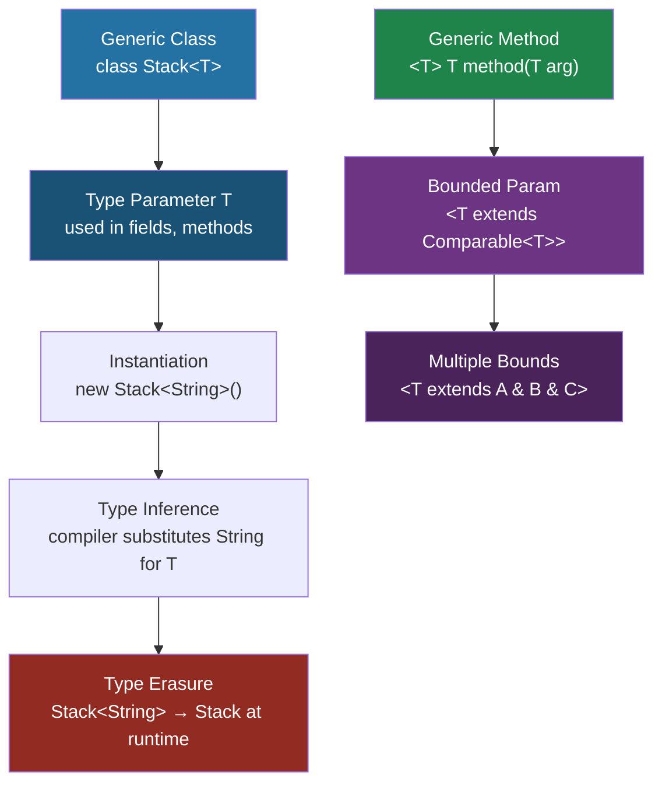

---
tags:
  - Java
  - Generics
  - TypeParameters
difficulty: Intermediate
created: 2026-07-26
---

# 🧪 Generic Classes and Methods

## TL;DR

- Generics provide **compile-time type safety** with zero runtime overhead (types erased to their bound or `Object`).
- Generic class: `class Box<T>` — type parameter `T` used throughout the class body.
- Generic method: `public static <T> T identity(T value)` — type parameter declared before return type.
- Bounded: `<T extends Comparable<T>>` restricts `T` to types that implement `Comparable`.
- Multiple bounds: `<T extends Serializable & Comparable<T>>` (class first, then interfaces).
- **Raw types** (`List` instead of `List<String>`) lose type safety — avoid in new code.
- Diamond operator `<>` lets the compiler infer type arguments from context (Java 7+).

---

## Intuition

Think of a generic class as a **cookie cutter that accepts a mold parameter**. The cutter (class) has the same shape for every cookie type, but the mold (type parameter) determines what kind of cookie comes out. A `Box<Apple>` uses the same `Box` cutter as `Box<Orange>` — but you can only put apples into the apple box and oranges into the orange box. The compiler enforces this distinction; the JVM just sees a `Box` at runtime.

---

## How It Works

### Generic Class and Method Flow



---

### Code: Generic Stack, Utility Methods, Bounded Types

```java
import java.io.Serializable;
import java.util.*;

// ── 1. Generic Class: Stack<T> ──────────────────────────────────────
// T is the type parameter — a placeholder for the actual type at use site
class Stack<T> {
    private final List<T> elements = new ArrayList<>();

    // Methods use T as return type and parameter type
    public void push(T item) {
        elements.add(Objects.requireNonNull(item, "Cannot push null"));
    }

    public T pop() {
        if (isEmpty()) throw new EmptyStackException();
        return elements.remove(elements.size() - 1);
    }

    public T peek() {
        if (isEmpty()) throw new EmptyStackException();
        return elements.get(elements.size() - 1);
    }

    public boolean isEmpty() { return elements.isEmpty(); }
    public int size()        { return elements.size(); }

    @Override
    public String toString() { return elements.toString(); }
}

// ── 2. Generic Class with Multiple Type Parameters: Pair<A, B> ──────
class Pair<A, B> {
    private final A first;
    private final B second;

    public Pair(A first, B second) {
        this.first = first;
        this.second = second;
    }

    public A getFirst()  { return first; }
    public B getSecond() { return second; }

    // Generic factory method — cleaner than constructor at call site
    public static <X, Y> Pair<X, Y> of(X x, Y y) {
        return new Pair<>(x, y);
    }

    @Override
    public String toString() {
        return "(" + first + ", " + second + ")";
    }
}

// ── 3. Multiple Bounds: T extends Serializable & Comparable<T> ──────
// Class bound MUST come first, then interfaces
class SortedCache<T extends Serializable & Comparable<T>> {
    private final TreeSet<T> store = new TreeSet<>();

    public void add(T item) { store.add(item); }
    public T min()          { return store.first(); }
    public T max()          { return store.last(); }
}

public class GenericDemo {

    // ── 4. Generic Methods ───────────────────────────────────────────
    // Type parameter <T> declared before return type
    public static <T> void swap(T[] array, int i, int j) {
        T temp = array[i];
        array[i] = array[j];
        array[j] = temp;
    }

    // Copy entire src array into dest
    public static <T> void copy(T[] dest, T[] src) {
        if (dest.length < src.length) throw new IllegalArgumentException("dest too small");
        System.arraycopy(src, 0, dest, 0, src.length);
    }

    // ── 5. Bounded Generic Method: <T extends Comparable<T>> ─────────
    // T must implement Comparable<T> — compiler ensures compareTo() exists
    public static <T extends Comparable<T>> T max(T a, T b) {
        return a.compareTo(b) >= 0 ? a : b;
    }

    // Works with any Comparable: Integer, String, LocalDate, etc.
    public static <T extends Comparable<T>> T findMax(List<T> list) {
        if (list == null || list.isEmpty()) throw new NoSuchElementException();
        T result = list.get(0);
        for (T item : list) {
            if (item.compareTo(result) > 0) result = item;
        }
        return result;
    }

    // ── 6. Diamond Operator — type inference ─────────────────────────
    public static void diamondDemo() {
        // Without diamond (verbose, Java 5/6 style):
        Stack<String> s1 = new Stack<String>();

        // With diamond (Java 7+) — compiler infers <String> from declaration:
        Stack<String> s2 = new Stack<>();

        // Also works for nested generics:
        Map<String, List<Integer>> complex = new HashMap<>(); // not new HashMap<String, List<Integer>>()

        // Diamond on anonymous classes requires Java 9+
        Comparator<String> comp = new Comparator<>() { // Java 9+
            @Override public int compare(String a, String b) { return a.compareTo(b); }
        };
    }

    // ── 7. Raw Types — what NOT to do ────────────────────────────────
    @SuppressWarnings({"rawtypes", "unchecked"})
    public static void rawTypesDemo() {
        // Raw type: no type argument — T erased to Object
        Stack rawStack = new Stack();  // WARNING: raw type
        rawStack.push("hello");
        rawStack.push(42);             // No compile error — accepts Object

        // Dangerous: cast at pop() is unchecked, can ClassCastException at runtime
        String s = (String) rawStack.pop(); // Runtime ClassCastException: 42 is not String

        // Contrast with parameterized:
        Stack<String> typedStack = new Stack<>();
        typedStack.push("hello");
        // typedStack.push(42); // COMPILE ERROR — caught at compile time
        String typed = typedStack.pop(); // No cast needed
    }

    public static void main(String[] args) {
        // Stack usage
        Stack<Integer> intStack = new Stack<>();
        intStack.push(10);
        intStack.push(20);
        intStack.push(30);
        System.out.println("Peek: " + intStack.peek()); // 30
        System.out.println("Pop: "  + intStack.pop());  // 30
        System.out.println("Stack: " + intStack);        // [10, 20]

        // Pair usage
        Pair<String, Integer> pair = Pair.of("Alice", 30);
        System.out.println("Pair: " + pair.getFirst() + " is " + pair.getSecond()); // Alice is 30

        // Generic method usage — type inferred from arguments
        Integer maxInt = max(42, 17);
        String maxStr  = max("banana", "apple");
        System.out.println("Max int: " + maxInt);   // 42
        System.out.println("Max str: " + maxStr);   // banana

        // findMax
        List<Double> scores = Arrays.asList(3.14, 2.71, 1.41, 1.73);
        System.out.println("Max score: " + findMax(scores)); // 3.14

        // Swap
        String[] words = {"hello", "world", "java"};
        swap(words, 0, 2);
        System.out.println("After swap: " + Arrays.toString(words)); // [java, world, hello]

        // SortedCache with multiple bounds
        SortedCache<String> cache = new SortedCache<>();
        cache.add("banana");
        cache.add("apple");
        cache.add("cherry");
        System.out.println("Min: " + cache.min()); // apple
        System.out.println("Max: " + cache.max()); // cherry
    }
}
```

---

### Notation Reference Table

| Notation | Meaning | Example | Use Case |
|---|---|---|---|
| `<T>` | Single unconstrained type parameter | `class Box<T>` | Hold any type |
| `<T extends Foo>` | T must extend class Foo | `<T extends Number>` | Numeric operations |
| `<T extends Foo & Bar>` | T extends class Foo AND implements interface Bar | `<T extends Serializable & Comparable<T>>` | Need multiple capabilities |
| `<A, B>` | Two independent type parameters | `class Pair<A, B>` | Key-value pairs, tuples |
| `<T extends Comparable<T>>` | Recursive bound — T comparable to itself | `findMax` | Sorting, min/max |
| `<>` | Diamond — infer type from context | `new ArrayList<>()` | Reduce verbosity |
| Raw `List` | No type argument (legacy) | `List items = new ArrayList()` | Pre-Java 5 compat only |

---

## Key Concepts

### Type Parameter Naming Conventions

By universal convention (followed throughout the JDK):

| Letter | Meaning | Example in JDK |
|--------|---------|---------------|
| `T` | Type | `class Comparable<T>` |
| `E` | Element | `interface List<E>`, `class ArrayList<E>` |
| `K` | Key | `interface Map<K, V>` |
| `V` | Value | `interface Map<K, V>` |
| `N` | Number | `class Number` subclass constraints |
| `R` | Return type | `interface Function<T, R>` |
| `A` | Accumulator | `interface Collector<T, A, R>` |
| `S, U, V` | 2nd, 3rd, 4th types | `interface BiFunction<T, U, R>` |

Deviating from convention makes code harder to read for other Java developers.

### Generic Methods vs Generic Classes

A **generic class** parameterizes the entire class — all instances of `Stack<String>` share the same String-oriented behavior. A **generic method** parameterizes just that one method — the type is inferred at each call site independently. Generic methods are often `static` utility methods (`Collections.sort`, `Arrays.asList`, etc.).

### Raw Types and Heap Pollution

Using a raw type bypasses the compiler's type checking:

```java
List rawList = new ArrayList();       // raw
rawList.add("hello");
rawList.add(42);                      // no error — compiler accepts Object

List<String> typed = rawList;         // unchecked assignment warning
String s = typed.get(1);             // ClassCastException at runtime — 42 is not String
```

This is **heap pollution**: a variable of a parameterized type references an object that is not of that parameterized type. `@SuppressWarnings("unchecked")` silences the warning but doesn't fix the underlying issue.

---

## Real-World Usage

- **Spring Data** `Repository<T, ID>` — the entire Spring Data abstraction is built on generic interfaces. `CrudRepository<User, Long>` gives you type-safe `save(User)`, `findById(Long)`, etc. without any casting.
- **`ResponseEntity<T>`** — Spring MVC wraps response bodies in `ResponseEntity<T>`, letting the generic type propagate through your controller layer for Jackson serialization without reflection hacks.
- **`Optional<T>`** — Java 8's null-safety wrapper is a textbook generic class. `Optional<String>` forces callers to handle the absent case explicitly via `isPresent()`, `orElse()`, or `map()`.

---

## Common Pitfalls

1. **Using raw types in new code** — `List list = new ArrayList()` loses all type safety. Use `List<Object>` if you genuinely need to hold anything.
2. **Confusing bounded type parameters with wildcards** — `<T extends Number>` creates a reusable name `T` you can reference throughout the method body. `? extends Number` is anonymous — you can't reference the captured type by name. Use type parameters when you need to relate types (input → output of the same type); use wildcards for flexibility in method signatures.
3. **Forgetting the class-first rule for multiple bounds** — `<T extends Runnable & Serializable>` is legal (two interfaces); `<T extends ArrayList & Runnable>` is legal (class first); `<T extends Runnable & ArrayList>` is a compile error (class must be first in intersection).
4. **Overloading methods that differ only in generic types** — after erasure, `void process(List<String> l)` and `void process(List<Integer> l)` both become `void process(List l)` — the compiler rejects this as an illegal overload.

---

## Review Questions

1. Write a generic method `<T extends Comparable<T>> List<T> filter(List<T> list, T threshold)` that returns all elements greater than the threshold.
2. Why does Java require the class bound to appear before interface bounds in a multiple-bounds declaration like `<T extends Cloneable & Comparable<T>>`?
3. A colleague uses `List` (raw type) instead of `List<Object>` and argues they are equivalent. Explain why they are not.

---

## Related

- [[_MOC_Java_Generics|↑ Section MOC]]
- [[Wildcards_and_PECS]]
- [[Type_Erasure_and_Variance]]

---

*Tags: #Java #Generics #TypeParameters #Intermediate*
