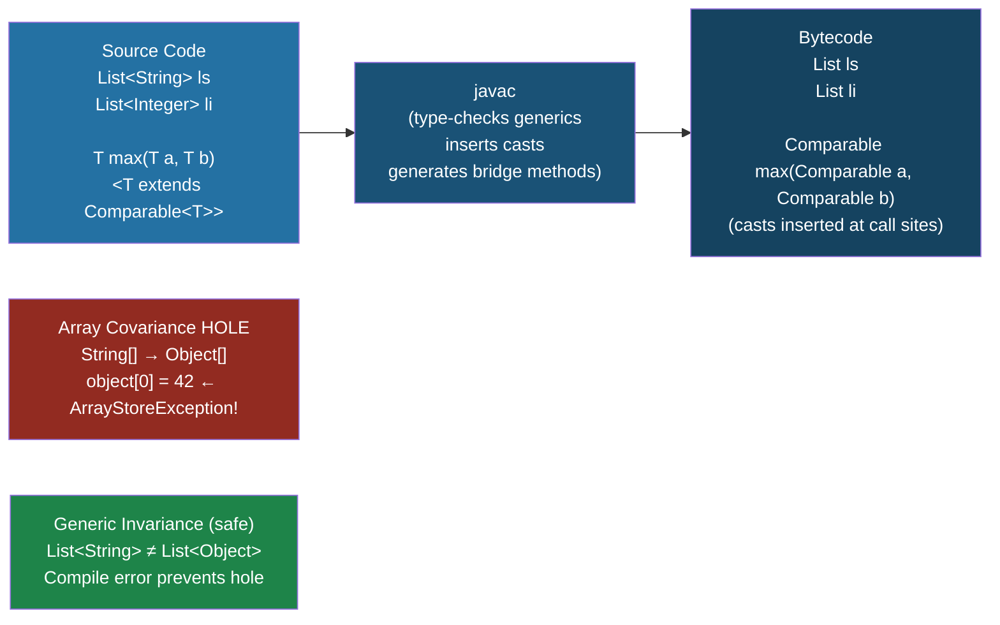

---
tags:
  - Java
  - Generics
  - TypeErasure
  - Variance
difficulty: Advanced
created: 2026-07-26
---

# 🔭 Type Erasure and Variance

## TL;DR

- **Type erasure** removes generic type parameters at compile time — `List<String>` and `List<Integer>` both become plain `List` at runtime. The compiler inserts casts and bridge methods to maintain type safety.
- Erasure **prevents**: `new T()`, `new T[]`, `instanceof List<String>`, `T.class`, catching generic exceptions, overloading on generic types alone.
- **Java arrays are covariant** — `String[]` is assignable to `Object[]` — but this is a broken hole (ArrayStoreException at runtime). Generics are **invariant** by design — `List<String>` is NOT a `List<Object>`.
- **Wildcards restore variance**: `? extends T` (covariant), `? super T` (contravariant).
- **Heap pollution** occurs when a raw/unchecked cast causes a variable of parameterized type to hold an object of the wrong type — silent until a `ClassCastException` at an unexpected point.

---

## Intuition

Imagine shipping boxes labeled "contains apples" or "contains oranges." At the warehouse (compile time) the labels are enforced strictly. But by the time the truck (JVM) picks them up, every box just says "contains stuff" — the labels are torn off (*erased*). The truck doesn't know which box had apples. If someone snuck an orange into the apple box before shipping (*heap pollution*), the recipient gets a nasty surprise when opening the box expecting an apple.

Arrays are like colored boxes at the warehouse that the truck *does* still check — but the check happens only at the moment of insertion (`ArrayStoreException`), not at assignment time. Generics opted for earlier (compile-time) checking at the cost of covariance.

---

## How It Works

### Type Erasure Pipeline



---

### Code Demonstrating Erasure, Bridge Methods, Heap Pollution

```java
import java.lang.reflect.*;
import java.util.*;

// ── Part 1: Type Erasure Evidence ──────────────────────────────────
public class ErasureDemo {

    public static void main(String[] args) throws Exception {

        // At runtime, List<String> and List<Integer> are the SAME class
        List<String>  stringList  = new ArrayList<>();
        List<Integer> integerList = new ArrayList<>();

        System.out.println(stringList.getClass() == integerList.getClass()); // true!
        System.out.println(stringList.getClass().getName());                  // java.util.ArrayList

        // No instanceof check with type parameter possible
        // if (stringList instanceof List<String>) { } // COMPILE ERROR

        // No .class for parameterized type
        // Class<?> c = List<String>.class;           // COMPILE ERROR
        Class<?> rawClass = List.class;               // OK — raw type

        // Reflection: generics survive in metadata (not erased from signatures!)
        Field field = Container.class.getDeclaredField("value");
        Type genericType = field.getGenericType();
        System.out.println("Field generic type: " + genericType); // T — if T, erased to Object

        // ParameterizedType from method signature
        Method m = ErasureDemo.class.getDeclaredMethod("takesStringList", List.class);
        Type paramType = m.getGenericParameterTypes()[0];
        System.out.println("Method param type: " + paramType); // java.util.List<java.lang.String>
        // Generic types ARE preserved in method/field signatures — just not at runtime values!

        // ── Part 2: Cannot create arrays of generic types ────────────
        // T[] arr = new T[10]; // COMPILE ERROR — T is erased, JVM can't allocate
        // List<String>[] lsArr = new List<String>[10]; // COMPILE ERROR — generic array
        List<?>[] lsArr = new List<?>[10]; // OK — wildcard arrays allowed (but still unsafe)
        Object[]  objArr = lsArr;          // OK — array covariance
        // lsArr[0] = new ArrayList<Integer>(); // ArrayStoreException at runtime

        // ── Part 3: Runtime type token workaround ───────────────────
        // When you genuinely need T at runtime, pass Class<T>
        String result = TypeSafeMap.get("key", String.class);
        System.out.println("Type token result: " + result);

        // ── Part 4: Heap Pollution via varargs ──────────────────────
        demonstrateHeapPollution();
    }

    static void takesStringList(List<String> list) { }

    @SafeVarargs // Suppresses unchecked varargs warning — safe because we only read
    public static <T> List<T> asList(T... elements) {
        return Arrays.asList(elements);
    }

    @SuppressWarnings("unchecked")
    static void demonstrateHeapPollution() {
        // Heap pollution: List<String> actually holds integers
        List<String> strings = new ArrayList<>();
        List         rawList = strings;       // raw type — unchecked assignment
        rawList.add(42);                      // no error — raw list accepts Object

        try {
            String s = strings.get(0);        // ClassCastException here! Not where 42 was added
        } catch (ClassCastException e) {
            System.out.println("Heap pollution caught: " + e.getMessage()); // Integer cannot be cast to String
        }
    }
}

// ── Container class to demonstrate generic field erasure ──────────
class Container<T> {
    T value; // erased to Object (or bound type) at runtime
    Container(T value) { this.value = value; }
}

// ── Runtime type token pattern ────────────────────────────────────
class TypeSafeMap {
    private static final Map<String, Object> map = new HashMap<>();

    public static <T> void put(String key, T value) {
        map.put(key, value);
    }

    @SuppressWarnings("unchecked")
    public static <T> T get(String key, Class<T> type) {
        Object value = map.getOrDefault(key, "default-value");
        return type.cast(value); // uses Class.cast — throws ClassCastException if wrong type
    }

    static { put("key", "hello-world"); }
}
```

---

### Bridge Methods — Maintaining Polymorphism After Erasure

```java
// Before erasure:
class StringBox implements Comparable<StringBox> {
    String value;
    StringBox(String v) { this.value = v; }

    @Override
    public int compareTo(StringBox other) {
        return this.value.compareTo(other.value);
    }
}

// After erasure, the interface requires: int compareTo(Object o)
// But the class only defines:           int compareTo(StringBox o)
// The compiler generates a BRIDGE METHOD:
//
// public synthetic bridge int compareTo(Object o) {
//     return this.compareTo((StringBox) o);  // delegates + casts
// }
//
// This bridge is what JVM calls when using Comparable polymorphically.
// You can see it via: StringBox.class.getDeclaredMethods()
```

---

### Array Covariance vs Generic Invariance — The Core Design Decision

```java
// ── Array Covariance (Java's broken hole) ───────────────────────────
Object[] objects = new String[3]; // Legal — String[] IS-A Object[]
objects[0] = "hello";             // OK
objects[1] = 42;                  // ArrayStoreException at runtime!
                                  // JVM checks the actual array type at store time

// This is broken: the compiler allowed it, the JVM catches it late
// This design was inherited from languages without generics

// ── Generic Invariance (Java's safe design choice) ──────────────────
List<String>  strings = new ArrayList<>();
// List<Object> objects = strings; // COMPILE ERROR — not assignable!
// This prevents the equivalent hole:
// objects.add(42); // would corrupt strings!

// Invariance is enforced at compile time — no runtime surprise

// ── Wildcards restore subtype flexibility without the hole ──────────
List<? extends Object> view = strings; // OK — ? extends Object accepts List<String>
// view.add("hello"); // COMPILE ERROR — cannot add to ? extends
// view is read-only, so no corruption possible
```

---

### Language Comparison Table

| Feature | Java Generics | Java Arrays | C# Generics | Kotlin Generics |
|---|---|---|---|---|
| Variance | Invariant (wildcards for flexibility) | Covariant (broken) | Covariant/contravariant via `out`/`in` | Declaration-site via `out`/`in` |
| Runtime type info | Erased (raw type) | Preserved (reifiable) | Reified (full type at runtime) | Erased (but `reified` inline functions) |
| `instanceof T` | Compile error | Possible (`instanceof String[]`) | Possible | Only with `reified` inline |
| Generic array creation | Compile error | N/A | Possible | Possible with `reified` |
| Null safety | Not enforced | Not enforced | Optional (`T?`) | Platform types |
| Bridge methods | Yes (compiler-generated) | N/A | No (reification) | No (reification) |

---

## Key Concepts

### Erasure Mechanics — What Gets Erased, What Stays

Erasure replaces type parameters with their **bound** (or `Object` if unbounded):

| Before Erasure | After Erasure |
|---|---|
| `List<String>` | `List` |
| `Map<K, V>` | `Map` |
| `<T extends Number>` | `Number` (T → Number) |
| `<T>` (unbounded) | `Object` |
| `Pair<String, Integer>` | `Pair` |

**What is NOT erased** (preserved in `.class` file metadata, accessible via reflection):
- Method parameter and return type signatures
- Field type signatures
- Class/interface declaration signatures
- Annotations with `RUNTIME` retention

This is how `ParameterizedTypeReference<List<User>>` in Spring works — it captures the generic type in the *class hierarchy*, which is stored in the bytecode.

### Restrictions Caused by Erasure

```java
// All of these are COMPILE ERRORS due to erasure:
class Erased<T> {
    T instance = new T();                    // Cannot instantiate T
    T[] array  = new T[10];                  // Cannot create generic array
    
    void checkType(Object o) {
        if (o instanceof T) { }              // Cannot check instanceof T
        Class<?> c = T.class;               // No .class for type parameter
    }
    
    void catchGeneric() {
        try { }
        catch (T e) { }                      // Cannot catch generic exception type
    }
}

// Cannot overload on generic types — both erase to same signature:
// void process(List<String> l) { }
// void process(List<Integer> l) { }        // COMPILE ERROR — same erasure
```

### Heap Pollution and @SafeVarargs

Heap pollution occurs silently and throws `ClassCastException` far from the polluting code:

```java
// @SafeVarargs: promise that varargs method does not pollute the heap
// Required when: method only reads from the varargs array, never stores to it
@SafeVarargs
public static <T> void safeVarargs(T... items) {
    for (T item : items) {
        System.out.println(item); // safe — only reading
    }
}

// DO NOT use @SafeVarargs on a method that stores into the varargs array
// That would be an actual heap pollution source
```

### Reifiable Types

A type is **reifiable** if its full type information is available at runtime:
- Primitive types: `int`, `double`
- Non-generic classes: `String`, `Object`
- Raw types: `List`, `Map`
- Wildcard parameterizations: `List<?>`, `Map<?, ?>`
- Arrays of reifiable types: `String[]`, `int[]`

Only reifiable types can be used for `instanceof`, array creation, or be the element type of an array.

---

## Real-World Usage

- **Spring `ParameterizedTypeReference<List<User>>`** — Spring's `RestTemplate` and `WebClient` use this to capture generic types for JSON deserialization. Internally it uses `getClass().getGenericSuperclass()` to recover the erased type from the class hierarchy bytecode metadata.
- **Spring `TypeDescriptor`** — Spring's type conversion framework wraps `java.lang.reflect.Type` to work with both raw and parameterized types, navigating the line between erased and unerased type information.
- **Gson's `TypeToken<List<User>>`** — the same pattern as Spring's `ParameterizedTypeReference`. `new TypeToken<List<User>>(){}` creates an anonymous subclass, and Gson reads the type argument from the superclass generic signature in the bytecode.

---

## Common Pitfalls

1. **Assuming `List<String>` and `List<Integer>` are different at runtime** — they have the same `Class` object. Code that tries to use them differently at runtime (e.g., method overloading) fails at compile time with "same erasure" errors.
2. **Trusting `@SuppressWarnings("unchecked")` as a fix** — suppressing the warning doesn't make the code correct; it silences the compiler's attempt to warn you about heap pollution. Always audit the code before suppressing.
3. **Trying to create a generic array** — `new T[10]` is a compile error. The common workaround is `(T[]) new Object[10]` with `@SuppressWarnings("unchecked")`, or using `Array.newInstance(Class<T> type, int length)` with a `Class<T>` token.
4. **Confusing array covariance with generic subtype relationships** — passing `String[]` where `Object[]` is expected works (and is dangerous). Passing `List<String>` where `List<Object>` is expected is a compile error (and is safe). They behave *opposite* to each other, which surprises many developers coming from other languages.

---

## Review Questions

1. Explain why the following code compiles but may throw `ClassCastException` at a line that doesn't look like a cast:

   ```java
   List<String> strings = new ArrayList<>();
   List rawList = strings;
   rawList.add(42);
   String s = strings.get(0); // ClassCastException here
   ```

2. Why does `String[] sa = new String[0]; Object[] oa = sa; oa[0] = new Integer(1);` compile successfully but throw at runtime, while `List<String> ls = new ArrayList<>(); List<Object> lo = ls;` fails at compile time? Which design is better and why?

3. A developer wants to call a JSON deserializer that needs to know the target type at runtime. They try `Class<List<User>> clazz = List<User>.class` but get a compile error. What are two approaches to pass the generic type information to the deserializer at runtime?

---

## Related

- [[_MOC_Java_Generics|↑ Section MOC]]
- [[Wildcards_and_PECS]]
- [[Generic_Classes_and_Methods]]

---

*Tags: #Java #Generics #TypeErasure #Variance #Advanced*
