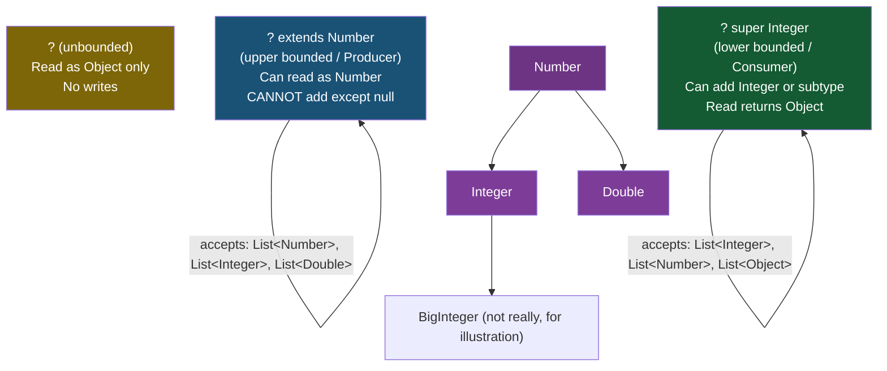

---
tags:
  - Java
  - Generics
  - Wildcards
  - PECS
difficulty: Advanced
created: 2026-07-26
---

# ❓ Wildcards and PECS

## TL;DR

- **`? extends T`** (upper bounded) — the collection is a **Producer**: you can *read* elements as `T`, but you **cannot add** (except `null`). Think: covariant.
- **`? super T`** (lower bounded) — the collection is a **Consumer**: you can *add* elements of type `T` or its subtypes, but reading returns `Object`. Think: contravariant.
- **`?`** (unbounded) — completely unknown type; you can only read as `Object`.
- **PECS = Producer Extends, Consumer Super** (Joshua Bloch, *Effective Java* Item 31).
- `Collections.copy(dest, src)` is the canonical PECS example: `List<? super T> dest` (consumer), `List<? extends T> src` (producer).

---

## Intuition

**`? extends T` = vending machine**: it only *dispenses* items. You can take a snack out (read it as `T`), but you cannot put your own snack back in — the machine doesn't know if your snack matches what it's configured to hold.

**`? super T` = trash can**: it only *accepts* items. You can throw your garbage in (add `T` or subtype), but when you reach in to retrieve something, you only know you'll get *something* — the contents are typed as `Object`.

---

## How It Works

### Wildcard Type Hierarchy



---

### Code: Upper Bounded, Lower Bounded, Unbounded, PECS

```java
import java.util.*;

public class WildcardDemo {

    // ── Upper Bounded: ? extends Number ──────────────────────────────
    // Method accepts List<Number>, List<Integer>, List<Double>, etc.
    // You can READ elements as Number; you CANNOT add (type unknown at runtime)
    public static double sumList(List<? extends Number> list) {
        double sum = 0;
        for (Number n : list) {   // Safe: every element IS-A Number
            sum += n.doubleValue();
        }
        // list.add(3.14);        // COMPILE ERROR — cannot add to ? extends Number
        // list.add(null);        // This is technically allowed but useless/dangerous
        return sum;
    }

    // ── Lower Bounded: ? super Integer ───────────────────────────────
    // Method accepts List<Integer>, List<Number>, List<Object>
    // You can ADD Integer or its subtypes; reading returns Object
    public static void addNumbers(List<? super Integer> list, int count) {
        for (int i = 1; i <= count; i++) {
            list.add(i);          // Safe: any ? super Integer can hold an Integer
        }
        // Integer val = list.get(0); // COMPILE ERROR — get() returns Object, not Integer
        Object obj = list.get(0);    // This is fine — get() returns Object
    }

    // ── Unbounded: ? ────────────────────────────────────────────────
    // Accepts any List<T> regardless of T
    // Can only read as Object; cannot add at all
    public static void printAll(List<?> list) {
        for (Object element : list) {  // Safe: every element IS-A Object
            System.out.println(element);
        }
        // list.add("hello"); // COMPILE ERROR — ? could be List<Integer>
    }

    // ── PECS: Collections.copy equivalent ───────────────────────────
    // src is a Producer  → ? extends T  (we read from it)
    // dest is a Consumer → ? super T    (we write into it)
    public static <T> void copy(List<? super T> dest, List<? extends T> src) {
        if (dest.size() < src.size()) throw new IllegalArgumentException("dest too small");
        for (int i = 0; i < src.size(); i++) {
            T element = src.get(i);   // reads as T from ? extends T
            dest.set(i, element);     // writes T into ? super T
        }
    }

    // ── Wildcard capture helper ──────────────────────────────────────
    // Sometimes we need to give a name to a wildcard's type
    // for a temporary computation — use a private helper method
    public static void reverse(List<?> list) {
        reverseHelper(list);   // delegates to capture helper
    }

    private static <T> void reverseHelper(List<T> list) {
        // Now T is a concrete captured type — we can read AND write
        for (int i = 0, j = list.size() - 1; i < j; i++, j--) {
            T temp = list.get(i);
            list.set(i, list.get(j));
            list.set(j, temp);
        }
    }

    // ── When NOT to use wildcards on return types ────────────────────
    // BAD — callers have to deal with a wildcard they can't use
    // public static List<? extends Number> badMethod() { ... }

    // GOOD — return a concrete parameterized type, or the bound type
    public static List<Number> goodMethod() {
        return new ArrayList<>();
    }

    public static void main(String[] args) {
        // sumList: works with List<Integer>, List<Double>, List<Number>
        List<Integer> ints    = Arrays.asList(1, 2, 3, 4, 5);
        List<Double>  doubles = Arrays.asList(1.1, 2.2, 3.3);
        List<Number>  numbers = Arrays.asList(10, 2.5, 7L);

        System.out.println("Sum ints:    " + sumList(ints));    // 15.0
        System.out.println("Sum doubles: " + sumList(doubles)); // 6.6
        System.out.println("Sum numbers: " + sumList(numbers)); // 19.5

        // addNumbers: works with List<Integer>, List<Number>, List<Object>
        List<Number> numList  = new ArrayList<>();
        List<Object> objList  = new ArrayList<>();
        addNumbers(numList, 3);
        addNumbers(objList, 3);
        System.out.println("Number list: " + numList); // [1, 2, 3]
        System.out.println("Object list: " + objList); // [1, 2, 3]

        // addNumbers(ints, 3); // COMPILE ERROR — List<Integer> is not ? super Integer
        // (? super Integer excludes List<Integer> when used with List.add)
        // Actually List<Integer> IS valid for ? super Integer — let's check:
        List<Integer> intDest = new ArrayList<>(Arrays.asList(0, 0, 0));
        addNumbers(intDest, 3);
        System.out.println("Int dest: " + intDest); // [1, 2, 3]

        // printAll: works with any list type
        printAll(ints);
        printAll(doubles);
        printAll(Arrays.asList("hello", "world"));

        // PECS copy
        List<Integer> src  = Arrays.asList(10, 20, 30);
        List<Number>  dest = new ArrayList<>(Arrays.asList(0, 0, 0));
        copy(dest, src);  // dest is ? super Integer (Number is super of Integer)
                           // src  is ? extends Integer (Integer extends Integer — itself)
        System.out.println("After copy: " + dest); // [10, 20, 30]

        // reverse with wildcard capture
        List<String> words = new ArrayList<>(Arrays.asList("hello", "world", "java"));
        reverse(words);
        System.out.println("Reversed: " + words); // [java, world, hello]
    }
}
```

---

### Wildcard Reference Table

| Wildcard | Can Read As | Can Write | Accepted List Types | Use Case |
|---|---|---|---|---|
| `? extends T` | `T` or supertype | No (only `null`) | `List<T>`, `List<SubT>` | Read-only access; producer |
| `? super T` | `Object` | `T` and subtypes | `List<T>`, `List<SuperT>`, `List<Object>` | Write-only access; consumer |
| `?` | `Object` | No | Any `List<X>` | Print/inspect without caring about type |

---

## Key Concepts

### Upper Bounded `? extends T` — Producer

When a collection is declared as `List<? extends Animal>`, the compiler knows every element in that list is *at minimum* an `Animal`. Reads are safe — you can assign to `Animal`. But writes are unsafe: the list might be a `List<Dog>`, a `List<Cat>`, or a `List<Animal>`. If you try to add a `Cat` to what is secretly a `List<Dog>`, you'd break type safety. So the compiler prohibits all adds (except `null`, which is type-compatible with anything).

```java
List<? extends Animal> animals = getDogs(); // ? = Dog
Animal a = animals.get(0);  // Safe — Dog IS-A Animal
// animals.add(new Cat());  // Rejected — list might be List<Dog>
```

### Lower Bounded `? super T` — Consumer

When a collection is declared as `List<? super Integer>`, the compiler knows it can hold integers — but it might be a `List<Number>`, `List<Object>`, or `List<Integer>`. Adding an `Integer` is always safe because every type in the super-chain can hold an `Integer`. But reading is unsafe: if the actual type is `List<Object>`, the element might be a `String` — so reads return `Object`.

```java
List<? super Integer> container = getNumbers(); // ? = Number
container.add(42);        // Safe — Number can hold Integer
Object obj = container.get(0); // Returns Object — actual type unknown
```

### PECS Principle

Joshua Bloch's **PECS** mnemonic (*Effective Java* Item 31) governs when to use each wildcard:

- Use `? extends T` for a parameter you only **produce** (return/read) values from.
- Use `? super T` for a parameter you only **consume** (add/write) values into.
- Use no wildcard when you both produce and consume from the same structure.

The canonical JDK example is `Collections.copy`:

```java
// src produces T elements → ? extends T
// dest consumes T elements → ? super T
public static <T> void copy(List<? super T> dest, List<? extends T> src)
```

### Spring's Usage of PECS

```java
// Spring's ApplicationEventMulticaster:
// Accepts listeners for any ApplicationEvent subtype
void addApplicationListener(ApplicationListener<? extends ApplicationEvent> listener);

// Spring Data's Comparable usage:
// A type that compares to itself or its supertypes
interface Comparable<T> { int compareTo(T o); }
// Sorted<T extends Comparable<? super T>> — T need only be comparable to a supertype,
// allowing subtypes to be sorted by a supertype's compareTo
```

### Wildcard Capture

When you need to perform an operation on a `List<?>` that requires knowing the type, use a private generic helper to *capture* the wildcard:

```java
public static void swap(List<?> list, int i, int j) {
    swapHelper(list, i, j); // capture ? as T
}
private static <T> void swapHelper(List<T> list, int i, int j) {
    T tmp = list.get(i);
    list.set(i, list.get(j));
    list.set(j, tmp);
}
```

The `swapHelper` method gives the wildcard a name (`T`) so you can read and write using the same type within the method.

### When NOT to Use Wildcards

- **Return types** — returning `List<? extends Number>` forces callers to deal with a useless wildcard. Return `List<Number>` or use a type parameter instead.
- **When a type parameter serves better** — if you need to relate input and output types (`<T> T identity(T t)`), wildcards can't express that relationship.
- **More than one level deep** — nested wildcards like `List<? extends List<? extends Number>>` are technically valid but nearly impossible to use in practice.

---

## Real-World Usage

- **Spring Framework** `ApplicationEventPublisher` uses `ApplicationListener<? extends ApplicationEvent>` so that a listener for `UserCreatedEvent` (a subtype) can be registered without an unchecked cast.
- **Guava's `Iterables.filter(Iterable<T>, Predicate<? super T>)`** — the predicate is a consumer of `T`; using `? super T` allows a `Predicate<Object>` to filter a `List<String>`.
- **`Comparable<? super T>`** in `TreeSet<T extends Comparable<? super T>>` — a `Dog` can be sorted if `Animal` implements `Comparable<Animal>`, even if `Dog` doesn't override `compareTo`.

---

## Common Pitfalls

1. **Using `extends` when you need to write** — `List<? extends Number> list; list.add(3.14);` is a compile error. If you need to add elements, you want `? super Number` or a concrete type parameter.
2. **Expecting `? super Integer` to exclude `List<Integer>`** — it doesn't. `List<Integer>` is valid for `? super Integer` (Integer is a supertype of itself). The set is: `List<Integer>`, `List<Number>`, `List<Object>`.
3. **Nested wildcard confusion** — `List<List<?>>` and `List<? extends List<?>>` are different types with different usability. `List<List<?>>` accepts `List<List<Integer>>` as an element but NOT as the outer list; `List<? extends List<?>>` accepts `List<List<Integer>>` as the outer list.
4. **Forgetting that wildcards are use-site variance** — unlike Kotlin's `out`/`in` or Scala's `+T`/`-T` (declaration-site variance), Java wildcards must be written at every use site. You cannot declare `class Stack<out T>` in Java.

---

## Review Questions

1. Why does `List<Dog>` fail to assign to `List<Animal>`, but `List<Dog>` successfully assigns to `List<? extends Animal>`?
2. Write a generic utility method `<T> void fillN(List<? super T> list, T element, int n)` that adds `element` to `list` exactly `n` times. Explain why `? super T` is the correct wildcard choice here.
3. A Spring team member writes a repository method returning `List<? extends BaseEntity>`. A senior dev requests changing it to `List<BaseEntity>`. Explain why this change is usually correct for return types.

---

## Related

- [[_MOC_Java_Generics|↑ Section MOC]]
- [[Generic_Classes_and_Methods]]
- [[Type_Erasure_and_Variance]]

---

*Tags: #Java #Generics #Wildcards #PECS #Advanced*
