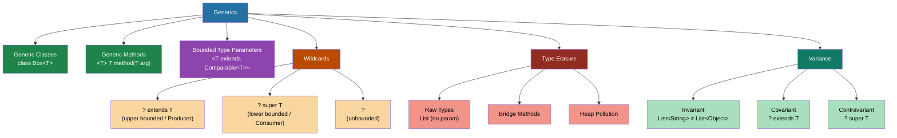

# Java Generics — Map of Content

> Generics give you compile-time type safety at zero runtime cost. Mastering them — especially wildcards and erasure — is essential for writing reusable library code and understanding the JDK's own APIs.

---

## Concept Map



---

## Learning Path

| Step | Topic | Note | Prerequisite |
|------|-------|------|--------------|
| 1 | Generic classes, methods, bounded params | [[Generic_Classes_and_Methods]] | Java OOP basics |
| 2 | Wildcards and PECS principle | [[Wildcards_and_PECS]] | Step 1 |
| 3 | Type erasure, variance, restrictions | [[Type_Erasure_and_Variance]] | Step 1–2 |
| 4 | Generics with Collections | [[_MOC_Java_Collections]] | Step 1–2 |
| 5 | Generics in Stream API | [[_MOC_Streams_Functional]] | Step 1–3 |

---

## Notes in This Section

| Note | Summary | Difficulty |
|------|---------|------------|
| [[Generic_Classes_and_Methods]] | Syntax, bounded params, raw types, diamond operator, naming conventions | Intermediate |
| [[Wildcards_and_PECS]] | Upper/lower/unbounded wildcards, PECS principle, Joshua Bloch's guidelines | Advanced |
| [[Type_Erasure_and_Variance]] | Erasure mechanics, restrictions, heap pollution, array covariance vs generic invariance | Advanced |

---

## Key Interview Questions

| Question | Core Answer | See Note |
|----------|------------|----------|
| Why can't you do `new T[]`? | Type parameter `T` is erased at runtime; JVM doesn't know what type to allocate for the array | [[Type_Erasure_and_Variance]] |
| What is PECS? | Producer Extends, Consumer Super — use `? extends T` to read from a collection, `? super T` to write to it | [[Wildcards_and_PECS]] |
| Why are Java arrays covariant but generics invariant? | Arrays check at runtime (ArrayStoreException); generics chose compile-time safety over covariance to prevent the same class of error statically | [[Type_Erasure_and_Variance]] |
| What is a raw type and why is it dangerous? | `List` without type parameter; compiler inserts unchecked casts; heap pollution possible | [[Generic_Classes_and_Methods]] |
| Difference between `<T extends Comparable<T>>` and `<? extends Comparable<?>>` | Type parameter creates a name you can reference; wildcard is anonymous and one-use | [[Wildcards_and_PECS]] |
| What is a bridge method? | Compiler-generated synthetic method that maintains polymorphism after type erasure in overridden generic methods | [[Type_Erasure_and_Variance]] |

---

## Quick-Reference Cheat Sheet

```
// Type parameter — reusable, nameable
public <T extends Comparable<T>> T max(T a, T b) { ... }

// Wildcard — anonymous, one-use
public void print(List<?> list) { ... }

// PECS rule:
List<? extends Number> producer = getNumbers(); // READ from here
Number n = producer.get(0);                    // OK
// producer.add(3.14); // COMPILE ERROR

List<? super Integer> consumer = getList();    // WRITE into here
consumer.add(42);                              // OK
// Integer i = consumer.get(0); // returns Object

// Type erasure: both become List at runtime
List<String>  → List (with String casts inserted by compiler)
List<Integer> → List (with Integer casts inserted by compiler)
```

---

## Related Sections

- [[_MOC_Java_Collections]] — generics in List, Map, Set APIs
- [[_MOC_Streams_Functional]] — `Stream<T>`, `Optional<T>`, `Collector<T,A,R>`
- [[_MOC_Java_Concurrency]] — `Future<V>`, `CompletableFuture<T>`
