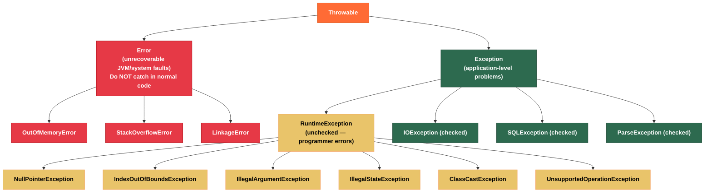

# ⚠️ Checked vs Unchecked Exceptions

> [!abstract] TL;DR
> **Checked exceptions** are subclasses of `Exception` (but not `RuntimeException`) that the compiler forces you to declare or handle — they model recoverable conditions the caller should plan for. **Unchecked exceptions** (subclasses of `RuntimeException` or `Error`) represent programmer mistakes or unrecoverable JVM conditions and need not be declared. The Java community has largely moved toward unchecked exceptions in frameworks (Spring wraps checked exceptions in `DataAccessException`) because checked exceptions break functional interfaces and create noisy API surfaces. The **sneaky throws** trick abuses type erasure to throw checked exceptions without declaring them, but use it sparingly.

---

## Intuition

Imagine calling a restaurant:

- **Checked exception** = "The restaurant may be fully booked — the phone system requires you to have an alternate plan before you dial." The API forces you to handle the contingency at compile time. Good for truly recoverable situations where the caller has meaningful options.
- **Unchecked exception** = "You misdialed by passing a negative table count. That's a programmer error — no recovery needed, just fix the bug." The exception propagates to a top-level handler that logs it.
- **Error** = "The building is on fire." You don't catch it and try to continue — you let the JVM exit.

---

## How It Works

### Java Exception Hierarchy



### Checked vs Unchecked Summary Table

| Aspect | Checked Exception | Unchecked Exception | Error |
|--------|------------------|---------------------|-------|
| Superclass | `Exception` (not RE) | `RuntimeException` | `Error` |
| Must declare in `throws`? | Yes | No | No |
| Must handle or propagate? | Yes (compile enforced) | No | No |
| Typical cause | External system failure | Bug in code | JVM/system fault |
| Caller can recover? | Often yes | Rarely | Almost never |
| Use in functional interfaces | Awkward (workaround needed) | Fine | N/A |
| Examples | `IOException`, `SQLException` | `NPE`, `IllegalArgument` | `OOM`, `StackOverflow` |

---

## Key Concepts

### 1. Checked Exceptions — Compile-Time Enforcement

```java
import java.io.*;

public class CheckedDemo {

    // Compiler forces callers to handle IOException
    public String readFile(String path) throws IOException {
        try (BufferedReader reader = new BufferedReader(new FileReader(path))) {
            return reader.readLine();
        }
        // IOException is checked — not declaring throws would be a compile error
    }

    // Option A: handle it yourself
    public String readFileSafe(String path) {
        try {
            return readFile(path);
        } catch (IOException e) {
            // Handle meaningfully — log, return default, rethrow wrapped
            System.err.println("Failed to read: " + path + " — " + e.getMessage());
            return "";
        }
    }

    // Option B: re-declare to let caller handle
    public String readFileAndPropagate(String path) throws IOException {
        return readFile(path);   // propagate: caller is responsible
    }

    // When checked exceptions are appropriate:
    // - File not found (caller can prompt user to choose another)
    // - Network timeout (caller can retry)
    // - Resource temporarily unavailable (caller can queue)
}
```

### 2. Unchecked Exceptions — Programmer Errors

```java
public class UncheckedDemo {

    // Unchecked: indicates a bug — callers should fix the bug, not catch it
    public static double divide(int a, int b) {
        if (b == 0) throw new IllegalArgumentException("Divisor must be non-zero, got: " + b);
        return (double) a / b;
    }

    // Common unchecked exceptions and when to throw them:
    public static void validate(String input, int index, Object state) {
        // Null argument when null not permitted
        if (input == null) throw new NullPointerException("input must not be null");
        // Or prefer: Objects.requireNonNull(input, "input must not be null");

        // Argument outside valid range
        if (index < 0) throw new IndexOutOfBoundsException("index: " + index);

        // Argument violates a precondition
        if (input.isBlank()) throw new IllegalArgumentException("input must not be blank");

        // Object in wrong state for the requested operation
        if (state == null) throw new IllegalStateException("Must initialize before calling");
    }
}
```

### 3. The Checked Exception Controversy

```java
// Bloch's position (Effective Java): Use checked exceptions for recoverable conditions
// the CALLER can reasonably handle; use unchecked for programming errors.

// Spring's decision: ALL SQL/data access exceptions are wrapped in unchecked
// DataAccessException hierarchy. Reason:
// 1. Most callers can't meaningfully recover from a SQL error
// 2. Checked exceptions pollute every DAO interface
// 3. Functional interfaces (Predicate, Function) don't support checked exceptions

// Wrapping checked as unchecked — the standard Spring/JPA approach:
public class WrappingDemo {

    public String loadConfig(String key) {
        try {
            return readFromDatabase(key);
        } catch (java.sql.SQLException e) {
            // Translate to domain exception (unchecked)
            throw new ConfigLoadException("Failed to load config key: " + key, e);
        }
    }

    // Custom unchecked exception
    static class ConfigLoadException extends RuntimeException {
        public ConfigLoadException(String message, Throwable cause) {
            super(message, cause);   // always preserve the cause chain!
        }
    }

    private String readFromDatabase(String key) throws java.sql.SQLException { return ""; }
}
```

### 4. Checked Exceptions and Functional Interfaces

```java
import java.util.*;
import java.util.function.*;

public class FunctionalCheckedException {

    @FunctionalInterface
    interface ThrowingFunction<T, R> {
        R apply(T t) throws Exception;
    }

    // Wrap a throwing function to make it usable in Stream pipelines
    public static <T, R> Function<T, R> wrap(ThrowingFunction<T, R> fn) {
        return t -> {
            try {
                return fn.apply(t);
            } catch (RuntimeException e) {
                throw e;   // re-throw unchecked as-is
            } catch (Exception e) {
                throw new RuntimeException(e);  // wrap checked as unchecked
            }
        };
    }

    public static void demo() throws Exception {
        List<String> paths = List.of("/etc/hosts", "/etc/passwd");

        // Without wrapper: lambda can't throw IOException
        // paths.stream().map(p -> readFile(p)) → COMPILE ERROR

        // With wrapper: checked exception is wrapped transparently
        List<String> contents = paths.stream()
            .map(wrap(p -> java.nio.file.Files.readString(java.nio.file.Path.of(p))))
            .toList();
    }

    private static String readFile(String path) throws java.io.IOException {
        return java.nio.file.Files.readString(java.nio.file.Path.of(path));
    }
}
```

### 5. Sneaky Throws — Type Erasure Trick

```java
public class SneakyThrows {

    // Abuses type erasure: at bytecode level, all Throwables are thrown the same way.
    // The <E extends Throwable> trick fools the compiler's type-checker.
    @SuppressWarnings("unchecked")
    public static <E extends Throwable> void sneakyThrow(Throwable e) throws E {
        throw (E) e;   // cast erased at runtime — JVM never checks it
    }

    // Usage: throw checked exception without declaring it
    public static String readFileSneaky(String path) {
        try {
            return java.nio.file.Files.readString(java.nio.file.Path.of(path));
        } catch (java.io.IOException e) {
            sneakyThrow(e);   // throws IOException but compiler doesn't know
            return null;      // unreachable, satisfies return type requirement
        }
    }

    // Lombok @SneakyThrows does this automatically:
    // @SneakyThrows(IOException.class)
    // public String readFile(String path) {
    //     return Files.readString(Path.of(path));  // no try-catch needed
    // }

    // WARNING: Use sparingly. Callers can't catch it as checked — only as Throwable.
    // Breaks the compile-time contract. Prefer wrapping with RuntimeException.
}
```

---

## Real-World Notes

- **Spring Data**: `@Repository` beans have all their exceptions translated by Spring's `PersistenceExceptionTranslationPostProcessor` from checked `SQLException` to unchecked `DataAccessException` subclasses — you never write `throws SQLException` in a Spring DAO.
- **CompletableFuture**: checked exceptions inside `thenApply` must be wrapped as unchecked. The `CompletableFuture.exceptionally()` callback receives them as `RuntimeException` wrappers — unwrap with `getCause()`.
- **gRPC / REST controllers**: the boundary between your service layer and the wire protocol is the right place to catch unchecked exceptions and map them to HTTP status codes or gRPC status codes — never let raw exceptions leak to clients.
- **Test code with `@SneakyThrows`**: Lombok's `@SneakyThrows` is common in test helpers where checked exception declarations would clutter otherwise simple test setup code.

---

## Common Pitfalls

| Pitfall | Example | Consequence | Fix |
|---------|---------|-------------|-----|
| Swallowing exceptions | `catch (Exception e) { }` | Bug silently ignored; impossible to diagnose | At minimum log; usually rethrow |
| Catching `Throwable` or `Error` | `catch (Error e)` | Catches OOM/StackOverflow; JVM state is corrupt | Let Errors propagate to JVM |
| Losing the cause chain | `throw new MyException("msg")` after catching `e` | Root cause lost forever | `throw new MyException("msg", e)` |
| Checked exceptions on lambdas | `list.stream().map(p -> readFile(p))` | Compile error — Function doesn't declare throws | Use wrapper or Lombok `@SneakyThrows` |
| Over-broad catch clause | `catch (Exception e)` | Catches NPE, IllegalState, etc. — hides bugs | Catch specific types; let unchecked propagate |
| Declaring checked where unchecked fits | `void setAge(int age) throws Exception` | Forces all callers to handle unnecessary exception | Use `IllegalArgumentException` instead |

---

## Related Notes

- [[_MOC_Java_Exceptions|↑ Section MOC — Java Exceptions]]
- [[Try_with_Resources]] — AutoCloseable, suppressed exceptions, resource cleanup
- [[Exception_Best_Practices]] — translation, logging, functional patterns, anti-patterns
- [[Java_Types_and_Variables]] — type system that underpins the hierarchy
- [[Streams_and_Pipelines]] — where checked exceptions in lambdas become painful

---

## Review Questions

1. A method reads a config file and throws `IOException`. A caller that uses this method inside a `Stream.map()` lambda gets a compile error. Walk through three different ways to resolve this, and state the trade-off of each approach.

2. Spring wraps all `SQLException` instances in unchecked `DataAccessException`. Give two concrete reasons why this design decision benefits application developers, and one scenario where it might make debugging harder.

3. Explain the "sneaky throws" technique: what Java language rules does it exploit, what are the risks for callers, and when (if ever) is it acceptable to use it?

---

#Java #Exceptions #CheckedException #UncheckedException #RuntimeException #ErrorHandling #Intermediate
