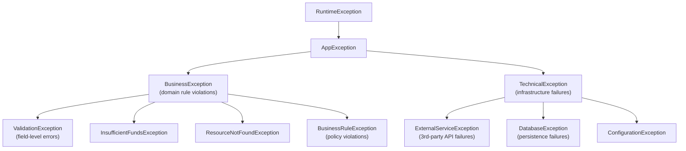

---
tags:
  - Java
  - Exceptions
  - CustomExceptions
  - Design
difficulty: Intermediate
created: 2026-07-26
---

# 🛠️ Custom Exceptions

## TL;DR

Custom exceptions convey domain context that standard JDK exceptions cannot express. Extend `RuntimeException` for unchecked exceptions (the Spring/modern style) or `Exception` for checked ones when callers genuinely need to handle the failure. Add meaningful fields beyond just a message: `errorCode` (for machines to parse), `context` map (for debugging), entity identifiers. Provide multiple constructors: message-only, message-plus-cause, and field-specific. Design an exception hierarchy — a base `AppException` branching into `BusinessException` and `TechnicalException` subtrees — so handlers can catch at the right level of specificity. Follow the `XxxException` naming convention. Avoid proliferating custom exceptions for conditions that standard exceptions express perfectly well.

---

## Intuition

A `RuntimeException("something went wrong")` is like a sticky note saying "broken." A custom `InsufficientFundsException` with `accountId`, `requested`, and `available` fields is like a precisely labelled incident report with all the facts. The former tells you *that* something failed; the latter tells you *what* failed, *why*, and *what data* was involved — crucial information for incident response, structured logging, and building meaningful API error responses.

---

## How It Works

### Exception Hierarchy Design



### Base AppException

```java
public abstract class AppException extends RuntimeException {

    private final String errorCode;
    private final Map<String, Object> context;

    protected AppException(String errorCode, String message) {
        super(message);
        this.errorCode = errorCode;
        this.context = new HashMap<>();
    }

    protected AppException(String errorCode, String message, Throwable cause) {
        super(message, cause);
        this.errorCode = errorCode;
        this.context = new HashMap<>();
    }

    protected AppException(String errorCode, String message, Map<String, Object> context) {
        super(message);
        this.errorCode = errorCode;
        this.context = new HashMap<>(context);
    }

    protected AppException(String errorCode, String message, Throwable cause,
                           Map<String, Object> context) {
        super(message, cause);
        this.errorCode = errorCode;
        this.context = new HashMap<>(context);
    }

    public String getErrorCode() { return errorCode; }
    public Map<String, Object> getContext() { return Collections.unmodifiableMap(context); }

    // Builder-style context enrichment
    public AppException with(String key, Object value) {
        this.context.put(key, value);
        return this;
    }
}
```

### ValidationException with Field-Level Errors

```java
public class ValidationException extends BusinessException {

    private final List<FieldError> fieldErrors;

    public ValidationException(List<FieldError> fieldErrors) {
        super("VALIDATION_FAILED",
              "Validation failed for " + fieldErrors.size() + " field(s)");
        this.fieldErrors = List.copyOf(fieldErrors);
    }

    public List<FieldError> getFieldErrors() {
        return fieldErrors;
    }

    public record FieldError(String field, String code, String message) {}

    // Factory method for single-field error
    public static ValidationException forField(String field, String code, String message) {
        return new ValidationException(List.of(new FieldError(field, code, message)));
    }
}

// Usage
throw ValidationException.forField("email", "INVALID_FORMAT", "Not a valid email address");

// Or bulk validation
List<ValidationException.FieldError> errors = new ArrayList<>();
if (dto.getEmail() == null) errors.add(new FieldError("email", "REQUIRED", "Email is required"));
if (dto.getAge() < 0) errors.add(new FieldError("age", "MIN_VALUE", "Age cannot be negative"));
if (!errors.isEmpty()) throw new ValidationException(errors);
```

### ResourceNotFoundException for Spring REST 404

```java
public class ResourceNotFoundException extends BusinessException {

    public ResourceNotFoundException(String resourceType, Object id) {
        super("RESOURCE_NOT_FOUND",
              String.format("%s with id '%s' was not found", resourceType, id),
              Map.of("resourceType", resourceType, "id", id));
    }

    public ResourceNotFoundException(String resourceType, String field, Object value) {
        super("RESOURCE_NOT_FOUND",
              String.format("%s where %s = '%s' was not found", resourceType, field, value),
              Map.of("resourceType", resourceType, "field", field, "value", value));
    }
}

// Usage in service layer
public User getUser(long id) {
    return userRepository.findById(id)
        .orElseThrow(() -> new ResourceNotFoundException("User", id));
}

public Product getProductBySku(String sku) {
    return productRepo.findBySku(sku)
        .orElseThrow(() -> new ResourceNotFoundException("Product", "sku", sku));
}
```

### BusinessRuleException with Business Context

```java
public class InsufficientFundsException extends BusinessException {

    private final BigDecimal requested;
    private final BigDecimal available;
    private final String accountId;

    public InsufficientFundsException(String accountId, BigDecimal requested,
                                      BigDecimal available) {
        super("INSUFFICIENT_FUNDS",
              String.format("Account %s has %.2f but %.2f was requested",
                            accountId, available, requested),
              Map.of("accountId", accountId,
                     "requested", requested,
                     "available", available));
        this.accountId = accountId;
        this.requested = requested;
        this.available = available;
    }

    public BigDecimal getRequested() { return requested; }
    public BigDecimal getAvailable() { return available; }
    public String getAccountId() { return accountId; }
}
```

### @ControllerAdvice Handler for Custom Exceptions

```java
@RestControllerAdvice
public class GlobalExceptionHandler {

    private static final Logger log = LoggerFactory.getLogger(GlobalExceptionHandler.class);

    @ExceptionHandler(ResourceNotFoundException.class)
    @ResponseStatus(HttpStatus.NOT_FOUND)
    public ErrorResponse handleNotFound(ResourceNotFoundException ex) {
        return ErrorResponse.of(ex.getErrorCode(), ex.getMessage(), ex.getContext());
    }

    @ExceptionHandler(ValidationException.class)
    @ResponseStatus(HttpStatus.UNPROCESSABLE_ENTITY)
    public ErrorResponse handleValidation(ValidationException ex) {
        return ErrorResponse.builder()
            .errorCode(ex.getErrorCode())
            .message(ex.getMessage())
            .fieldErrors(ex.getFieldErrors())
            .build();
    }

    @ExceptionHandler(InsufficientFundsException.class)
    @ResponseStatus(HttpStatus.PAYMENT_REQUIRED)
    public ErrorResponse handleInsufficientFunds(InsufficientFundsException ex) {
        return ErrorResponse.of(ex.getErrorCode(), ex.getMessage(), ex.getContext());
    }

    @ExceptionHandler(BusinessException.class)  // catch-all for business exceptions
    @ResponseStatus(HttpStatus.BAD_REQUEST)
    public ErrorResponse handleBusiness(BusinessException ex) {
        log.warn("Business rule violation: {} - {}", ex.getErrorCode(), ex.getMessage());
        return ErrorResponse.of(ex.getErrorCode(), ex.getMessage(), null);
    }

    @ExceptionHandler(TechnicalException.class)  // infrastructure failures
    @ResponseStatus(HttpStatus.INTERNAL_SERVER_ERROR)
    public ErrorResponse handleTechnical(TechnicalException ex) {
        log.error("Technical failure: {}", ex.getErrorCode(), ex);
        return ErrorResponse.of("INTERNAL_ERROR", "A technical error occurred", null);
        // Note: do NOT expose internal details (cause, stack trace) to clients
    }
}
```

### Exception Translation (DAO Layer Pattern)

```java
// Translate infrastructure exceptions to domain exceptions at layer boundaries
@Repository
public class UserRepository {

    public User save(User user) {
        try {
            return jdbcTemplate.insert(user);
        } catch (DuplicateKeyException e) {
            // Translate SQL-specific to domain-meaningful
            throw new ResourceConflictException("User", "email", user.getEmail(), e);
        } catch (DataAccessException e) {
            // Wrap with context
            throw new DatabaseException("Failed to save user", e)
                .with("userId", user.getId())
                .with("operation", "INSERT");
        }
    }
}
```

### Custom Exception Design Reference

| Exception Name | Extends | Checked? | Key Fields | HTTP Status | When to Use |
|---|---|---|---|---|---|
| `AppException` | `RuntimeException` | No | `errorCode`, `context` | — | Abstract base; never throw directly |
| `BusinessException` | `AppException` | No | inherited | 400/422 | Abstract; domain rule violations |
| `ValidationException` | `BusinessException` | No | `fieldErrors: List<FieldError>` | 422 | Input validation failures with field details |
| `ResourceNotFoundException` | `BusinessException` | No | `resourceType`, `id` | 404 | Entity lookup failures |
| `InsufficientFundsException` | `BusinessException` | No | `requested`, `available`, `accountId` | 402 | Financial business rule violations |
| `TechnicalException` | `AppException` | No | inherited + `cause` | 500 | Abstract; infrastructure failures |
| `ExternalServiceException` | `TechnicalException` | No | `serviceName`, `statusCode` | 502 | 3rd-party API failures |
| `DatabaseException` | `TechnicalException` | No | `operation` | 500 | Persistence layer failures |

---

## Key Concepts

### When to Create Custom Exceptions

Create a custom exception when: (1) the domain concept has a specific name that maps to a business term stakeholders use, (2) you need to carry structured data beyond a message string, (3) you're building a hierarchy that lets handlers catch at the right granularity, (4) you're translating between architectural layers and need to prevent infrastructure leakage.

Do NOT create a custom exception for every error variant — use standard exceptions where the meaning is clear: `IllegalArgumentException` for invalid method arguments, `IllegalStateException` for calling methods in wrong order, `UnsupportedOperationException` for unimplemented features.

### Checked vs Unchecked Custom Exceptions

In modern Java applications (especially Spring REST APIs), the dominant convention is **unchecked** custom exceptions. This avoids forcing every calling method to declare `throws YourException` or wrap in try-catch at every layer. The exception hierarchy handles propagation. Checked custom exceptions make sense in library APIs where callers genuinely need to handle the failure case at the call site and have meaningful recovery options.

### Exception Fields Design

An exception is read by two audiences: humans (developers, on-call engineers reading logs) and machines (monitoring systems, error aggregators, API clients parsing error responses). Design fields accordingly:

- `errorCode` — machine-readable stable string constant (not message, which can change); used for i18n lookup, monitoring alerts
- `message` — human-readable, context-specific; should answer "what happened and where"
- `context` — structured key-value debugging data: entity IDs, operation names, input values
- `cause` — always include when wrapping another exception; never lose the root cause

### Exception Hierarchy Design

A well-designed hierarchy lets handlers be as specific or as general as needed: catch `InsufficientFundsException` to return 402, catch `BusinessException` to return 400, catch `AppException` to return 500 with a safe message. The hierarchy also documents the exception model — new developers reading the hierarchy understand the failure landscape of the application.

### Best Practices

- **Meaningful names**: `UserNotFoundException` not `EntityLookupException`; the name should be self-explanatory
- **Always include cause**: when wrapping, always pass the original exception to the `super(message, cause)` constructor
- **Implement `Serializable`**: exceptions that cross process boundaries (RMI, distributed systems) must be serializable; always add `serialVersionUID`
- **Don't log AND throw**: logging an exception and then rethrowing it causes duplicate log entries at every layer. Log once — at the boundary where you handle it. Throw until you handle.
- **Don't expose internals**: `TechnicalException`s should not leak stack traces, SQL queries, or internal service names to API clients

### Exception Translation (Layer Isolation)

DAO/Repository layer should translate infrastructure exceptions (`SQLException`, `JdbcException`) into domain exceptions (`DatabaseException`, `ResourceNotFoundException`). Service layer translates to business exceptions. Controller layer translates to HTTP responses. Each layer speaks its own language — this is the exception equivalent of the Dependency Inversion Principle.

---

## Real-World: Spring Exception Hierarchies

Spring itself demonstrates this pattern extensively:

- `DataAccessException` — abstract base for all Spring data exceptions; translates vendor-specific `SQLException`s to portable exceptions (`EmptyResultDataAccessException`, `DuplicateKeyException`, `TransientDataAccessException`)
- `AuthenticationException` in Spring Security — base for `BadCredentialsException`, `AccountExpiredException`, `DisabledException`
- `NestedRuntimeException` — Spring's base exception that preserves nested exception message display
- Spring Boot's `ProblemDetail` (RFC 7807) integrates with `@ControllerAdvice` for standardized error responses

---

## Common Pitfalls

1. **Too many custom exceptions** — Creating `UserEmailNotFoundException`, `UserPhoneNotFoundException`, `UserIdNotFoundException` separately when `ResourceNotFoundException("User", "email", value)` covers all three with context. Over-proliferation makes the hierarchy unmanageable.

2. **Leaking infrastructure exceptions** — Letting `SQLException`, `HibernateException`, or `HttpClientErrorException` propagate to the service or controller layer creates tight coupling to infrastructure. Translate at the layer boundary.

3. **Missing `serialVersionUID`** — All `Throwable` subclasses implement `Serializable`. Without `serialVersionUID`, deserialization can fail when the class changes. Always declare `private static final long serialVersionUID = 1L;`.

4. **Exception in `toString()` or field accessors** — If an exception's `toString()` or a getter method itself throws (e.g., a field is not initialized properly), logging the exception will cause another exception, making incident diagnosis extremely painful.

---

## Related Notes

- [[_MOC_Java_Exceptions|↑ Section MOC]]
- [[Exception_Hierarchy_and_Handling]] — the JDK exception hierarchy these custom types sit within
- [[SOLID_Principles]] — custom exception hierarchies apply Open/Closed and Liskov Substitution

---

## Review Questions

1. Why should the `TechnicalException` handler in `@ControllerAdvice` return a generic "technical error" message to clients rather than the actual exception message?
2. A `ValidationException` carrying field errors is thrown in a service method. The method is also `@Transactional`. Does the transaction roll back? What annotation change would affect this?
3. You have `catch (BusinessException e)` and `catch (ValidationException e)` handlers in the same try-catch block. `ValidationException` extends `BusinessException`. In what order must the catch blocks appear, and why?

---

*tags: #Java #Exceptions #CustomExceptions #Design #ExceptionHierarchy #SpringBoot #ControllerAdvice*
