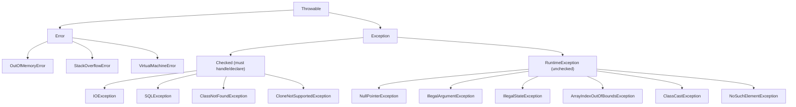

---
tags:
  - Java
  - Exceptions
  - ErrorHandling
difficulty: Intermediate
created: 2026-07-26
---

# ⚠️ Exception Hierarchy and Handling

## TL;DR

`Throwable` splits into `Error` (JVM-level, unrecoverable: `OutOfMemoryError`, `StackOverflowError`) and `Exception` (recoverable). Checked exceptions (`IOException`, `SQLException`) require explicit handling or declaration in the method signature — the compiler enforces this. Unchecked `RuntimeException`s (`NullPointerException`, `IllegalArgumentException`, `IllegalStateException`) don't require declaration and signal programming bugs or intentional API design. `try-catch-finally` guarantees `finally` runs even if `try` returns or throws. Multi-catch `catch(A | B e)` (Java 7) avoids duplicate handler code. `try-with-resources` (Java 7) auto-closes any `AutoCloseable` in reverse open order; if `close()` also throws, that exception is *suppressed* and attached to the primary exception, accessible via `getSuppressed()`.

---

## Intuition

Think of it in three tiers:

- **Error** = the building is on fire. The JVM is out of memory or the stack has overflowed. There is nothing the application can do — evacuate (JVM shuts down).
- **Checked Exception** = a predictable detour on your route. The road *might* be closed for construction (file might not exist, network might be down). You *must* have a plan before you set out — that's what the compiler forces you to do.
- **Unchecked Exception** = a programming bug. You turned left when the GPS said right. The program should be fixed, not papered over with a try-catch.

---

## How It Works

### Hierarchy



### try-catch-finally with the finally Guarantee

```java
public String readFirstLine(String path) {
    BufferedReader reader = null;
    try {
        reader = new BufferedReader(new FileReader(path));
        return reader.readLine();  // even if this returns, finally runs first
    } catch (FileNotFoundException e) {
        System.err.println("File not found: " + path);
        return null;
    } catch (IOException e) {
        throw new RuntimeException("Failed to read file: " + path, e);  // chaining
    } finally {
        // ALWAYS executes — even if try returned or threw
        if (reader != null) {
            try {
                reader.close();
            } catch (IOException ignored) { /* best effort */ }
        }
        System.out.println("finally ran");  // always prints
    }
}

// WARNING: if finally throws, it MASKS the original exception
public void dangerousFinally() {
    try {
        throw new RuntimeException("original problem");
    } finally {
        throw new RuntimeException("finally problem");  // original is LOST
    }
}
```

### Multi-Catch (Java 7)

```java
public void parseAndStore(String input) {
    try {
        int value = Integer.parseInt(input);
        storeInDatabase(value);
    } catch (NumberFormatException | SQLException e) {
        // e is effectively final — cannot reassign
        // both caught and handled identically
        log.error("Failed to process input: {}", input, e);
        throw new ProcessingException("Input processing failed", e);
    }
}
```

### try-with-resources with AutoCloseable

```java
// Custom AutoCloseable resource
public class TrackedConnection implements AutoCloseable {
    private final String name;

    public TrackedConnection(String name) {
        this.name = name;
        System.out.println("Opened: " + name);
    }

    public void query() {
        System.out.println("Querying: " + name);
    }

    @Override
    public void close() {
        System.out.println("Closed: " + name);
        // if this throws, it will be SUPPRESSED if try-block also threw
    }
}

// Multiple resources — closed in REVERSE order (conn2 first, then conn1)
public void multiResourceExample() {
    try (TrackedConnection conn1 = new TrackedConnection("primary");
         TrackedConnection conn2 = new TrackedConnection("replica")) {
        conn1.query();
        conn2.query();
    }
    // Output: Opened: primary, Opened: replica, query x2,
    //         Closed: replica, Closed: primary
}
```

### Suppressed Exceptions

```java
public class FailingResource implements AutoCloseable {
    @Override
    public void close() throws Exception {
        throw new Exception("close() failed");
    }
}

public void suppressedDemo() {
    try (FailingResource r = new FailingResource()) {
        throw new RuntimeException("business logic failed");  // primary
        // close() will ALSO throw → that exception is suppressed
    } catch (RuntimeException e) {
        System.out.println("Primary: " + e.getMessage());  // "business logic failed"
        for (Throwable suppressed : e.getSuppressed()) {
            System.out.println("Suppressed: " + suppressed.getMessage());  // "close() failed"
        }
    } catch (Exception e) {
        e.printStackTrace();
    }
}
```

### Exception Chaining (Preserving Root Cause)

```java
// Layer boundary: DAO layer translates to domain exception
public User findUserById(long id) {
    try {
        return jdbcTemplate.queryForObject(SQL, userMapper, id);
    } catch (EmptyResultDataAccessException e) {
        // Chain: new exception wraps original cause
        throw new UserNotFoundException("User not found: " + id, e);
    } catch (DataAccessException e) {
        throw new RepositoryException("Database error fetching user: " + id, e);
    }
}

// Retrieving chain
try {
    findUserById(42);
} catch (UserNotFoundException e) {
    Throwable cause = e.getCause();       // original EmptyResultDataAccessException
    e.initCause(new RuntimeException());  // set cause after construction (if not set in constructor)
}
```

### Rethrowing in Catch

```java
public void rethrowing() throws IOException {
    try {
        riskyOperation();
    } catch (IOException e) {
        log.warn("Retrying after error", e);
        // Rethrow SAME exception — stack trace preserved
        throw e;
    }
}

// Java 7+: compiler is smarter about rethrow type inference
// Even if catch declares Exception, if only IOException can reach here,
// the method signature only needs throws IOException
public void smartRethrow() throws IOException {
    try {
        new FileReader("file.txt");
    } catch (Exception e) {
        throw e;  // compiler knows only IOException can be caught here
    }
}
```

### Exception Types Reference Table

| Exception Type | Compile-time check | Common Examples | When to Use | Typical Handler Pattern |
|---|---|---|---|---|
| `Error` | No | `OutOfMemoryError`, `StackOverflowError` | Never throw; JVM issues | Catch only in shutdown hooks/frameworks |
| Checked `Exception` | Yes | `IOException`, `SQLException`, `ClassNotFoundException` | Predictable, recoverable external failures | Catch and recover, or wrap and rethrow |
| `RuntimeException` | No | `NPE`, `IAE`, `ISE`, `ClassCastException` | Programming bugs; Spring API style | Fix the code; or catch at boundary to log |
| Custom Checked | Yes | `ParseException` (your own) | Library APIs where callers must handle | Explicitly handle per use case |
| Custom Unchecked | No | `UserNotFoundException`, `InsufficientFundsException` | Domain/business rule violations | Catch at controller/service boundary |

---

## Key Concepts

### Error vs Exception

`Error` signals JVM or system-level catastrophe that the application cannot sensibly recover from. `OutOfMemoryError` means the JVM has no more heap. `StackOverflowError` means unbounded recursion consumed the stack. Never catch `Error` in application code — it gives a false sense of recovery. The only legitimate place to catch `Error` is in framework-level lifecycle code (e.g., logging that the JVM is dying before shutdown).

### Checked vs Unchecked Design

The checked/unchecked split is a design choice that Java enforces at the compiler level. The argument *for* checked exceptions: they make failure modes visible in the API contract. The argument *against* (the Spring philosophy): they clutter interfaces, make lambdas painful, and encourage empty-catch anti-patterns. Modern Java libraries (including JDK Stream API) largely avoid checked exceptions. In production code, the dominant convention is unchecked for domain exceptions and checked only where callers genuinely have meaningful recovery options.

### try-catch-finally Edge Cases

`finally` runs even when `try` or `catch` executes a `return` statement — the return value is evaluated, stored, then `finally` runs, then the stored value is returned. If `finally` itself executes a `return`, it *overrides* the `try`'s return. If `finally` throws, the exception from `try` or `catch` is silently discarded — this is the dangerous masking problem that `try-with-resources` was designed to solve.

### Multi-Catch Constraint

In `catch (A | B e)`, the variable `e` is **effectively final** — you cannot reassign it. This means the two exception types share a single handler but you cannot perform type-specific operations like `e = new WrappedException(e)`. The common base type is inferred at compile time.

### try-with-resources and Suppressed Exceptions

Before Java 7, closing resources in `finally` blocks had a structural problem: if both `try` threw and `finally`'s `close()` threw, the original exception was lost. `try-with-resources` solves this elegantly — if the try-block throws AND `close()` also throws, the close exception is *suppressed* and attached to the primary exception. Resources are closed in reverse declaration order. Multiple resources in one `try(...)` statement each get auto-closed.

### Exception Chaining

When crossing architectural layers (DAO → Service → Controller), always wrap exceptions rather than letting infrastructure exceptions leak to higher layers. `new DomainException("context message", cause)` preserves the full stack trace chain accessible via `getCause()`. Losing the cause is one of the most frustrating production debugging problems.

---

## Real-World: Spring Boot Integration

```java
@RestControllerAdvice
public class GlobalExceptionHandler extends ResponseEntityExceptionHandler {

    // Handles your custom unchecked exceptions
    @ExceptionHandler(UserNotFoundException.class)
    public ResponseEntity<ErrorResponse> handleUserNotFound(UserNotFoundException ex) {
        return ResponseEntity.status(HttpStatus.NOT_FOUND)
            .body(new ErrorResponse("USER_NOT_FOUND", ex.getMessage()));
    }

    // Handles all unhandled exceptions as 500
    @ExceptionHandler(Exception.class)
    public ResponseEntity<ErrorResponse> handleGeneral(Exception ex) {
        log.error("Unhandled exception", ex);
        return ResponseEntity.status(HttpStatus.INTERNAL_SERVER_ERROR)
            .body(new ErrorResponse("INTERNAL_ERROR", "An unexpected error occurred"));
    }
}
```

Spring's `@Transactional` rolls back on any `RuntimeException` by default. To trigger rollback for checked exceptions: `@Transactional(rollbackFor = CheckedException.class)`.

---

## Common Pitfalls

1. **Catching `Exception` too broadly** — `catch (Exception e)` silently swallows `NullPointerException`, `ClassCastException`, and other bugs that should crash fast and loud. Catch the most specific type possible.

2. **Empty catch block** — `catch (Exception e) {}` is a time-bomb. Even just `log.error("...", e)` is infinitely better. If you genuinely intend to ignore, add a comment explaining why.

3. **`finally` masking the original exception** — Closing resources in `finally` with a bare `close()` that can throw will silently discard the original exception. Use `try-with-resources` instead.

4. **Not closing resources** — Forgetting to close `InputStream`, `Connection`, or `Statement` in all exit paths causes resource leaks. `try-with-resources` eliminates this class of bug entirely.

5. **Checked exceptions in lambdas** — `stream.map(this::riskyMethod)` won't compile if `riskyMethod` throws a checked exception. You must wrap with a utility method or use a functional interface that declares the checked exception.

---

## Related Notes

- [[_MOC_Java_Exceptions|↑ Section MOC]]
- [[Custom_Exceptions]] — designing domain-rich exception hierarchies
- [[_MOC_Java_OOP]] — polymorphism; the exception hierarchy IS polymorphism

---

## Review Questions

1. If `try` executes `return "A"` and `finally` executes `return "B"`, what does the method return, and is the behavior different if `finally` throws instead of returning?
2. How do suppressed exceptions in `try-with-resources` differ from the exception-masking problem in `try-finally` with manual `close()` calls?
3. A method signature declares `throws IOException`. A subclass overrides this method. Can the overriding method declare `throws Exception`? Why or why not?

---

*tags: #Java #Exceptions #ErrorHandling #TryCatch #TryWithResources #SuppressedExceptions #ExceptionChaining*
