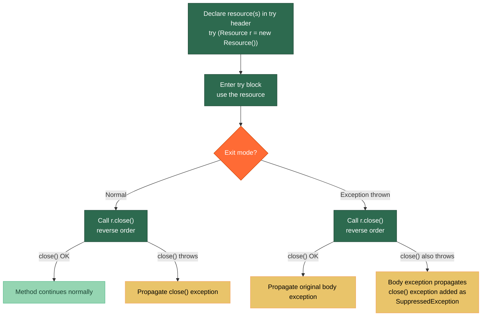

# 🔐 Try-with-Resources

> [!abstract] TL;DR
> **Try-with-resources** (Java 7+) guarantees that any object implementing `AutoCloseable` is closed when the try block exits, whether normally or via exception. Resources declared in the header are closed in **reverse declaration order**. If both the body and `close()` throw, the body exception propagates and the `close()` exception is **suppressed** (retrievable via `Throwable.getSuppressed()`). This eliminates the notorious `finally` + `close()` bug where a `close()` exception silently swallowed the original exception.

---

## Intuition

Imagine a security badge checkout system at a server room:

- The old way (`finally` + manual `close()`): you had to remember to return your badge on the way out, even if the server caught fire. If you panicked (threw an exception) AND dropping the badge also threw an exception, the badge-drop error would replace the fire alert — the real problem was lost.
- **Try-with-resources** = an automatic turnstile. The door closes behind you no matter what. If the server was on fire AND the door jammed, the jammed-door error is noted as a footnote (suppressed exception) but the fire alert (original exception) is still what reaches the alarm system.

---

## How It Works

### Resource Lifecycle in Try-with-Resources



---

## Key Concepts

### 1. AutoCloseable vs Closeable

```java
// AutoCloseable — the root interface (Java 7+)
// close() is allowed to throw any checked Exception
public interface AutoCloseable {
    void close() throws Exception;
}

// Closeable — for I/O streams; narrows close() to IOException
// All java.io streams implement Closeable (and thus AutoCloseable)
public interface Closeable extends AutoCloseable {
    void close() throws IOException;
}

// Your custom resource — implement AutoCloseable
public class DatabaseConnection implements AutoCloseable {
    private final String url;
    private boolean open = true;

    public DatabaseConnection(String url) {
        this.url = url;
        System.out.println("Opened connection to " + url);
    }

    public void query(String sql) {
        if (!open) throw new IllegalStateException("Connection is closed");
        System.out.println("Executing: " + sql);
    }

    @Override
    public void close() {
        if (open) {
            open = false;
            System.out.println("Closed connection to " + url);
        }
        // Idempotent close is a best practice — safe to call multiple times
    }
}
```

### 2. Basic Try-with-Resources Syntax

```java
import java.io.*;

public class TryWithResourcesDemo {

    // Single resource
    public static String readFirstLine(String path) throws IOException {
        try (BufferedReader reader = new BufferedReader(new FileReader(path))) {
            return reader.readLine();
        }   // reader.close() called automatically here — even if readLine() throws
    }

    // Multiple resources — declared left-to-right, closed RIGHT-TO-LEFT
    public static void copyFile(String src, String dst) throws IOException {
        try (InputStream  in  = new FileInputStream(src);
             OutputStream out = new FileOutputStream(dst)) {
            in.transferTo(out);
        }
        // Closing order: out.close() first, then in.close()
        // This mirrors the stack discipline: last opened, first closed
    }

    // Java 9+: effectively-final variable (no need to re-declare)
    public static void java9Style(BufferedReader existing) throws IOException {
        // 'existing' must be effectively final
        try (existing) {
            String line = existing.readLine();
        }   // existing.close() called; caller's reference is now closed
    }
}
```

### 3. Suppressed Exceptions

```java
public class SuppressedExceptionDemo {

    static class FlakeyResource implements AutoCloseable {
        @Override
        public void close() throws Exception {
            throw new Exception("Close failed!");
        }
    }

    public static void demonstrateSuppressed() {
        try (FlakeyResource r = new FlakeyResource()) {
            throw new RuntimeException("Body failed!");
            // Both body AND close() throw:
            // - "Body failed!" propagates (primary)
            // - "Close failed!" is added as suppressed
        } catch (RuntimeException e) {
            System.out.println("Primary: " + e.getMessage()); // "Body failed!"

            Throwable[] suppressed = e.getSuppressed();
            for (Throwable s : suppressed) {
                System.out.println("Suppressed: " + s.getMessage()); // "Close failed!"
            }
        } catch (Exception e) {
            e.printStackTrace();
        }
    }

    // Why the old finally approach was broken:
    public static void oldFinallyBug() throws Exception {
        Exception bodyException = null;
        FlakeyResource r = new FlakeyResource();
        try {
            throw new RuntimeException("Body failed!");
        } catch (RuntimeException e) {
            bodyException = e;
            throw e;
        } finally {
            try {
                r.close();
            } catch (Exception closeEx) {
                // If we just: throw closeEx; — body exception is LOST!
                // Correct but tedious workaround:
                if (bodyException != null) {
                    bodyException.addSuppressed(closeEx);
                } else {
                    throw closeEx;
                }
            }
        }
        // try-with-resources does ALL of the above automatically
    }
}
```

### 4. Custom Resources and Null Safety

```java
public class CustomResourceDemo {

    // Resource that wraps an optional external connection
    public static class TransactionScope implements AutoCloseable {
        private final java.sql.Connection conn;
        private boolean committed = false;

        public TransactionScope(java.sql.Connection conn) throws java.sql.SQLException {
            this.conn = conn;
            conn.setAutoCommit(false);
        }

        public void commit() throws java.sql.SQLException {
            conn.commit();
            committed = true;
        }

        @Override
        public void close() throws java.sql.SQLException {
            if (!committed) {
                conn.rollback();   // auto-rollback if not committed
            }
            conn.setAutoCommit(true);
        }
    }

    public static void transactionalDemo(java.sql.Connection conn) throws java.sql.SQLException {
        try (TransactionScope tx = new TransactionScope(conn)) {
            // do database work...
            tx.commit();
        }
        // If any exception occurs before commit(), close() rolls back automatically
    }

    // Null-safe resource — if factory returns null, skip close
    public static void nullSafeDemo() throws Exception {
        // try-with-resources handles null gracefully: close() is NOT called on null
        AutoCloseable maybeNull = getOptionalResource();
        try (AutoCloseable r = maybeNull) {
            if (r != null) {
                // use r
            }
        }
    }

    private static AutoCloseable getOptionalResource() { return null; }
}
```

### 5. Common AutoCloseable Resources

```java
import java.io.*;
import java.net.*;
import java.sql.*;
import java.nio.channels.*;

public class CommonResources {

    public static void examples() throws Exception {
        String path = "/tmp/file.txt";
        String host = "localhost";

        // I/O Streams
        try (FileInputStream fis  = new FileInputStream(path);
             BufferedInputStream bis = new BufferedInputStream(fis)) { }

        // Writer
        try (PrintWriter pw = new PrintWriter(new FileWriter(path))) {
            pw.println("Hello");
        }

        // Network
        try (Socket socket = new Socket(host, 8080);
             InputStream is = socket.getInputStream()) { }

        // JDBC
        try (Connection conn = DriverManager.getConnection("jdbc:...");
             PreparedStatement ps = conn.prepareStatement("SELECT 1");
             ResultSet rs = ps.executeQuery()) {
            while (rs.next()) { System.out.println(rs.getInt(1)); }
        }

        // NIO Channels
        try (FileChannel channel = FileChannel.open(java.nio.file.Path.of(path))) { }

        // Executors (Java 19+ with virtual threads)
        try (var executor = java.util.concurrent.Executors.newVirtualThreadPerTaskExecutor()) {
            executor.submit(() -> System.out.println("task"));
        }
        // ExecutorService.close() awaits termination — very clean lifecycle
    }
}
```

---

## Real-World Notes

- **JDBC connection leaks**: the most common Java resource leak in enterprise code is a `Connection` not closed when an exception occurs mid-method. Try-with-resources eliminates this entirely — every connection, statement, and result set should be in a try-with-resources block.
- **Spring's `TransactionTemplate`** replaces manual `try/catch/finally` around transactions with a template method pattern. Under the hood it does the same commit-or-rollback logic that `TransactionScope` above demonstrates.
- **Testing with Mockito**: mock `AutoCloseable` resources in tests and verify `close()` was called with `verify(mock).close()` — try-with-resources guarantees it, but the test confirms your test double is wired up correctly.
- **Java 21 virtual threads and `ExecutorService`**: `ExecutorService` implements `AutoCloseable` (Java 19+), making structured concurrency clean: `try (var exec = Executors.newVirtualThreadPerTaskExecutor()) { ... }` waits for all tasks to finish before the block exits.

---

## Common Pitfalls

| Pitfall | Example | Consequence | Fix |
|---------|---------|-------------|-----|
| Declaring resource outside try header | `Conn c = new Conn(); try { ... }` | `c` not closed on exception | Move declaration into `try (Conn c = new Conn())` |
| Swallowing suppressed exceptions | Only printing `e.getMessage()` | Lose close() failure info | Check `e.getSuppressed()` in diagnostics |
| Non-idempotent `close()` | `close()` throws on second call | Double-close causes cascade errors | Guard with `if (open)` flag in `close()` |
| Closing in wrong order | Closing `InputStream` before `BufferedInputStream` wrapping it | Potentially flushing to a closed stream | Declare outer wrapper last (it's closed first) |
| Forgetting `close()` on re-thrown resource | Catching, doing work, re-throwing — resource not in try header | Resource leak if re-thrown path doesn't close | Always use try-with-resources, not manual close |

---

## Related Notes

- [[_MOC_Java_Exceptions|↑ Section MOC — Java Exceptions]]
- [[Checked_vs_Unchecked]] — exception hierarchy; why `close()` can throw checked exceptions
- [[Exception_Best_Practices]] — logging at boundaries, exception chaining
- [[Java_Types_and_Variables]] — reference types and null references
- [[Concurrency_Basics]] — `ExecutorService.close()` in virtual thread structured concurrency

---

## Review Questions

1. You have a method that opens a `Connection`, then a `PreparedStatement`, then a `ResultSet`. Write this using try-with-resources. In what order are the three resources closed, and why does that order matter?

2. A `close()` method in your `AutoCloseable` throws an exception at the same time as an exception is thrown from the try body. Which exception propagates to the caller? How do you access the other one? Why was the `finally`-based approach before Java 7 problematic for this scenario?

3. A senior engineer says: "Make sure `DatabaseConnection.close()` is idempotent." What does that mean, how do you implement it, and why is it important specifically for try-with-resources?

---

#Java #Exceptions #TryWithResources #AutoCloseable #ResourceManagement #SuppressedExceptions #Intermediate
