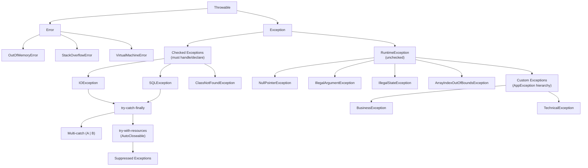

# Java Exceptions — Map of Content

> This section covers the full exception ecosystem in Java: from the Throwable hierarchy to checked vs unchecked design decisions, try-with-resources, suppressed exceptions, and building domain-rich custom exceptions.

---

## Concept Map

---

## Learning Path

Work through these notes in order to build a complete mental model of Java exception handling:

1. **Foundation first** — Understand the Throwable hierarchy: Error vs Exception, checked vs unchecked. This is the prerequisite for everything else.
2. **Mechanics** — Master try-catch-finally, multi-catch, try-with-resources, and suppressed exceptions. Know the edge cases (finally with return, exception in finally).
3. **Design** — Learn when and how to create custom exceptions with meaningful context. Understand exception hierarchy design patterns.
4. **Real-world integration** — See how Spring Boot leverages exception handling via `@ControllerAdvice`, `@ExceptionHandler`, and its own `DataAccessException` hierarchy.

---

## Notes in This Section

| Note | Description | Difficulty |
|------|-------------|------------|
| [[Exception_Hierarchy_and_Handling]] | Throwable tree, checked/unchecked, try-catch-finally, multi-catch, try-with-resources, suppressed exceptions, exception chaining | Intermediate |
| [[Custom_Exceptions]] | Designing domain exceptions, AppException hierarchies, error codes, @ControllerAdvice integration, exception translation | Intermediate |

---

## Key Questions to Answer

After studying this section, you should be able to confidently answer:

1. **When to use checked vs unchecked?** — Why does Spring use unchecked everywhere while Java I/O uses checked? What's the philosophical argument on each side?
2. **What happens if `finally` throws?** — If both `try` and `finally` throw, which exception propagates? How does this differ from try-with-resources suppressed exception behavior?
3. **How do suppressed exceptions work?** — When does a `close()` exception get suppressed? How do you retrieve suppressed exceptions? How does this differ from pre-Java-7 `finally` resource closing?
4. **What is exception chaining and why does it matter?** — How do you preserve root cause when wrapping exceptions? Why is losing the cause a serious debugging problem?
5. **What fields should a custom exception carry?** — Beyond message and cause, what contextual data makes exceptions useful in production incident diagnosis?

---

## Key Concepts Quick Reference

| Concept | One-liner |
|---------|-----------|
| `Error` | JVM/system-level, unrecoverable — never catch in application code |
| Checked Exception | Compiler-enforced handling; use for predictable, recoverable failures |
| `RuntimeException` | Unchecked; signals programming bug or Spring-style API convention |
| `try-with-resources` | Auto-closes `AutoCloseable` in reverse order; close exceptions are suppressed |
| Suppressed exceptions | Close() exception stored in primary exception, accessible via `getSuppressed()` |
| Exception chaining | Wrap original cause in new exception for context; preserve with constructor arg |
| Multi-catch | `catch (A \| B e)` — variable is effectively final; Java 7+ |
| Custom exception | Carry domain context (errorCode, entity ID, field errors) beyond just message |

---

## Related Sections

- [[_MOC_Java_Fundamentals]] — Language basics, types, control flow
- [[_MOC_Java_OOP]] — Inheritance, polymorphism, interfaces; exception hierarchy is polymorphism in action
- [[_MOC_Streams_Functional]] — Checked exceptions in lambdas: a common friction point
