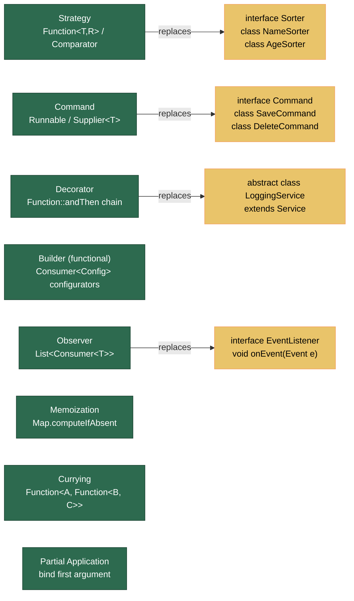

# 🎨 Functional Design Patterns

> [!abstract] TL;DR
> Classical OOP design patterns become dramatically lighter in functional Java. **Strategy** shrinks from a class hierarchy to a `Function` parameter. **Command** is a `Runnable` or `Supplier<T>`. **Decorator** is `Function::andThen` composition. **Observer** is `List<Consumer<T>>`. **Memoization** is `Map.computeIfAbsent`. **Currying** converts an n-argument function into a chain of 1-argument functions. These patterns reduce boilerplate while retaining the same intent — the trade-off is that stack traces and debugging are harder than with named classes.

---

## Intuition

Think of the shift from OOP patterns to functional patterns as the difference between **hiring a department** vs **writing an instruction**:

- OOP Strategy: hire a `SortStrategy` department, have them implement an interface, inject the department.
- Functional Strategy: write a note "sort by last name" (a lambda) and hand it directly to the function that needs it.

The same intent — "plug in interchangeable behavior" — is achieved in one line instead of three files. The power is composability: functional pieces snap together like LEGO blocks using `andThen`, `compose`, `computeIfAbsent`, without class hierarchies.

---

## How It Works

### Pattern Map — OOP to Functional



---

## Key Concepts

### 1. Strategy Pattern — Functions Instead of Classes

```java
import java.util.*;
import java.util.function.*;

public class StrategyPattern {

    // ── BEFORE: OOP Strategy ──────────────────────────────────────────────
    interface PricingStrategy {
        double apply(double basePrice, int quantity);
    }

    static class BulkDiscount implements PricingStrategy {
        @Override
        public double apply(double basePrice, int quantity) {
            return quantity > 10 ? basePrice * 0.8 : basePrice;
        }
    }

    static class VIPDiscount implements PricingStrategy {
        @Override
        public double apply(double basePrice, int quantity) {
            return basePrice * 0.7;
        }
    }

    // ── AFTER: Functional Strategy ────────────────────────────────────────
    // PricingStrategy IS-A BiFunction<Double, Integer, Double>
    // No classes needed — just define the lambdas

    static final BiFunction<Double, Integer, Double> BULK_DISCOUNT =
        (price, qty) -> qty > 10 ? price * 0.8 : price;

    static final BiFunction<Double, Integer, Double> VIP_DISCOUNT =
        (price, qty) -> price * 0.7;

    static final BiFunction<Double, Integer, Double> NO_DISCOUNT =
        (price, qty) -> price;

    // The "context" just accepts the strategy as a parameter
    public static double checkout(double price, int qty,
                                  BiFunction<Double, Integer, Double> strategy) {
        return strategy.apply(price, qty);
    }

    public static void demo() {
        System.out.println(checkout(100.0, 15, BULK_DISCOUNT));  // 80.0
        System.out.println(checkout(100.0,  1, VIP_DISCOUNT));   // 70.0

        // Dynamic selection — map of strategies
        Map<String, BiFunction<Double, Integer, Double>> strategies = Map.of(
            "BULK", BULK_DISCOUNT,
            "VIP",  VIP_DISCOUNT,
            "NONE", NO_DISCOUNT
        );

        String customerType = "VIP";
        double finalPrice = checkout(100.0, 5, strategies.get(customerType));
    }
}
```

### 2. Command Pattern — Runnable and Supplier

```java
import java.util.*;
import java.util.function.*;

public class CommandPattern {

    // ── BEFORE: OOP Command ───────────────────────────────────────────────
    interface Command { void execute(); }
    interface UndoableCommand extends Command { void undo(); }

    // ── AFTER: Functional Command with history ────────────────────────────
    public static class CommandHistory {
        private final Deque<Runnable> undoStack = new ArrayDeque<>();

        // Execute a command and record its undo action
        public void execute(Runnable action, Runnable undoAction) {
            action.run();
            undoStack.push(undoAction);
        }

        public void undo() {
            if (!undoStack.isEmpty()) undoStack.pop().run();
        }
    }

    // Supplier<T> for commands that return values (transactional operations)
    public static class TransactionalCommand {

        public static <T> T executeWithRetry(Supplier<T> command, int maxAttempts) {
            Exception last = null;
            for (int i = 0; i < maxAttempts; i++) {
                try {
                    return command.get();
                } catch (RuntimeException e) {
                    last = e;
                    System.err.println("Attempt " + (i+1) + " failed: " + e.getMessage());
                }
            }
            throw new RuntimeException("All " + maxAttempts + " attempts failed", last);
        }
    }

    public static void demo() {
        // Text editor history
        StringBuilder doc = new StringBuilder("Hello");
        CommandHistory history = new CommandHistory();

        history.execute(
            () -> doc.append(" World"),          // do
            () -> doc.delete(5, doc.length())    // undo
        );
        System.out.println(doc);  // "Hello World"

        history.undo();
        System.out.println(doc);  // "Hello"

        // Transactional with retry
        String result = TransactionalCommand.executeWithRetry(
            () -> callFlakeyService(),
            3
        );
    }

    static String callFlakeyService() { return "OK"; }
}
```

### 3. Decorator Pattern — Function Composition

```java
import java.util.function.*;

public class DecoratorPattern {

    // ── BEFORE: OOP Decorator ─────────────────────────────────────────────
    interface TextProcessor { String process(String text); }
    static class TrimProcessor implements TextProcessor {
        public String process(String t) { return t.trim(); }
    }
    static class UpperCaseProcessor implements TextProcessor {
        private final TextProcessor wrapped;
        UpperCaseProcessor(TextProcessor w) { this.wrapped = w; }
        public String process(String t) { return wrapped.process(t).toUpperCase(); }
    }

    // ── AFTER: Function composition ───────────────────────────────────────
    static final UnaryOperator<String> trim      = String::trim;
    static final UnaryOperator<String> uppercase = String::toUpperCase;
    static final UnaryOperator<String> addPrefix = s -> "[PROCESSED] " + s;

    // Compose decorators with andThen — left to right, reads naturally
    static final UnaryOperator<String> pipeline =
        trim.andThen(uppercase).andThen(addPrefix);

    public static void demo() {
        System.out.println(pipeline.apply("  hello world  "));
        // → "[PROCESSED] HELLO WORLD"

        // Build dynamically based on config
        UnaryOperator<String> customPipeline = buildPipeline(true, false, true);
        System.out.println(customPipeline.apply("  test  "));
    }

    static UnaryOperator<String> buildPipeline(boolean doTrim, boolean doUpper, boolean doPrefix) {
        UnaryOperator<String> result = UnaryOperator.identity();
        if (doTrim)   result = result.andThen(String::trim);
        if (doUpper)  result = result.andThen(String::toUpperCase);
        if (doPrefix) result = result.andThen(s -> "[OUT] " + s);
        return result;
    }
}
```

### 4. Builder Pattern — Consumer Configurators

```java
import java.util.function.*;

public class FunctionalBuilder {

    // Traditional builder requires a dedicated Builder class per type.
    // Functional builder accepts Consumer<T> configurators — very flexible.

    public static class HttpRequest {
        private String method = "GET";
        private String url;
        private String body;
        private final java.util.Map<String, String> headers = new java.util.HashMap<>();

        public HttpRequest method(String m) { this.method = m; return this; }
        public HttpRequest url(String u)    { this.url = u; return this; }
        public HttpRequest body(String b)   { this.body = b; return this; }
        public HttpRequest header(String k, String v) { headers.put(k, v); return this; }

        @Override public String toString() {
            return method + " " + url + " headers=" + headers + " body=" + body;
        }
    }

    // Factory that accepts Consumer<HttpRequest> for configuration
    public static HttpRequest request(Consumer<HttpRequest> configurator) {
        HttpRequest req = new HttpRequest();
        configurator.accept(req);
        return req;
    }

    public static void demo() {
        // Clean functional-style construction
        HttpRequest postRequest = request(req -> req
            .method("POST")
            .url("https://api.example.com/users")
            .header("Content-Type", "application/json")
            .body("{\"name\":\"Alice\"}")
        );

        // Reusable partial configurations
        Consumer<HttpRequest> jsonHeaders = req -> req
            .header("Content-Type",  "application/json")
            .header("Accept",        "application/json");

        Consumer<HttpRequest> authHeaders = req -> req
            .header("Authorization", "Bearer token123");

        // Compose reusable configurators with andThen
        Consumer<HttpRequest> apiRequest = jsonHeaders.andThen(authHeaders);

        HttpRequest getUser = request(apiRequest.andThen(r -> r.url("/users/42")));
        HttpRequest postUser = request(apiRequest.andThen(r -> r.method("POST").url("/users")));

        System.out.println(getUser);
        System.out.println(postUser);
    }
}
```

### 5. Observer Pattern — List of Consumers

```java
import java.util.*;
import java.util.function.*;

public class ObserverPattern {

    // ── BEFORE: OOP Observer ──────────────────────────────────────────────
    interface EventListener<T> { void onEvent(T event); }

    // ── AFTER: List of Consumer<T> ────────────────────────────────────────
    public static class EventBus<T> {
        private final List<Consumer<T>> listeners = new ArrayList<>();

        public void subscribe(Consumer<T> listener)   { listeners.add(listener); }
        public void unsubscribe(Consumer<T> listener) { listeners.remove(listener); }

        public void publish(T event) {
            listeners.forEach(l -> l.accept(event));
        }
    }

    record UserCreatedEvent(String userId, String email) {}

    public static void demo() {
        EventBus<UserCreatedEvent> bus = new EventBus<>();

        // Listeners are just lambdas / method references
        bus.subscribe(e -> System.out.println("Welcome email sent to " + e.email()));
        bus.subscribe(e -> System.out.println("Audit log: user created " + e.userId()));
        bus.subscribe(e -> System.out.println("Analytics: new user " + e.userId()));

        bus.publish(new UserCreatedEvent("u-123", "alice@example.com"));
        // All three listeners fire in order
    }
}
```

### 6. Memoization — computeIfAbsent

```java
import java.util.*;
import java.util.function.*;

public class Memoization {

    // Cache expensive computation results — pure functions only
    // (same input must always produce same output; no side effects)

    public static <T, R> Function<T, R> memoize(Function<T, R> fn) {
        Map<T, R> cache = new HashMap<>();
        return input -> cache.computeIfAbsent(input, fn);
        // computeIfAbsent: if key absent, compute value with fn and store it
    }

    // Classic example: Fibonacci with memoization
    // NOTE: recursive memoization needs a reference trick to recurse through the cache
    static final Map<Long, Long> fibCache = new HashMap<>();

    static long fib(long n) {
        if (n <= 1) return n;
        return fibCache.computeIfAbsent(n, k -> fib(k - 1) + fib(k - 2));
    }

    public static void demo() {
        // Generic memoized function
        Function<String, Integer> expensiveLength =
            memoize(s -> {
                System.out.println("Computing for: " + s);
                return s.length();
            });

        System.out.println(expensiveLength.apply("hello"));  // computes
        System.out.println(expensiveLength.apply("hello"));  // cached — no print
        System.out.println(expensiveLength.apply("world"));  // computes

        // Fibonacci
        System.out.println(fib(50));  // fast due to memoization
    }

    // Thread-safe memoization: replace HashMap with ConcurrentHashMap
    public static <T, R> Function<T, R> memoizeConcurrent(Function<T, R> fn) {
        Map<T, R> cache = new java.util.concurrent.ConcurrentHashMap<>();
        return input -> cache.computeIfAbsent(input, fn);
        // ConcurrentHashMap.computeIfAbsent is atomic per key
    }
}
```

### 7. Currying and Partial Application

```java
import java.util.function.*;

public class CurryingAndPartial {

    // Currying: transform f(a, b) into a -> (b -> result)
    // Each call returns a new function waiting for the next argument

    // ── Currying ──────────────────────────────────────────────────────────
    public static <A, B, C> Function<A, Function<B, C>> curry(BiFunction<A, B, C> f) {
        return a -> b -> f.apply(a, b);
    }

    public static void curryDemo() {
        BiFunction<String, Integer, String> repeat = (s, n) -> s.repeat(n);

        // Curried version
        Function<String, Function<Integer, String>> curriedRepeat = curry(repeat);

        // Apply one argument at a time
        Function<Integer, String> repeatHello = curriedRepeat.apply("hello");
        System.out.println(repeatHello.apply(3));  // "hellohellohello"
        System.out.println(repeatHello.apply(1));  // "hello"

        // Useful for building reusable partial functions
        Function<Integer, String> repeatDash = curriedRepeat.apply("-");
        System.out.println(repeatDash.apply(5));   // "-----"
    }

    // ── Partial Application ───────────────────────────────────────────────
    // Fix the FIRST argument, return a function expecting the rest
    public static <A, B, R> Function<B, R> partial(BiFunction<A, B, R> f, A fixedA) {
        return b -> f.apply(fixedA, b);
    }

    public static void partialDemo() {
        BiFunction<String, String, String> greet =
            (greeting, name) -> greeting + ", " + name + "!";

        // Partially apply "Hello" — get back a Function<String, String>
        Function<String, String> sayHello = partial(greet, "Hello");
        Function<String, String> sayHi    = partial(greet, "Hi");

        System.out.println(sayHello.apply("Alice"));  // "Hello, Alice!"
        System.out.println(sayHi.apply("Bob"));       // "Hi, Bob!"

        // Common practical example: pre-fill a logger prefix
        BiFunction<String, String, String> logger = (prefix, msg) -> "[" + prefix + "] " + msg;
        Function<String, String> infoLog  = partial(logger, "INFO");
        Function<String, String> errorLog = partial(logger, "ERROR");

        System.out.println(infoLog.apply("Server started"));   // "[INFO] Server started"
        System.out.println(errorLog.apply("Connection refused")); // "[ERROR] Connection refused"
    }
}
```

---

## Real-World Notes

- **Spring's `WebMvcConfigurer`** uses the functional-builder pattern: `addCorsMappings(CorsRegistry registry)` passes a registry (the "config object") into your `Consumer`-style configurator method.
- **RxJava / Project Reactor**: the entire reactive pipeline is a decorator chain — each `.map()`, `.filter()`, `.flatMap()` composes a new `Publisher` decorator around the previous one, exactly like `Function::andThen`.
- **Guava `CacheBuilder`**: Guava's `LoadingCache` is a production-grade memoization cache with TTL, size limits, and eviction — use it instead of a raw `HashMap.computeIfAbsent` in production when you need bounded caching.
- **Command pattern in undo systems**: IDE undo/redo stacks, text editors, and game save systems all use the command pattern. The functional version with `Deque<Runnable>` for undo is simpler than a full class hierarchy.
- **Currying in validation**: `Function<Field, Function<Rule, ValidationResult>>` lets you pre-bind the field and apply multiple rules — common in custom validation framework implementations.

---

## Common Pitfalls

| Pitfall | Example | Consequence | Fix |
|---------|---------|-------------|-----|
| Memoizing impure functions | Caching `Math.random()` or `LocalDate.now()` | Always returns the first computed value | Only memoize pure functions (same input → same output always) |
| Shared mutable state in Consumer | `Consumer<T>` that modifies a shared list without sync | Race condition in parallel streams | Use `Collector` instead of mutable accumulation in streams |
| Infinite recursion in curried lambdas | Self-referential lambda | `StackOverflowError` | Use explicit method recursion + memoization map |
| Stack trace opacity | Deep `andThen` chains fail with cryptic trace | Hard to identify which decorator failed | Add named intermediate variables; log at each step in debug mode |
| Over-currying simple code | `a -> b -> c -> a + b + c` for trivial ops | Unreadable; no benefit | Curry only when partial application genuinely provides reusable intermediate functions |

---

## Related Notes

- [[_MOC_Java_Streams|↑ Section MOC — Java Streams & Functional]]
- [[Method_References]] — the building blocks: Function, Consumer, Supplier, Predicate
- [[Streams_and_Pipelines]] — functional patterns in stream pipelines
- [[Bounded_Type_Parameters]] — generic type parameters in functional interfaces
- [[Java_Patterns]] — classical OOP design patterns for comparison

---

## Review Questions

1. You have a `BiFunction<Double, Double, Double> discount = (price, pct) -> price * (1 - pct)` and you want to create three pre-configured discounters: 10%, 20%, 30%. Using partial application, write the code that creates these three `Function<Double, Double>` objects from the single BiFunction.

2. A codebase has a `Strategy` interface with 12 implementations, each in its own file, with no state. A teammate proposes replacing the whole hierarchy with a `Map<String, Function<Input, Output>>`. What are the three main advantages of the functional approach, and what is one scenario where the OOP class hierarchy would still be preferable?

3. You want to memoize a method `String fetchFromRemote(String url)`. What are the two criteria the method must satisfy before memoization is safe? What Java data structure would you use in a multi-threaded web server, and why is `HashMap` insufficient there?

---

#Java #Functional #DesignPatterns #Strategy #Command #Decorator #Observer #Memoization #Currying #Advanced
