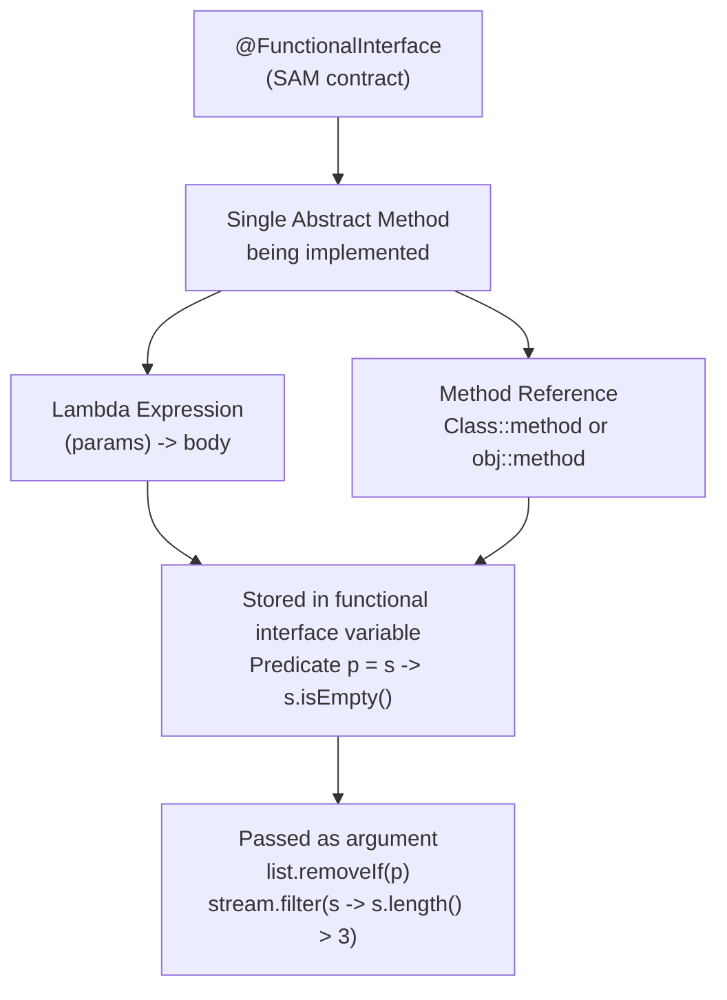

---
tags:
  - Java
  - Streams
  - Lambdas
  - FunctionalProgramming
difficulty: Intermediate
created: 2026-07-26
---

# λ Lambdas and Functional Interfaces

## TL;DR

Lambdas are anonymous functions that implement a `@FunctionalInterface` — an interface with exactly one abstract method (SAM: Single Abstract Method). `java.util.function` provides the canonical functional interface library: `Function<T,R>` (transform one type to another), `Predicate<T>` (boolean test), `Consumer<T>` (side-effect, no return), `Supplier<T>` (produce a value), `BiFunction<T,U,R>`, `UnaryOperator<T>`, `BinaryOperator<T>`, plus primitive specializations (`IntFunction`, `ToLongFunction`, etc.) that avoid boxing overhead. Method references (`::`) are four forms: static method, instance method on type, instance method on specific object, and constructor. Lambdas capture variables from the enclosing scope only if those variables are **effectively final** — they cannot be reassigned after capture.

---

## Intuition

A lambda is a **recipe card** you hand to someone — not the meal itself, but the instructions for making it. The recipe card (lambda) is lightweight, portable, and can be passed around as data. When someone wants the meal (result), they execute the recipe.

A method reference is like pointing to an existing recipe already written in a cookbook (`Collections::sort`) rather than writing the same instructions again as an anonymous card.

---

## How It Works

### Mental Model: @FunctionalInterface → Lambda / Method Reference



### Lambda Syntax Evolution

```java
// Anonymous class — verbose, pre-Java-8 style
Comparator<String> byLength1 = new Comparator<String>() {
    @Override
    public int compare(String a, String b) {
        return Integer.compare(a.length(), b.length());
    }
};

// Lambda — expression body (single expression, no braces, implicit return)
Comparator<String> byLength2 = (a, b) -> Integer.compare(a.length(), b.length());

// Lambda — block body (explicit return, multiple statements allowed)
Comparator<String> byLength3 = (String a, String b) -> {
    // explicit types optional; required only to resolve ambiguity
    System.out.println("Comparing: " + a + " vs " + b);
    return Integer.compare(a.length(), b.length());
};

// Zero params: empty parentheses required
Runnable r = () -> System.out.println("Running");

// One param: parentheses optional
Consumer<String> print = s -> System.out.println(s);
Predicate<Integer> isEven = n -> n % 2 == 0;
```

### All Four Method Reference Forms

```java
// Form 1: Static method reference — ClassName::staticMethod
// Equivalent lambda: (s) -> Integer.parseInt(s)
Function<String, Integer> parser = Integer::parseInt;
System.out.println(parser.apply("42"));  // 42

// Form 2: Instance method on a type (unbound) — ClassName::instanceMethod
// Equivalent lambda: (s) -> s.toUpperCase()
// First lambda param becomes "this" for the method call
Function<String, String> upper = String::toUpperCase;
List<String> words = List.of("hello", "world");
words.stream().map(String::toUpperCase).forEach(System.out::println);

// Form 3: Instance method on a specific object (bound) — instance::instanceMethod
// Equivalent lambda: (x) -> myObj.someMethod(x)
String prefix = "Hello, ";
Function<String, String> greeter = prefix::concat;
System.out.println(greeter.apply("Alice"));  // "Hello, Alice"

// Form 4: Constructor reference — ClassName::new
// Equivalent lambda: (s) -> new StringBuilder(s)
Function<String, StringBuilder> sbFactory = StringBuilder::new;
Supplier<List<String>> listFactory = ArrayList::new;  // no-arg constructor
```

### All Core java.util.function Interfaces

```java
// Function<T, R>: T -> R; one input, one output
Function<String, Integer> strLen = String::length;
Function<Integer, Integer> doubler = x -> x * 2;

// Composition: andThen (apply f then g) vs compose (apply g then f)
Function<String, Integer> lenThenDouble = strLen.andThen(doubler);
System.out.println(lenThenDouble.apply("hello"));  // 5 -> 10

Function<String, Integer> doubleThenLen = strLen.compose(
    s -> s + s  // applied BEFORE strLen
);
// Actually: compose means: apply argument first to the other function, then to strLen
// strLen.compose(f) = x -> strLen.apply(f.apply(x))

// Predicate<T>: T -> boolean; test/filter
Predicate<String> nonEmpty = s -> !s.isEmpty();
Predicate<String> shortStr = s -> s.length() < 5;

// Predicate composition
Predicate<String> nonEmptyAndShort = nonEmpty.and(shortStr);
Predicate<String> emptyOrLong = nonEmpty.negate().or(shortStr.negate());
Predicate<String> notNull = Predicate.not(Objects::isNull);  // Java 11+

List<String> data = List.of("hi", "", "hello", "world", "hey");
data.stream()
    .filter(nonEmpty.and(shortStr))
    .forEach(System.out::println);  // hi, hey

// Consumer<T>: T -> void; side effects
Consumer<String> logger = s -> System.out.println("[LOG] " + s);
Consumer<String> auditor = s -> auditService.record(s);
Consumer<String> logAndAudit = logger.andThen(auditor);  // chain consumers

data.forEach(logAndAudit);

// Supplier<T>: () -> T; produce without input (lazy evaluation, factory)
Supplier<List<String>> freshList = ArrayList::new;
Supplier<LocalDateTime> now = LocalDateTime::now;  // evaluated lazily each call

// BiFunction<T, U, R>: (T, U) -> R
BiFunction<String, Integer, String> repeat = (s, n) -> s.repeat(n);
System.out.println(repeat.apply("ab", 3));  // "ababab"

// UnaryOperator<T> extends Function<T,T>: T -> T (same type in and out)
UnaryOperator<String> trim = String::trim;
UnaryOperator<Integer> square = n -> n * n;
List<String> mutable = new ArrayList<>(List.of("  hi  ", " world "));
mutable.replaceAll(trim);  // replaceAll takes UnaryOperator

// BinaryOperator<T> extends BiFunction<T,T,T>: (T, T) -> T
BinaryOperator<Integer> sum = Integer::sum;
BinaryOperator<String> concat = String::concat;
int total = Stream.of(1, 2, 3, 4).reduce(0, sum);
```

### Effectively Final Capture

```java
public void captureDemo() {
    String prefix = "Hello";   // effectively final — never reassigned
    int multiplier = 3;        // effectively final

    // OK: captures are effectively final
    Function<String, String> greet = name -> prefix + ", " + name;
    IntUnaryOperator tripler = n -> n * multiplier;

    // COMPILE ERROR: cannot capture a variable that is reassigned
    String reassigned = "initial";
    // reassigned = "changed";  // uncommenting this breaks the lambda below
    // Consumer<String> broken = s -> System.out.println(reassigned);

    // WORKAROUND 1: use an array (the array reference is final, contents are mutable)
    int[] counter = {0};
    Runnable increment = () -> counter[0]++;   // compiles, but use with care

    // WORKAROUND 2: AtomicInteger for thread-safe mutable capture
    AtomicInteger atomicCounter = new AtomicInteger(0);
    Runnable safeIncrement = () -> atomicCounter.incrementAndGet();
}
```

### Core Functional Interfaces Reference

| Interface | Method Signature | Composition Methods | Returns | Typical Use |
|---|---|---|---|---|
| `Function<T,R>` | `R apply(T t)` | `andThen(after)`, `compose(before)` | `R` | Transform/convert |
| `Predicate<T>` | `boolean test(T t)` | `and()`, `or()`, `negate()` | `boolean` | Filter/test |
| `Consumer<T>` | `void accept(T t)` | `andThen(after)` | `void` | Side effects, logging |
| `Supplier<T>` | `T get()` | — | `T` | Lazy factory, default values |
| `BiFunction<T,U,R>` | `R apply(T t, U u)` | `andThen(after)` | `R` | Two-arg transform |
| `UnaryOperator<T>` | `T apply(T t)` | (inherits `Function`) | `T` | In-place transform |
| `BinaryOperator<T>` | `T apply(T t1, T t2)` | (inherits `BiFunction`) | `T` | Combine two of same type |
| `IntFunction<R>` | `R apply(int value)` | — | `R` | Avoid boxing `Integer` |
| `ToIntFunction<T>` | `int applyAsInt(T t)` | — | `int` | Extract int without boxing |

---

## Key Concepts

### @FunctionalInterface Annotation

`@FunctionalInterface` is optional but strongly recommended. It documents intent and makes the compiler enforce the SAM constraint — if you accidentally add a second abstract method, the compiler reports an error immediately rather than silently allowing it. Default methods and static methods in the interface do not count toward the SAM count.

### Lambda Syntax Rules

Parentheses around a single parameter are optional (`x -> x * 2` is valid). Type declarations on parameters are optional and inferred from context. A block body `{ ... }` requires an explicit `return` statement; an expression body is implicitly returned. Checked exceptions in lambda bodies are a challenge — you must either wrap them in a try-catch inside the lambda or use a functional interface that declares the checked exception.

### The Four Method Reference Types

1. **Static**: `Integer::parseInt` — `ClassName::staticMethod`; equivalent to `x -> ClassName.staticMethod(x)`
2. **Unbound instance** (on type): `String::length` — `ClassName::instanceMethod`; first lambda param becomes the receiver
3. **Bound instance** (on object): `myList::add` — `obj::instanceMethod`; the receiver is fixed
4. **Constructor**: `ArrayList::new` — `ClassName::new`; equivalent to `() -> new ClassName()` or `(x) -> new ClassName(x)` depending on the target functional interface

### Primitive Specializations

`Function<Integer, Integer>` boxes and unboxes `int` values, incurring overhead. For performance-sensitive code, use `IntUnaryOperator`, `IntFunction<R>`, `ToIntFunction<T>`, `LongBinaryOperator`, etc. Streams have corresponding primitive variants: `IntStream`, `LongStream`, `DoubleStream`.

### Effectively Final

A local variable captured by a lambda must be effectively final — the compiler ensures the variable is never reassigned after the point of capture. Note that "effectively final" does not mean "deeply immutable": you can capture an `AtomicInteger` reference (effectively final reference) and call mutating methods on it. This is legal but requires care in multithreaded contexts.

### Composition

Function composition is a powerful pattern: build small, single-responsibility functions and compose them into pipelines. `andThen` applies the original function first, then the composed function. `compose` applies the argument function first. `Predicate` combinators (`and`, `or`, `negate`) make complex filter conditions readable. For long pipelines, consider storing intermediate functions in named variables for readability.

---

## Real-World: Spring Boot Examples

```java
// @Bean as Supplier — Spring creates beans lazily via supplier
@Configuration
public class AppConfig {
    @Bean
    public Supplier<UserService> userServiceSupplier(UserRepository repo) {
        return () -> new UserServiceImpl(repo);  // lazy factory
    }
}

// WebFilter as Function-like — reactive pipeline
@Component
public class LoggingFilter implements WebFilter {
    @Override
    public Mono<Void> filter(ServerWebExchange exchange, WebFilterChain chain) {
        // Function<ServerWebExchange, Mono<Void>> shape
        return chain.filter(exchange)
            .doOnSubscribe(s -> log.info("Request: {}", exchange.getRequest().getPath()));
    }
}

// Event listener as Consumer
@EventListener
public Consumer<UserCreatedEvent> onUserCreated() {
    return event -> emailService.sendWelcomeEmail(event.getUser());
}

// Predicate for business rule
Predicate<Order> isEligibleForDiscount =
    order -> order.getTotalValue().compareTo(BigDecimal.valueOf(100)) >= 0
          && order.getCustomer().isPremium();

orders.stream()
    .filter(isEligibleForDiscount)
    .forEach(discountService::applyDiscount);
```

---

## Common Pitfalls

1. **Mutating captured variables** — Using `int[] counter = {0}` to work around effectively final is thread-unsafe. In concurrent contexts, use `AtomicInteger` or redesign to avoid shared mutation entirely.

2. **Checked exceptions in lambdas** — `stream.map(path -> Files.readString(path))` won't compile because `Files.readString` throws `IOException`. Wrapping with a utility method (`sneakyThrow` or `Try.of()` from Vavr) is one approach; another is a private helper method with a checked exception declared that you reference via method reference.

3. **Over-lambdafying simple code** — A single-element stream with a lambda transformation and terminal collect is often clearer written as a simple if-statement or variable assignment. Lambdas should improve readability, not obscure it.

4. **Ignoring primitive specializations** — `Stream<Integer>` in a hot loop with millions of elements boxes every int. Use `IntStream` with `mapToInt` to avoid GC pressure from boxing.

---

## Related Notes

- [[_MOC_Streams_Functional|↑ Section MOC]]
- [[Stream_Pipeline_and_Collectors]] — lambdas are the building blocks of every stream operation
- [[Interfaces_and_Modern_Types]] — default methods, static methods; @FunctionalInterface sits in this context

---

## Review Questions

1. What is the difference between `Function.compose(before)` and `Function.andThen(after)`? Write an example showing both and explain the execution order.
2. A lambda tries to capture a local variable `count` and calls `count++`. Why does this fail to compile? Show two workarounds and explain the tradeoffs.
3. Given `BiFunction<String, Integer, String>`, what is the equivalent method reference for `String.valueOf(int)`? What form of method reference is it?

---

*tags: #Java #Streams #Lambdas #FunctionalProgramming #FunctionalInterface #MethodReferences #java-util-function*
