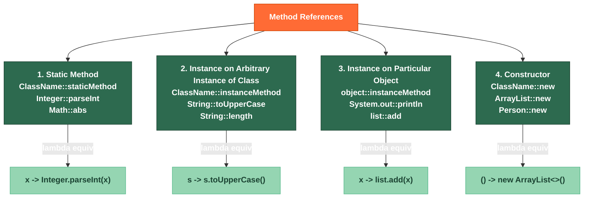

# 🔗 Method References

> [!abstract] TL;DR
> Method references are shorthand for lambdas that simply delegate to an existing method. There are four kinds: **static** (`Integer::parseInt`), **instance on class** (`String::toUpperCase`), **instance on object** (`printer::print`), and **constructor** (`ArrayList::new`). Use them when they are clearer than a lambda; avoid them when the lambda body has meaningful logic. Java's built-in **functional interfaces** (`Predicate<T>`, `Function<T,R>`, `Consumer<T>`, `Supplier<T>`, `BiFunction`) compose via `andThen`, `compose`, `and`, `or`, and `negate` to build pipelines without explicit loops.

---

## Intuition

A method reference is like a speed-dial button on a phone:

- Instead of writing out a lambda `x -> String.valueOf(x)`, you attach a direct wire to the `String::valueOf` method — the JVM routes the argument straight there.
- **Lambdas** are ad-hoc anonymous functions; **method references** are pointers to named functions. If the function already has a good name, use the pointer — it's more readable and gives the JIT more optimization context.

---

## How It Works

### Four Kinds of Method References



---

## Key Concepts

### 1. The Four Kinds — Side by Side

```java
import java.util.*;
import java.util.function.*;
import java.util.stream.*;

public class MethodReferenceDemo {

    // ── Kind 1: Static method reference ────────────────────────────────────
    // Class::staticMethod  →  (args) -> Class.staticMethod(args)

    public static void staticRefs() {
        // Lambda vs method reference
        Function<String, Integer> parseL = s -> Integer.parseInt(s);
        Function<String, Integer> parseM = Integer::parseInt;   // cleaner

        List<String> nums = List.of("1", "2", "3");
        List<Integer> parsed = nums.stream().map(Integer::parseInt).toList();

        // Other common static refs
        Function<Double, Double> abs   = Math::abs;
        Function<Object, String> str   = String::valueOf;
        Comparator<String> natOrder    = Comparator.naturalOrder(); // static factory
    }

    // ── Kind 2: Instance method on arbitrary instance ─────────────────────
    // Class::instanceMethod  →  (instance, args) -> instance.instanceMethod(args)
    // The first lambda arg BECOMES the receiver object

    public static void instanceOnClassRefs() {
        Function<String, String> upper  = String::toUpperCase;   // s -> s.toUpperCase()
        Function<String, Integer> len   = String::length;        // s -> s.length()
        Predicate<String> isEmpty       = String::isEmpty;       // s -> s.isEmpty()
        BiFunction<String, String, Boolean> startsWith = String::startsWith;

        List<String> words = List.of("hello", "world", "");
        List<String> nonEmpty = words.stream().filter(Predicate.not(String::isEmpty)).toList();
        List<String> upper_words = words.stream().map(String::toUpperCase).toList();
    }

    // ── Kind 3: Instance method on a specific (captured) object ──────────
    // object::instanceMethod  →  (args) -> object.instanceMethod(args)
    // The object is captured in the closure at creation time

    public static void instanceOnObjectRefs() {
        List<String> results = new ArrayList<>();
        Consumer<String> addToResults = results::add;     // list is captured

        List<String> words = List.of("foo", "bar", "baz");
        words.forEach(results::add);   // same as: words.forEach(w -> results.add(w))

        // Printer object
        var printer = new Object() {
            void print(String s) { System.out.println("[LOG] " + s); }
        };
        words.forEach(printer::print);  // printer captured; print called for each word
    }

    // ── Kind 4: Constructor reference ─────────────────────────────────────
    // Class::new  →  (args) -> new Class(args)

    record Person(String name, int age) {}

    public static void constructorRefs() {
        // Supplier (0-arg constructor)
        Supplier<ArrayList<String>> listFactory = ArrayList::new;
        ArrayList<String> list = listFactory.get();

        // Function (1-arg constructor)
        Function<String, StringBuilder> sbFactory = StringBuilder::new;
        StringBuilder sb = sbFactory.apply("initial");

        // BiFunction (2-arg constructor)
        BiFunction<String, Integer, Person> personFactory = Person::new;
        Person alice = personFactory.apply("Alice", 30);

        // Common use: Collectors.toCollection
        List<String> names = List.of("Charlie", "Alice", "Bob");
        TreeSet<String> sorted = names.stream()
            .collect(Collectors.toCollection(TreeSet::new));
    }
}
```

### 2. Built-in Functional Interfaces

```java
import java.util.function.*;

public class FunctionalInterfaceDemo {

    // ── Predicate<T> — test a condition; returns boolean ──────────────────
    public static void predicateDemo() {
        Predicate<String> notEmpty   = s -> !s.isEmpty();
        Predicate<String> longEnough = s -> s.length() > 5;

        // Composing predicates
        Predicate<String> valid = notEmpty.and(longEnough);          // AND
        Predicate<String> either = notEmpty.or(longEnough);          // OR
        Predicate<String> empty  = notEmpty.negate();                // NOT
        Predicate<String> notBlank = Predicate.not(String::isBlank); // static helper

        List<String> words = List.of("hi", "hello", "world", "");
        List<String> result = words.stream().filter(valid).toList();  // ["hello", "world"]
    }

    // ── Function<T, R> — transform T to R ─────────────────────────────────
    public static void functionDemo() {
        Function<String, Integer> length  = String::length;
        Function<Integer, String> toStr   = Object::toString;

        // compose: apply g THEN f  →  f(g(x))
        // andThen: apply f THEN g  →  g(f(x))
        Function<String, String> lengthStr = length.andThen(toStr);
        // "hello" → 5 → "5"

        Function<String, String> greet = ((Function<String, String>) String::trim)
            .andThen(s -> "Hello, " + s + "!");
        System.out.println(greet.apply("  Alice  "));  // "Hello, Alice!"

        // UnaryOperator<T> — same type in and out
        UnaryOperator<String> trim = String::trim;
        UnaryOperator<Integer> double_ = n -> n * 2;
        Function<Integer, Integer> quadruple = double_.andThen(double_);
    }

    // ── Consumer<T> — side-effect only; returns void ──────────────────────
    public static void consumerDemo() {
        Consumer<String> print = System.out::println;
        Consumer<String> log   = s -> System.err.println("[LOG] " + s);

        // andThen chains: both consumers run in sequence
        Consumer<String> printAndLog = print.andThen(log);
        printAndLog.accept("event");  // prints to stdout then stderr

        // BiConsumer<T, U>
        BiConsumer<String, Integer> printPair = (k, v) -> System.out.println(k + "=" + v);
        Map<String, Integer> map = Map.of("a", 1, "b", 2);
        map.forEach(printPair);
    }

    // ── Supplier<T> — produce a value with no input ───────────────────────
    public static void supplierDemo() {
        Supplier<List<String>> listSupplier = ArrayList::new;
        Supplier<String> greeting = () -> "Hello, World!";

        // Lazy initialization pattern
        Supplier<HeavyObject> lazy = HeavyObject::new;
        // HeavyObject not created until .get() is called
        HeavyObject obj = lazy.get();
    }

    // ── BiFunction<T, U, R> — two inputs, one output ─────────────────────
    public static void biFunctionDemo() {
        BiFunction<String, Integer, String> repeat = (s, n) -> s.repeat(n);
        System.out.println(repeat.apply("ab", 3));  // "ababab"

        // BinaryOperator<T> — both inputs and output same type
        BinaryOperator<Integer> add = Integer::sum;
        BinaryOperator<String> concat = String::concat;
    }

    static class HeavyObject { HeavyObject() { /* expensive */ } }
}
```

### 3. Comparator.comparing Chains

```java
import java.util.*;

public class ComparatorMethodRef {

    record Employee(String name, String dept, int salary) {}

    public static void comparatorDemo() {
        List<Employee> employees = List.of(
            new Employee("Alice",   "Eng", 95_000),
            new Employee("Bob",     "HR",  70_000),
            new Employee("Charlie", "Eng", 85_000),
            new Employee("Zara",    "HR",  70_000)
        );

        // Method references with Comparator — very readable
        Comparator<Employee> byDept   = Comparator.comparing(Employee::dept);
        Comparator<Employee> bySalary = Comparator.comparingInt(Employee::salary);
        Comparator<Employee> byName   = Comparator.comparing(Employee::name);

        // Chain: dept ASC, salary DESC, name ASC
        Comparator<Employee> sorted = byDept
            .thenComparing(bySalary.reversed())
            .thenComparing(byName);

        List<Employee> result = employees.stream().sorted(sorted).toList();

        // Min/max with method reference
        Optional<Employee> highest = employees.stream()
            .max(Comparator.comparingInt(Employee::salary));
    }
}
```

### 4. When to Use Method References vs Lambdas

```java
public class MethodRefVsLambda {

    public static void guidelines() {
        List<String> words = List.of("hello", "world");

        // PREFER method reference: lambda just delegates directly to a method
        words.stream().map(String::toUpperCase).toList();     // clear
        words.stream().forEach(System.out::println);          // clear

        // PREFER lambda: method ref would be obscure, or logic is non-trivial
        words.stream().map(s -> s.substring(0, 1).toUpperCase() + s.substring(1)).toList();
        words.stream().filter(s -> s.length() > 3 && s.startsWith("h")).toList();

        // PREFER lambda: when argument names add documentation value
        users.stream()
             .filter(user -> user.isActive() && user.hasRole("ADMIN"))
             .toList();  // vs User::isActive — loses the compound condition clarity
    }

    interface User { boolean isActive(); boolean hasRole(String role); }
    static List<User> users = List.of();
}
```

---

## Real-World Notes

- **Spring's `@FunctionalInterface` callbacks**: Spring uses `Supplier<T>` for lazy bean initialization, `Consumer<T>` for configuration callbacks (e.g., `RestTemplateBuilder.customizers(...)`), and `Function<T, R>` in `@ConditionalOn` evaluators.
- **JUnit 5**: `assertThrows(IllegalArgumentException.class, () -> service.call())` — the lambda is a `ThrowingSupplier`, a custom functional interface. Method refs work here too: `assertThrows(NullPointerException.class, service::callWithNull)`.
- **Collectors**: `Collectors.toMap(User::getId, User::getName)` uses two method references to extract key and value — far more readable than explicit lambdas in group-by operations.
- **`Predicate.not`** (Java 11+): `filter(Predicate.not(String::isBlank))` is cleaner than `filter(s -> !s.isBlank())` — avoids the manual negation lambda.

---

## Common Pitfalls

| Pitfall | Example | Consequence | Fix |
|---------|---------|-------------|-----|
| Ambiguous overload with method ref | `System.out::println` when `println` is overloaded | Compiler can't resolve overload | Use explicit lambda `s -> System.out.println(s)` |
| Captured mutable state | `list::add` where list is modified | Closure captures reference; behavior depends on list state | Ensure captured object is effectively final and not concurrently modified |
| `andThen` vs `compose` confusion | `f.compose(g)` vs `f.andThen(g)` | Wrong execution order | `andThen` = f then g; `compose` = g then f (g applied first) |
| Null from Supplier | `Supplier<X> s = SomeClass::mayReturnNull` | NPE on `.get()` in certain conditions | Document and guard null returns |
| Method ref to instance method looks like static | `String::valueOf` (static) vs `String::length` (instance) | Subtle difference in how args are bound | Remember: instance-on-class gets the instance as the first arg |

---

## Related Notes

- [[_MOC_Java_Streams|↑ Section MOC — Java Streams & Functional]]
- [[Streams_and_Pipelines]] — where method references are most heavily used
- [[Functional_Design_Patterns]] — Strategy, Command, Observer via functional interfaces
- [[Bounded_Type_Parameters]] — generics in functional interface type parameters
- [[Checked_vs_Unchecked]] — checked exceptions in lambda bodies

---

## Review Questions

1. What is the difference between `String::toUpperCase` (instance method on class) and `System.out::println` (instance method on object)? Write the equivalent lambda for each and explain how the arguments are bound differently.

2. You have a `Function<String, Integer> f = String::length` and a `Function<Integer, String> g = Object::toString`. Write the composed function that converts a String to its length as a String, using both `andThen` and `compose`. Which method do you call on which function for each approach?

3. A pipeline does `stream.filter(s -> !s.isEmpty())`. A reviewer suggests `stream.filter(Predicate.not(String::isEmpty))`. Explain the advantages of the reviewer's suggestion in terms of readability and reusability.

---

#Java #Streams #Functional #MethodReferences #FunctionalInterfaces #Lambdas #Intermediate
