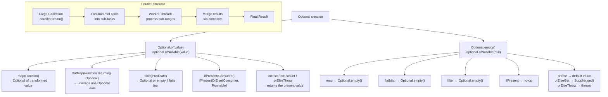

---
tags:
  - Java
  - Streams
  - Optional
  - Parallel
difficulty: Intermediate
created: 2026-07-26
---

# 🔀 Optional and Parallel Streams

## TL;DR

`Optional<T>` is a container that explicitly models the possible absence of a value — replacing null-returning methods with a type that forces callers to acknowledge the empty case. Core methods: `orElse(default)` (always evaluates default), `orElseGet(Supplier)` (lazy — evaluates default only when empty), `orElseThrow()`, `map(Function)` (transforms present value), `flatMap(Function<T, Optional<R>>)` (avoids `Optional<Optional<T>>`), `filter(Predicate)`, `ifPresent(Consumer)`, `ifPresentOrElse(Consumer, Runnable)` (Java 9). Parallel streams use `ForkJoinPool.commonPool()` with work-stealing to split work across CPU cores. Parallel wins for: CPU-bound operations, stateless pipelines, large data sets (typically 10k+ elements). Parallel hurts for: small collections, ordered terminal operations (`findFirst`), stateful intermediates, IO-bound work, or operations with shared mutable state.

---

## Intuition

**Optional** is Schrödinger's box — the value is either there or not, but you must *open the box* (call a method like `orElse` or `map`) before you can use the contents. The type system forces you to acknowledge the uncertainty, unlike null which silently propagates and explodes later as `NullPointerException`.

**Parallel streams** are dividing a large harvest field among many farmers versus using one farmer for a small garden. For a vast field, the coordination overhead of splitting, assigning, and merging is worth it. For a small garden, you spend more time organizing than farming — sequential is faster.

---

## How It Works

### Optional State Machine



### Optional Creation and Chain

```java
// Three creation methods
Optional<String> present = Optional.of("hello");          // NPE if null
Optional<String> maybeNull = Optional.ofNullable(getValue()); // safe; null → empty
Optional<String> empty = Optional.empty();

// WRONG: Optional.of(null) — throws NullPointerException immediately
// Optional<String> bad = Optional.of(null);  // NPE here, not later

// Chained Optional pipeline (no nested if-null checks)
// findUser → getAddress → getCity — each step might be absent
String city = userRepository.findById(userId)     // Optional<User>
    .map(User::getAddress)                         // Optional<Address> (Address or empty)
    .flatMap(Address::getCity)                     // Optional<String> (getCity returns Optional)
    .filter(c -> !c.isBlank())                     // empty if city is blank
    .map(String::trim)                             // trim if present
    .orElse("Unknown");                            // default if any step was empty

// ifPresent and ifPresentOrElse (Java 9)
userRepository.findById(userId)
    .ifPresent(user -> emailService.sendWelcome(user));

userRepository.findById(userId)
    .ifPresentOrElse(
        user -> log.info("Found user: {}", user.getName()),
        () -> log.warn("User not found: {}", userId)
    );

// stream() — Java 9: treat Optional as zero-or-one-element Stream
// Useful for flatMapping into a larger stream
List<String> cities = users.stream()
    .map(User::getAddress)                 // Stream<Optional<Address>>
    .flatMap(Optional::stream)             // Stream<Address> — empties dropped
    .map(Address::getCity)
    .collect(Collectors.toList());
```

### orElse vs orElseGet — Critical Distinction

```java
// orElse: ALWAYS evaluates the default, even when value is present
// This is expensive if the default involves a database call or object creation
User user1 = findUser(id).orElse(createDefaultUser());  // createDefaultUser() ALWAYS called!

// orElseGet: LAZY — Supplier only called when Optional is empty
User user2 = findUser(id).orElseGet(() -> createDefaultUser());  // called ONLY if empty

// Performance impact example
Optional<Config> config = cache.get("key");  // cache hit — Optional is present

// BAD: still queries database even on cache hit
Config c1 = config.orElse(database.loadConfig("key"));  // database.loadConfig() always runs

// GOOD: database only queried on cache miss
Config c2 = config.orElseGet(() -> database.loadConfig("key"));  // lazy; DB only on miss
```

### Optional Anti-Patterns

```java
// ANTI-PATTERN 1: isPresent() + get() — same as if (x != null) x.get()
// Defeats the purpose of Optional's composition API
if (findUser(id).isPresent()) {
    User u = findUser(id).get();  // also calls findUser TWICE — wasteful!
    process(u);
}
// CORRECT:
findUser(id).ifPresent(this::process);
// or with return:
User u = findUser(id).orElseThrow(() -> new UserNotFoundException(id));

// ANTI-PATTERN 2: Optional as a field
// Fields should use null for absence; Optional adds boxing overhead and Serialization issues
public class User {
    private Optional<String> middleName;  // BAD: don't use Optional as a field
    private String middleName2;           // GOOD: use null-checked getter instead
}

// ANTI-PATTERN 3: Optional in method parameters
// Forces callers to wrap values unnecessarily
void process(Optional<String> name) { ... }        // BAD
void process(String name) { ... }                  // GOOD: let callers handle null/absent

// ANTI-PATTERN 4: Optional wrapping collections
Optional<List<User>> users = findUsers(criteria);  // BAD: return empty list instead
List<User> users2 = findUsers2(criteria);          // GOOD: return Collections.emptyList()
```

### Parallel Streams — ForkJoinPool

```java
// Sequential: processes one at a time on caller thread
long sequentialCount = numbers.stream()
    .filter(n -> isPrime(n))
    .count();

// Parallel: splits across ForkJoinPool.commonPool() threads (CPU count - 1)
long parallelCount = numbers.parallelStream()
    .filter(n -> isPrime(n))
    .count();  // significantly faster for large lists and CPU-bound isPrime()

// Converting between sequential and parallel mid-pipeline
List<Integer> result = largeList.stream()
    .filter(n -> n > 0)
    .parallel()          // switch to parallel here
    .map(this::expensiveTransform)
    .sequential()        // back to sequential for ordered output
    .collect(Collectors.toList());

// Parallel with custom ForkJoinPool (avoid blocking commonPool)
ForkJoinPool customPool = new ForkJoinPool(4);  // 4 threads
try {
    List<Result> results = customPool.submit(() ->
        largeList.parallelStream()
            .map(this::processItem)
            .collect(Collectors.toList())
    ).get();  // blocks until done
} catch (InterruptedException | ExecutionException e) {
    Thread.currentThread().interrupt();
    throw new RuntimeException("Parallel processing failed", e);
} finally {
    customPool.shutdown();
}
```

### Stateful Parallel Operation Problem

```java
// BROKEN: shared mutable state in parallel stream
List<Integer> sharedList = new ArrayList<>();
IntStream.range(0, 1000)
    .parallel()
    .forEach(i -> sharedList.add(i));  // ArrayList is NOT thread-safe!
// Result: random ConcurrentModificationException, wrong size, or data corruption

// CORRECT: use collect — thread-safe by design
List<Integer> safeList = IntStream.range(0, 1000)
    .parallel()
    .boxed()
    .collect(Collectors.toList());  // uses thread-local sub-lists and merges

// BROKEN: relying on encounter order in parallel
// findFirst with parallel: forces ordering coordination, slow
Optional<Integer> first = largeStream.parallel().findFirst();  // slow, defeats parallel

// BETTER: findAny (no ordering requirement, faster in parallel)
Optional<Integer> any = largeStream.parallel().findAny();  // truly parallel-friendly

// Using unordered() hint to improve parallel performance when order doesn't matter
long count = largeList.parallelStream()
    .unordered()               // tell the framework: order doesn't matter
    .filter(this::isValid)
    .limit(100)                // limit on unordered parallel is much faster
    .count();
```

### When to Use Parallel — Decision Guide

```java
// GOOD parallel candidate: CPU-bound, stateless, large data
List<Report> reports = rawData.parallelStream()  // 100k+ elements
    .filter(d -> d.isRelevant())                 // stateless predicate
    .map(d -> generateReport(d))                 // expensive CPU computation per element
    .collect(Collectors.toList());               // thread-safe collector

// BAD parallel candidate: IO-bound (threads just wait, no CPU gain)
List<Response> responses = urls.parallelStream()
    .map(url -> httpClient.get(url))  // IO-bound — use async CompletableFuture instead
    .collect(Collectors.toList());

// BAD parallel candidate: tiny collection (overhead > savings)
List<String> result = List.of("a", "b", "c").parallelStream()  // 3 elements!
    .map(String::toUpperCase)
    .collect(Collectors.toList());  // sequential is 10-100x faster here

// BAD parallel candidate: ordered operations that require coordination
List<String> ordered = largeList.parallelStream()
    .sorted()                    // must gather all elements — expensive in parallel
    .limit(10)                   // then limit — sorting defeated parallelism
    .collect(Collectors.toList());
```

### Optional Method Reference Table

| Method | Empty Behavior | Present Behavior | Returns | When to Use |
|---|---|---|---|---|
| `Optional.of(value)` | — (NPE if null) | Creates Optional | `Optional<T>` | When value is guaranteed non-null |
| `Optional.ofNullable(value)` | Returns empty | Creates Optional | `Optional<T>` | When value might be null |
| `Optional.empty()` | — | — | `Optional<T>` | Explicit empty |
| `get()` | Throws `NoSuchElementException` | Returns value | `T` | Avoid — use `orElseThrow()` instead |
| `orElse(T)` | Returns default | Returns value | `T` | When default is cheap constant |
| `orElseGet(Supplier)` | Calls supplier | Returns value | `T` | When default is expensive (DB, new object) |
| `orElseThrow(Supplier)` | Throws supplied exception | Returns value | `T` | Mandatory value; fail-fast on absent |
| `map(Function)` | Returns empty | Applies function, wraps result | `Optional<R>` | Transform present value |
| `flatMap(Function)` | Returns empty | Applies function (which returns Optional) | `Optional<R>` | Chain methods that return Optional |
| `filter(Predicate)` | Returns empty | Empty if fails, present if passes | `Optional<T>` | Conditional keep |
| `ifPresent(Consumer)` | No-op | Runs consumer | `void` | Side-effect only if present |
| `ifPresentOrElse(Consumer, Runnable)` | Runs Runnable | Runs Consumer | `void` | Side-effect with else branch (Java 9+) |
| `stream()` | Returns empty Stream | Returns single-element Stream | `Stream<T>` | flatMapping into larger stream (Java 9+) |
| `isPresent()` | Returns false | Returns true | `boolean` | Use only when composition isn't possible |
| `isEmpty()` | Returns true | Returns false | `boolean` | Java 11+; cleaner than `!isPresent()` |

---

## Key Concepts

### Optional Design Intent

`Optional` is designed specifically as a **return type** for methods that may or may not produce a value. It is not intended as a general-purpose null replacement for fields, parameters, or collection elements. `Optional` is not `Serializable`, making it unsuitable for entity fields. As a parameter type, it forces callers to wrap values unnecessarily. As a collection element, return an empty collection instead.

### map vs flatMap in Optional

`map(Function<T, R>)` wraps the result in a new Optional: if the mapper returns a `String`, you get `Optional<String>`. If you use `map` with a method that already returns `Optional<String>`, you'd get `Optional<Optional<String>>` — the double-wrapping problem. `flatMap(Function<T, Optional<R>>)` unwraps one level, keeping the result as `Optional<R>`. Rule of thumb: if the mapping function returns `Optional`, use `flatMap`; otherwise use `map`.

### orElse Eager Evaluation Trap

This is a subtle performance bug: `optional.orElse(expensiveOperation())` evaluates `expensiveOperation()` unconditionally because Java evaluates method arguments before the method call. The `orElseGet(() -> expensiveOperation())` form evaluates the supplier lazily — only when the Optional is actually empty. For database queries, HTTP calls, or heavy object construction as defaults, always use `orElseGet`.

### Parallel Stream — ForkJoinPool Work-Stealing

`parallelStream()` submits work to `ForkJoinPool.commonPool()`, which uses work-stealing: idle threads steal tasks from the queues of busy threads. The pool size defaults to `Runtime.getRuntime().availableProcessors() - 1`. The common pool is shared across the entire JVM — if another library or framework also uses it heavily, parallel streams compete for threads. For isolated parallel workloads, submit to a dedicated `ForkJoinPool`.

### Parallel Stream Data Size Threshold

The canonical rule: parallel streams typically outperform sequential above approximately **10,000 elements** for CPU-bound, stateless operations. Below this threshold, the thread coordination overhead (splitting, task queue, merging) exceeds the computation saved. Benchmark your specific operation — CPU complexity per element matters more than element count alone.

### Ordering in Parallel Streams

`findFirst()` in a parallel stream must identify and return the *first encounter-order* element — this requires ordering coordination among threads and degrades performance. `findAny()` returns *any* matching element — whichever thread finds one first — and is genuinely parallel. Similarly, `forEachOrdered()` maintains order but kills parallelism benefits; prefer `forEach()` when order doesn't matter.

---

## Real-World: Spring Data and Security

```java
// Spring Data findById returns Optional
@Repository
public interface UserRepository extends JpaRepository<User, Long> {
    Optional<User> findByEmail(String email);
}

// Service uses Optional composition
public UserDto getUser(Long id) {
    return userRepository.findById(id)
        .map(UserDto::fromEntity)
        .orElseThrow(() -> new ResourceNotFoundException("User", id));
}

// Spring Security getCurrentUser returns Optional
public Optional<String> getCurrentUsername() {
    return Optional.ofNullable(SecurityContextHolder.getContext().getAuthentication())
        .filter(Authentication::isAuthenticated)
        .map(Authentication::getName);
}

// Usage in controller
String username = getCurrentUsername()
    .orElseThrow(() -> new UnauthorizedException("Not authenticated"));
```

---

## Common Pitfalls

1. **`orElse` eager evaluation with expensive defaults** — `optional.orElse(db.query(...))` runs the DB query even on cache hit. Always use `orElseGet` for expensive defaults. This is one of the most common Optional performance bugs in production code.

2. **Optional in fields** — `private Optional<String> middleName` causes `Serializable` issues, null `Optional` references (you can assign null to an Optional variable!), and forces every serialization framework to handle it specially. Use nullable fields with null-safe getters instead.

3. **`isPresent()` + `get()` anti-pattern** — This is the verbose null-check pattern in Optional clothes. Use `map`, `ifPresent`, `orElseThrow`, or `ifPresentOrElse` instead.

4. **Parallel streams with shared mutable state** — Using `forEach` with a shared non-thread-safe collection in a parallel stream is a data race. Always use `collect()` with a thread-safe `Collector`, or process results after the parallel operation completes.

---

## Related Notes

- [[_MOC_Streams_Functional|↑ Section MOC]]
- [[Stream_Pipeline_and_Collectors]] — Optional is returned by `findFirst`, `min`, `max`, and `reduce` without identity
- [[_MOC_Java_Concurrency]] — parallel streams are concurrency; ForkJoinPool and shared state interact with Java's memory model

---

## Review Questions

1. Why does `optional.orElse(database.findDefault())` call `database.findDefault()` even when the Optional is non-empty? Rewrite it correctly.
2. You have `Optional<User>` and `User.getAddress()` returns `Optional<Address>`. Write a pipeline to get the city as a `String`, defaulting to `"Unknown"`, using `flatMap` correctly. What happens if you use `map` instead of `flatMap` in the second step?
3. Given a list of 50 integers and a computationally trivial operation (`n -> n * 2`), is `parallelStream()` faster than `stream()`? Explain the overhead components that determine the answer.

---

*tags: #Java #Streams #Optional #Parallel #ForkJoinPool #orElseGet #flatMap #StreamAPI*
