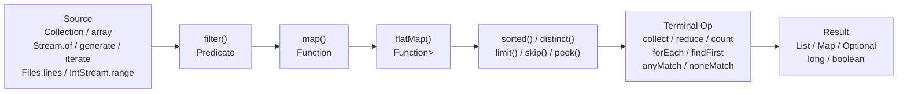

# 🌊 Stream Pipeline and Collectors

## TL;DR

A Stream pipeline has three parts: **source** (collection, array, `Stream.of()`, `Stream.generate()`, `Stream.iterate()`, `Files.lines()`) → **zero or more intermediate operations** (lazy, return `Stream<T>`: `filter`, `map`, `flatMap`, `distinct`, `sorted`, `limit`, `skip`, `peek`) → **one terminal operation** (eager, triggers evaluation, consumes the stream: `collect`, `reduce`, `count`, `min`, `max`, `forEach`, `findFirst`, `findAny`, `anyMatch`, `allMatch`, `noneMatch`). `Collectors` is the factory for terminal aggregations: `toList()`, `toSet()`, `toMap()`, `groupingBy()`, `partitioningBy()`, `joining()`, `counting()`. A stream can only be consumed once — calling a terminal op after the stream is already closed throws `IllegalStateException`.

---

## Intuition

A stream pipeline is a **factory assembly line**:

- **Raw materials** (source) enter the line — boxes of items
- Each **station** (intermediate operation) processes items one at a time as they pass through — no station pulls all items at once; items flow only when the next stage demands them (lazy)
- The **packaging machine** at the end (terminal operation) is what starts the conveyor belt; without it, nothing moves
- The **output bin** (collector) captures the final result in the shape you need — a list, a map grouped by category, a sum

---

## How It Works

### Pipeline Stages



### Complete Pipeline Example

```java
// Find names of active premium users ordered alphabetically, limit 10
List<String> result = users.stream()                    // source: Collection.stream()
    .filter(User::isActive)                             // intermediate: Predicate
    .filter(u -> u.getTier() == Tier.PREMIUM)           // intermediate: chained filter
    .sorted(Comparator.comparing(User::getLastName))    // intermediate: sorted with Comparator
    .limit(10)                                          // intermediate: limit count
    .map(u -> u.getFirstName() + " " + u.getLastName()) // intermediate: transform to String
    .collect(Collectors.toList());                      // terminal: collect into List

// Stream creation variants
Stream<String> fromArray = Arrays.stream(new String[]{"a", "b", "c"});
Stream<Integer> fromOf = Stream.of(1, 2, 3, 4, 5);
Stream<Double> infinite = Stream.generate(Math::random);  // infinite; must limit()
Stream<Integer> iterated = Stream.iterate(0, n -> n + 2)  // even numbers; Java 9: with predicate
    .takeWhile(n -> n < 20);                              // Java 9+: takeWhile, dropWhile
IntStream range = IntStream.range(0, 10);                 // 0..9 primitive int stream
Stream<String> lines = Files.lines(Path.of("data.txt")); // must close! use try-with-resources
```

### flatMap vs map — Key Distinction

```java
List<List<String>> nestedList = List.of(
    List.of("apple", "apricot"),
    List.of("banana"),
    List.of("cherry", "coconut", "cranberry")
);

// map wraps each list in a Stream<Stream<String>> — NOT what we want
Stream<Stream<String>> wrongResult = nestedList.stream()
    .map(List::stream);  // Stream<Stream<String>> — nested!

// flatMap flattens one level: Stream<String>
List<String> allFruits = nestedList.stream()
    .flatMap(List::stream)      // Function<List<String>, Stream<String>>
    .sorted()
    .collect(Collectors.toList());
// [apple, apricot, banana, cherry, coconut, cranberry]

// Real-world: Order → LineItems
List<String> allProductNames = orders.stream()
    .flatMap(order -> order.getLineItems().stream())  // flatten line items
    .map(LineItem::getProductName)
    .distinct()
    .sorted()
    .collect(Collectors.toList());

// flatMap on Optional (Optional-specific)
Optional<String> city = findUser(id)               // Optional<User>
    .flatMap(User::getAddress)                     // Optional<Address> (returns Optional)
    .map(Address::getCity);                        // String (returns plain value)
```

### Collectors.groupingBy with Downstream Collectors

```java
// Simple grouping: Map<Department, List<Employee>>
Map<Department, List<Employee>> byDept = employees.stream()
    .collect(Collectors.groupingBy(Employee::getDepartment));

// Downstream counting: Map<Department, Long>
Map<Department, Long> countByDept = employees.stream()
    .collect(Collectors.groupingBy(
        Employee::getDepartment,
        Collectors.counting()
    ));

// Downstream averaging salary: Map<Department, Double>
Map<Department, Double> avgSalaryByDept = employees.stream()
    .collect(Collectors.groupingBy(
        Employee::getDepartment,
        Collectors.averagingDouble(Employee::getSalary)
    ));

// Downstream mapping + toSet: Map<Department, Set<String>>
Map<Department, Set<String>> namesByDept = employees.stream()
    .collect(Collectors.groupingBy(
        Employee::getDepartment,
        Collectors.mapping(Employee::getName, Collectors.toSet())
    ));

// Multi-level groupingBy: Map<Department, Map<Grade, List<Employee>>>
Map<Department, Map<Grade, List<Employee>>> nested = employees.stream()
    .collect(Collectors.groupingBy(
        Employee::getDepartment,
        Collectors.groupingBy(Employee::getGrade)
    ));
```

### partitioningBy — Boolean Split

```java
// Map<Boolean, List<Employee>>
Map<Boolean, List<Employee>> seniorSplit = employees.stream()
    .collect(Collectors.partitioningBy(
        e -> e.getYearsExperience() >= 5
    ));

List<Employee> senior = seniorSplit.get(true);
List<Employee> junior = seniorSplit.get(false);

// partitioningBy with downstream
Map<Boolean, Long> seniorCount = employees.stream()
    .collect(Collectors.partitioningBy(
        e -> e.getYearsExperience() >= 5,
        Collectors.counting()
    ));
```

### Collectors.joining

```java
List<String> words = List.of("Java", "Streams", "are", "powerful");

String simple = words.stream().collect(Collectors.joining());
// "JavaStreamsarepowerful"

String withDelimiter = words.stream().collect(Collectors.joining(", "));
// "Java, Streams, are, powerful"

String full = words.stream().collect(Collectors.joining(", ", "[", "]"));
// "[Java, Streams, are, powerful]"

// Practical: building SQL IN clause
String inClause = ids.stream()
    .map(String::valueOf)
    .collect(Collectors.joining(", ", "WHERE id IN (", ")"));
```

### Collectors.toMap with Merge Function

```java
// Simple: Stream<User> → Map<Long, User>
Map<Long, User> usersById = users.stream()
    .collect(Collectors.toMap(User::getId, Function.identity()));
// THROWS IllegalStateException on duplicate keys!

// With merge function — resolve duplicates by keeping the newer one
Map<String, User> latestByEmail = users.stream()
    .collect(Collectors.toMap(
        User::getEmail,               // key extractor
        Function.identity(),          // value extractor
        (existing, newer) -> newer    // merge: keep newer on collision
    ));

// With specific map implementation (LinkedHashMap for insertion order)
Map<Long, String> idToName = users.stream()
    .collect(Collectors.toMap(
        User::getId,
        User::getName,
        (a, b) -> a,      // keep first on collision
        LinkedHashMap::new // map factory
    ));
```

### reduce — Folding a Stream

```java
// reduce with identity: guaranteed non-empty result
int sum = IntStream.rangeClosed(1, 10).reduce(0, Integer::sum);  // 55

// reduce without identity: returns Optional (stream might be empty)
Optional<Integer> product = Stream.of(1, 2, 3, 4, 5)
    .reduce((a, b) -> a * b);  // Optional[120]

// reduce for complex aggregation
String concatNames = employees.stream()
    .map(Employee::getName)
    .reduce("", (a, b) -> a.isEmpty() ? b : a + ", " + b);

// Custom object reduction — prefer Collectors.summarizingInt for statistics
IntSummaryStatistics stats = employees.stream()
    .collect(Collectors.summarizingInt(Employee::getAge));
// stats.getMin(), getMax(), getSum(), getAverage(), getCount()
```

### Teeing Collector (Java 12+)

```java
// Split stream into two results and merge — avoids two passes
record Stats(long count, OptionalDouble average) {}

Stats ageStats = employees.stream()
    .collect(Collectors.teeing(
        Collectors.counting(),
        Collectors.averagingDouble(Employee::getAge),
        (count, avg) -> new Stats(count, OptionalDouble.of(avg))
    ));
```

### Stream Operations Reference Table

| Operation | Type | Lazy? | Short-circuits? | Returns | Common Use |
|---|---|---|---|---|---|
| `filter(Predicate)` | Intermediate | Yes | No | `Stream<T>` | Remove non-matching elements |
| `map(Function)` | Intermediate | Yes | No | `Stream<R>` | Transform each element |
| `flatMap(Function)` | Intermediate | Yes | No | `Stream<R>` | Flatten nested streams/collections |
| `distinct()` | Intermediate | Yes | No | `Stream<T>` | Remove duplicates (uses equals/hashCode) |
| `sorted()` | Intermediate | Yes | No | `Stream<T>` | Sort (stateful — must see all elements) |
| `limit(n)` | Intermediate | Yes | Yes | `Stream<T>` | Take first n elements |
| `skip(n)` | Intermediate | Yes | No | `Stream<T>` | Drop first n elements |
| `peek(Consumer)` | Intermediate | Yes | No | `Stream<T>` | Debug/logging without consuming |
| `collect(Collector)` | Terminal | — | No | `R` | Accumulate into collection/map |
| `reduce(identity, BinaryOp)` | Terminal | — | No | `T` | Fold into single value |
| `forEach(Consumer)` | Terminal | — | No | `void` | Side-effect per element |
| `count()` | Terminal | — | No | `long` | Count elements |
| `min/max(Comparator)` | Terminal | — | No | `Optional<T>` | Find extreme element |
| `findFirst()` | Terminal | — | Yes | `Optional<T>` | First element (respects order) |
| `findAny()` | Terminal | — | Yes | `Optional<T>` | Any element (faster in parallel) |
| `anyMatch(Predicate)` | Terminal | — | Yes | `boolean` | True if any element matches |
| `allMatch(Predicate)` | Terminal | — | Yes | `boolean` | True if all elements match |
| `noneMatch(Predicate)` | Terminal | — | Yes | `boolean` | True if no elements match |

---

## Key Concepts

### Lazy Evaluation and the Conveyor Belt

Intermediate operations build a pipeline description but do not process any elements. This means: (1) chaining three `filter` + `map` + `limit` operations on a million-element list does NOT process a million elements — it stops as soon as `limit` is satisfied; (2) calling `peek` in a pipeline without a terminal operation does nothing at all; (3) you can construct a pipeline and share the configuration, as long as you create a fresh stream for each terminal operation.

### filter, map, flatMap

`filter` tests each element and keeps those that pass the `Predicate`. `map` transforms each element from type T to type R — one-to-one. `flatMap` maps each element to a `Stream<R>` (a sub-stream, possibly of different size) and flattens one level — replacing each element with zero, one, or many output elements. Use `flatMap` when each input element corresponds to a collection of outputs.

### Stateful Intermediate Operations

`sorted()` and `distinct()` are **stateful** — `sorted` must see all elements before it can emit any output (it uses merge sort internally), and `distinct` maintains a `HashSet` of seen elements. These break the "process one at a time" model. In parallel streams, stateful operations are expensive because they require coordination across threads.

### Collectors Deep Dive

`Collectors.toList()` returns a modifiable `ArrayList`. `Collectors.toUnmodifiableList()` (Java 10+) returns an unmodifiable list. `Collectors.toSet()` makes no ordering guarantee. `groupingBy` groups into a `HashMap` by default; to get a sorted `TreeMap` use the three-argument form with `TreeMap::new`. `toMap` throws on duplicate keys unless a merge function is provided.

### Stream Creation Methods

`Collection.stream()` for sequential streams from any `Collection`. `Arrays.stream(T[])` for arrays. `Stream.of(elements...)` for varargs. `Stream.generate(Supplier)` for infinite streams (always use `limit` or `takeWhile`). `Stream.iterate(seed, UnaryOperator)` for sequences (Java 9 adds a predicate form like `iterate(0, n -> n < 100, n -> n + 1)`). `Files.lines(Path)` returns a stream that must be closed — use in `try-with-resources`.

---

## Real-World: Spring and JPA

```java
// Spring Data JPA streaming results (avoids loading all into memory)
@Query("SELECT u FROM User u WHERE u.active = true")
@QueryHints(value = @QueryHint(name = HINT_FETCH_SIZE, value = "50"))
Stream<User> streamActiveUsers();  // use in try-with-resources

// Service consuming the stream
@Transactional(readOnly = true)
public void processActiveUsers() {
    try (Stream<User> users = userRepository.streamActiveUsers()) {
        users.filter(u -> u.getLastLogin().isBefore(cutoffDate))
             .map(UserDto::from)
             .forEach(emailService::sendReactivationEmail);
    }
}
```

---

## Common Pitfalls

1. **Reusing a stream** — Calling a second terminal operation on an already-consumed stream throws `IllegalStateException: stream has already been operated upon or closed`. Create a fresh stream for each pipeline.

2. **Side effects in map** — Using `map` for side effects (database writes, HTTP calls) instead of `forEach` is semantically wrong and breaks lazy evaluation assumptions. Use `forEach` for side effects, `map` only for transformation.

3. **`toMap` duplicate key crash** — `Collectors.toMap` throws `IllegalStateException` on duplicate keys if no merge function is provided. Always supply a merge function when the key uniqueness is not guaranteed.

4. **Parallelizing sequential-dependent operations** — Using `parallelStream()` with `reduce` that relies on order, or with `forEachOrdered` that defeats the purpose of parallelism. Also: using parallel streams on inherently sequential sources (like `Files.lines()` which reads one line at a time).

---

## Related Notes

- [[_MOC_Streams_Functional|↑ Section MOC]]
- [[Lambdas_and_Functional_Interfaces]] — `Predicate`, `Function`, `Consumer` are the building blocks of every stream operation
- [[Optional_and_Parallel_Streams]] — Optional returned by `findFirst`/`min`/`max`; parallel stream mechanics
- [[Collection_Hierarchy_and_Choosing]] — streams are views over collections; understanding `List`, `Set`, `Map` is prerequisite

---

## Review Questions

1. Explain why `sorted()` is a stateful intermediate operation and what this means for performance in parallel streams compared to `filter()`.
2. You have `Stream<Optional<User>>` from a list that may have nulls wrapped in Optional. Write a pipeline that extracts only the present users' names as a `List<String>` using `flatMap`.
3. `Collectors.groupingBy(Employee::getDepartment)` returns `Map<Department, List<Employee>>`. How would you change this to return `Map<Department, Long>` (count per department)? And then `Map<Department, Optional<Employee>>` for the highest-paid per department?

---

*tags: #Java #Streams #Collectors #Pipeline #LazyEvaluation #groupingBy #flatMap #reduce*
