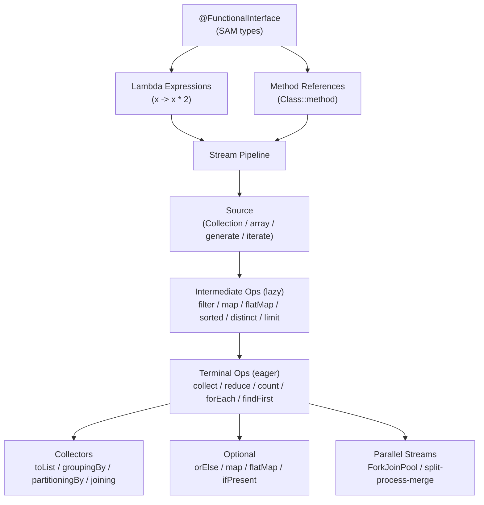

---
tags:
  - Java
  - Streams
  - Functional
  - MOC
domain: Java
created: 2026-07-26
status: complete
---

# Java Streams & Functional Programming — Map of Content

> This section covers Java's functional programming model: lambda expressions, functional interfaces, the Stream API pipeline, Collectors, Optional, and parallel stream execution. Together these topics enable declarative, composable data processing in Java 8+.

---

## Concept Map

---

## Learning Path

1. **Lambdas and Functional Interfaces** — Understand what a lambda is (anonymous function, SAM implementation), the four method reference forms, and all core `java.util.function` types. This is the vocabulary for everything else.
2. **Stream Pipeline and Collectors** — Learn the source → intermediate → terminal model. Master lazy evaluation, `flatMap` vs `map`, and the essential `Collectors`: `groupingBy`, `partitioningBy`, `joining`, `toMap`.
3. **Optional and Parallel Streams** — Understand `Optional` as an explicit nullability container and its composition methods. Then learn when parallel streams help vs hurt, and how ForkJoinPool work-stealing operates.

---

## Notes in This Section

| Note | Description | Difficulty |
|------|-------------|------------|
| [[Lambdas_and_Functional_Interfaces]] | Lambda syntax, all 4 method reference types, `Function`/`Predicate`/`Consumer`/`Supplier`, composition, effectively final captures | Intermediate |
| [[Stream_Pipeline_and_Collectors]] | Source/intermediate/terminal model, lazy evaluation, `flatMap`, `groupingBy`, `partitioningBy`, `reduce`, `Collectors.toMap` with merge | Intermediate |
| [[Optional_and_Parallel_Streams]] | `Optional` creation and chaining, `orElse` vs `orElseGet`, parallel ForkJoinPool, stateful parallel pitfalls, custom pool | Intermediate |

---

## Key Questions to Answer

1. **What triggers a stream?** — Intermediate operations are lazy; what exactly causes evaluation to start, and what happens if no terminal operation is called?
2. **When does parallel hurt?** — Give at least three concrete scenarios where `parallelStream()` is slower or incorrect compared to sequential. What's the threshold of data size where parallel typically helps?
3. **How does `flatMap` differ from `map`?** — When do you need `flatMap`? What would happen if you used `map` where `flatMap` is required (in both Stream and Optional contexts)?
4. **Why is `orElse` vs `orElseGet` not just a style choice?** — When does the distinction have real performance consequences?
5. **What does "effectively final" mean for lambda captures?** — Can you mutate a captured object? What about a captured reference?

---

## Key Concepts Quick Reference

| Concept | One-liner |
|---------|-----------|
| `@FunctionalInterface` | Interface with exactly one abstract method; lambda/method-ref can implement it |
| Lambda | `(params) -> expression` or `(params) -> { body; }` — anonymous function |
| Method reference | `Class::method` shorthand for a lambda that just delegates to an existing method |
| Stream pipeline | Source → zero or more lazy intermediate ops → one eager terminal op |
| Lazy evaluation | Intermediate ops build a description; terminal op triggers actual processing |
| `flatMap` | Maps each element to a `Stream<R>`, then flattens one level — avoids `Stream<Stream<R>>` |
| `Optional` | A container that holds zero or one value; replaces null-returning methods |
| `orElseGet` | Lazy alternative to `orElse` — supplier only called when Optional is empty |
| Parallel stream | Uses `ForkJoinPool.commonPool()`; good for CPU-bound, stateless, large data |
| Suppressed exception | Not applicable here — see Exceptions section |

---

## Cheat Sheet: Core Functional Interfaces

| Interface | Signature | Primitive Specializations |
|-----------|-----------|--------------------------|
| `Function<T,R>` | `R apply(T t)` | `IntFunction<R>`, `ToIntFunction<T>` |
| `Predicate<T>` | `boolean test(T t)` | `IntPredicate`, `LongPredicate` |
| `Consumer<T>` | `void accept(T t)` | `IntConsumer`, `LongConsumer` |
| `Supplier<T>` | `T get()` | `IntSupplier`, `BooleanSupplier` |
| `BiFunction<T,U,R>` | `R apply(T t, U u)` | `ToIntBiFunction<T,U>` |
| `UnaryOperator<T>` | `T apply(T t)` | `IntUnaryOperator` |
| `BinaryOperator<T>` | `T apply(T t1, T t2)` | `IntBinaryOperator` |

---

## Related Sections

- [[_MOC_Java_Collections]] — streams consume collections; understanding iteration semantics matters
- [[_MOC_Java_Concurrency]] — parallel streams use ForkJoinPool; shared state with parallel streams is a concurrency bug
- [[_MOC_Java_Exceptions]] — checked exceptions in lambda expressions: a key friction point
