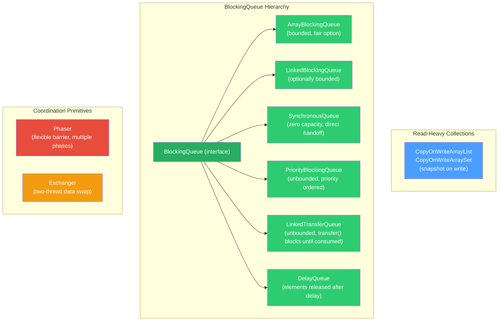

# 🗂️ Concurrent Data Structures

> [!abstract] TL;DR
> Java's `java.util.concurrent` package provides thread-safe collections designed for specific access patterns: `CopyOnWriteArrayList` for read-dominated lists, `BlockingQueue` variants for producer-consumer pipelines, and coordination primitives like `Phaser` and `Exchanger` for complex multi-thread synchronization. Choosing the right structure matters enormously — using a `LinkedBlockingQueue` with no capacity bound, for instance, can silently queue millions of tasks and cause an `OutOfMemoryError`.

---

## Intuition — the Right Tool for the Right Counter

- **`CopyOnWriteArrayList`** = a whiteboard protected by glass. Readers see the current snapshot through the glass at any time. Writers get a new copy of the whiteboard, make their change, then swap the glass shield — readers briefly see one version, then the other, but nobody is blocked.
- **`BlockingQueue`** = an airport baggage belt with a fixed number of slots. Producers (baggage handlers) wait if the belt is full; consumers (passengers) wait if it is empty. Neither busy-loops.
- **`SynchronousQueue`** = a direct hand-off — producer reaches out a bag directly to a consumer's hands. No storage; both must be present simultaneously.
- **`Phaser`** = a checkpoint system for a relay race where you can add or remove runners mid-race, and choose how many laps to run.
- **`Exchanger`** = two messengers meeting in the middle of the road and swapping envelopes — each blocks until the other arrives.

---

## How It Works



---

## Key Concepts / Details

### CopyOnWriteArrayList — Read-Heavy, Write-Expensive

```java
// ── CopyOnWriteArrayList: thread-safe, lock-free reads ──────────────────────
// Writes (add/set/remove) copy the entire internal array, modify the copy,
// then atomically replace the reference. Reads always see a consistent snapshot.

import java.util.concurrent.CopyOnWriteArrayList;

List<String> listeners = new CopyOnWriteArrayList<>();

// Safe concurrent registration and iteration — no ConcurrentModificationException
listeners.add("listenerA");
listeners.add("listenerB");

// Reads hold NO lock — multiple threads iterate simultaneously
for (String listener : listeners) {    // iterates snapshot taken at iterator creation
    dispatch(listener);                // listeners added AFTER iteration started are NOT seen
}

// When to use:
//   ✅ Event listener lists (few registrations, many dispatches)
//   ✅ Config/whitelist that rarely changes but is read by many threads
//   ❌ Frequent writes — O(n) copy on every mutation
//   ❌ Large collections — the copy is expensive in memory and time

// CopyOnWriteArraySet wraps CopyOnWriteArrayList — same trade-offs, unique elements
Set<String> roles = new CopyOnWriteArraySet<>(Arrays.asList("READ", "WRITE"));
```

### BlockingQueue — Producer-Consumer Pattern

```java
// ── ArrayBlockingQueue: bounded, FIFO, optional fairness ────────────────────
// "Bounded" = fixed capacity set at construction; producer blocks when full
BlockingQueue<Task> queue = new ArrayBlockingQueue<>(100);         // capacity = 100
BlockingQueue<Task> fairQueue = new ArrayBlockingQueue<>(100, true); // fair = FIFO among waiters

// Four operation families:
queue.add(task);            // throws IllegalStateException if full (non-blocking)
queue.offer(task);          // returns false if full (non-blocking)
queue.offer(task, 100, TimeUnit.MILLISECONDS); // times out after 100ms
queue.put(task);            // BLOCKS until space available (interruptible)

Task t = queue.poll();               // returns null if empty (non-blocking)
Task t2 = queue.poll(100, MILLISECONDS); // times out after 100ms
Task t3 = queue.take();             // BLOCKS until element available (interruptible)


// ── LinkedBlockingQueue: optionally bounded ──────────────────────────────────
// Default capacity = Integer.MAX_VALUE — effectively unbounded → OOM risk!
// ALWAYS specify capacity in production.
BlockingQueue<Work> safe   = new LinkedBlockingQueue<>(10_000); // bounded
BlockingQueue<Work> unsafe = new LinkedBlockingQueue<>();        // DANGER: unbounded


// ── SynchronousQueue: zero-capacity direct handoff ──────────────────────────
// put() blocks until take() is called by another thread (and vice versa)
// Used in Executors.newCachedThreadPool() to hand off tasks directly to idle threads
BlockingQueue<Runnable> handoff = new SynchronousQueue<>();
// producer and consumer must rendezvous — no buffering


// ── PriorityBlockingQueue: unbounded, priority-ordered ──────────────────────
// Elements must be Comparable or provide a Comparator
// poll()/take() returns the LOWEST priority element (min-heap)
BlockingQueue<Task> pq = new PriorityBlockingQueue<>(
    11,
    Comparator.comparingInt(Task::getPriority)
);
// No blocking on put (unbounded) — but take() blocks if empty


// ── Producer-Consumer with BlockingQueue ─────────────────────────────────────
public class WorkPipeline {
    private final BlockingQueue<String> queue = new ArrayBlockingQueue<>(50);
    private volatile boolean done = false;

    // Producer: generates work items
    class Producer implements Runnable {
        @Override
        public void run() {
            try {
                for (String item : dataSource) {
                    queue.put(item);         // blocks if queue full — natural back-pressure
                }
            } catch (InterruptedException e) {
                Thread.currentThread().interrupt();
            } finally {
                done = true;
            }
        }
    }

    // Consumer: processes work items
    class Consumer implements Runnable {
        @Override
        public void run() {
            try {
                while (!done || !queue.isEmpty()) {
                    String item = queue.poll(100, TimeUnit.MILLISECONDS);
                    if (item != null) process(item);
                }
            } catch (InterruptedException e) {
                Thread.currentThread().interrupt();
            }
        }
    }
}
```

### LinkedTransferQueue — Zero-Copy Transfer

```java
import java.util.concurrent.LinkedTransferQueue;

// LinkedTransferQueue: unbounded, supports transfer() which blocks until
// a consumer actually takes the item — guarantees handoff, not just enqueueing.
LinkedTransferQueue<Message> ltq = new LinkedTransferQueue<>();

// Producer: blocks until a consumer calls take() or poll()
ltq.transfer(message);                   // blocks; unlike put() which returns after enqueue

// Non-blocking attempt: returns false if no consumer waiting right now
boolean taken = ltq.tryTransfer(message);

// With timeout
boolean taken2 = ltq.tryTransfer(message, 200, TimeUnit.MILLISECONDS);

// Consumer side is identical to BlockingQueue
Message msg = ltq.take();               // blocks until available
```

### Phaser — Flexible Multi-Phase Barrier

```java
import java.util.concurrent.Phaser;

// Phaser = reusable, flexible alternative to CountDownLatch + CyclicBarrier
// Can add/remove parties at runtime; supports multiple phases

// ── Example: pipeline with 3 stages, 4 worker threads ───────────────────────
int workerCount = 4;
Phaser phaser = new Phaser(workerCount + 1); // +1 for the main orchestrator thread

for (int i = 0; i < workerCount; i++) {
    final int workerId = i;
    Thread.ofVirtual().start(() -> {
        try {
            // Phase 0: load data
            loadData(workerId);
            phaser.arriveAndAwaitAdvance(); // wait for ALL workers to finish Phase 0

            // Phase 1: transform
            transform(workerId);
            phaser.arriveAndAwaitAdvance(); // wait for ALL workers to finish Phase 1

            // Phase 2: write output
            writeOutput(workerId);
            phaser.arriveAndDeregister(); // done — deregister from phaser
        } catch (Exception e) {
            phaser.arriveAndDeregister(); // deregister even on error
        }
    });
}

// Orchestrator participates in each phase
phaser.arriveAndAwaitAdvance(); // releases Phase 0 when all workers + main arrive
phaser.arriveAndAwaitAdvance(); // releases Phase 1
phaser.arriveAndDeregister();   // orchestrator done

// Dynamic registration: add a new party mid-execution
phaser.register();              // atomically increments party count
phaser.arrive();                // signal arrival without waiting (async)
int phase = phaser.getPhase();  // current phase number (0, 1, 2 …)
```

### Exchanger — Two-Thread Data Swap

```java
import java.util.concurrent.Exchanger;

// Exchanger: two threads swap objects at a synchronization point
// Both block at exchange() until the other arrives; then each gets the other's object

Exchanger<List<Integer>> exchanger = new Exchanger<>();

// Thread 1: fills a buffer and swaps it for an empty one to refill
Thread.ofVirtual().start(() -> {
    List<Integer> buffer = new ArrayList<>();
    while (true) {
        buffer.add(produce());
        if (buffer.size() == BATCH_SIZE) {
            try {
                // Hand off full buffer; receive empty buffer from consumer
                buffer = exchanger.exchange(buffer);
            } catch (InterruptedException e) {
                Thread.currentThread().interrupt(); return;
            }
        }
    }
});

// Thread 2: drains the full buffer and swaps it for an empty one
Thread.ofVirtual().start(() -> {
    List<Integer> emptyBuffer = new ArrayList<>();
    while (true) {
        try {
            // Receive full buffer; give back empty buffer
            List<Integer> fullBuffer = exchanger.exchange(emptyBuffer);
            fullBuffer.forEach(Consumer::consume);
            emptyBuffer = new ArrayList<>();
        } catch (InterruptedException e) {
            Thread.currentThread().interrupt(); return;
        }
    }
});
```

### Concurrent Collections Comparison Table

| Collection | Thread Safety Mechanism | Reads | Writes | When to Use |
|---|---|---|---|---|
| `CopyOnWriteArrayList` | Copy-on-write | Lock-free, snapshot | O(n) copy | Read-heavy: event listeners, config lists |
| `ConcurrentHashMap` | Segment/bucket CAS | Lock-free | Per-bucket CAS | General-purpose concurrent map |
| `ArrayBlockingQueue` | Single ReentrantLock | Blocks if empty | Blocks if full | Bounded producer-consumer, back-pressure |
| `LinkedBlockingQueue` | Two locks (put/take) | Blocks if empty | Blocks if full | Higher throughput than Array; specify capacity! |
| `SynchronousQueue` | CAS | Always blocks | Always blocks | Direct handoff; `newCachedThreadPool` |
| `PriorityBlockingQueue` | ReentrantLock | Blocks if empty | Never blocks (unbounded) | Priority-ordered tasks |
| `LinkedTransferQueue` | CAS | Blocks if empty | `transfer()` blocks until consumed | Guaranteed consumer handoff |
| `DelayQueue` | ReentrantLock | Blocks until delay expires | Never blocks | Scheduled tasks, TTL caches |
| `Phaser` | CAS-based | N/A | N/A | Multi-phase barriers, dynamic parties |
| `Exchanger` | CAS | N/A | N/A | Two-thread data swap, double-buffering |

---

## Real-World Notes

- **Spring `ApplicationEventPublisher`** internally iterates its listener list — it uses a `CopyOnWriteArrayList` equivalent for thread safety during dispatch.
- **`Executors.newCachedThreadPool()`** uses a `SynchronousQueue` internally — tasks are handed directly to waiting threads with no buffering. If no thread is available, a new one is created.
- **`Executors.newFixedThreadPool(n)`** uses an unbounded `LinkedBlockingQueue` — this is a common OOM source if the producer is faster than consumers. Consider `ThreadPoolExecutor` with explicit capacity and a `RejectedExecutionHandler`.
- **Kafka consumer polling** uses a single-threaded model per partition; if you parallelize processing, a `LinkedTransferQueue` or bounded `ArrayBlockingQueue` is the right internal buffer.
- **`Phaser`** is used internally by `ForkJoinPool` to implement work-stealing synchronization.
- **`DelayQueue`** powers `ScheduledThreadPoolExecutor` internally — understanding it explains how `scheduleAtFixedRate` works.

---

## Common Pitfalls

1. **Unbounded `LinkedBlockingQueue`**: `new LinkedBlockingQueue<>()` has `Integer.MAX_VALUE` capacity. A slow consumer lets the queue grow without bound → `OutOfMemoryError`. Always use `new LinkedBlockingQueue<>(capacity)` in production.

2. **`CopyOnWriteArrayList` for write-heavy workloads**: Each `add()` allocates and copies the entire array. With 10,000 elements, a concurrent burst of writes causes massive GC pressure and latency spikes.

3. **Iterating non-concurrent list under lock**: Using `Collections.synchronizedList()` gives you a locked list, but iteration must be externally synchronized: `synchronized(list) { for (E e : list) ... }`. Missing this causes `ConcurrentModificationException`. Use `CopyOnWriteArrayList` instead to avoid manual external sync.

4. **`Phaser` party count mismatch**: If a thread calls `arrive()` but never registered, it throws `IllegalStateException`. If a registered thread crashes without calling `arriveAndDeregister()`, all other threads at `arriveAndAwaitAdvance()` block forever.

5. **`PriorityBlockingQueue` unbounded growth**: Unlike `ArrayBlockingQueue`, `PriorityBlockingQueue` never blocks the producer — it grows until OOM if consumers can't keep up.

6. **`Exchanger` with more than two threads**: `Exchanger` is strictly for exactly two threads. With three or more participants, use `CyclicBarrier` or `Phaser` instead.

---

## Related Concepts

- [[Threads_and_Synchronization]] — foundational lock and wait/notify patterns
- [[Concurrent_Utilities]] — CountDownLatch, CyclicBarrier, Semaphore, ReentrantLock
- [[Executors_and_CompletableFuture]] — thread pools that use BlockingQueue internally
- [[Virtual_Threads_Java21]] — virtual threads combined with BlockingQueue for I/O pipelines
- [[_MOC_Java_Concurrency|↑ Section MOC]]

---

## Review Questions

1. What is the difference between `ArrayBlockingQueue` and `LinkedBlockingQueue` in terms of capacity, throughput, and failure modes? Why should you always specify a capacity for `LinkedBlockingQueue`?

2. Explain the copy-on-write mechanism in `CopyOnWriteArrayList`. What consistency guarantee does iteration provide, and why is this structure unsuitable for write-heavy workloads?

3. How does `Phaser` improve on `CountDownLatch` and `CyclicBarrier`? Give a scenario where only `Phaser` can handle the requirement cleanly.

---

## Sources

- Java SE 21 API — `java.util.concurrent`: https://docs.oracle.com/en/java/docs/api/java.base/java/util/concurrent/package-summary.html
- Brian Goetz — Java Concurrency in Practice, Chapter 5 (Building Blocks)
- Doug Lea — JSR-166: Concurrency Utilities

#Java #Concurrency #ConcurrentCollections #BlockingQueue #Phaser #ProducerConsumer
