# 🔒 Concurrent Utilities

> [!abstract] TL;DR
> `java.util.concurrent` provides: **lock-free structures** (`ConcurrentHashMap` — per-bucket CAS+sync since Java 8; `CopyOnWriteArrayList` — snapshot on write; `ConcurrentLinkedQueue` — non-blocking Michael-Scott queue), **atomic variables** (`AtomicInteger`/`Long`/`Reference` via hardware CAS; `LongAdder` with striped cells for high-contention counters), **flexible locks** (`ReentrantLock` with `tryLock` timeout, fairness, multiple `Condition`s; `ReadWriteLock` for read-heavy workloads; `StampedLock` with optimistic read), and **synchronization barriers** (`CountDownLatch` one-shot gate; `CyclicBarrier` reusable barrier; `Semaphore` N-permits; `Phaser` flexible generation-based barrier; `Exchanger` pair handoff).

---

## Intuition

- **`ConcurrentHashMap`** = a bank vault with 16 (or more) separate combination locks, one per drawer. Customers accessing different drawers never block each other.
- **`AtomicInteger`** = a number written on a whiteboard with a special rule: you can only erase and rewrite if the number you see matches what you expected — otherwise try again. No key required; the hardware guarantees it.
- **`Semaphore`** = a parking lot with N spaces. Cars (threads) must wait for an open space. When a car leaves, it signals one waiting car to enter.
- **`CountDownLatch`** = a starting pistol for a race that fires only after all N athletes confirm they're in position. Once fired, it cannot be re-cocked.
- **`CyclicBarrier`** = a relay race baton exchange point — all N runners must reach the exchange zone before any of them continues. After they all pass, the barrier resets for the next lap.

---

## How It Works

### Package Overview

```mermaid
graph TD
    JUC["java.util.concurrent"]

    DS["Data Structures"]
    ATM["Atomic"]
    LCK["Locks"]
    SYN["Synchronizers"]

    JUC --> DS
    JUC --> ATM
    JUC --> LCK
    JUC --> SYN

    DS --> CHM["ConcurrentHashMap\n(per-bucket CAS/sync)"]
    DS --> COWAL["CopyOnWriteArrayList\n(snapshot on write)"]
    DS --> CLQ["ConcurrentLinkedQueue\n(non-blocking)"]
    DS --> BQ["BlockingQueue\n(ArrayBQ / LinkedBQ\n/ PriorityBQ)"]

    ATM --> AI["AtomicInteger\n/ AtomicLong\n/ AtomicReference"]
    ATM --> LA["LongAdder\n/ DoubleAdder\n(striped cells)"]
    ATM --> ASR["AtomicStampedReference\n(ABA prevention)"]

    LCK --> RL["ReentrantLock\n(tryLock / fairness\n/ Condition)"]
    LCK --> RWL["ReadWriteLock\n(concurrent readers\n/ exclusive writer)"]
    LCK --> SL["StampedLock\n(optimistic read)"]

    SYN --> CDL["CountDownLatch\n(one-shot await)"]
    SYN --> CB["CyclicBarrier\n(reusable N-party)"]
    SYN --> SEM["Semaphore\n(N-permit pool)"]
    SYN --> PH["Phaser\n(flexible phases)"]
    SYN --> EX["Exchanger\n(pair handoff)"]

    style JUC fill:#2C3E50,color:#fff
    style DS fill:#4A90D9,color:#fff
    style ATM fill:#8E44AD,color:#fff
    style LCK fill:#27AE60,color:#fff
    style SYN fill:#D35400,color:#fff
```



---

### Java Code Examples

```java
// ══════════════════════════════════════════════════════════════════
// CONCURRENT DATA STRUCTURES
// ══════════════════════════════════════════════════════════════════

// ── ConcurrentHashMap: atomic compound operations ─────────────────
ConcurrentHashMap<String, List<String>> index = new ConcurrentHashMap<>();

// computeIfAbsent — atomically get or create (key-level lock)
// Thread-safe: if two threads call simultaneously, only one creates the list
index.computeIfAbsent("java", k -> new CopyOnWriteArrayList<>()).add("streams");

// merge — atomic read-modify-write: if key absent → value; if present → apply fn
ConcurrentHashMap<String, Integer> wordCount = new ConcurrentHashMap<>();
wordCount.merge("hello", 1, Integer::sum);  // absent: inserts 1; present: existing+1
wordCount.merge("world", 1, Integer::sum);  // safe under concurrent access

// compute — atomically compute new value from existing (null if absent)
wordCount.compute("java", (k, v) -> v == null ? 1 : v + 1);

// forEach with parallelism threshold (1 = use all available parallelism)
wordCount.forEach(1, (k, v) -> System.out.printf("%s: %d%n", k, v));

// reduce — parallel aggregation
int total = wordCount.reduceValues(1, Integer::sum);

// NOTE: ConcurrentHashMap does NOT allow null keys or values (unlike HashMap)
// Iteration is weakly consistent — may or may not reflect concurrent updates


// ── CopyOnWriteArrayList: optimal for read-heavy, rare writes ─────
CopyOnWriteArrayList<String> listeners = new CopyOnWriteArrayList<>();
listeners.add("listener1");     // creates a new array copy with element appended
listeners.add("listener2");

// Safe iteration even while another thread modifies (iterates snapshot copy)
for (String listener : listeners) {
    notifyListener(listener);   // safe, no ConcurrentModificationException
}
// Trade-off: writes are O(n) — copy entire array; only use for rare writes


// ── BlockingQueue: producer-consumer channel ──────────────────────
BlockingQueue<Task> taskQueue = new ArrayBlockingQueue<>(50); // bounded

// Producer:
taskQueue.put(newTask);           // blocks if queue is full (flow control)
boolean offered = taskQueue.offer(newTask, 100, TimeUnit.MILLISECONDS); // timeout

// Consumer:
Task task = taskQueue.take();    // blocks until element available
Task task2 = taskQueue.poll(100, TimeUnit.MILLISECONDS); // timeout version


// ══════════════════════════════════════════════════════════════════
// ATOMIC VARIABLES
// ══════════════════════════════════════════════════════════════════

// ── AtomicInteger: lock-free counter ─────────────────────────────
AtomicInteger counter = new AtomicInteger(0);
int newVal = counter.incrementAndGet();   // atomic ++; returns new value
int old    = counter.getAndAdd(5);        // atomic +=5; returns old value
int result = counter.updateAndGet(v -> v * 2); // lambda: atomic transform

// compareAndSet (CAS): the primitive hardware instruction
// Only updates if current value == expected (optimistic concurrency)
int expected = counter.get();
boolean succeeded = counter.compareAndSet(expected, expected + 1);
// If another thread modified counter between get() and CAS → false → retry


// ── AtomicReference: lock-free reference swap ────────────────────
AtomicReference<String> status = new AtomicReference<>("PENDING");

// Safe state transition: only moves PENDING → PROCESSING, never backwards
boolean transitioned = status.compareAndSet("PENDING", "PROCESSING");
if (transitioned) {
    processTask();
    status.set("DONE");
}


// ── ABA Problem and AtomicStampedReference ───────────────────────
// ABA: value changes A→B→A; CAS sees A and succeeds even though it changed
// Fix: use stamp (version counter) alongside the reference
AtomicStampedReference<String> stamped = new AtomicStampedReference<>("v1", 0);
int[] stampHolder = {0};
String current = stamped.get(stampHolder);   // reads value AND stamp
int currentStamp = stampHolder[0];
stamped.compareAndSet(current, "v2", currentStamp, currentStamp + 1); // only if stamp matches


// ── LongAdder: better than AtomicLong under high contention ──────
LongAdder hitCount = new LongAdder();
// Under contention: each thread updates a different cell in an internal array
// Reduces CAS retries dramatically at high thread counts
hitCount.increment();            // fast — usually no CAS retry needed
hitCount.add(5);
long total = hitCount.sum();     // aggregates all cells — slightly stale during heavy updates
// Use LongAdder when: writes >> reads, counter never decremented, approximate ok
// Use AtomicLong when: compare-and-set logic needed, or reads as frequent as writes


// ══════════════════════════════════════════════════════════════════
// FLEXIBLE LOCKS
// ══════════════════════════════════════════════════════════════════

// ── ReentrantLock: superior to synchronized when you need more control ──
ReentrantLock lock = new ReentrantLock(true); // fair=true: FIFO waiting order

// Basic usage: ALWAYS unlock in finally
lock.lock();
try {
    // critical section
    performCriticalOperation();
} finally {
    lock.unlock(); // executes even if exception thrown — prevents permanent deadlock
}

// tryLock with timeout: deadlock prevention — gives up rather than waiting forever
if (lock.tryLock(1, TimeUnit.SECONDS)) {
    try {
        performCriticalOperation();
    } finally {
        lock.unlock();
    }
} else {
    // Could not acquire lock in time — log, circuit-break, or degrade gracefully
    return fallbackResult();
}

// Interruptible lock acquisition (unlike synchronized, which ignores interrupts)
try {
    lock.lockInterruptibly();
    try {
        performCriticalOperation();
    } finally {
        lock.unlock();
    }
} catch (InterruptedException e) {
    Thread.currentThread().interrupt(); // restore interrupt status
}

// Multiple Condition variables: fine-grained producer-consumer signaling
Condition notFull  = lock.newCondition();
Condition notEmpty = lock.newCondition();

public void put(T item) throws InterruptedException {
    lock.lock();
    try {
        while (isFull()) notFull.await();   // releases lock, waits for signal
        enqueue(item);
        notEmpty.signal();                   // wake one consumer
    } finally { lock.unlock(); }
}

public T take() throws InterruptedException {
    lock.lock();
    try {
        while (isEmpty()) notEmpty.await();
        T item = dequeue();
        notFull.signal();                    // wake one producer
        return item;
    } finally { lock.unlock(); }
}


// ── ReadWriteLock: concurrent readers, exclusive writer ───────────
ReadWriteLock rwLock = new ReentrantReadWriteLock();
Lock readLock  = rwLock.readLock();
Lock writeLock = rwLock.writeLock();

Map<String, Config> configCache = new HashMap<>(); // protected by rwLock

public Config getConfig(String key) {
    readLock.lock();    // Multiple threads can hold readLock simultaneously
    try {
        return configCache.get(key);
    } finally {
        readLock.unlock();
    }
}

public void updateConfig(String key, Config value) {
    writeLock.lock();   // Exclusive: blocks ALL readers and other writers
    try {
        configCache.put(key, value);
    } finally {
        writeLock.unlock();
    }
}
// NOTE: Cannot upgrade from read to write lock — must release read first (deadlock risk otherwise)


// ── StampedLock: optimistic read — fastest for read-heavy ─────────
StampedLock stampedLock = new StampedLock();
private double value = 0.0;

public double readValue() {
    long stamp = stampedLock.tryOptimisticRead(); // NO lock acquired; just reads stamp
    double currentValue = this.value;             // read without lock
    if (!stampedLock.validate(stamp)) {           // was value written since stamp?
        // Optimistic read failed (concurrent write) — fall back to real read lock
        stamp = stampedLock.readLock();
        try {
            currentValue = this.value;
        } finally {
            stampedLock.unlockRead(stamp);
        }
    }
    return currentValue; // Lock held 0% of the time on happy path
}

public void writeValue(double newValue) {
    long stamp = stampedLock.writeLock();         // exclusive write lock
    try {
        this.value = newValue;
    } finally {
        stampedLock.unlockWrite(stamp);
    }
}
// NOTE: StampedLock is NOT reentrant — re-entry deadlocks


// ══════════════════════════════════════════════════════════════════
// SYNCHRONIZATION BARRIERS
// ══════════════════════════════════════════════════════════════════

// ── CountDownLatch: one-shot gate (cannot be reset) ───────────────
int serviceCount = 3;
CountDownLatch startSignal = new CountDownLatch(serviceCount);

for (int i = 0; i < serviceCount; i++) {
    final int id = i;
    executor.submit(() -> {
        try {
            initializeService(id);
        } finally {
            startSignal.countDown(); // decrement counter (even if init failed)
        }
    });
}
boolean allReady = startSignal.await(30, TimeUnit.SECONDS); // blocks until count=0
if (!allReady) throw new TimeoutException("Services didn't start in time");
System.out.println("All services initialized — accepting traffic");


// ── CyclicBarrier: N-party rendezvous (reusable) ──────────────────
// barrier action runs once when the LAST thread arrives
CyclicBarrier barrier = new CyclicBarrier(3, () ->
    System.out.println("All threads at phase boundary — merging results")
);

// Parallel processing with merge point
for (int i = 0; i < 3; i++) {
    final int chunkId = i;
    executor.submit(() -> {
        try {
            List<Result> partialResult = processChunk(data[chunkId]);
            storePartial(chunkId, partialResult);
            barrier.await();  // wait for all 3 to finish processing
            // barrier action fires; all 3 continue together
            mergeResults();   // now safe to merge
            barrier.await();  // second phase: wait for merge to finish
            publishResults();
        } catch (BrokenBarrierException e) {
            // Another thread threw exception → barrier broken; handle/abort
        }
    });
}


// ── Semaphore: N-permit resource pool ────────────────────────────
Semaphore dbConnectionPool = new Semaphore(10, true); // 10 max concurrent, fair queue

public Result queryDatabase(String sql) throws InterruptedException {
    dbConnectionPool.acquire(); // block until a permit is available
    try {
        Connection conn = pool.getConnection();
        return conn.execute(sql);
    } finally {
        dbConnectionPool.release(); // always release — even on exception
    }
}

// Non-blocking attempt with timeout (circuit-breaker pattern)
if (dbConnectionPool.tryAcquire(200, TimeUnit.MILLISECONDS)) {
    try {
        return queryDatabase(sql);
    } finally {
        dbConnectionPool.release();
    }
} else {
    return cachedResult(); // degrade gracefully when DB is saturated
}
```

---

## Key Concepts

### ConcurrentHashMap Internals (Java 8+)

- Heap divided into **Node buckets**. Empty bucket insertion uses **CAS** (no lock). Occupied bucket synchronizes on the **head node** of the bucket's linked list/tree.
- **Treeification**: buckets with >8 nodes convert to `TreeNode` (red-black tree) for O(log n) lookup.
- `computeIfAbsent`, `merge`, `compute` are **atomic at the key level** — entire operation under one bucket lock.
- **No null keys or values** — unlike `HashMap`. `null` would be ambiguous ("key absent" vs "key mapped to null").
- Iterators are **weakly consistent** — may or may not reflect concurrent updates that happened after iterator creation; never throw `ConcurrentModificationException`.

### Atomic Classes and CAS

- **CAS (Compare-And-Swap)**: single CPU instruction (x86: `CMPXCHG`). Reads a memory location, compares with expected value, writes new value only if they match — atomically.
- **Lock-free but not wait-free**: under contention, CAS can retry many times (busy loop). Not guaranteed to make progress in bounded time.
- **ABA problem**: value changes A→B→A. CAS sees A and succeeds even though the value was modified. Fix: `AtomicStampedReference` adds a version stamp alongside the reference.

### LongAdder vs AtomicLong

| Feature | AtomicLong | LongAdder |
|---|---|---|
| Mechanism | Single cell, CAS | Striped cells array, reduces contention |
| Read performance | Fast (single read) | Slower (sum all cells) |
| Write under high contention | Many retries | Near-linear scaling |
| Memory | 1 long | 1 long + N cells (on demand) |
| Supports CAS/get-and-set | Yes | No |
| Best for | Compare-and-swap logic | High-frequency counters (metrics) |

### ReentrantLock vs synchronized

| Capability | `synchronized` | `ReentrantLock` |
|---|---|---|
| Acquire with timeout | No | `tryLock(timeout)` |
| Interruptible acquire | No | `lockInterruptibly()` |
| Fair ordering (FIFO) | No | `new ReentrantLock(true)` |
| Multiple condition variables | No (one per object) | `lock.newCondition()` (unlimited) |
| Lock in one method, unlock in another | No | Yes (with discipline) |

### CountDownLatch vs CyclicBarrier vs Semaphore

| Utility | Reusable? | Blocking method | Direction | Use case |
|---|---|---|---|---|
| `CountDownLatch` | No (one-shot) | `await()` | N → 0, unblocks awaiters | Startup gate, test coordination |
| `CyclicBarrier` | Yes (auto-reset) | `await()` | N parties arrive, all continue | Parallel algorithms with sync points |
| `Semaphore` | Yes | `acquire()` | Permits: max → 0, release → max | Resource pool, rate limiting |
| `Phaser` | Yes (phases) | `arriveAndAwaitAdvance()` | Flexible registration | Multi-phase parallel computation |

### StampedLock Optimistic Read Pattern

```
1. stamp = tryOptimisticRead()  → reads current write-stamp; no lock
2. read shared variables        → optimistic: assume no concurrent write
3. validate(stamp)              → did any write happen since step 1?
   → true:  no write happened; return value safely
   → false: a write occurred; fall back to readLock() and re-read
```

This provides a **third mode** (beyond shared read and exclusive write): reads with zero lock overhead on the happy path (no concurrent write). `validate(stamp)` is a memory fence — ensures reads in step 2 are not reordered past step 3.

---

## Real-World Notes

- **Caffeine cache** (Spring Boot default) uses CAS internally for cache entry management — nearly zero lock contention at high read throughput.
- **Spring Security** uses `ConcurrentHashMap` for `SessionRegistry` — maps sessions to principals under concurrent login/logout.
- **HikariCP** connection pool uses a custom `ConcurrentBag` (similar to `Semaphore` + `StampedLock` hybrid) for ultra-fast connection checkout.
- **Micrometer** (Spring Boot Actuator metrics) uses `LongAdder` via `Counter` implementation for metric recording — optimized for high-frequency updates from many threads.

---

## Common Pitfalls

1. **Forgetting `unlock()` in `finally`**: a `ReentrantLock` not released leaves it permanently locked — all other threads block forever. Every `lock()` call must be followed by `try { ... } finally { unlock(); }`.

2. **Upgrading read lock to write lock**: holding `readLock` and calling `writeLock.lock()` → deadlock. The read lock must be released before acquiring write lock.

3. **`CyclicBarrier` broken barrier**: if one thread throws an exception inside `await()`, the barrier enters broken state. All other threads' `await()` calls throw `BrokenBarrierException`. Call `barrier.reset()` to recover (only if no threads are currently waiting).

4. **`Semaphore` release without try-finally**: if the code between `acquire()` and `release()` throws, the permit is leaked — pool shrinks permanently. Always use try-finally.

5. **`StampedLock` re-entry**: unlike `ReentrantLock`, `StampedLock` is **not reentrant**. A thread trying to re-enter deadlocks itself. Never call `StampedLock` methods recursively.

---

## Related

- [[_MOC_Java_Concurrency|↑ Section MOC]]
- [[Threads_and_Synchronization]] — JMM visibility guarantees underlying all these utilities
- [[HashMap_and_Concurrent_Collections]] — HashMap vs ConcurrentHashMap deep dive

---

## Review Questions

1. What is the difference between `CountDownLatch` and `CyclicBarrier`? When would you choose each, and why can't a `CountDownLatch` be reused?

2. Why is `LongAdder` preferred over `AtomicLong` for high-contention counters? What is the internal mechanism that makes it faster, and what is the trade-off?

3. How does `StampedLock`'s optimistic read differ from `ReadWriteLock`'s read lock? What validation step is required, and what happens when validation fails?

---

#Java #Concurrency #ConcurrentCollections #Atomic #Locks
