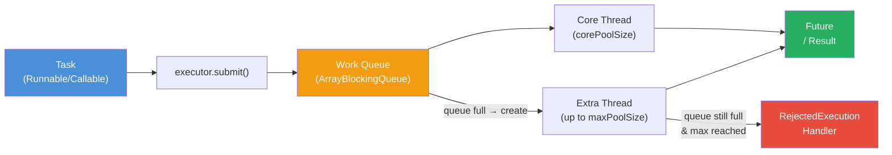
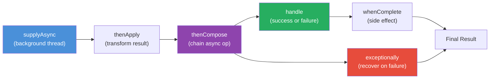

# ⚡ Executors and CompletableFuture

> [!abstract] TL;DR
> `ExecutorService` abstracts thread lifecycle; **`ThreadPoolExecutor(corePoolSize, maxPoolSize, keepAlive, queue, factory, handler)`** is the foundation for all pool configurations. `Executors` factory methods create common pools (fixed, cached, single, virtual). `ScheduledExecutorService` handles delayed and periodic tasks. **`CompletableFuture`** enables non-blocking async pipelines: `supplyAsync` → `thenApply` → `thenCompose` (flatMap) → `thenCombine` (zip two futures) → `exceptionally`/`handle` for error recovery → `allOf`/`anyOf` for fan-out. **Always pass a custom executor** to async methods — the default `ForkJoinPool.commonPool()` is shared with parallel streams and must never block.

---

## Intuition

- **`ExecutorService`** = a staffing agency. You submit job descriptions (tasks), and the agency manages hiring (thread creation), assigning shifts (scheduling), and firing idle workers (keepAlive). You never touch individual workers.
- **`CompletableFuture`** = an Amazon delivery promise. You don't wait by the door — you attach callbacks ("when it arrives, put it in the locker; if it fails, send a notification"). Each callback chains to the next automatically without blocking the original thread.
- **Thread pool sizing** = calibrating a restaurant kitchen. Too few cooks (threads): orders pile up (queue fills, latency rises). Too many: cooks bump into each other (context-switch overhead), kitchen gets hot (memory).
- **`CallerRunsPolicy`** = "if we're overwhelmed, the manager (caller) does the task themselves" — natural backpressure upstream.

---

## How It Works

### Execution Pipeline



### CompletableFuture Pipeline



---

### Java Code Examples

```java
// ── ThreadPoolExecutor: full constructor ─────────────────────────────────────
ThreadPoolExecutor executor = new ThreadPoolExecutor(
    4,                               // corePoolSize:    threads always alive (warm)
    8,                               // maximumPoolSize: max under burst load
    60, TimeUnit.SECONDS,            // keepAliveTime:   idle extra thread timeout
    new ArrayBlockingQueue<>(100),   // workQueue:       bounded — prevents OOM runaway
    new ThreadFactory() {
        private final AtomicInteger counter = new AtomicInteger();
        @Override
        public Thread newThread(Runnable r) {
            Thread t = new Thread(r, "app-worker-" + counter.getAndIncrement());
            t.setDaemon(false);
            return t;
        }
    },
    // RejectedExecutionHandler — what happens when queue is full & threads at max:
    new ThreadPoolExecutor.CallerRunsPolicy()
    // Alternatives:
    // AbortPolicy (default) — throws RejectedExecutionException
    // DiscardPolicy          — silently drops task (data loss!)
    // DiscardOldestPolicy    — drops oldest queued task, retries current
    // CallerRunsPolicy       — caller thread executes the task (backpressure)
);

// Monitor pool stats at runtime
int active   = executor.getActiveCount();
long queued  = executor.getQueue().size();
long completed = executor.getCompletedTaskCount();

// Proper two-phase shutdown (always do this)
executor.shutdown();                // stop accepting new tasks, drain queue
try {
    if (!executor.awaitTermination(30, TimeUnit.SECONDS)) {
        executor.shutdownNow();     // interrupt running tasks
        if (!executor.awaitTermination(30, TimeUnit.SECONDS)) {
            System.err.println("Executor did not terminate");
        }
    }
} catch (InterruptedException e) {
    executor.shutdownNow();
    Thread.currentThread().interrupt(); // restore interrupted status
}


// ── Executors factory methods ────────────────────────────────────────────────

// Fixed: CPU-bound tasks with known parallelism ceiling
ExecutorService fixed = Executors.newFixedThreadPool(
    Runtime.getRuntime().availableProcessors()
);
// WARNING: uses unbounded LinkedBlockingQueue — can OOM under sustained overload
// Prefer custom ThreadPoolExecutor with bounded queue for production

// Cached: many short-lived async tasks (creates threads on demand, reuses idle ones)
ExecutorService cached = Executors.newCachedThreadPool();
// WARNING: unbounded thread creation — can create thousands under load → OOM

// Single-threaded: sequential processing, event loop, serialize access to resource
ExecutorService single = Executors.newSingleThreadExecutor();

// Virtual thread per task (Java 21): ideal for IO-bound workloads
// Each virtual thread is cheap (~1KB stack vs ~1MB for platform thread)
ExecutorService virtual = Executors.newVirtualThreadPerTaskExecutor();


// ── ScheduledExecutorService ─────────────────────────────────────────────────
ScheduledExecutorService scheduler = Executors.newScheduledThreadPool(2);

// One-time delayed execution
ScheduledFuture<?> oneTime = scheduler.schedule(
    () -> System.out.println("Runs once after 5 seconds"),
    5, TimeUnit.SECONDS
);

// Fixed rate: period from START of each execution (even if task is slow)
// If task takes longer than period → tasks back up → use fixed delay instead
scheduler.scheduleAtFixedRate(
    () -> sendHeartbeat(),
    0,      // initial delay
    10,     // period
    TimeUnit.SECONDS
);

// Fixed delay: period from END of each execution (safe for variable-duration tasks)
scheduler.scheduleWithFixedDelay(
    () -> pollExternalApi(),
    0,     // initial delay
    5,     // delay between end and next start
    TimeUnit.SECONDS
);


// ── CompletableFuture: full API ──────────────────────────────────────────────
ExecutorService appExecutor = Executors.newFixedThreadPool(10);

// Start async computation (always pass custom executor — avoid common pool)
CompletableFuture<User> userFuture = CompletableFuture.supplyAsync(
    () -> userRepository.findById(1L).orElseThrow(),
    appExecutor
);

// thenApply: synchronous transform (runs in completing thread)
CompletableFuture<UserDto> dtoFuture = userFuture
    .thenApply(UserDto::fromUser);

// thenApplyAsync: async transform (runs in executor thread)
CompletableFuture<UserDto> dtoFutureAsync = userFuture
    .thenApplyAsync(UserDto::fromUser, appExecutor);

// thenCompose: flatMap — chains an async operation, avoids CF<CF<T>>
// Use when the next step itself returns a CompletableFuture
CompletableFuture<List<Order>> ordersFuture = userFuture
    .thenComposeAsync(
        user -> orderRepository.findByUserAsync(user.getId()), // returns CF<List<Order>>
        appExecutor
    );
// BAD: thenApply here would return CompletableFuture<CompletableFuture<List<Order>>>

// thenCombine: zip two independent futures (run concurrently)
CompletableFuture<String> nameFuture = CompletableFuture
    .supplyAsync(() -> fetchUserName(1L), appExecutor);
CompletableFuture<Double> balanceFuture = CompletableFuture
    .supplyAsync(() -> fetchBalance(1L), appExecutor);

CompletableFuture<String> summary = nameFuture.thenCombine(
    balanceFuture,
    (name, balance) -> name + " has balance: $" + balance
);

// thenAccept: consume result, return void (terminal)
summary.thenAccept(System.out::println);

// exceptionally: recover from failure (only called on exception)
CompletableFuture<User> withFallback = userFuture
    .exceptionally(ex -> {
        log.warn("User fetch failed: {}, returning guest", ex.getMessage());
        return User.GUEST; // substitute a safe default
    });

// handle: process both success and failure (always called)
CompletableFuture<String> handled = userFuture
    .handle((user, ex) -> {
        if (ex != null) return "Error: " + ex.getCause().getMessage();
        return "User: " + user.getName();
    });

// whenComplete: side effect (logging, metrics) — does NOT change result/exception
CompletableFuture<User> withLogging = userFuture
    .whenComplete((user, ex) -> {
        if (ex != null) metricsService.incrementError("user.fetch");
        else metricsService.incrementSuccess("user.fetch");
    }); // original result/exception propagated unchanged

// allOf: wait for all to complete (returns Void — collect results separately)
CompletableFuture<User> cf1 = CompletableFuture.supplyAsync(() -> fetchUser(1), appExecutor);
CompletableFuture<User> cf2 = CompletableFuture.supplyAsync(() -> fetchUser(2), appExecutor);
CompletableFuture<User> cf3 = CompletableFuture.supplyAsync(() -> fetchUser(3), appExecutor);

CompletableFuture<Void> allDone = CompletableFuture.allOf(cf1, cf2, cf3);
allDone.join(); // block until all three complete
List<User> users = List.of(cf1.join(), cf2.join(), cf3.join()); // results available now

// anyOf: first to complete wins — useful for redundant service calls
CompletableFuture<Object> fastest = CompletableFuture.anyOf(
    CompletableFuture.supplyAsync(() -> callRegion("us-east"), appExecutor),
    CompletableFuture.supplyAsync(() -> callRegion("eu-west"), appExecutor),
    CompletableFuture.supplyAsync(() -> callRegion("ap-south"), appExecutor)
);
String response = (String) fastest.join(); // requires cast — anyOf returns CF<Object>
```

---

## Key Concepts

### ThreadPoolExecutor Parameters

| Parameter | Role | Typical Value |
|---|---|---|
| `corePoolSize` | Minimum always-alive threads | CPU cores for CPU-bound; 10–50 for IO-bound |
| `maximumPoolSize` | Max threads including burst | 2× core for IO; core+1 for CPU |
| `keepAliveTime` | How long idle extra threads live | 60 seconds |
| `workQueue` | Buffer for pending tasks | `ArrayBlockingQueue(N)` for backpressure |
| `threadFactory` | Names threads, sets daemon | Always name threads for debugging |
| `rejectedExecutionHandler` | Action when queue full + max threads | `CallerRunsPolicy` for backpressure |

### Queue Type and Thread Growth Behavior

```
Task arrives:
  → If active < corePoolSize: create new core thread
  → Else if queue not full: enqueue task
  → Else if active < maximumPoolSize: create extra thread
  → Else: RejectedExecutionHandler fires
```

| Queue Type | Behavior | Pool Type |
|---|---|---|
| `SynchronousQueue` | No buffering; always creates new thread if all busy | `newCachedThreadPool()` — unbounded threads |
| `LinkedBlockingQueue` (unbounded) | Infinite buffering; extra threads never created | `newFixedThreadPool()` — fixed threads |
| `ArrayBlockingQueue(N)` | Bounded; extra threads created after queue full | Custom — bounded queue + bounded threads |

### Thread Pool Sizing

| Workload Type | Formula | Rationale |
|---|---|---|
| CPU-bound | `Ncpu + 1` | One extra for preemption; no blocking |
| IO-bound | `Ncpu × (1 + W/C)` | W = wait time, C = compute time; threads fill IO wait slots |
| Mixed | Profile with `VisualVM` or `async-profiler` | Measure actual wait ratio |

Little's Law: `L = λ × W` (queue length = arrival rate × average wait). If arrival rate exceeds service rate, queue grows unboundedly → OOM. Bounded queue with `CallerRunsPolicy` propagates backpressure.

### CompletableFuture Method Reference

| Method | Async? | Error recovery? | Returns | Use case |
|---|---|---|---|---|
| `supplyAsync(s, e)` | Yes | No | `CF<T>` | Start computation |
| `thenApply(f)` | No (same thread) | No | `CF<U>` | Transform result |
| `thenApplyAsync(f, e)` | Yes | No | `CF<U>` | Async transform |
| `thenCompose(f)` | No | No | `CF<U>` | Flatmap async op |
| `thenCombine(cf, f)` | No | No | `CF<V>` | Zip two futures |
| `thenAccept(c)` | No | No | `CF<Void>` | Consume result |
| `exceptionally(f)` | No | Yes (on error) | `CF<T>` | Recovery fallback |
| `handle(f)` | No | Yes (both paths) | `CF<U>` | Both success + error |
| `whenComplete(a)` | No | Side-effect only | `CF<T>` | Logging, metrics |
| `allOf(cfs...)` | N/A | No | `CF<Void>` | Wait for all |
| `anyOf(cfs...)` | N/A | No | `CF<Object>` | First to complete |

### Why Always Pass a Custom Executor

`ForkJoinPool.commonPool()` is the default for `supplyAsync` without an executor. It is:
- **Shared** with all parallel streams in the JVM
- **CPU-sized** (`availableProcessors - 1` threads) — not meant for blocking IO
- **Starvation-prone**: one blocking DB call holds a thread → other parallel operations starve

Always create and pass a dedicated `ExecutorService` for production async code.

---

## Real-World Notes

- **Spring `@Async`** uses a `TaskExecutor` — configure via `ThreadPoolTaskExecutor` in `@EnableAsync`. Self-invocation (`this.method()`) bypasses the proxy and runs synchronously.
- **Spring Boot** auto-configures `ThreadPoolTaskExecutor` (via `spring.task.execution.*` properties). Default: core=8, max=Integer.MAX_VALUE, queue=Integer.MAX_VALUE — always override for production.
- **`WebClient`** (Spring WebFlux) returns `Mono`/`Flux`, not `CompletableFuture`. Can convert: `mono.toFuture()`.
- **Kotlin coroutines** compile to `CompletableFuture`-compatible continuations — interoperable via `future {}` builder.

---

## Common Pitfalls

1. **Unbounded queue in fixed pool**: `Executors.newFixedThreadPool(10)` uses an unbounded `LinkedBlockingQueue` — under sustained overload, it fills memory and OOMs. Use a custom `ThreadPoolExecutor` with `ArrayBlockingQueue(N)`.

2. **Blocking IO inside async chain on common pool**: `CF.supplyAsync(() -> db.query(...))` without explicit executor uses `ForkJoinPool.commonPool()` — one blocking thread starves the whole pool. Always pass `appExecutor`.

3. **Swallowing exceptions silently**: an exception in a `CompletableFuture` chain is silently discarded unless `.get()`, `.join()`, or `.exceptionally()` is called. Add `.whenComplete((r, ex) -> { if (ex != null) log.error(...); })`.

4. **`allOf` returning `Void`**: `allOf(cf1, cf2).join()` doesn't give you the results. Collect results by calling `.join()` on each individual `CompletableFuture` after the `allOf.join()`.

5. **`executor.shutdown()` omitted**: non-daemon threads in a pool keep the JVM alive after `main()` returns. Always shut down executors, preferably in a try-with-resources or JVM shutdown hook.

6. **`scheduleAtFixedRate` with slow tasks**: if the task duration exceeds the period, subsequent executions back up — they execute immediately after each other once the prior completes. Use `scheduleWithFixedDelay` for tasks with variable duration.

---

## Related

- [[_MOC_Java_Concurrency|↑ Section MOC]]
- [[Threads_and_Synchronization]] — low-level thread mechanics underlying executors
- [[Concurrent_Utilities]] — lock-free data structures for use within tasks
- [[Virtual_Threads_and_Modules]] — Java 21 virtual threads replace cached thread pools for IO-bound work

---

## Review Questions

1. What happens to tasks when a `ThreadPoolExecutor`'s queue is full and all `maximumPoolSize` threads are busy? Describe each of the four built-in rejection policies.

2. What is the difference between `thenApply` and `thenCompose`? Write an example where `thenApply` would return the wrong type and `thenCompose` is required.

3. Why should you always pass a custom executor to `CompletableFuture.supplyAsync()` in a web application? What specifically goes wrong if you use the default?

---

#Java #Concurrency #Executors #CompletableFuture #Async
