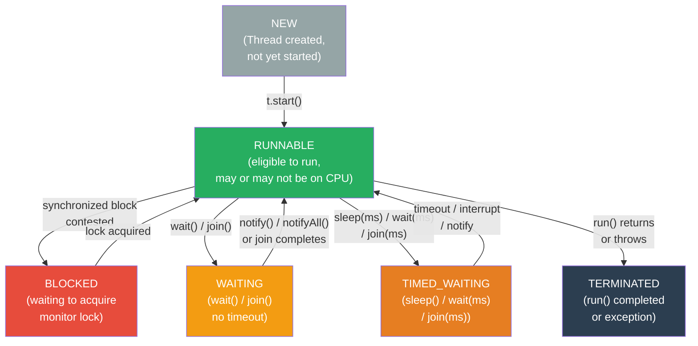

# 🧵 Threads and Synchronization

> [!abstract] TL;DR
> Thread lifecycle: **NEW → RUNNABLE → BLOCKED/WAITING/TIMED_WAITING → TERMINATED**. `synchronized` ensures both **mutual exclusion AND visibility** by acquiring the intrinsic monitor lock. `volatile` guarantees **visibility but NOT atomicity** — `count++` is still a race condition. The **Java Memory Model** defines **happens-before** relationships: program order, monitor unlock→lock, volatile write→read, Thread.start()→run(), thread completion→join(). **Deadlock** requires four conditions: mutual exclusion, hold-and-wait, no-preemption, and circular wait. `wait()`/`notify()`/`notifyAll()` **must be called while holding the lock**, and `wait()` must always be in a **`while` loop** to guard against spurious wakeups.

---

## Intuition

- **`synchronized`** = a single-key bathroom. Only one person enters at a time, and when they walk in they see the room exactly as the previous occupant left it (no stale state).
- **`volatile`** = a bulletin board everyone reads fresh every time. No stale copies, but two people can write at the same time.
- **happens-before** = a legal guarantee: "if I wrote this before you read it, you are guaranteed to see my write." Without it, the CPU or JIT may reorder operations and you see stale data.
- **Deadlock** = two people each holding a key the other needs, neither willing to put theirs down first.
- **`wait()/notify()`** = a waiting room with a buzzer: `wait()` gives up your seat (lock) and sits down; `notify()` rings the buzzer to wake one waiter (but they still need to re-acquire the lock).

---

## How It Works

### Thread Lifecycle



### Thread State Reference

| State | Meaning | How Entered | How Exited | Using CPU? |
|-------|---------|-------------|------------|------------|
| NEW | Created, not started | `new Thread()` | `t.start()` | No |
| RUNNABLE | Eligible; may be running | `start()`, lock acquired, sleep ends | Context switch, sleep, wait, lock | Maybe |
| BLOCKED | Waiting to acquire monitor | `synchronized` contention | Lock becomes available | No |
| WAITING | Indefinite wait | `wait()`, `join()` (no timeout) | `notify()`/`notifyAll()`, join completes | No |
| TIMED_WAITING | Timed wait | `sleep(ms)`, `wait(ms)`, `join(ms)` | Timeout, interrupt, notify | No |
| TERMINATED | Finished | `run()` returns or throws | — | No |

---

### Java Code Examples

```java
// ── Thread creation: 3 ways ──────────────────────────────────────────────────

// 1. Extend Thread (legacy — avoid; couples task and execution mechanism)
class MyThread extends Thread {
    @Override
    public void run() { System.out.println("Running in: " + getName()); }
}
new MyThread().start();

// 2. Implement Runnable (better — separates task from thread)
Runnable task = () -> System.out.println("Lambda task in: " + Thread.currentThread().getName());
Thread t = new Thread(task, "worker-1");
t.setDaemon(true); // dies when all non-daemon threads finish
t.start();
t.join();          // caller blocks until t finishes; throws InterruptedException

// 3. Callable + FutureTask (when you need a return value or exception propagation)
Callable<Integer> callable = () -> { return 42; };
FutureTask<Integer> future = new FutureTask<>(callable);
new Thread(future).start();
Integer result = future.get(); // blocks, throws ExecutionException on failure


// ── Thread control ───────────────────────────────────────────────────────────
Thread.sleep(1000);                           // sleep 1s; TIMED_WAITING; interruptible
Thread.currentThread().interrupt();           // set interrupted flag (request stop)
Thread.interrupted();                         // read AND clear interrupted flag
Thread.currentThread().isInterrupted();       // read WITHOUT clearing flag


// ── synchronized: method level ───────────────────────────────────────────────
public class BankAccount {
    private long id;
    private double balance;

    public BankAccount(long id, double initialBalance) {
        this.id = id;
        this.balance = initialBalance;
    }

    public long getId() { return id; }

    // synchronized on 'this' — only one thread at a time per BankAccount instance
    public synchronized void deposit(double amount) {
        if (amount <= 0) throw new IllegalArgumentException("Positive amount required");
        balance += amount;
    }

    public synchronized void withdraw(double amount) {
        if (amount > balance) throw new IllegalStateException("Insufficient funds");
        balance -= amount;
    }

    public synchronized double getBalance() { return balance; }
}


// ── synchronized: block level (finer granularity, lock ordering for deadlock prevention) ──
public class TransferService {

    // Deadlock-safe transfer: always lock the lower-id account first
    public void transfer(BankAccount from, BankAccount to, double amount) {
        // Enforce consistent lock ordering by numeric id
        BankAccount first  = from.getId() < to.getId() ? from : to;
        BankAccount second = first == from ? to : from;

        synchronized (first) {
            synchronized (second) {
                from.withdraw(amount);
                to.deposit(amount);
            }
        }
    }
}


// ── volatile: visibility guarantee, NOT atomicity ───────────────────────────
public class StatusMonitor {
    private volatile boolean running = true;  // writes flushed to main memory immediately
    private volatile int count = 0;           // reads always from main memory
    // WARNING: count++ is NOT atomic even with volatile
    // It compiles to: read count, increment, write count (three operations)
    // Two threads can interleave and lose updates

    public void stop() { running = false; }  // other threads see this immediately

    public void run() throws InterruptedException {
        while (running) {   // always reads fresh value — not cached in register
            count++;        // RACE CONDITION even with volatile
            Thread.sleep(100);
        }
    }
}
// FIX for count: use AtomicInteger.incrementAndGet() or synchronized block


// ── wait/notify: Producer-Consumer pattern ──────────────────────────────────
public class BoundedBuffer<T> {
    private final Queue<T> queue = new LinkedList<>();
    private final int capacity;

    public BoundedBuffer(int capacity) { this.capacity = capacity; }

    public synchronized void put(T item) throws InterruptedException {
        // WHILE loop — not if! Protects against spurious wakeups
        while (queue.size() == capacity) {
            wait();      // atomically: release monitor lock + suspend this thread
        }
        queue.add(item);
        notifyAll();     // wake all threads waiting on this monitor
        // prefer notifyAll() over notify() unless all waiters are equivalent
    }

    public synchronized T take() throws InterruptedException {
        while (queue.isEmpty()) {
            wait();
        }
        T item = queue.poll();
        notifyAll();
        return item;
    }
}


// ── ThreadLocal: per-thread storage ─────────────────────────────────────────
public class RequestContext {
    // Each thread gets its own independent copy
    private static final ThreadLocal<String> userId = new ThreadLocal<>();
    private static final ThreadLocal<String> requestId =
        ThreadLocal.withInitial(() -> UUID.randomUUID().toString()); // lazy init per thread

    public static void setUserId(String id) { userId.set(id); }
    public static String getUserId() { return userId.get(); }

    // CRITICAL: must call in thread pool context (threads are reused!)
    // Without this, next request on the same thread sees old userId
    public static void clear() {
        userId.remove();
        requestId.remove();
    }
}
// Usage with thread pool (e.g., servlet filter):
// try { RequestContext.setUserId(id); handleRequest(); }
// finally { RequestContext.clear(); } // ALWAYS in finally


// ── Deadlock demonstration ──────────────────────────────────────────────────
// Thread A: synchronized(lockA) { synchronized(lockB) { ... } }
// Thread B: synchronized(lockB) { synchronized(lockA) { ... } }
// → A holds lockA, wants lockB; B holds lockB, wants lockA → deadlock

// Prevention strategies:
// 1. Consistent lock ordering (as in TransferService above)
// 2. tryLock with timeout (ReentrantLock — see Concurrent_Utilities note)
// 3. Lock-free data structures (ConcurrentHashMap, Atomic classes)
// 4. Avoid holding multiple locks; restructure algorithm
```

---

## Key Concepts

### Thread Creation and Lifecycle

- **`Runnable` vs `Callable`**: `Runnable.run()` returns void and cannot throw checked exceptions. `Callable<T>.call()` returns a value and can throw — use with `Future<T>` via executor or `FutureTask`.
- **Daemon threads**: `t.setDaemon(true)` — JVM exits when only daemon threads remain. Good for background monitoring, bad for tasks that must complete (file flush, DB commit).
- **`Thread.join()`**: calling thread enters WAITING until the target thread reaches TERMINATED. `join(millis)` → TIMED_WAITING.
- **Interruption protocol**: `interrupt()` sets a flag (doesn't forcibly stop). Methods like `sleep()`, `wait()`, `join()` check the flag and throw `InterruptedException`. Use `isInterrupted()` in loops; catch `InterruptedException` and re-interrupt or propagate.

### synchronized — Intrinsic Monitor Lock

- Acquires the **monitor lock** on the specified object (`this` for instance methods, `ClassName.class` for static methods).
- Guarantees both **mutual exclusion** (only one thread in the block at a time) and **visibility** (all writes before unlock are visible to next thread after lock acquisition).
- **Reentrant**: same thread can re-enter a synchronized block it already holds (counter increments).
- JVM can optimize via **lock elision** (escape analysis — non-escaping object's lock removed entirely) and **lock biasing** (no-CAS path for uncontended single-thread access).
- No fairness guarantee — a thread that just released a lock can immediately reacquire it, starving other waiters.

### volatile — Visibility Without Atomicity

| Property | volatile | synchronized |
|---|---|---|
| Mutual exclusion | No | Yes |
| Visibility guarantee | Yes | Yes |
| Atomicity | No (compound ops are races) | Yes (within block) |
| Blocking | No | Yes (contended) |
| Use for | Flags, lazy singleton, simple status | Any shared mutable state |

**Safe uses of volatile**: boolean flag, singleton double-checked locking (DCL with volatile field), simple published reference updates.

**Unsafe**: `count++`, `if (x > 0) x--`, check-then-act sequences.

### Java Memory Model — happens-before

The JMM defines when one thread's write is **guaranteed visible** to another thread's read. Key relationships:

| Rule | Before (happens-before) | After |
|------|------------------------|-------|
| Program order | Any action | Any later action in same thread |
| Monitor unlock | `synchronized` block exit | Next `synchronized` acquisition on same lock |
| Volatile write | Write to volatile field | Any subsequent read of same volatile field |
| Thread start | `Thread.start()` | All actions in the started thread |
| Thread join | All actions in thread | `Thread.join()` returns |
| Constructor finish | Object fully constructed | Any code that receives a reference |

**Why it matters**: without a happens-before edge, the JVM (or CPU) can reorder writes and reads — thread B may never see thread A's write, or see it in wrong order.

### Deadlock — Four Conditions

All four must be present simultaneously for deadlock to occur:

| Condition | Description | Prevention |
|---|---|---|
| Mutual exclusion | Resource held by only one thread | Use lock-free structures (hard to eliminate in general) |
| Hold-and-wait | Thread holds one resource, waits for another | Acquire all locks at once or release before waiting |
| No preemption | Locks cannot be forcibly taken | `tryLock(timeout)` with `ReentrantLock` |
| Circular wait | Thread A waits for B, B waits for A | Consistent lock ordering (enforce global ordering by ID) |

**Detection**: `jstack <pid>` produces thread dump showing "Found one Java-level deadlock" with the cycle. Also detectable via `ThreadMXBean.findDeadlockedThreads()`.

### wait() / notify() — Rules

- `wait()`, `notify()`, `notifyAll()` can only be called from within `synchronized` on the **same object** — violating this throws `IllegalMonitorStateException`.
- `wait()` **atomically** releases the lock AND suspends the thread. This prevents the race condition where notify() fires before wait() — possible only if both synchronized on same object.
- **Spurious wakeups**: POSIX threads allow wakeups without notify. Always wrap `wait()` in a `while` (predicate check), never `if`.
- **`notify()` vs `notifyAll()`**: `notify()` wakes exactly one waiter (JVM-chosen); `notifyAll()` wakes all. Prefer `notifyAll()` unless all waiters are equivalent and waking one is sufficient.

### ThreadLocal — Per-Thread State

- Creates an independent variable for each thread — reads/writes don't interfere.
- `withInitial(Supplier)` — lazy initialization; called once per thread.
- **Leak in thread pools**: thread pool reuses threads across requests. Without `remove()`, the previous request's data remains. Always call `remove()` in a `finally` block.
- **InheritableThreadLocal**: child threads inherit parent's value at creation. Used by Spring's `RequestContextHolder` for request-scoped beans in async contexts (with caveats — not propagated to thread pool workers automatically).

---

## Real-World Notes

- **Spring `@Transactional`** binds the `EntityManager` to the current thread via `ThreadLocal` — this is why JPA sessions are not thread-safe across threads.
- **Spring `@Async`** moves execution to a different thread — `ThreadLocal` values (like `SecurityContextHolder`) are NOT automatically propagated unless you configure a `DelegatingSecurityContextExecutor`.
- **Spring's `RequestContextHolder`** uses `InheritableThreadLocal` for HTTP request context — breaks with thread pools unless `RequestContextListener` or `RequestContextFilter` is configured.
- **Hibernate Session** is not thread-safe by design — it stores pending changes, lazy-loaded collections, and identity map per-session, which is stored in ThreadLocal by Spring.

---

## Common Pitfalls

1. **`volatile` for compound operations**: `count++` is three bytecode instructions (read, add, store). Two threads can interleave these and lose an update. Use `AtomicInteger.incrementAndGet()` or a `synchronized` block.

2. **`wait()` outside `synchronized`**: `object.wait()` without holding the object's lock → `IllegalMonitorStateException` at runtime. The lock must be acquired first.

3. **`if` instead of `while` for `wait()`**: spurious wakeup fires before the condition is true → thread proceeds with invalid state → data corruption. The `while` re-checks and waits again.

4. **`ThreadLocal` leak in thread pool**: HTTP threads are reused by Tomcat/Jetty. Without `remove()` in a filter's finally block, `userId` from request N leaks into request N+1 on the same thread.

5. **Inconsistent lock ordering**: `synchronized(A) { synchronized(B) }` in one method and `synchronized(B) { synchronized(A) }` in another → deadlock under concurrent use. Enforce ordering by object identity (`System.identityHashCode()` or domain ID).

---

## Related

- [[_MOC_Java_Concurrency|↑ Section MOC]]
- [[Executors_and_CompletableFuture]] — higher-level thread management
- [[Concurrent_Utilities]] — ReentrantLock, ConcurrentHashMap, CountDownLatch
- [[JVM_Memory_Areas]] — stack vs heap, ThreadLocal storage

---

## Review Questions

1. What is the difference between `volatile` and `synchronized`? When is each sufficient, and when must you use the other?

2. Why must `wait()` always be called inside a `while` loop rather than an `if` statement? What is a spurious wakeup?

3. Describe the four conditions required for deadlock and give one concrete prevention strategy for each condition.

---

#Java #Concurrency #Threads #JMM #Synchronization
