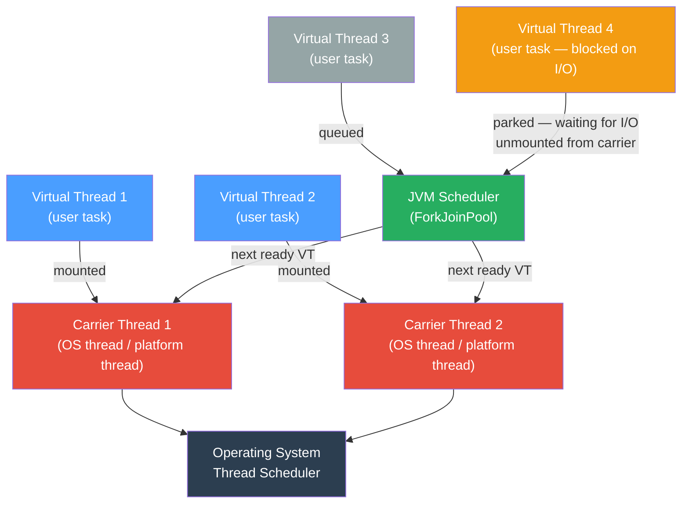

# 🪡 Virtual Threads (Java 21 / Project Loom)

> [!abstract] TL;DR
> Virtual threads are lightweight JVM-managed threads that multiplex many tasks onto a small pool of OS (carrier) threads, eliminating the 1:1 OS-thread constraint. They make blocking I/O cheap — a virtual thread blocks without parking the carrier thread — so you can run millions of concurrent tasks where platform threads would exhaust OS resources. For CPU-bound work virtual threads offer no benefit; use them when your bottleneck is I/O wait.

---

## Intuition — the Hotel Reception Desk Analogy

- **Platform threads** = hotel staff. Each guest (task) gets a dedicated staff member who stands idle while the guest is in the shower. Expensive; you can only hire so many.
- **Virtual threads** = one smart receptionist using a task board. When a guest needs a taxi (I/O), the receptionist puts a sticky note on the board ("wake me when taxi arrives") and immediately helps the next guest. No staff member is wasted waiting.
- **Carrier threads** = the actual hotel staff (OS threads). They execute whichever virtual thread is ready, not one per guest forever.
- **Pinning** = a guest physically handcuffs the receptionist to their chair (entering a `synchronized` block). That carrier thread is stuck until the block exits — the whole benefit collapses.

---

## How It Works



**M:N mapping**: M virtual threads (potentially millions) run on N carrier threads (typically equal to CPU cores). The JVM's built-in `ForkJoinPool` acts as scheduler — when a virtual thread blocks on I/O, it is *unmounted* (its stack saved to heap), freeing the carrier thread to run another virtual thread.

---

## Key Concepts / Details

### Creating and Starting Virtual Threads

```java
// ── 1. Thread.ofVirtual() — direct creation ──────────────────────────────────

// Named virtual thread (useful for debugging/JFR)
Thread vt = Thread.ofVirtual()
        .name("fetcher-", 0)          // auto-numbered: fetcher-0, fetcher-1 …
        .start(() -> System.out.println("Hello from " + Thread.currentThread()));

vt.join(); // join works exactly like platform threads

// Quick one-liner (no name, fire-and-forget)
Thread.ofVirtual().start(() -> doWork());

// Check if current thread is virtual
boolean isVirtual = Thread.currentThread().isVirtual(); // Java 21+


// ── 2. Executors.newVirtualThreadPerTaskExecutor() — the preferred approach ──

// Creates a NEW virtual thread for EVERY submitted task (no thread pool needed)
// The carrier pool (ForkJoinPool) is still bounded, but tasks are unlimited
try (ExecutorService executor = Executors.newVirtualThreadPerTaskExecutor()) {
    List<Future<String>> futures = new ArrayList<>();
    for (int i = 0; i < 100_000; i++) {
        int id = i;
        futures.add(executor.submit(() -> fetchFromDatabase(id))); // 100k virtual threads
    }
    for (Future<String> f : futures) {
        System.out.println(f.get());
    }
} // AutoCloseable: awaits completion then shuts down


// ── 3. Thread.Builder — factory for repeated creation ───────────────────────
Thread.Builder.OfVirtual builder = Thread.ofVirtual().name("worker-", 0);
Thread t1 = builder.start(task1);
Thread t2 = builder.start(task2); // each call creates a new virtual thread


// ── Practical HTTP client example — shine with I/O ───────────────────────────
// Traditional: need a thread-pool sized to max concurrency; too large = OOM
// Virtual: just submit; JVM handles it

HttpClient httpClient = HttpClient.newHttpClient();

try (var executor = Executors.newVirtualThreadPerTaskExecutor()) {
    List<Future<Integer>> results = urls.stream()
        .map(url -> executor.submit(() -> {
            HttpRequest req = HttpRequest.newBuilder(URI.create(url)).build();
            HttpResponse<String> resp = httpClient.send(req, HttpResponse.BodyHandlers.ofString());
            return resp.statusCode(); // blocks the virtual thread, NOT the carrier
        }))
        .toList();

    for (Future<Integer> r : results) System.out.println(r.get());
}
```

### Structured Concurrency (Java 21 Preview / Java 23 Final)

```java
// StructuredTaskScope ensures child tasks don't outlive the parent scope.
// ShutdownOnFailure: cancel remaining tasks if ANY subtask fails.
// ShutdownOnSuccess: cancel remaining tasks as soon as ONE succeeds.

import jdk.incubator.concurrent.StructuredTaskScope;

record UserProfile(String name, String avatar) {}

UserProfile fetchProfile(long userId) throws Exception {
    try (var scope = new StructuredTaskScope.ShutdownOnFailure()) {
        // Fork two concurrent subtasks — each runs in its own virtual thread
        StructuredTaskScope.Subtask<String> nameFuture =
                scope.fork(() -> fetchName(userId));
        StructuredTaskScope.Subtask<String> avatarFuture =
                scope.fork(() -> fetchAvatar(userId));

        scope.join()           // wait for both (or until one fails)
             .throwIfFailed(); // propagate the first failure as an exception

        // Both succeeded — retrieve results
        return new UserProfile(nameFuture.get(), avatarFuture.get());
    }
    // scope closes: any unfinished forks are cancelled automatically
}
```

### ScopedValue — Replacement for ThreadLocal

```java
// ThreadLocal problems with virtual threads:
//   1. Virtual threads are numerous — ThreadLocal memory per-thread adds up
//   2. ThreadLocal is mutable (set/get/remove) — ScopedValue is immutable per scope

import jdk.incubator.concurrent.ScopedValue;

// Define a scoped value (like a typed key)
static final ScopedValue<String> REQUEST_ID = ScopedValue.newInstance();

void handleRequest(String reqId) {
    // Bind the value for the duration of the lambda (and any virtual threads it forks)
    ScopedValue.where(REQUEST_ID, reqId).run(() -> {
        processStep1(); // can read REQUEST_ID.get() = reqId
        processStep2(); // same value visible across the call chain
    });
    // Outside the run() block, REQUEST_ID.isBound() == false
}

void processStep1() {
    String id = REQUEST_ID.get(); // throws NoSuchElementException if not bound
    log.info("Step 1 for request: " + id);
}
```

### Pinning Pitfalls

```java
// ── PINNED: synchronized block holds the carrier thread ─────────────────────
// If the virtual thread blocks on I/O while inside synchronized,
// the carrier thread is STUCK (pinned) until the synchronized block exits.
// This defeats the purpose of virtual threads.

public synchronized String fetchData(String url) throws IOException {
    return httpClient.send(request, ...).body(); // BAD: pins carrier thread during I/O
}

// ── FIX: use ReentrantLock instead of synchronized ──────────────────────────
private final ReentrantLock lock = new ReentrantLock();

public String fetchData(String url) throws IOException {
    lock.lock();
    try {
        return httpClient.send(request, ...).body(); // virtual thread parks (unmounts); carrier freed
    } finally {
        lock.unlock();
    }
}

// Detect pinning with JFR:
// Enable event: jdk.VirtualThreadPinned
// Run: java -XX:+EnableDynamicAgentLoading -Djdk.tracePinnedThreads=full MyApp
// OR add JFR config: jdk.VirtualThreadPinned { enabled = true; stackTrace = true; }

// Native methods and class initializers also pin — minimize synchronized in library code
// Java 24 preview: synchronized no longer pins (improved Loom integration)
```

### When to Use (and NOT Use) Virtual Threads

```java
// ── USE virtual threads for: ─────────────────────────────────────────────────

// 1. High-concurrency I/O-bound servers (REST APIs, gRPC services)
//    Each incoming request gets its own virtual thread — simple blocking code,
//    massive scalability.

// 2. Parallel I/O operations (fetching from multiple services, DB calls)
//    executor.submit(() -> callServiceA());
//    executor.submit(() -> callServiceB()); — run concurrently, blocked cheaply

// 3. Replacing large fixed thread pools
//    Old: Executors.newFixedThreadPool(200) — 200 OS threads
//    New: Executors.newVirtualThreadPerTaskExecutor() — 0 wasted OS threads


// ── DO NOT use virtual threads for: ─────────────────────────────────────────

// 1. CPU-bound tasks (heavy computation, image processing, ML inference)
//    Virtual thread doesn't improve throughput — still needs a CPU core.
//    Better: ForkJoinPool.commonPool() or a bounded platform thread pool.

// 2. Tasks holding synchronized locks that block on I/O (pinning problem above)

// 3. As a replacement for async reactive frameworks when your bottleneck is
//    CPU or when you need back-pressure (reactive still wins there)


// ── Quick benchmark sketch ───────────────────────────────────────────────────
// 10,000 tasks each sleeping 100ms (simulating I/O):
//   Platform threads (pool=200):  ~5,000ms  (200 threads * 100ms rounds)
//   Virtual threads:              ~100ms    (all sleep concurrently, no queuing)
```

### Carrier Thread Pool Configuration

```java
// Default carrier pool size = Runtime.getRuntime().availableProcessors()
// Override via system property:
// -Djdk.virtualThreadScheduler.parallelism=16   (carrier thread count)
// -Djdk.virtualThreadScheduler.maxPoolSize=256  (max carrier threads under load)

// For CPU-bound virtual thread tasks (if you must):
ForkJoinPool customCarrier = new ForkJoinPool(32);
// No public API yet to specify custom carrier — set system properties instead
```

---

## Real-World Notes

- **Spring Boot 3.2+** enables virtual threads with a single property: `spring.threads.virtual.enabled=true`. This switches Tomcat's request handling and `@Async` to virtual threads automatically.
- **JDBC connections** are the common pinning hotspot — most JDBC drivers use `synchronized` internally. HikariCP 5.1+ and recent PostgreSQL JDBC driver have removed/reduced synchronization; check your driver version.
- **Virtual threads are not pooled** — creating a new one per task is intentional and cheap (~1–2KB stack vs ~1MB for platform threads).
- **`ThreadLocal` still works** but memory pressure increases with millions of virtual threads each carrying their own `ThreadLocal` maps. Prefer `ScopedValue` for new code.
- **Debugging**: virtual thread dumps appear in `jstack` and JFR. Name your virtual threads (`Thread.ofVirtual().name("req-", counter)`) for readable dumps.
- **Loom + reactive**: Reactive/Webflux is still useful for back-pressure and event-stream scenarios. Virtual threads solve the "thread-per-request blocking" problem, not the "streaming data back-pressure" problem.

---

## Common Pitfalls

1. **Pinning via `synchronized`**: Any `synchronized` block that performs I/O inside it pins the carrier thread. Audit libraries for `synchronized` methods — many older drivers (Redis clients, some JDBC drivers) have this issue.

2. **CPU-bound tasks on virtual threads**: Running matrix multiplication on 100,000 virtual threads won't go faster — you still have N CPU cores. Each virtual thread will fight for a carrier thread, adding overhead without parallelism gain.

3. **Forgetting to name virtual threads**: `Thread.ofVirtual().start(task)` creates nameless threads. Stack traces and JFR events become unreadable at scale. Always use `.name("prefix-", counter)`.

4. **Using `ExecutorService.newVirtualThreadPerTaskExecutor()` for CPU-bound batch work**: This creates a thread-per-task unboundedly. For CPU-bound work, use a bounded `ForkJoinPool` to avoid scheduler thrashing.

5. **ThreadLocal memory bloat**: If you carry large `ThreadLocal` values and create millions of virtual threads, heap consumption grows proportionally. Use `ScopedValue` or reduce ThreadLocal payload size.

6. **`Thread.sleep()` inside synchronized** pins the carrier. Refactor to use `Condition.await()` with `ReentrantLock`.

---

## Related Concepts

- [[Threads_and_Synchronization]] — platform thread fundamentals, synchronized, volatile, wait/notify
- [[Executors_and_CompletableFuture]] — thread pool patterns, CompletableFuture, async pipelines
- [[Concurrent_Utilities]] — ReentrantLock (use instead of synchronized to avoid pinning)
- [[Concurrent_Data_Structures]] — thread-safe collections used with virtual thread workloads
- [[_MOC_Java_Concurrency|↑ Section MOC]]

---

## Review Questions

1. Explain the M:N mapping between virtual threads and carrier threads. What happens to the carrier thread when a virtual thread blocks on a network call?

2. Why does entering a `synchronized` block inside a virtual thread degrade performance (pinning)? What is the recommended fix for code that must hold a lock while doing I/O?

3. Compare `ThreadLocal` and `ScopedValue` for context propagation in virtual thread applications. When would you prefer one over the other?

---

## Sources

- JEP 444 — Virtual Threads (Java 21 Final): https://openjdk.org/jeps/444
- JEP 453 — Structured Concurrency (Java 21 Preview): https://openjdk.org/jeps/453
- JEP 446 — Scoped Values (Java 21 Preview): https://openjdk.org/jeps/446
- Inside Java — Project Loom: https://inside.java/tag/loom

#Java #Concurrency #VirtualThreads #ProjectLoom #Java21 #StructuredConcurrency
