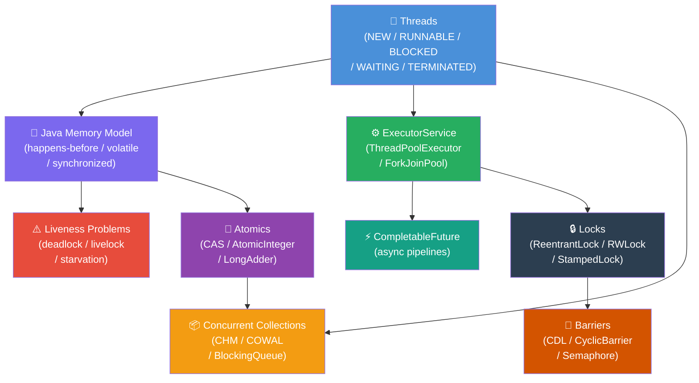

# Java Concurrency — Map of Content

This section covers everything you need to write correct, efficient, and safe concurrent Java programs — from low-level thread mechanics and the Java Memory Model through high-level abstractions like CompletableFuture, concurrent data structures, and synchronization utilities.

---

## Concept Map

---

## Learning Path

| Step | Topic | Note | Why | Prerequisite |
|------|--------|------|-----|--------------|
| 1 | Thread Lifecycle & JMM | [[Threads_and_Synchronization]] | Foundation of all concurrency — visibility and ordering rules govern everything else | Java basics |
| 2 | synchronized & volatile | [[Threads_and_Synchronization]] | Most common concurrency primitives; deadlock prevention patterns | Step 1 |
| 3 | ExecutorService & Thread Pools | [[Executors_and_CompletableFuture]] | Proper thread management; CPU/IO pool sizing | Step 1–2 |
| 4 | CompletableFuture pipelines | [[Executors_and_CompletableFuture]] | Non-blocking async composition for microservices | Step 3 |
| 5 | Concurrent Collections | [[Concurrent_Utilities]] | Lock-free / fine-grained locking structures; replacing synchronized wrappers | Step 2 |
| 6 | Atomic Variables & CAS | [[Concurrent_Utilities]] | Lock-free counters and state machines; understand LongAdder vs AtomicLong | Step 2 |
| 7 | ReentrantLock / Stamped | [[Concurrent_Utilities]] | Flexible locking beyond synchronized; tryLock timeouts; optimistic read | Step 5–6 |
| 8 | Synchronization Barriers | [[Concurrent_Utilities]] | Coordinating multiple threads (startup gates, parallel batch processing) | Step 3 |

---

## Notes in This Section

| Note | Topics Covered | Difficulty | Key Abstractions |
|------|---------------|------------|-----------------|
| [[Threads_and_Synchronization]] | Thread lifecycle, synchronized, volatile, JMM happens-before, deadlock, wait/notify, ThreadLocal | Advanced | `Thread`, `synchronized`, `volatile`, `wait()`, `ThreadLocal` |
| [[Executors_and_CompletableFuture]] | ThreadPoolExecutor parameters, pool sizing, ScheduledExecutorService, CompletableFuture full API | Advanced | `ExecutorService`, `ThreadPoolExecutor`, `CompletableFuture` |
| [[Concurrent_Utilities]] | ConcurrentHashMap, CopyOnWriteArrayList, AtomicInteger, LongAdder, ReentrantLock, ReadWriteLock, StampedLock, CountDownLatch, CyclicBarrier, Semaphore | Advanced | `ConcurrentHashMap`, `AtomicInteger`, `ReentrantLock`, `CountDownLatch` |

---

## Key Questions

> Use these as a self-test after studying each note.

1. **What is happens-before?** Why does it matter that a volatile write happens-before a subsequent volatile read? What guarantees does it provide beyond mere ordering?

2. **CompletableFuture vs parallel streams** — when should you reach for each? What if the operation is IO-bound vs CPU-bound?

3. **How do you size a thread pool?** What is the formula for IO-bound tasks? What tool do you use to validate empirically?

4. **What is pinning in virtual threads (Java 21)?** When does a virtual thread pin its carrier thread to the platform thread, and how do you detect it?

5. **LongAdder vs AtomicLong** — why is LongAdder faster under high contention? What is the trade-off?

6. **CountDownLatch vs CyclicBarrier** — one is one-shot, the other resets. Which is which? When does each fit?

7. **ReentrantLock vs synchronized** — what 3 capabilities does ReentrantLock provide that synchronized lacks?

---

## Common Anti-Patterns

| Anti-Pattern | Problem | Fix |
|---|---|---|
| `volatile` on compound operations | `count++` is not atomic even with volatile | Use `AtomicInteger` or `synchronized` |
| `if (queue.isEmpty()) wait()` | Spurious wakeups cause logic errors | Always use `while` loop |
| `ThreadLocal` in thread pool without `remove()` | Previous request's data leaks into next | Call `remove()` in finally |
| `Executors.newFixedThreadPool` with unbounded queue | OOM under sustained load | Use `ThreadPoolExecutor` with bounded queue |
| Nested `synchronized` blocks in inconsistent order | Deadlock | Enforce consistent lock ordering by object ID |
| Blocking IO inside `CompletableFuture` on common pool | Starves ForkJoinPool | Pass custom executor to `supplyAsync`/`thenApplyAsync` |

---

## Quick Reference: Concurrency Primitives

| Primitive | Package | Mutual Exclusion | Visibility | Blocking | Use When |
|---|---|---|---|---|---|
| `synchronized` | java.lang | Yes (intrinsic) | Yes | Yes | Simple critical sections |
| `volatile` | java.lang | No | Yes | No | Single-writer flags, lazy singleton |
| `ReentrantLock` | j.u.c.locks | Yes | Yes | Yes (tryLock optional) | Need tryLock, Condition, fairness |
| `AtomicInteger` | j.u.c.atomic | CAS (optimistic) | Yes | No | Lock-free counters |
| `LongAdder` | j.u.c.atomic | CAS striped | Yes | No | High-contention counters |
| `ConcurrentHashMap` | j.u.c | Per-bucket | Yes | No | Concurrent map with atomic ops |
| `CountDownLatch` | j.u.c | N/A | Yes | Yes (await) | One-shot startup gate |
| `Semaphore` | j.u.c | N permits | Yes | Yes (acquire) | Resource pool throttling |

---

## Related MOCs

- [[_MOC_JVM_Memory]] — GC pressure from concurrency, ThreadLocal overhead, Metaspace
- [[_MOC_Modern_Java]] — Virtual threads (Java 21), structured concurrency
- [[_MOC_Streams_Functional]] — Parallel streams vs CompletableFuture tradeoffs
