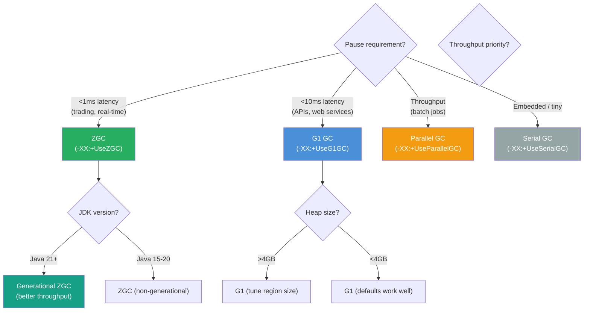
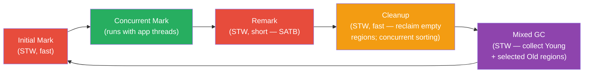

# ♻️ Garbage Collection Algorithms

> [!abstract] TL;DR
> GC algorithms: **Serial** (single-thread STW, tiny embedded heaps), **Parallel** (multi-thread STW, throughput-focused, Java 8 default), **G1** (default Java 9+, region-based, predictable pause target via `-XX:MaxGCPauseMillis`, concurrent marking), **ZGC** (ultra-low pause <1ms regardless of heap size, concurrent relocation via colored pointers, production-ready Java 15, generational ZGC Java 21 for better throughput), **Shenandoah** (OpenJDK concurrent compaction, similar pause profile to ZGC). Underlying principle: **weak generational hypothesis** — most objects die young, justifying fast young-gen collection. GC tuning goal: select the right algorithm for the workload, then measure before over-tuning.

---

## Intuition

- **Serial GC** = one hotel cleaner who hangs a "Do Not Disturb" sign on every floor while cleaning. All guests stop.
- **Parallel GC** = a cleaning team of N people who still hang the "Do Not Disturb" sign, but clean faster together.
- **G1 GC** = a smart cleaning manager who cleans the dirtiest rooms first while guests occupy cleaner rooms, pausing guests only briefly for the final check.
- **ZGC** = an invisible concierge who cleans around guests without stopping them — guests never notice the cleaning happening (sub-millisecond pauses regardless of mess size).
- **Generational hypothesis** = the insight that most hotel guests check out after one night (most objects are short-lived). Clean the checkout area (Young gen) frequently; deep-clean long-stay suites (Old gen) rarely.

---

## How It Works

### GC Algorithm Selection



### G1 GC Phases



Red = Stop-The-World (STW). Green = concurrent with application.

---

### Java Code Examples

```java
// ── Reference types and GC interaction ──────────────────────────────────────

// Soft reference cache — evicted only when heap is critically low
public class ImageCache {
    private final Map<String, SoftReference<BufferedImage>> cache = new ConcurrentHashMap<>();

    public BufferedImage get(String key) {
        SoftReference<BufferedImage> ref = cache.get(key);
        if (ref != null) {
            BufferedImage img = ref.get();   // null if GC reclaimed it
            if (img != null) return img;     // cache hit
            cache.remove(key);               // clean up stale entry
        }
        // Cache miss — reload and cache with soft reference
        BufferedImage img = loadFromDisk(key);
        cache.put(key, new SoftReference<>(img));
        return img;
    }

    private BufferedImage loadFromDisk(String key) {
        // stub — actual disk load here
        return null;
    }
}


// WeakHashMap — entries removed automatically when keys become unreachable
WeakHashMap<Object, String> weakMap = new WeakHashMap<>();
Object key = new Object();
weakMap.put(key, "associated metadata");

key = null; // strong reference gone
System.gc(); // hint GC to run (JVM may ignore, but usually runs in examples)
// After GC: weakMap.size() == 0 (entry was automatically removed)


// Explicit GC hint — generally avoid in application code
System.gc(); // hint only; JVM may ignore; use -XX:+DisableExplicitGC to suppress
Runtime.getRuntime().gc(); // same as above


// Cleaner — modern replacement for finalizers (Java 9+)
Cleaner cleaner = Cleaner.create();

class NativeResource {
    private final long nativeHandle;

    NativeResource(long handle) {
        this.nativeHandle = handle;
        // Register cleanup action — runs after NativeResource is GC'd
        cleaner.register(this, () -> releaseNativeMemory(handle));
    }

    private static void releaseNativeMemory(long handle) {
        System.out.println("Releasing native handle: " + handle);
        // JNI call to free native memory
    }
}
// When NativeResource is GC'd, cleaner runs releaseNativeMemory automatically
// Unlike finalizers: runs in a dedicated cleaner thread; not subject to finalization delays
```

```bash
# ── GC Selection Flags ────────────────────────────────────────────
-XX:+UseSerialGC           # Serial: single-thread, stop-the-world; <100MB heap
-XX:+UseParallelGC         # Parallel/Throughput GC: multi-thread STW; Java 8 default
-XX:+UseG1GC               # G1: region-based, pause target; Java 9+ default
-XX:+UseZGC                # ZGC: concurrent, sub-ms; Java 15 production, Java 21 generational
-XX:+UseShenandoahGC       # Shenandoah: concurrent compact; OpenJDK 15+

# ── G1 Tuning ─────────────────────────────────────────────────────
-XX:MaxGCPauseMillis=200           # pause target (G1 aims for this, not a hard limit)
-XX:G1HeapRegionSize=4m            # region size: 1–32MB, power of 2 (auto-calculated if omitted)
-XX:InitiatingHeapOccupancyPercent=45  # start concurrent marking when heap is 45% full
-XX:G1NewSizePercent=5             # min Young gen size (% of heap)
-XX:G1MaxNewSizePercent=60         # max Young gen size (% of heap)
-XX:G1MixedGCCountTarget=8        # number of mixed GC cycles to spread Old gen cleanup
-XX:G1HeapWastePercent=5           # stop mixed GC when less than 5% of heap is reclaimable

# ── ZGC Tuning ────────────────────────────────────────────────────
-XX:SoftMaxHeapSize=4g             # ZGC starts GC before hard max (keep ~20% headroom)
-XX:ZCollectionInterval=0          # time-based GC trigger interval (0=allocation-based only)
-XX:ZUncommitDelay=300             # seconds before uncommitting unused memory to OS
# Java 21 Generational ZGC (recommended for new deployments):
-XX:+UseZGC -XX:+ZGenerational     # enable generational mode (default in Java 21+)

# ── GC Diagnostics ────────────────────────────────────────────────
-Xlog:gc*:file=gc.log:time,uptime:filecount=5,filesize=20m  # Java 9+ unified logging
-Xlog:gc+heap=debug                # heap before/after each GC
-XX:+GCLogFileRotation             # Java 8: rotate GC logs
-XX:NumberOfGCLogFiles=5
-XX:GCLogFileSize=20m

# ── Finalization / Reference ──────────────────────────────────────
-XX:+DisableExplicitGC             # ignore System.gc() calls from application code
-XX:+PrintReferenceGC              # log soft/weak/phantom reference clearing
```

---

## Key Concepts

### Mark-Sweep-Compact — The Foundation

All GC algorithms implement variations of three phases:

| Phase | Action | Purpose | Cost |
|---|---|---|---|
| **Mark** | Traverse from GC roots; mark all reachable objects | Identify live objects | Proportional to live set |
| **Sweep** | Reclaim memory occupied by unmarked objects | Free dead objects | Proportional to heap size |
| **Compact** | Move live objects together; eliminate fragmentation | Enable fast sequential allocation | Proportional to live set |

Different algorithms optimize which phases run concurrently, in parallel, or incrementally.

### GC Roots

GC starts traversal from roots — objects that are definitively live regardless of heap state:

| Root Type | Examples |
|---|---|
| Thread stack variables | Local variables in active methods |
| Static fields | `static Map<String, Object> cache = ...` |
| JNI references | Objects referenced from native code via `JNIEnv` |
| Synchronized objects | Objects used as monitors (held locks) |
| ClassLoader objects | `WebappClassLoader`, `URLClassLoader` |
| JVM internal references | Interned strings, system class instances |

Anything not reachable from any root is garbage — GC safely reclaims it.

### Weak Generational Hypothesis

Two related observations:
1. **Weak**: most objects die young (die within one or two minor GCs).
2. **Strong**: old objects rarely reference young objects (cross-generational references are uncommon).

These justify:
- **Separate Young/Old collections**: Young gen collected frequently (fast); Old gen rarely (slow).
- **Remembered Sets / Card Tables**: track cross-generational references. When collecting Young gen, only scan Old→Young references (card table) instead of all of Old gen.

### G1 GC — Region-Based Approach

- Heap divided into ~2048 equal-size regions (1–32MB each, power of 2).
- Each region labeled dynamically: Eden / Survivor / Old / Humongous (for large objects).
- **Collection Set (CSet)**: G1 selects which regions to collect per GC cycle — always all Young regions, plus selected Old regions in mixed GC.
- **Remembered Set (RSet)**: per-region tracking of incoming references from other regions — enables collecting a subset without scanning the whole heap.
- **Humongous objects**: `>` 50% of region size → allocated contiguously in Old gen regions. Problematic: skips Young gen entirely; causes fragmentation; may trigger full GC.
- **Pause target**: `-XX:MaxGCPauseMillis=200` — G1 tries to meet it by adjusting CSet size. Not a hard guarantee.

### ZGC — Colored Pointers and Concurrent Relocation

| Feature | G1 GC | ZGC |
|---|---|---|
| Pause type | STW (Young + mixed) | Concurrent (tiny STW only for root scan ~1ms) |
| Pause magnitude | 10ms–200ms typical | <1ms regardless of heap size |
| Concurrent relocation | No | Yes (load barriers fix stale pointers) |
| Heap range | 8MB–1TB | 8MB–16TB |
| Java default since | Java 9 | Java 21 (generational mode) |
| Throughput vs G1 | Higher throughput | 5–15% lower throughput (barrier cost) |

**Colored pointers**: ZGC embeds GC metadata (marked, relocated) in unused bits of 64-bit pointers. This allows the GC to track object state and forward references without a separate header word.

**Load barriers**: every heap read (`getfield`, `arraylod`) goes through a barrier that checks if the pointer is stale (object relocated) and updates it. This is the source of ZGC's throughput cost but enables concurrent relocation.

**Generational ZGC (Java 21)**: adds Young/Old separation. Young gen collected more frequently with lower barrier cost. Significantly improved throughput over non-generational ZGC.

### Shenandoah

- OpenJDK project (Red Hat); available in OpenJDK 15+.
- Uses **Brooks pointers** (forwarding pointer in each object header) for concurrent compaction.
- Similar pause profile to ZGC: sub-10ms pauses concurrent with application.
- Different from ZGC: not using colored pointers; reads through forwarding pointer (slightly different overhead model).

### Algorithm Comparison

| GC | Pause type | Typical pause | Throughput | Heap range | Best for |
|---|---|---|---|---|---|
| Serial | Full STW | 100ms–10s | Low | <100MB | Embedded, tiny heaps |
| Parallel | Full STW | 50ms–2s | Highest | Any | Batch processing, throughput |
| G1 | STW Young + mixed | 10ms–200ms | High | 1GB–1TB | General-purpose web services |
| ZGC | Near-concurrent | <1ms | Medium-High | 8MB–16TB | Latency-sensitive (trading, APIs) |
| Shenandoah | Near-concurrent | <10ms | Medium-High | Any | Alternative to ZGC on OpenJDK |

### GC Log Analysis — What to Look For

| Signal in GC Log | What it Indicates | Action |
|---|---|---|
| Long STW pauses (>500ms) | Heap too small; insufficient concurrent work | Increase `-Xmx`; switch to ZGC |
| Frequent full GC | Old gen filling too fast; promotion rate high | Tune Young gen size; check for memory leaks |
| `GC (Allocation Failure)` | Eden fills before GC completes | Increase Young gen; reduce allocation rate |
| `concurrent mode failure` | CMS/G1 can't complete concurrent marking before Old fills | Increase `InitiatingHeapOccupancyPercent` |
| `Humongous allocation` | Object >50% region size bypasses Young gen | Break up large objects; increase region size |
| Heap always at max | Possible memory leak | Heap dump + Eclipse MAT analysis |

---

## Real-World Notes

- **Spring Boot microservices**: G1 is the default and works well for most cases. Switch to ZGC for p99 latency-sensitive services.
- **Kubernetes pod sizing**: JVM max heap should be ~75% of container memory limit. Leave room for Metaspace, Code Cache, off-heap, and OS. Use `-XX:MaxRAMPercentage=75.0` instead of `-Xmx` in containers.
- **GCEasy.io** and **GCViewer**: free tools for visualizing GC logs — paste your GC log file for instant analysis.
- **Micrometer `JvmGcMetrics`**: exposes `jvm.gc.pause`, `jvm.gc.memory.promoted`, `jvm.gc.memory.allocated` — monitor in Grafana.

---

## Common Pitfalls

1. **Humongous object allocation causing full GC**: `byte[]` larger than `G1HeapRegionSize / 2` (e.g., >2MB with default 4MB regions) bypasses Young gen → allocated in Old gen regions → Old gen fragments → full GC. Fix: smaller buffers, pool large buffers (Netty `ByteBufAllocator`), or increase region size.

2. **Premature promotion**: objects promoted to Old gen before dying. Cause: Survivor spaces too small → overflow to Old gen. Fix: tune `-XX:SurvivorRatio` (smaller = larger Survivors) or `-XX:MaxTenuringThreshold`.

3. **`System.gc()` in application code**: causes unexpected full GC, disrupts G1's ergonomics (concurrent marking cycle interrupted). Remove from application code. Add `-XX:+DisableExplicitGC` to suppress library calls (e.g., NIO DirectBuffer cleanup path).

4. **Over-tuning GC before profiling**: don't blindly add flags. Profile with GC logs first. GCEasy.io will tell you exactly what's wrong (promotion failure, humongous allocation, etc.) before you start adjusting.

5. **Using Parallel GC for web services**: Parallel GC is STW for all phases — fine for batch jobs (throughput matters) but devastating for API latency (full heap GC blocks all requests). Use G1 or ZGC for anything serving HTTP traffic.

---

## Related

- [[_MOC_JVM_Memory|↑ Section MOC]]
- [[JVM_Memory_Areas]] — heap structure, generation sizes, GC roots in memory
- [[JIT_Compilation_and_Tuning]] — Code Cache fills during JIT; GC and JIT interact for string deduplication

---

## Review Questions

1. Explain the difference between G1 GC and ZGC in terms of pause behavior. At what latency requirement and heap size would you switch from G1 to ZGC, and what is the throughput trade-off?

2. What is the weak generational hypothesis and how does it justify maintaining separate Young and Old generation memory areas? What is the role of a Remembered Set?

3. What are GC roots? Name four types. Why must GC traversal start from roots rather than scanning all objects in the heap?

---

#Java #JVM #GarbageCollection #G1 #ZGC
